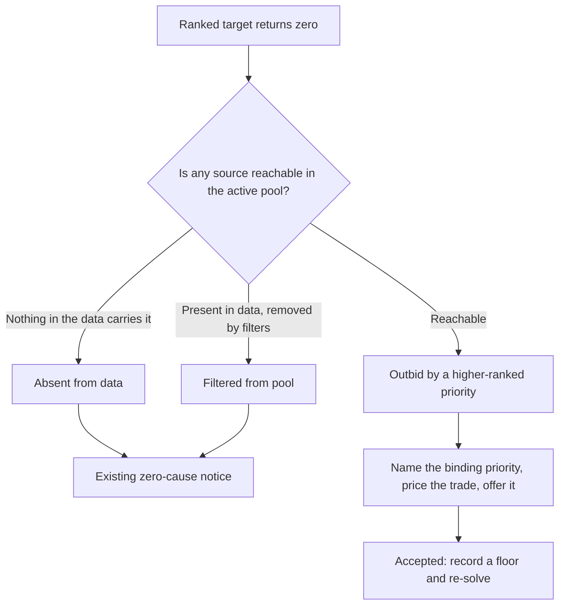
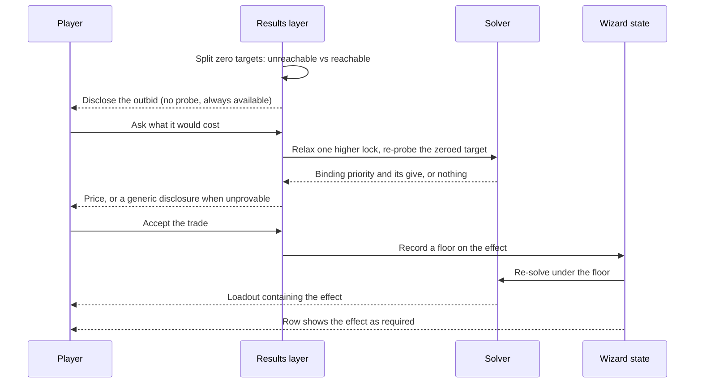

# Ranked Priority Zero Disclosure - Plan

**Tracked as #345.**

## Goal Capsule

- **Objective:** When a ranked priority comes back empty even though the effect was reachable, tell the player what outbid it, price the trade in the currency they care about, and let them take it in one click — with the choice recorded as a real requirement rather than a one-off.
- **Product authority:** User-directed through brainstorm dialogue on 2026-08-17. Product Contract unchanged by this enrichment.
- **Execution profile:** Sequential. U1 through U5 form a dependency chain; U6 and U7 are independent once U1 lands.
- **Stop conditions:** Stop and surface if the counterfactual probe cannot attribute a binding priority on the reported case, or if probe cost at endgame scale exceeds the U3 threshold with no on-request fallback acceptable to the product shape.
- **Open blockers:** None. One measurement inside U3 settles the automatic-vs-on-request question.
- **Coordinates with:** `docs/plans/2026-08-16-005-feat-utility-nice-to-have-container-plan.md` (#348), which restructures the same priority list and carries a claim U7 corrects.

---

## Product Contract

### Summary

When a ranked priority resolves to zero while sources for it remain reachable, the result names the higher-ranked priority that took the slot and states what taking it back would cost. The player can accept that trade in one click, and accepting records a best-effort floor so the requirement persists and shows on the row.

### Problem Frame

A player ranked Freedom of Movement 7th of 13, then 5th, then 3rd. It was never filled. Meanwhile Ghostly and True Seeing — ranked 9th and 12th — were. Their conclusion: *"I still might be too dumb to understand what the optimizer's goal is or what it's optimizing. If it's not meeting player-set requirements, it's not really optimizing."*

The solve was correct. The boots that carry Freedom of Movement cost exactly one point of Deadly, and Deadly sits above it in the priority list, so the lexicographic solve locks Deadly at its maximum before Freedom of Movement is ever considered. Every loadout that holds Deadly at its ceiling puts different boots on. The two lower-ranked toggles filled because they were free riders: items that won their slots on other merit happened to carry them. Nothing was spent on them.

So the player saw two lower-ranked effects reported as satisfied, a higher-ranked one blank, and no signal connecting the two facts. The results panel has two zero-cause notices — nothing in the data carries the stat, and nothing in the filtered pool carries it. Neither fires here, correctly, because the effect *is* reachable. There is no third notice for the case where a higher-ranked priority simply won.

This is not a rare corner. Ranking each of the twenty utility toggles last under the Melee preset at ML15 two-handed, ten are reachable in that build and four of those ten come back silently zero — Freedom of Movement among them. Ranked higher, more would win; the four is the ranked-last rate for one build shape, not a universal rate. It is frequent enough that the silence is a routine experience rather than an edge case.

Underneath the missing notice is a mental-model mismatch. Rank position reads as a requirement and is not one — it is a preference that competes. The only mechanism that makes an effect non-negotiable is a best-effort floor, and it lives in the Advanced panel with nothing pointing at it. #348's requirements currently tell the reader that a must-have is expressed by ranking the stat normally, which is the belief this report disproves.

### Key Decisions

- **Disclose the outbid and surface the lever together.** (session-settled: user-directed — chosen over disclosure alone: ranking normally leaves four of ten reachable toggles at zero, so naming a hidden control in prose does not carry the weight.) A notice that explains the loss without offering a way to change it leaves the player exactly where they started.

- **The trade is offered after the solve, not configured before it.** (session-settled: user-approved — chosen over adding a require control to every priority row: fewer new concepts for the player, and the product already generates near-optimal alternatives on demand.) The player never has to learn what a floor is to get what they asked for.

- **Accepting the offer writes a real floor.** (session-settled: user-approved — chosen over an ephemeral re-solve: a choice the player made should survive the next solve and the saved character.) One mechanism carries both the one-click convenience and the durable, inspectable state.

- **The notice is the load-bearing half and leads.** (session-settled: user-approved — chosen over shipping the lever first: the reported complaint is about trust, not outcome.) A lever without an explanation relocates the confusion rather than removing it — the player sets a requirement, the floor is relaxed, and they are told *that* instead.

- **Attribution is proven, never inferred.** The results layer already refuses to name a cause it has not checked, after naming the wrong one cost a player correct advice. Naming the binding priority from rank order alone would repeat that: the stat directly above a zero is not necessarily the one that bound it.

- **This plan corrects #348's must-have claim.** (session-settled: user-directed — chosen over filing it as a separate note: #348 is still requirements-only and unplanned, so the correction is cheap now and prevents shipping a statement known to be false.)

### Key Flows

- F1. The outbid is disclosed
  - **Trigger:** A solve completes and a ranked target holds zero while sources for it remain in the active pool.
  - **Steps:** The result separates this case from the two existing zero causes; it names the higher-ranked priority that bound it, on evidence rather than position; it states the cost of taking the target back.
  - **Outcome:** The player can see that a choice was made, what it cost them, and what it would cost to reverse.

- F2. The trade is taken
  - **Trigger:** The player accepts the offered trade.
  - **Steps:** A floor is recorded on that effect; the solve reruns under it; the priority row shows the effect as required.
  - **Outcome:** The loadout contains the effect, the higher-ranked stat gives up the stated amount, and the requirement persists into later solves and the saved character.

- F3. A recorded requirement later cannot hold
  - **Trigger:** A floor that was satisfied when accepted cannot be met after the player changes the build.
  - **Steps:** The existing shortfall disclosure reports the unmet floor.
  - **Outcome:** The player can tell this apart from the outbid case — one is a requirement that failed, the other is a preference that lost.

### Requirements

**Disclosing the outbid**

- R1. When a ranked target resolves to zero and sources for it remain reachable in the active pool, the result discloses that a higher-ranked priority took it.
- R2. The disclosure names the binding priority only on evidence that relaxing it changes the outcome. Rank adjacency is not evidence.
- R3. The disclosure is distinguishable from the two existing zero causes, so a player can tell "something won it" from "nothing carries it."
- R4. An effect that filled without being paid for does not produce this disclosure.
- R5. The disclosure reaches every share export, matching the standing rule that no mechanic is solve-visible and share-invisible.

**Pricing and offering the trade**

- R6. The result states what taking the outbid effect would cost, expressed as the amount the binding priority gives up.
- R7. The price is computed on request rather than on every solve.
- R8. Accepting the offer returns a loadout containing the effect, with the stated cost paid and nothing else silently traded away.

**Recording the requirement**

- R9. Accepting writes a best-effort floor on that effect, so the choice survives later solves and saved characters.
- R10. The priority row shows when an effect is required, and the player can clear that requirement from the same place.
- R11. When a recorded requirement later cannot be met, the existing shortfall disclosure reports it, and the player can distinguish that from the outbid case.

**Coordination with the nice-to-have container**

- R12. #348's statement that a must-have is expressed by ranking the stat normally is corrected to name the floor as the mechanism that makes an effect non-negotiable.

### Acceptance Examples

- AE1. Outbid is named and priced
  - **Covers R1, R2, R6.**
  - **Given** the Melee preset at ML15 two-handed with Freedom of Movement ranked below Deadly,
  - **When** the solve completes with Freedom of Movement at zero,
  - **Then** the result discloses that a higher-ranked priority took it, names Deadly, and states the cost as one point of Deadly.

- AE2. The trade is taken and recorded
  - **Covers R8, R9, R10.**
  - **Given** the disclosure from AE1,
  - **When** the player accepts the trade,
  - **Then** the loadout contains Freedom of Movement, Deadly drops by exactly the stated amount, a floor is recorded, and the row shows the effect as required.

- AE3. An unreachable target keeps its existing notice
  - **Covers R3.**
  - **Given** a ranked effect no item in the active pool carries,
  - **When** the solve completes,
  - **Then** the existing zero-cause notice fires and the outbid disclosure does not.

- AE4. A free rider produces no disclosure
  - **Covers R4.**
  - **Given** a lower-ranked toggle carried by an item that won its slot on other merit,
  - **When** the solve completes with that toggle satisfied,
  - **Then** no outbid disclosure is produced for it.

- AE5. A recorded requirement that later fails
  - **Covers R11.**
  - **Given** an accepted requirement that was satisfiable when accepted,
  - **When** the player narrows the build so it can no longer hold,
  - **Then** the shortfall disclosure reports the unmet requirement, distinguishably from an outbid preference.

### Scope Boundaries

- The partial case — a ranked stat that returns less than the player hoped rather than nothing — is deferred. Zero is what reads as a broken tool; short-of-ideal is a much larger surface.
- Changing which items the solver picks is out. The solve is correct; only the disclosure and the player's means of expressing a requirement are at fault.
- Splitting the priority list into requirement and preference zones is deferred. It teaches the cleanest mental model, but #348 is already restructuring that list, and two structural changes from two plans landing together is a collision worth avoiding.
- Applying a floor on the player's behalf, without them accepting it, is out.

### Dependencies and Assumptions

- #348 is requirements-only and unplanned, so R12's correction lands before that scope is built on the claim it removes.
- Floors are accepted on presence effects today; only the Utility sentinel is excluded from the bound sanitizer. This plan needs no change to what a floor may be set on.
- The solver can already probe a target's maximum under a given set of locks, so pricing the trade is a use of existing machinery rather than a new solver capability. Its cost at endgame scale is unmeasured.
- Floors are best-effort by contract: they are relaxed rather than made infeasible. Accepting a trade therefore creates a requirement that can later fail, which is why R11 exists.

### Outstanding Questions

**Resolved during planning** — the brainstorm deferred these three; each is settled below and carried into a unit. None blocks implementation.

- Pricing cost at endgame scale, and whether the offer appears automatically or on request. Settled as a measured gate inside U3.
- Whether a recorded requirement is shown only on the priority row or also in the results panel. Settled in U5: the row owns the state; the results panel owns the moment.
- How the row's required state reads alongside #348's pinned container. Settled in U5's approach: the required marker attaches to ranked rows only, and the container is not a ranked row.

### Sources and Research

- Issue #345 — the player report, the rank-by-rank reproduction, and the confirmation that a floor delivers the effect at the same rank.
- Measured for this plan: ranking each of the twenty utility toggles last under the Melee preset at ML15 two-handed, six are secured, four are reachable but silently zero, and ten are unreachable and already disclosed. One build shape, ranked-last position.
- `web/results.js` — the existing two-cause zero notice, its standing refusal to name an unproven cause, and the notice surface the new disclosure joins.
- `web/solver.js` — the lexicographic staging that produces the outbid, the probe used to price a target under locks, and the shortfall reporting for floors that cannot hold.
- `web/wizard.js` — the bound sanitizer that accepts floors on every stat except the Utility sentinel, and the per-row advanced model.
- `web/persist.js` — `targetFloors` is already a persisted field, so requirement durability is an assertion rather than new work.
- `docs/plans/2026-08-16-005-feat-utility-nice-to-have-container-plan.md` — #348, whose must-have claim R12 corrects.
- `CONCEPTS.md` — Outbid target, Best-effort floor, and Lexicographic solve, the canonical names used throughout.

---

## Planning Contract

### Key Technical Decisions

- KTD1. **The outbid set is the complement of the existing unsourced set, computed in the same place.** The zero-cause notice already splits targets into reachable and unreachable using the active pool. Targets at zero that *are* reachable are exactly the outbid set, so this is a third branch on an existing split rather than a new detector. Free riders are excluded by construction — a free rider is nonzero.

- KTD2. **Attribution is a prefix walk over the lock set, not a leave-one-out.** (Inherits the Product Contract decision *Attribution is proven, never inferred*.) Locks are accumulated in rank order, and every lock's value was achieved *under* the locks above it — so dropping one lock while retaining the ones beneath it tests an incoherent state and can be outright infeasible. Instead, find the deepest prefix of locks under which the zeroed target still reaches a nonzero value; the first lock past that boundary is the binding priority. The boundary is monotone, so it is found by binary search rather than one probe per higher-ranked stat. When the boundary sits at the very first lock, or no prefix admits the target, the probe returns nothing and the disclosure stays generic. Guessing the nearest stat is the failure this repo has already paid for once.

- KTD3. **Pricing is a separate, on-request step from detection.** (session-settled: user-approved — chosen over pricing on every solve: the price costs real solves and the detection costs none.) Detection ships in U1 with no probe; the price arrives in U2 and is wired on request in U3.

- KTD4. **A restored character discloses but does not offer.** The results renderer is called from three live sites in `web/wizard.js`, and the restored-snapshot site passes no solver instance. Detection reads only the stored result, so the disclosure still renders; pricing needs the solver, so the offer is withheld there rather than faked. This is a defined state, not a gap.

- KTD5. **Accepting writes the floor through the same path the Advanced input writes.** (Inherits *Accepting the offer writes a real floor*.) One writer means one sanitizer, one persistence field, and one clear path. `targetFloors` is already persisted and already rendered in exports as a `min` bound, so durability and share-visibility are assertions rather than new work.

- KTD6. **The live call sites are guarded by source-text assertions.** `web/query.js` contains a renderer call and is not loaded by `web/index.html`; the three live sites are in `web/wizard.js`. A wiring change verified only through the notice function would pass while rendering nowhere — this repo shipped exactly that defect in #332. The guard asserts the call-site count so a fourth site cannot appear unguarded.

### High-Level Technical Design

The disclosure path from a completed solve to a recorded requirement:

The three live renderer call sites differ in what they can offer:

| Call site | Context | Solver attached | Discloses | Offers price |
|---|---|---|---|---|
| `web/wizard.js:2244` | Fresh solve | Yes | Yes | Yes |
| `web/wizard.js:2471` | Restored character | No | Yes | No (KTD4) |
| `web/wizard.js:2903` | Re-render of last run | Yes | Yes | Yes |
| `web/query.js:176` | Not loaded by `web/index.html` | — | Not wired | Not wired |

### Assumptions

- The reported case reproduces headlessly at ML15, two-handed, Melee preset with Freedom of Movement ranked below Deadly, and the cost is one point of Deadly. Measured during the brainstorm; U1 rebuilds it as a fixture rather than trusting the number.
- The zeroed target's reachability is monotone in the lock prefix: once a prefix excludes it, no longer prefix admits it. That is what makes the boundary binary-searchable. U2 should confirm monotonicity holds on the reported case rather than assume it, and fall back to a linear walk if it does not.

### Sequencing

U1 → U2 → U3 → U4 → U5 is a chain. U6 depends only on U1. U7 is independent and can land at any point.

---

## Implementation Units

### U1. Detect the outbid target and disclose it

- **Goal:** A third zero-cause branch that fires when a ranked target is zero and reachable, worded generically, with no probe and no naming.
- **Requirements:** R1, R3, R4, R5. Implements KTD1.
- **Dependencies:** None.
- **Files:** `web/results.js`, `web/projection.js`, `web/exporters.js`, `tests/results.test.js`, `tests/projection.test.js`, `tests/exporters.test.js`
- **Approach:** Extend the existing zero-cause split rather than adding a parallel detector. The current split partitions zeroed targets by pool reachability and discloses only the unreachable half; the reachable half is the outbid set. Exclude the Utility sentinel exactly as the existing notice does — it is never a pool stat and would otherwise flag on every solve with the tier ranked. Route the disclosure text through the shared projection content model so all six exports carry it from one source, matching how the saturation and credit notices already travel.
- **Execution note:** The golden fixture set never produces this condition — 85 ranked targets across 23 fixtures, zero occurrences. Build the fixture from the measured ML15 two-handed Melee case before writing the branch, so the test is proven to exercise the path rather than assumed to.
- **Patterns to follow:** The two-cause split and its evidence discipline in `web/results.js`; `saturationNoticeLines` and `creditNoticeLines` in `web/projection.js` for the export channel.
- **Test scenarios:**
  - Covers AE3. A ranked effect no pool item carries produces the existing unreachable notice and no outbid disclosure.
  - Covers AE4. A lower-ranked toggle satisfied as a free rider produces no outbid disclosure, because its value is nonzero.
  - A ranked target at zero that is reachable produces the outbid disclosure.
  - The Utility sentinel ranked and at zero produces no outbid disclosure.
  - Several outbid targets in one solve produce one disclosure naming them together.
  - The disclosure appears in all six exports, asserted through the shared projection path rather than a hand-built record.
- **Verification:** The disclosure renders for the measured Melee case and stays silent for the free-rider and unreachable cases, with export coverage proven through `Proj.project` rather than a constructed record.

### U2. Prove the binding priority and price the trade

- **Goal:** A counterfactual that identifies which higher-ranked priority bound a zeroed target and what relaxing it costs — or reports that it cannot tell.
- **Requirements:** R2, R6. Implements KTD2.
- **Dependencies:** U1.
- **Files:** `web/solver.js`, `tests/solver.test.js`
- **Approach:** Reuse the existing single-target probe, applied to lock *prefixes*. Probe the zeroed target under the first k locks only, for increasing k: the target reaches a nonzero value while k is small and stops once k includes the lock that binds it. That boundary is the binding priority, and because the property is monotone in k it is located by binary search rather than a probe per stat. Price it separately: re-maximize the binding stat subject to the target holding at its nonzero value and the locks above the boundary; the price is the original achieved value minus that maximum. Return nothing when the boundary sits at the first lock or no prefix admits the target — naming a stat there would be a guess. The probe runs only for targets already known to be outbid, so its cost never lands on an ordinary solve.
- **Execution note:** Prove the refusal path, not just the success path. Construct a case where no prefix admits the target and confirm the probe returns nothing rather than naming the nearest stat; a guard that cannot fail is the shape this repo has been bitten by. Do not relax a single lock in isolation — a lock's value was achieved under the locks above it, so a leave-one-out relaxation tests a state the solve never occupied.
- **Patterns to follow:** The existing probe-under-locks helper and the joint-feasibility check the floor machinery already performs in `web/solver.js`.
- **Test scenarios:**
  - Covers AE1. Freedom of Movement zeroed under the Melee preset attributes to Deadly with a cost of one.
  - A target no lock prefix admits returns no attribution and no price.
  - A target that is zero because nothing carries it is never passed to the probe.
  - Attribution does not depend on rank adjacency: a case where the binding stat is not the one immediately above the zeroed target attributes correctly.
  - The probe leaves the reported solve unchanged — running it does not mutate the result the player is looking at.
- **Verification:** Attribution matches the reproduction on the reported case, and the unattributable case returns nothing.

### U3. Measure probe cost and wire the priced disclosure into the live render

- **Goal:** Settle automatic-versus-on-request from measurement, and thread the priced disclosure through the renderer's real call sites.
- **Requirements:** R6, R7. Implements KTD3, KTD4, KTD6.
- **Dependencies:** U2.
- **Files:** `web/wizard.js`, `web/results.js`, `tests/wizard.test.js`
- **Approach:** Measure probe cost across the golden fixtures and at least one endgame ML34 build, then choose: automatic when the cost is comfortably inside a normal solve's budget, on-request otherwise, with the measured numbers recorded in the commit. Wire the three live sites in `web/wizard.js`; leave `web/query.js` alone — it is not loaded by `web/index.html`. The restored-character site passes no solver, so it discloses without offering, per KTD4.
- **Execution note:** Verify through the wizard's own call sites, not by calling the disclosure function with arguments you supply. Assert the call-site count so a fourth site cannot appear unguarded, and assert that `web/index.html` does not load `web/query.js` so the next reader is not misled the same way.
- **Patterns to follow:** The existing source-text call-site guards in `tests/wizard.test.js`; the on-demand alternatives path in `web/results.js` for the request-triggered shape.
- **Test scenarios:**
  - Every live renderer call site passes what the priced disclosure needs, asserted against the call sites' source text with a count assertion.
  - `web/index.html` does not load `web/query.js`.
  - The restored-character path renders the disclosure and offers no price.
  - A fresh solve renders the disclosure and can produce a price.
  - The measured probe cost is recorded, and the automatic-versus-on-request choice follows it.
- **Verification:** The disclosure and its price appear in the running app on the reported build, and the restored-character path degrades to disclosure-only without error.

### U4. Accept the trade and record the requirement

- **Goal:** Accepting the offer writes a floor, re-solves, and persists.
- **Requirements:** R8, R9. Implements KTD5.
- **Dependencies:** U3.
- **Files:** `web/wizard.js`, `web/results.js`, `tests/wizard.test.js`, `tests/persist.test.js`
- **Approach:** Write the floor through the same state path the Advanced panel's min input uses, so the value passes the existing sanitizer and lands in the already-persisted field. Then re-solve. Durability and export visibility are existing behavior — assert them rather than build them.
- **Execution note:** Prove the persistence assertion fails against a build where the floor is written outside the sanitized path, so the test is known to be checking the real writer.
- **Patterns to follow:** The bound-input writer and `cleanBoundMap` in `web/wizard.js`; the persisted field list in `web/persist.js`; the `min` bound rendering in `web/exporters.js`.
- **Test scenarios:**
  - Covers AE2. Accepting on the reported case yields a loadout containing Freedom of Movement with Deadly down by exactly the stated amount.
  - The written floor survives a save and reload.
  - The written floor appears in exports as a bound.
  - Accepting a trade whose price was computed against a stale result does not silently apply to a different build.
  - Removing the priority clears its floor, matching existing behavior.
- **Verification:** The accepted requirement holds across a re-solve and a saved-character round trip.

### U5. Show and clear the requirement on the priority row

- **Goal:** A required effect reads as required on its row, and can be cleared there.
- **Requirements:** R10.
- **Dependencies:** U4.
- **Files:** `web/wizard.js`, `tests/wizard.test.js`
- **Approach:** The per-row advanced model already computes whether a row carries bounds; surface that as a visible required state on the collapsed row with a clear affordance. The marker attaches to ranked rows only — #348's container is pinned and not a ranked row, so the two do not compete for the same indicator.
- **Patterns to follow:** `advancedRowModel` and the advanced badge summary in `web/wizard.js`.
- **Test scenarios:**
  - A row with a floor shows the required state; a row without one does not.
  - Clearing from the row removes the floor and the state.
  - The Utility container row never shows the required state.
  - A restored character shows the required state for floors it loaded.
- **Verification:** The required state is visible without opening the Advanced panel, and clearing it there removes the floor.

### U6. Distinguish an unmet requirement from an outbid preference

- **Goal:** The two zero-shaped disclosures cannot be confused, and never both speak for the same stat.
- **Requirements:** R11.
- **Dependencies:** U1.
- **Files:** `web/results.js`, `web/projection.js`, `tests/results.test.js`
- **Approach:** The shortfall path already reports floors that could not be met. Ensure a stat carrying an unmet floor produces the shortfall disclosure and not the outbid disclosure, and that the two read distinguishably when both appear in one solve for different stats.
- **Patterns to follow:** The existing floor-shortfall reporting and the bound notice in `web/results.js`.
- **Test scenarios:**
  - Covers AE5. A floor that cannot hold produces the shortfall disclosure, not the outbid one.
  - A solve with one unmet floor and one outbid preference produces both, each naming its own stat.
  - A satisfied floor produces neither.
- **Verification:** No stat produces both disclosures, and the reported wording distinguishes a failed requirement from a lost preference.

### U7. Correct the must-have claim in the nice-to-have container plan

- **Goal:** #348 stops stating that ranking a stat normally expresses a must-have.
- **Requirements:** R12.
- **Dependencies:** None.
- **Files:** `docs/plans/2026-08-16-005-feat-utility-nice-to-have-container-plan.md`
- **Approach:** Revise the claim in that plan's Key Decisions to name the floor as the mechanism that makes an effect non-negotiable, and reference the measurement that disproves the ranking half. Change the claim only — that plan's scope, requirements, and IDs stay as they are.
- **Test expectation:** none — documentation correction with no behavioral surface.
- **Verification:** #348 no longer asserts that ranking normally expresses a must-have, and its requirements are otherwise unchanged.

---

## Verification Contract

| Gate | Command | Applies to | Done signal |
|---|---|---|---|
| Python suite | `python3 tests/run_tests.py` | All units | 827+ pass, zero fail |
| JS suite | `for t in tests/*.test.js; do node "$t"; done` | All units | Every file passes; run one file per invocation |
| Golden re-ratification | `node tests/parity/capture_golden.js` | U2, U4 | Re-ratify deliberately only if a diff appears; a diff here is not automatically expected, since no unit changes what the solver picks absent a floor |
| Build stamp | `python3 tests/run_tests.py` (stamp guard) | U1, U3, U4, U5 | `?v=` in `web/index.html`, `BUILD` in `web/app.js`, and the `**Current build:**` line in `README.md` agree |
| Live-surface check | Browser pass on the reported build | U3, U5 | The disclosure, its price, and the required row state appear in the running app |

Any unit touching `web/` bumps the three build-stamp values together. U7 is documentation only and is exempt.

---

## Definition of Done

**Global**

- All twelve requirements are satisfied or explicitly deferred in writing.
- Both suites pass, with JS run one file per invocation.
- The three build-stamp values agree.
- The disclosure is verified in the running app at a live renderer call site, not only through a unit test.
- Attribution never names a priority it has not proven, and the unattributable case is covered by a test that fails when the refusal is removed.
- Abandoned approaches are removed from the diff — no dead probe variants, unused notice branches, or commented-out wiring.
- Issue #345 is closed by the PR body with a closing keyword.

**Per unit**

- U1. The outbid disclosure fires on the measured case, stays silent on free riders and unreachable targets, and reaches all six exports through the shared projection path.
- U2. Attribution matches the reproduction and returns nothing when no lock prefix admits the target.
- U3. All three live call sites are guarded by source-text assertions including a count; the measured probe cost and the resulting automatic-versus-on-request choice are recorded.
- U4. An accepted trade survives a re-solve and a saved-character round trip and appears in exports.
- U5. The required state is visible on the row without opening Advanced and can be cleared there.
- U6. No stat produces both the shortfall and outbid disclosures.
- U7. #348 no longer carries the corrected claim.
