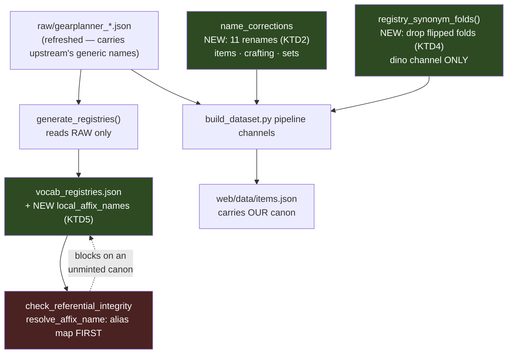

# fix: Refresh the gear-planner snapshot as a canon-defending vocabulary migration

> [!NOTE]
> **Revised 2026-08-18 after a five-persona document review.** The review found four P0 defects, each independently re-measured against upstream `master` and confirmed. All four are resolved below; the resolutions changed KTD2, KTD5, U2 and U3 substantially, and added KTD8. What the review corrected, and where the answer now lives:
>
> | Finding | Resolution |
> |---|---|
> | `name_corrections` reaches only items + the augment pool, not crafting or sets (~280 occurrences would ship under upstream's spelling) | **KTD2** — rename each catalog at its single load point, so every downstream pool inherits it |
> | Our own `ml36_augments.json` makes the canonical natively present, killing the build before the rename runs | **KTD8** — rename the crafting catalog *before* `ml36_augments.check`, redefining "pristine" precisely |
> | `cross_add` hard-fails on the regenerated registry, and its lore half fails *silently* | **KTD5** — union `local_affix_names` into the emitted `_affix_registry`, with a count-based assertion |
> | The armed set is 13, not 11, and `Force Lore` is not a case | **The measured threat**, below — re-derived from the direct Rule A predicate |
>
> The review's P1s are folded into the units that own them. The one finding deliberately **not** adopted: splitting U2 into two units (advisory, confidence 50) — the KTD3 invariant spans both halves and would have to be duplicated or become an artificial cross-unit dependency.

## Goal Capsule

Pull the stale gear-planner snapshot forward (17+ days, +364 KB of item data) **without** adopting upstream's new generic affix vocabulary. Upstream flipped from DDO's in-game enchantment names to generic mechanic names; we keep the enchantment names, because those are what a player reads on an item tooltip and matching the tooltip is a standing principle here.

Done when the new data is in, our canon still wins everywhere, and three independent checks come back **explained rather than merely green**: the unserved-crafting-slot diff, the golden re-ratification, and the perf gate.

### What a player notices

Affix names are **unchanged** — a saved character's ranked `Combustion` still resolves, and exports still read `Combustion`. Upstream's generic names additionally resolve in the search box. Crafting slots relabel `Cannith: → Essence Crafting:`. And recommended loadouts may shift: this lands roughly three weeks of new item data, so every solve re-runs against a larger catalog. That last one is why the build trio bumps — a data-only merge changes every solve on the live site the moment it deploys.

---

## Problem Frame

`data/seed/compendium/raw/` holds a point-in-time snapshot of `illusionistpm/ddo-gear-planner` (upstream commit `ec3e595` (gear-planner, not this repo), 2026-08-01). It is stale, and the refresh is a prerequisite for #363. Two prior refresh attempts were made and both were reverted.

The refresh is not a drop-in, because upstream changed its **vocabulary**, not just its data. This plan treats that as a migration with a defended invariant.

### The measured threat — the predicate that actually matters

**Corrected after review.** An earlier draft derived the threat from upstream's *fold table* (names upstream folds away). That proxy is wrong in both directions: it misses names upstream renamed with no fold entry at all, and it flags names whose data never moved. The predicate that matters is the Rule A test directly:

> For every entry in `affix_aliases.json`: is the **variant** gate-visible in the refreshed raw, **and** is the **canonical** absent from `generate_registries()` over that same refreshed raw?

Measured against upstream `master` fetched 2026-08-18 — registry goes 1441 → 1483 names, 60 removed, 102 added. **13 aliases are armed:**

| variant (arrives in refreshed raw) | canonical (leaves the registry) |
|---|---|
| Fire Spell Power | Combustion |
| Positive Spell Power | Devotion |
| Negative Spell Power | Nullification |
| Cold Spell Power | Glaciation |
| Force Spell Power | Impulse |
| Electric Spell Power | Magnetism |
| Sonic Spell Power | Resonance |
| Acid Spell Power | Corrosion |
| Negative Lore | Void Lore |
| Cold Lore | Ice Lore |
| **Damage vs. the Helpless** | **Damage to helpless enemies** |
| **False Life (%)** | **Legendary Conditioning** |
| **Ki** | **Enhanced Ki** |

The three in bold are the ones a fold-key predicate cannot see, and each carries its own consequence:

- **`Damage vs. the Helpless`** — upstream consolidated the whole helpless family to one spelling (29 occurrences); our canonical drops to **zero** in raw. The #305 `local_affix_synonyms` family collapses from 11 synonyms to 1, and ten entries become stale no-ops with nothing failing — that section has no `assert_all_reached` equivalent.
- **`False Life (%)`** — the #376 fix shipped 2026-08-18 (PR #377). Its canonical `Legendary Conditioning` has zero occurrences in refreshed raw, so the entry that fix added is armed too.
- **`Ki`** — upstream now types all 20 records `{"name":"Ki","type":"Untyped","value":"3"}`. `iter_affixes` yields them, so **#229's mask is already gone** and that alias is live, not latent. It cannot stay out of scope.

**`Force Lore` is not a case and must not be treated as one.** It has **zero** occurrences in refreshed items/crafting/sets, while `Kinetic Lore` has 57/3/12 and stays in the registry. A `Force Lore → Kinetic Lore` rename would trip `name_corrections`' source-absent guard — a guaranteed build failure — and `Kinetic Lore` needs no minting.

### The failure that reverted the earlier attempts

PR #375 shipped picker aliases pointing from upstream's generic names to our canon (`Fire Spell Power → Combustion`, …). Those, plus the older `Ki` and helpless-family entries and PR #377's `False Life (%)` entry, are the 13 armed above.

Those aliases are **dormant today and activate on refresh.** Measured on the current tree: `Combustion`/`Devotion`/`Void Lore`/`Kinetic Lore` are in the frozen registry; `Fire Spell Power`/`Positive Spell Power`/`Negative Lore`/`Force Lore` are not. The gate never calls `resolve_affix_name` on a name upstream does not emit, so nothing fires. Once the refresh lands, raw starts carrying the generic names, the gate resolves each through the alias map, and each lands on a canon name the regenerated registry no longer contains.

That is Rule A from `docs/solutions/conventions/name-corrections-canonical-must-be-a-raw-upstream-name.md`, eleven times over — the same dormancy that currently masks the `Ki` violation (#229). **No rename or fold can fix it**, because `generate_registries` reads the raw files *before* any pipeline stage runs. This is the single most likely cause of both prior reverts, and U3 exists specifically for it.

---

## Requirements

- **R1** Our canon survives the refresh in every channel: items, crafting, sets, dino sets, augment defs.
- **R2** The refresh does not trip the integrity gates spuriously, and every gate that *does* fire is adjudicated, not silenced.
- **R3** A name we fail to defend must fail **loudly**, not split silently into a second bucket.
- **R4** The 12 renamed crafting slots are absorbed with no loss of served slots.
- **R5** Saved-character priorities and golden fixtures continue to resolve.
- **R6** The unserved-slot population is diffed against the pre-refresh baseline and every change is attributed.
- **R7** Solve-time cost is re-measured against a same-session baseline; "it shipped, therefore it fits" is not sound.
- **R8** `SOURCE.json` provenance moves with the data.

---

## Key Technical Decisions

**KTD1 — Keep our canon; do not follow upstream.** *(session-settled: user-directed — chosen over adopting upstream's generic names: the DDO wiki, which is this repo's source of truth, uses the enchantment names, and matching the in-game tooltip is a standing principle.)* Evidence already on disk, no new harvest needed: `docs/wiki-evidence/spellpower-universal.md` quotes the `Spell_power` and `Equipment_bonus` pages ("+2 [[Combustion]] Scepter"); `docs/wiki-evidence/spell-lore.md` quotes the `Spell_Lore` "Types of spell lore" roster as `Ice Lore` / `Void Lore` / `Kinetic [Lore]`. This is the open question #374 says decides the migration.

**Counter-evidence considered, not overturning.** #374's first comment records a player asking for "force lore" where our roster says `Kinetic Lore`, and concluded "keep ours everywhere" was the weaker position. Two axes are in play and they have different answers: *tooltip fidelity* (what a player reads on the item) and *search vocabulary* (what a player types). The wiki's `Spell_Lore` roster settles the first; the picker-alias layer settles the second without renaming stored data. KTD1 holds because we serve both axes separately — not because the counter-case was weak. **Both halves are load-bearing; neither is optional.**

**Revisit trigger.** This divergence is re-examined, not assumed, when any of these fires: a user report shows a player searching upstream's generic name for one of the ten enchantment stats; the DDO wiki's own `Spell_power` or `Spell_Lore` page adopts generic naming; or the armed set exceeds ~20 names, at which point the override layer's cost outweighs the tooltip win. Record the check in each refresh's migration report rather than re-deciding silently.

**KTD2 — Rename each catalog at its single load point.** *(session-settled: user-approved — the seam was settled on #374's third comment, quoting `src/name_corrections.py`: "mint the real name in the pipeline, then alias the variant on top so both resolve.")*

**This corrects two earlier errors.** First, the issue *body* suggests `local_affix_synonyms`; its later comments supersede that, and measurement agrees — `registry_synonym_folds()` has exactly two consumers (`src/helpless_fold.py:53`, filtered to its own canonical, and `src/dino_parser.py` (lines 188 and 435)), so **nothing in the item pipeline applies it**. A local synonym entry would be inert for the catalog: the affix would still import as `Fire Spell Power` and score zero against a `Combustion` target. That is exactly the half PR #375 shipped.

Second, an earlier draft of this plan claimed `name_corrections` already covers items/crafting/sets. It does not — it is called twice, on the item roster (`build_dataset.py:536`) and the augment pool (`:767`), leaving **121 occurrences in `gearplanner_sets.json` and 244 in `gearplanner_crafting.json`** unrenamed.

The fix is one idea, not N: each catalog has exactly **one load point**, and renaming there means every downstream consumer inherits it.

| channel | where the rename goes | what it covers |
|---|---|---|
| items | existing call at `build_dataset.py:536` | the item roster |
| crafting | **new**, immediately after `crafting_catalog_mod.load_catalog()` (`:450`) | every pool derived from the catalog — augment, seal, dino, viktranium, nearly-complete, green-steel, thunder-forged |
| sets | **new**, immediately after `set_catalog_mod.load_catalog()` (`:475`) | set definitions and bonuses |
| dino | suppress the flipped upstream folds (KTD4) | the only migration-relevant consumer of `registry_synonym_folds()` |
| picker | `affix_aliases.json` — already shipped in PR #375 | discoverability; keep, do not remove |
| registry | `local_affix_names` (KTD5) | so the shipped aliases keep resolving, and `cross_add` keeps validating |

The existing augment-pool call at `:767` becomes redundant once the catalog is renamed upstream of it. Keep it — a per-channel miss is already a silent no-op, and `assert_all_reached` remains the honesty guard across all channels.

**KTD3 — Derive the armed set by the direct predicate, gate on it; never hand-list.** The review's P0-4 showed the first draft used the wrong rule: it derived the threat from upstream's *fold table*, which both misses names upstream renamed with no fold entry (the helpless family) and flags names whose data never moved (`Force Lore`). Use the Rule A test itself:

> for each `affix_aliases.json` entry — is the **variant** gate-visible in the refreshed raw, **and** is the **canonical** absent from `generate_registries()` over that same raw?

A build assertion computes this and fails when the result differs from the declared set, in either direction. A hand-list is right once and rots at the next refresh, silently. Today the rule yields **13**; that number is asserted, not assumed, so a fourteenth arriving upstream is a loud event rather than a silent zero-scoring stat.

**KTD4 — Suppress, do not invert, the flipped upstream folds — and scope it to the Dino channel.** Applies to the subset of the armed set that upstream actually folds (the ten spell-power/lore names); the other three are renames only. Post-refresh upstream carries `Combustion → Fire Spell Power`. The Dino seam applies that map single-pass (`src/dino_parser.py:206`), so a Dino set stat literally named `Combustion` would fold **to** `Fire Spell Power` — the wrong direction — and `check_set_records_spelling` (`src/dino_parser.py:435`) would then raise because the output is itself a fold key.

Adding a local *inverse* fold does not fix this and makes it worse: `_local_synonym_folds`' collision guard (`src/vocabulary.py:213`) compares synonym **keys**, and an inverse fold's key is upstream's *canonical*, so it does not collide. Both directions then survive in the merged map, splitting one mechanic across two buckets by whichever spelling a record happened to carry — silent, and the same under-credit class as #376.

So: drop the upstream fold whose **key** is a protected-canon name, rather than inverting it. Chosen over an explicit suppression list, which needs re-curating every refresh and fails silently when someone forgets.

**KTD5 — Mint our canon into the frozen registry, and into BOTH its consumers.** Required, and confirmed by measurement. `generate_registries` reads **raw only**, before any rename runs, so no pipeline change can put `Combustion` back into the registry. Post-refresh the registry goes 1441 → 1483 names, and our canon leaves it.

Add a curated `local_affix_names` section to `data/seed/compendium/vocab_registries.json`, carrying the same per-entry evidence requirement as `local_affix_synonyms` (noting the two sections live in different files). It must be unioned in **two** places, not one — the review found the second:

1. `check_referential_integrity` — so the 13 armed aliases resolve. The union must happen **inside** the function, loading the registry file directly, because its only caller (`tests/test_vocabulary.py:56`) builds `baseline` from raw and would not carry the section.
2. `load_affix_vocabulary` (`build_dataset.py:193`) — whose `_affix_registry` (`:1236`) feeds `cross_add_map` (`:1439`). Without this, `validate_map` raises `SystemExit` on the 8 vanished `spell_focus.SPELLPOWERS`, and — worse — `LORE_ROSTER` is *bounded* to known names, so `Ice Lore`/`Void Lore`/`Kinetic Lore` are **silently omitted** rather than erroring.

Preferred over resolving the gate through `registry_synonym_folds()`, which would let any fold silently widen what the gate accepts. Note also what this gate still cannot do: its caller regenerates the baseline from the same raw it validates, so it catches alias misdirection but never a name *leaving* raw — 60 names leave this refresh, 49 with no fold entry at all. U4 owns that diff explicitly.

**KTD8 — Rename the crafting catalog before `ml36_augments.check`, and say what "pristine" now means.** Our own `data/seed/compendium/ml36_augments.json` carries 8 Ruby entries whose affix names are protected canon, injected at `build_dataset.py:460`. `check` (`:459`) compares each to its gear-planner sibling and raises `SystemExit` on divergence — so post-refresh the sibling says `Fire Spell Power`, the shard says `Combustion`, and the build dies before this plan's work begins.

Placing the crafting rename at `:450` resolves it: `check` then compares our canon to our canon. This deliberately changes what the module's "runs on the PRISTINE catalog" comment means — pristine with respect to **tier content** (the staleness guard's actual subject: upstream adding an ML36 tier), no longer with respect to affix spelling. Update that comment in the same commit. Chosen over re-anchoring the 8 shard entries, which would need redoing on every future upstream rename.

**KTD6a — The #363 unblock is measured, not assumed.** #374 asserts the refreshed `crafting.json` types the Nearly Complete amp options correctly, and the rest of this plan refuses to take #374's claims on trust — so this one was checked too, against upstream `master` on 2026-08-18:

| Nearly Complete option | our current build | upstream refreshed |
|---|---|---|
| `Healing Amplification` | Enhancement | **Competence** |
| `Negative Amplification` | Enhancement | **Profane** |
| `Repair Amplification` | Enhancement | **Enhancement** (unchanged) |

The refresh therefore resolves two of the three stats #363 reports and **leaves `Repair Amplification` typed Enhancement**. Treat #363 as *partially* unblocked: U7 confirms the two corrected types landed, and the residual `Repair Amplification` question goes back to #363 with a wiki check rather than being closed as fixed. Without this measurement the plan could execute perfectly and still not deliver the reason it was sequenced first.

**KTD6 — Land the migration alone.** *(session-settled: user-directed.)* **The interim option was considered and declined:** #374's closing line offered "a narrow sanctioned correction in the interim" for #363 ahead of the refresh. Declined because the correction lives in the same `crafting.json` the refresh replaces, so it would need immediate re-adjudication against the new data — paying twice for one fix. The cost accepted, stated plainly: #363's over-stack stays live for the duration of this migration, affecting any solve that ranks Healing or Negative Amplification. #363 follows immediately on a green baseline; #283 is characterized and recorded here but not fixed. #371's nearly-finished import stays separate — #372 is explicitly two separable halves and this plan closes only the refresh half.

**KTD7 — Land the unserved-slot guard *before* the refresh.** #372's own tail recommends this order as the cheaper one. It converts the captured 35-label / 415-item-slot baseline from a manual diff into a build gate, so R6 is enforced rather than remembered.

---

## High-Level Technical Design

Where each defense sits, and what it protects:

The three green boxes are this plan's substantive changes; everything else is data movement and verification. Two asymmetries drive the whole design. **The gate reads raw only** — so no rename or fold can ever satisfy it, which is why KTD5 is a separate mechanism rather than a consequence of KTD2. And **the fold map reaches only the Dino channel** — which is why the item catalog needs a rename rather than a fold, the distinction PR #375 missed.

---

## Implementation Units

### U1. Unserved-crafting-slot build guard

**Goal:** Convert the pre-refresh unserved-slot baseline into a build-time gate so the refresh cannot quietly strand a pool.

**Requirements:** R4, R6 · **Dependencies:** none — lands first, on today's data, per KTD7.

**Files:**
- `src/crafting_coverage.py` (create) — compute served vs declared slot labels per pool
- `build_dataset.py` (modify) — call the guard; stamp the universe count into `metadata`
- `tests/test_crafting_coverage.py` (create)

**Approach:** Compute each pool's *served* labels from its real keying rather than by string-matching pool names — augments by `fits_slots` colors, viktranium by `slot_type`, nearly_complete by `category`, dino by `dino_type`, seal as `"Sealed in " + seal_type`, green-steel/thunder-forged by tier. Two earlier heuristics got this wrong by string-matching keys and falsely flagged Sealed-in and dino pools; read the record shapes. Declared labels come from each item's `crafting` list, base-normalized by stripping any parenthetical qualifier.

The guard runs on the **derived pool records** (after the dino/seal/viktranium/augment builders have run), not on `gearplanner_crafting.json` — none of `fits_slots`, `dino_type`, `category` or `seal_type` exists in the raw catalog; all four are produced downstream. That fixes its hook point late in `build_dataset.py` and shapes how the test builds fixtures.

It **allowlists the current 35 unserved labels** and fails on any new one — *and* on any allowlisted label that is no longer declared at all. Both directions matter: a one-directional allowlist rots silently, which is exactly what KTD3 forbids. Stamp the universe count into the dataset per the [[Triage universe]] discipline so readers do not hand-recount a different predicate.

**Patterns to follow:** the guard shape in `src/name_corrections.py` (`assert_all_reached`); allowlist-with-declared-exceptions as used by the augment registry.

**Test scenarios:**
- Baseline holds: against the current tree the guard passes and reports exactly 35 unserved labels / 415 item-slots.
- New unserved label fails: inject an item declaring an undeclared slot → the guard raises naming that label.
- Retired label is not a false positive: remove a served pool's only record → the guard raises for *that* pool, distinguishably.
- Vacuity, per pool: a pool that walks zero records raises rather than passing — aggregate zero-inspection is not sufficient (a populated pool must not vouch for a dark one).
- The stamped count equals the guard's own validated count, not what it iterated.

**Verification:** Guard passes on the current tree at exactly the baseline numbers, and has been *observed to fail* on injected corruption with its own message — not a sibling gate's.

**Execution note:** Falsify before trusting. Confirm the red text is this guard's, since the build has layered gates and a red proves *a* gate fired, not that yours did.

---

### U2. Defend the canon through the pipeline

**Goal:** Make our canon survive import in **every** channel — rename it back at each catalog's load point, and stop the Dino seam folding it away.

**Requirements:** R1, R3 · **Dependencies:** none (parallel-safe with U1; different files)

**Files:**
- `data/seed/compendium/affix_name_corrections.json` (modify) — 13 rename entries with evidence
- `build_dataset.py` (modify) — rename call after the crafting load (`:450`) and after the set load (`:475`); thread both coverage dicts into `assert_all_reached`; update the `ml36_augments.check` "pristine" comment per KTD8
- `src/vocabulary.py` (modify) — suppress flipped upstream folds in `registry_synonym_folds`
- `tests/test_name_corrections.py`, `tests/test_vocabulary.py`, `tests/test_dino_parser.py`, `tests/test_ml36_augments.py` (modify)

**Approach — two halves, one goal.**

*Items / crafting / sets:* 13 `name_corrections` entries, applied at each catalog's **single load point** (KTD2). One call per catalog; every derived pool inherits it. The crafting call sits **before** `ml36_augments.check` (KTD8), which is what stops our own ML36 shard from killing the build.

The 13 are the measured armed set, not a guess. Ten are spell-power/lore flips; the other three each carry a wrinkle worth naming:
- `Damage vs. the Helpless → Damage to helpless enemies` — upstream consolidated the family, so our canonical hits **zero** occurrences in raw. Ten of the eleven `local_affix_synonyms` synonyms in the #305 entry become stale no-ops, and that section has **no `assert_all_reached` equivalent** — add one, or the staleness is invisible.
- `False Life (%) → Legendary Conditioning` — added by PR #377 today; armed by the same mechanism.
- `Ki → Enhanced Ki` — upstream now types all 20 records `Untyped`, so #229's mask is **gone** and this is live, not latent. It cannot stay deferred.

Do **not** add a `Force Lore` entry: it has zero occurrences in refreshed raw, so `name_corrections`' source-absent guard would fail the build. `Kinetic Lore` survives natively (57/3/12).

*Dino:* drop any upstream fold whose key is one of the ten folded canon names, so a Dino set carrying `Combustion` stays `Combustion`. Do **not** add inverse local folds — `_local_synonym_folds`' collision guard compares synonym keys and would not catch the resulting two-way map (KTD4).

Then the KTD3 assertion: recompute the armed set from the direct predicate and fail when it differs from the declared 13.

**Patterns to follow:** `src/name_corrections.py`'s `assert_all_reached`; `_local_synonym_folds`' `IntegrityError` shape (name both sides).

**Test scenarios:**
- Each of the 13 renames reaches its channel: after build, **zero** records carry the upstream spelling in items, crafting, **sets**, dino and augment defs — asserted per pool, never aggregated.
- Set and crafting coverage specifically: assert the counts that motivated this (121 set occurrences, 244 crafting) go to zero, since those are the channels the previous design missed.
- `assert_all_reached` fires when an entry matches no channel.
- `ml36_augments.check` passes post-rename, and **fails** if the rename is moved back after it — pinning KTD8's ordering.
- A new `local_affix_synonyms` staleness guard fires when a declared synonym matches nothing upstream.
- Dino suppression: merged map has no folded canon name as a key; a Dino stat named `Combustion` survives the parse seam.
- The pre-change tree does **not** do this — same input yields the fold.
- KTD3 assertion fires when the declared set and the derived set diverge, in either direction.
- `helpless_fold.fold_map()` still returns a non-empty family (it filters to its own canonical) — verify, since its source spelling changed.
- Each new canon name checked against `BONUS_TYPES`, so `_split_type` cannot peel it and leave `stat=""`.

**Verification:** Zero upstream-spelling survivors per pool; `assert_all_reached` green; the ML36 ordering test red when the order is reversed.

**Execution note:** Start from failing assertions and prove each red against the pre-change tree — copy the gitignored `web/data/` in first, or the crash reads as a pass.

---

### U3. Mint our canon into the frozen registry

**Goal:** Give both registry consumers a curated way to accept a canon name that no longer appears in raw.

**Requirements:** R2, R5 · **Dependencies:** U2 (shares `src/vocabulary.py`)

**Files:**
- `data/seed/compendium/vocab_registries.json` (modify) — add `local_affix_names` + `_local_names_why`
- `src/vocabulary.py` (modify) — union inside `check_referential_integrity`
- `build_dataset.py` (modify) — union in `load_affix_vocabulary` (`:193`)
- `tests/test_vocabulary.py`, `tests/test_cross_add.py`, `tests/test_build_metadata.py` (modify)

**Approach:** Union the section in **both** consumers (KTD5). Inside `check_referential_integrity`, load the registry file directly rather than trusting the passed `baseline` — its only caller generates that baseline from raw and would not carry the section.

**Legitimacy predicate — corrected.** An earlier draft said "minted by a reviewed local fold", which would have rejected every entry this unit adds, since the names are minted by *renames*. The real predicate has two arms: an entry is legitimate only when the name is either the `canonical_name` of an `affix_name_corrections.json` entry, **or** the `name` of a `local_affix_synonyms` entry. Both arms are needed — ten spell-power/lore names and `Legendary Conditioning`/`Enhanced Ki` come from the first, `Damage to helpless enemies` from the second.

**Test scenarios:**
- With the 13 minted, `resolve_affix_name` returns our canon for each armed variant and the gate passes.
- Without minting, the gate raises for `Fire Spell Power` — the predicted failure, reproduced deliberately.
- A name in `local_affix_names` backed by neither arm is rejected; the join is asserted mechanically.
- **`cross_add` regression:** all ten `spell_focus.SPELLPOWERS` and all three affected `LORE_ROSTER` entries are present in `metadata.cross_add` post-refresh — asserted by **count**, because the lore half omits silently rather than raising.
- `validate_map` does not `SystemExit` on the refreshed registry.
- A genuinely unknown new upstream name still raises against an injected baseline — the gate is not widened.

**Verification:** Gate passes against refreshed raw; `cross_add` targets complete by count; the gate still fails on an unknown name.

### U4. Vendor the refreshed snapshot and re-freeze

**Goal:** Land the new data with provenance and re-freeze every registry deliberately.

**Requirements:** R1, R2, R8 · **Dependencies:** U1, U2, U3

**Files:**
- `data/seed/compendium/raw/gearplanner_{items,crafting,sets,affix_synonyms}.json` (replace)
- `data/seed/compendium/raw/SOURCE.json` (modify) — `upstream_commit`, dates, counts
- `data/seed/compendium/{vocab_registries,affix_synonyms_registry,crafting_slot_registry,augment_registry}.json` (re-freeze)
- `tests/test_overhaul_invariants.py`, `tests/test_crafting_catalog.py` (re-ratify pinned populations)

**Approach:** Vendor all four raw files from one upstream commit — never mix commits. Update `SOURCE.json` first (`assert_freshness` at `src/vocabulary.py:610` reads `upstream_commit`). Then re-freeze each registry as a reviewed diff, one at a time, adjudicating what moved.

**`check_set_records_spelling` must NOT fire — an earlier draft had this backwards.** U4 depends on U2, so the auto-drop is already in the tree and `Combustion` is no longer a fold key. If that guard (`src/dino_parser.py:435`) does raise, it means KTD3's derived set failed to cover the name it reports — treat it as a real failure of U2, never as an expected red to wave through.

**Adjudicate the fold diff offline, then re-freeze once.** `check_affix_synonyms` raises on the **first** added/removed/re-pointed fold in sorted order, and upstream moves 46/94 → 69/145. A build-run-per-fold loop is impractical, and re-freezing wholesale accepts ~51 additions with nothing reviewed — which is how #154 happened. So: produce the full categorized diff (added / removed / re-pointed) as a table in the `docs/reports/` entry, adjudicate every row in writing, then re-freeze in one act.

**Attribute every registry *removal*.** The gate catches alias misdirection but never a name *leaving* raw — and 60 names leave this refresh, 49 with no fold entry at all. That is the class that hid `Damage to helpless enemies`. Diff frozen `affix_names` against `generate_registries()` over refreshed raw and attribute each removal in writing (fold-away / silent upstream rename / genuinely retired). A removal that is an alias canonical or a name-correction canonical is **blocking**.

**Test scenarios:**
- `assert_freshness` passes against the new commit and fails against the old stamp. Note what it cannot do: it reads a hand-written string from `SOURCE.json` and never inspects the raw files, so it **cannot** detect mixed-commit vendoring. Fetch all files with a single `git checkout <sha> -- <paths>` from the pinned SHA and record the command in the report — that, not the guard, is the real mitigation.
- Pinned populations re-ratified with the delta attributed to named upstream additions, never bumped to whatever the build produced: `tests/test_overhaul_invariants.py` (`len(items) == 9108`), `tests/test_vocabulary.py` and `tests/test_crafting_catalog.py` (83 crafting pool keys).
- Grep the **built artifact** for each upstream generic name and expect **zero, per pool** — items, crafting, sets, dino, augment defs — never aggregated. A rename that reaches items but not augments is worse than no rename.
- `cross_add.validate_map` and `spell_focus._UNIVERSAL` still validate; no name appears in both key spaces.
- Both orphan guards (`set_bonus_orphans`, `set_def_orphans`) pass per channel.
- Each new canon name is checked against `BONUS_TYPES` — a canonical that is also a bonus-type word makes `_split_type` peel it and leave `stat=""`.

**Verification:** Build succeeds; every gate that fired was adjudicated in writing; zero generic-name survivors per pool.

---

### U5. Absorb the crafting-slot rename

**Goal:** Take the 12 `Cannith: <slot> - <affix>` → `Essence Crafting: <slot> - <affix>` renames with no loss of served slots.

**Requirements:** R4 · **Dependencies:** U1, U4

**Files:**
- `data/seed/compendium/crafting_slot_registry.json` (re-freeze — currently 95 slots)
- `src/crafting_coverage.py` (re-curate U1's allowlist: 12 `Cannith:` entries retire, 12 `Essence Crafting:` land, paired 1:1)
- `tests/test_vocabulary.py` (the pinned `Cannith: Rune Arm - Extra` assertion and the 95-slot count)
- `src/`/`web/` wherever a `Cannith:` label is matched (audit; do not assume none)
- `tests/test_crafting_coverage.py` (extend)

**Principle check first — KTD1 applies here too.** This plan defends thirteen affix names on the grounds that players must find the words they see in game, then adopts upstream's `Cannith: → Essence Crafting:` relabel wholesale. Confirm against the wiki whether DDO renamed the in-game system or only upstream's key changed. If the game still says Cannith, keep our label or ship an alias — erasing a term players use is precisely the failure KTD1 exists to prevent. Record the ruling; do not inherit #374's "trivial to absorb".

**Note the untaken fifth file.** Upstream now ships `site/src/assets/essence-crafting.json` (~171 KB, upstream path — not in this repo) which U4 does not vendor. The 12 renamed slots are pool-less on our side today; that file may be their pool data. Decide explicitly whether they stay unserved.

**Approach:** Verify the 12/12 exact pairing before re-freezing rather than trusting #374's claim. Any user-facing label change flows through to exports per the standing rule that new mechanics must be share-visible.

**Test scenarios:**
- Exactly 12 retired and 12 added, pairing 1:1 by the slot/affix suffix.
- **Exactly 12 allowlist entries move, paired 1:1** by slot/affix suffix, with no unpaired new label. (Stated this way rather than "no new unserved label": the 12 `Cannith:` markers are inside U1's 35-entry allowlist and upstream has already renamed all of them, so the naive form fails by construction.)
- No `Cannith:` string survives in the built artifact or in `web/`.

**Verification:** U1's guard is green at the baseline count, adjusted only by attributed changes.

---

### U6. Named assertions, then golden re-ratification

**Goal:** Pin the migration's behavior in named tests **before** regenerating the golden, then re-ratify each fixture with attribution.

**Requirements:** R3, R5 · **Dependencies:** U4, U5

**Files:**
- `tests/vocabulary_migration.test.js` (create) — named behavioral assertions
- `tests/parity/fixtures.json` (modify if needed)
- `tests/parity/golden.json` (regenerate — last)

**Approach:** The classic re-ratification clauses ("diff contained to expected fixtures" + "no priority target regressed") **cannot adjudicate a `chosen`-only diff** — per the 2026-08-17 amendment, an injected live regression satisfied both while a legitimate re-ratification moved 18 of 23 fixtures with zero `perTarget` change. So the named assertions must exist *first*; a golden's sanctioned remedy for a red is to overwrite the objection, which makes it useless as the sole guard for a reported behavior.

Rebuild `web/data/items.json` from the current tree before any capture — it is gitignored, so git gives no signal it belongs to a different tree.

9 of 23 fixtures reference affected names; 5 rank them as raw `targets` (`Devotion` ×2, `Combustion`, `Kinetic Lore` ×2). Because we keep our canon these should still resolve — **a ranked stat sitting at zero is the tell that a local fold was missed**, and it is a fixture-level detector for U2's coverage.

**Test scenarios:**
- Each of the 13 armed variants, present on an item, credits the corresponding canon target.
- A player ranking `Combustion` gets the same total pre- and post-migration on a fixed item set.
- Each affected fixture's `perTarget` for its ranked name is **non-zero** after re-ratification.
- Saved-character priorities in our canon still resolve through the load path.
- Golden diff is attributed per fixture; the six non-sentinel control fixtures are examined specifically for leakage.

**Verification:** Named assertions pass and were red before U2/U3; every golden diff has a written cause.

**Execution note:** Assertions first, golden last. Never regenerate to make a red go away.

---

### U7. Close-out: unserved diff, #283, perf, build trio

**Goal:** Produce the three explained results the Goal Capsule requires, and record the #283 finding.

**Requirements:** R6, R7, R8 · **Dependencies:** U4, U5, U6

**Files:**
- `web/index.html` (`?v=`), `web/app.js` (`BUILD`), `README.md` (`**Current build:**`)
- `docs/reports/` (create the migration report)

**Approach:** Diff unserved slots against the 35-label / 415-item-slot baseline and attribute every change. Characterize the two vanished `(quarterstaff)`-qualified Lamordia slots and comment the finding on #283 — whether the refresh resolves it, invalidates it, or leaves it open — without fixing it here (KTD6).

**`tests/perf_utility.js` cannot measure this on its own.** It is a self-relative A/B — for each fixture it solves the ratified form and the sentinel-appended form against whatever dataset is on disk, then asserts `median(b) ≤ 2.00 × median(a)`. Both arms move together, so the *ratio* is invariant to the refresh: running it post-refresh answers "is the Utility widening still under 2×", not "did +364 KB of items raise solve cost".

Measure both, in one session on one machine: run it against the pre-refresh dataset and again post-refresh, and compare the **absolute** medians of arm (a) across the two runs — that is the refresh delta. Report the Utility ratio separately as its own gate. Two numbers, not one.

Bump the trio together — this is a solver-affecting data change, so the footer is the only version signal a player has.

**Test scenarios:**
- `tests/test_build_stamp.py` passes (it fails when the three disagree).
- Utility ratio still inside its 2.00× budget, AND the absolute pre/post medians reported as the refresh delta. If either is out of budget, stop and surface rather than shipping with a caveat.
- Full Python suite; JS suite run **file by file** (`node a.js b.js` runs only the first, which has silently skipped the golden check before).

**Verification:** All three checks explained in the report, not merely green.

---

## Verification Contract

| Gate | How | Blocking |
|---|---|---|
| Python suite | `python3 tests/run_tests.py` | yes |
| JS suite | `for t in tests/*.test.js; do node "$t" \|\| echo "FAIL $t"; done` | yes |
| Build | `python3 build_dataset.py` clean, every fired gate adjudicated | yes |
| Canon survival | zero generic-name survivors **per pool** in the built artifact | yes |
| Unserved slots | U1 guard green; diff vs 35/415 attributed | yes |
| Golden | named assertions first; per-fixture attribution | yes |
| Perf | Utility ratio in budget **and** absolute pre/post medians reported | yes |
| Picker discoverability | all 13 armed variants resolve to our canon through `buildPickerVocabulary` against the rebuilt dataset | yes |
| Build trio | `tests/test_build_stamp.py` | yes |
| Guard falsification | each new guard observed failing with **its own** message | yes |

---

## Definition of Done

1. Snapshot refreshed from one upstream commit; `SOURCE.json` moved with it.
2. All 13 armed names resolve to our canon; zero upstream-spelling survivors **per pool** (items, crafting, sets, dino, augment defs).
3. No protected canon name is a fold key in the merged map, and a missed defense fails loudly.
4. The 12 crafting slots renamed with no new unserved label.
5. Goldens re-ratified with per-fixture attribution, behind named assertions written first.
6. Unserved diff, perf, and trio all explained in a `docs/reports/` entry.
7. #363's unblock verified against the refreshed data — the two corrected types confirmed present, the `Repair Amplification` residual recorded on the issue rather than closed.
8. Each new guard — U1's coverage guard, U2's protected-canon assertion, U3's registry gate — has been **observed failing with its own message** on injected corruption, per the Verification Contract's falsification row.
9. #374 closed with the corrected count and the evidence; #283 commented; #363 unblocked **to the extent measured above**.
10. The migration report states the change in **player-facing** terms, not only gate terms.

---

## Scope Boundaries

**Deferred to follow-up work**
- **#363** — lands immediately after, on a green baseline (KTD6).
- **#371** — the `nearly-finished.json` import is #372's *other* half; this plan closes only the refresh half, so **#372 stays open**.
- **#283** — characterized and commented here, fixed separately.
- **#229** — untyped-affix blindness. Out of scope, but note it currently masks a live `Ki` Rule A violation; whoever closes it must re-point that alias in the same commit.

**Non-goals**
- Changing which names players rank, or adopting upstream's vocabulary.
- Re-harvesting set definitions (gear-planner is sole authority).
- Any solver-logic change beyond what the fold layer requires.

---

## Risks & Dependencies

| Risk | Mitigation |
|---|---|
| A protected name is missed → silent bucket split | U2's protected-canon assertion makes it loud; fixture zero-check is a second detector |
| `check_set_records_spelling` fires and is misread as a new bug | Called out in U4 as *expected*; confirm the message is that guard's |
| Golden re-ratified to hide a real regression | Named assertions written **before** regeneration (U6) |
| `local_affix_names` becomes an escape hatch | U3 test rejects a minted name with no backing local fold |
| Guard verified against a stale dataset | Rebuild before any capture; `web/data/` is gitignored |
| Upstream changes again mid-work | Fetch every file with one `git checkout <sha> -- <paths>`; record the SHA and command in the report (`assert_freshness` cannot corroborate it) |
| **This lands and is wrong** | The whole migration lands as one squash commit, so revert is `git revert <sha>` plus a build-trio bump — the golden and all four frozen registries revert with it. `main` auto-deploys, so the post-deploy signal is the footer BUILD plus a spot-check that a `Combustion` priority still scores non-zero on the live site |

---

## Open Questions (deferred to implementation)

- Exact count of upstream folds dropped by KTD4's auto-drop — knowable only against the refreshed table; assert whatever it is rather than predicting it.
- Whether any of the 58 added upstream folds merges two mechanics we treat as distinct. The U6 gate surfaces each as a reviewable event; adjudicate then, and remember a fold that merges two mechanics is exactly the #154 failure.
- Whether `Radiance Lore` / `Kinetic Lore` need defending later, if upstream adds folds for them.

---

## Sources & Research

- Issues #374 (migration), #372 (refresh), #363 (unblocked), #371, #283, #229; PR #375 (the spell-power/lore aliases), PR #377 (#376 fix, itself armed by this refresh).
- `docs/wiki-evidence/spellpower-universal.md`, `docs/wiki-evidence/spell-lore.md` — the canon ruling.
- `docs/solutions/conventions/name-corrections-canonical-must-be-a-raw-upstream-name.md` — Rule A/B; predicted this failure class.
- `docs/solutions/logic-errors/impossible-values-mean-a-unit-change-not-corruption.md` — why the synonym gate exists (#154); a rename must reach every pool.
- `docs/solutions/workflow-issues/golden-solve-guard-missing-from-local-test-sweep.md` — the 2026-08-17 amendment.
- `docs/solutions/workflow-issues/rebuild-the-dataset-before-any-golden-capture.md`.
- `docs/solutions/conventions/prove-a-guard-fails-before-trusting-it.md` — a red proves *a* gate fired.
- `docs/solutions/design-patterns/universal-stat-expansion-family.md`, `docs/solutions/conventions/golden-fixtures-resolve-aliases-like-saved-builds.md`.
- `docs/plans/2026-08-05-001-fix-affix-vocabulary-hygiene-plan.md` (U6 alias discipline) and `docs/plans/2026-08-10-001-fix-unreachable-affix-vocabulary-plan.md` (U1 `Enhanced Ki`) — binding rulings that live only in plan prose; read directly.
- Upstream table fetched 2026-08-18 from `illusionistpm/ddo-gear-planner` `master`: 69 entries / 145 folds vs our frozen 46 / 94.
