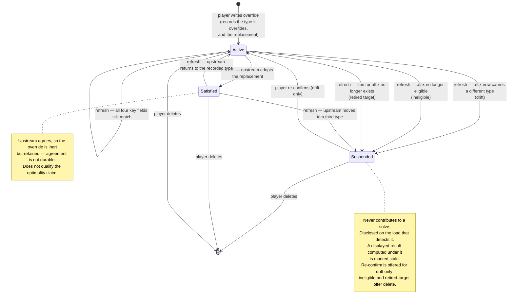
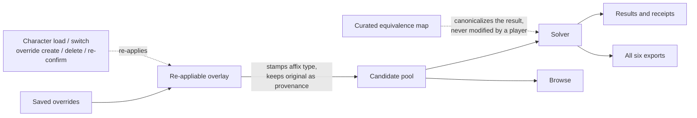

# Player bonus-type override - Plan

## Goal Capsule

**Objective.** Let a player correct the bonus type of one affix on one item, so a solve reflects the stacking they observe in game rather than the type the catalog recorded.

**Product authority.** #88, workstream 2. Workstream 1 — the wiki-gated equivalence audit — is complete and verified against the tree as of 2026-08-20; this feature is the whole of what remains on the issue.

**Open blockers.** None. All questions raised in two review rounds are settled and recorded as Key Decisions.

**Product Contract preservation.** Unchanged. Planning added the Planning Contract, Implementation Units, Verification Contract, and Definition of Done below; every R-ID and AE-ID above is preserved as written.

**Landing strategy.** Three PRs in dependency order — U1–U4 (identity, overlay, eligibility, goldens), U5–U8 (persistence, pool keying, lifecycle, disclosure), U9–U12 (exports, surfaces, manager, correction report). `main` deploys on every push, so each PR must leave the app coherent: PR 1 ships the overlay with no override UI to reach it — apart from three new entries in the declared-credit type selector, which renders from the same shared constant (see System-Wide Impact). PR 2 adds persistence, pool keying, and disclosure. PR 3 opens the surfaces and the correction report.

## Product Contract

### Summary

A player selects one affix on one item, picks a replacement bonus type from a closed list, and every subsequent solve buckets that affix under the chosen type. Each override records the type it was written against, so a later dataset refresh can tell a correction that still applies from one whose premise has moved. Overrides are labelled as player-asserted wherever contributions are shown, and travel with the character and its exports.

### Problem Frame

DDO's stacking rule is that same-type bonuses on a stat take the highest, and different-type bonuses sum. The solver implements that as a `(stat, bonus type)` bucket — max within, sum across. The model is correct. What it cannot check is the type name it is handed.

Testers reported both directions of failure: bonuses that stack when they shouldn't, and bonuses that don't when they should. Workstream 1 chased the shared-bucket half of that and closed it. It verified that no in-game type appears in the catalog under two different names, dispositioned all 30 live types, and replaced the dated completeness claim with a build guard.

That guarantee is name-level, and name-level is the only kind an equivalence map can offer. It cannot reach the case where the type recorded on one specific affix is wrong. But that residual class is three causes wearing one symptom, and they do not want the same instrument:

1. **The catalog disagrees with the wiki.** gear-planner records a type the wiki's rendered tooltip contradicts. Already closed globally and wiki-sourced, by `src/type_corrections.py` reading `data/seed/compendium/affix_type_corrections.json` — nine live per-affix corrections today, each with a `from`/`to` pair and a stale guard, one of them recorded as player-reported. A maintainer fix, not a player setting.
2. **The wiki was corrected upstream but the catalog has not refreshed.** Resolves itself on the next snapshot. A refresh, not a fix.
3. **The wiki itself is wrong and uncorrected.** Nobody has checked that item against a running game client, and no amount of harvesting closes it, because the source everyone harvests from is the thing that is wrong.

An override serves all three as a local stopgap, because neither the tool nor the player can tell them apart at creation: the app is client-side with no wiki access, and the catalog the browser loads is already post-correction. Only the third has no other instrument. The first two are maintainer work an override papers over until the real fix lands — which is precisely why an override must not become the place a report goes to die, and why the creation surface names the distinction rather than pretending to enforce it.

The taxonomy is not stable per case, either: a player who finds the wiki wrong and edits it converts their own case from the third cause to the second, and the override should expire on the next refresh rather than assert forever.

The cost of any of the three is not a cosmetic mislabel. A wrong type puts a real bonus in the wrong bucket, which changes which item the solver buys. A bonus that should have been overwritten instead sums, and the player is handed a loadout that spends a slot on a redundant item and a total their character sheet will never show. The person who can see that discrepancy is the player, and today the tool gives them nowhere to put the observation.

### Key Decisions

**Overrides are per-affix, never per-type.** A player retypes one affix on one item. The claim that two type *names* denote a single in-game type stays a maintainer decision backed by a wiki ruling and an entry in the curated equivalence map. The two defect classes look similar and want opposite handling: a per-affix mislabel is unbounded, player-observable, and local, while a name-equivalence claim is a statement about DDO's rules that would silently rewrite verified data everywhere it applied. (session-settled: user-directed — chosen over a global type-to-type mapping and over offering both: the global arm would let a player's belief overwrite the equivalence map workstream 1 just verified, and every wrong global mapping is wrong on every item at once.)

**An override is the wiki-versus-game instrument, and never a substitute for a catalog correction.** Cause 1 in the Problem Frame already has a global, wiki-sourced mechanism, and cause 2 fixes itself. An override applied to either is a private patch over a defect everyone else still has. This is why the override records what it was overriding from — so the tool can tell when a maintainer fix or a refresh has landed and stop asserting over it.

**An override resolves to one distinguishable affix occurrence, and byte-identical occurrences move together.** The identity is the variant plus the affix name plus the recorded type, extended with the affix's value where those three do not separate two occurrences. They frequently do not: **130 variants** carry two eligible affixes sharing both name and type. Adding the value separates 78 of them. The remaining **52 are identical in name, type, and value** — `Aberrant Robe` carries `Armor Class | Armor | 5` twice — and no key can tell them apart because no difference exists. Those retype together, because retyping one of two identical rows is what would split a bucket that maxed at 5 into 5+5. Expansion provenance is deliberately *not* part of the identity: carrying it is exactly what makes an affix ineligible, so no eligible occurrence has one.

**An override records what it was overriding from.** The stored override carries the type the affix held when it was written, not only the replacement. That recorded type does double duty: it disambiguates the target when one item carries a stat under two types, and it is the sentinel that detects upstream drift on a later refresh. (session-settled: user-directed — chosen over applying unconditionally until deleted, and over dropping on any change: unconditional application lets a stale override outlive its own premise with nothing telling the player the disagreement ended, and dropping on any change discards corrections that are still valid whenever upstream merely re-values an affix.)

**Drift suspends rather than resolves — except when upstream agrees.** When upstream no longer says what the override was written against, the tool does not guess whether the wiki fixed the problem or moved it somewhere else. It suspends the override, discloses the change, and asks the player. The one branch it can settle alone is upstream arriving at the player's own replacement type: that is agreement, not drift, and the override becomes **satisfied**. It is kept in that state rather than deleted, because upstream agreement is not durable — `affix_type_corrections.json`'s `_retired_2026_08_18` block records two entries retired without cause and restored, noting that retiring them "would have silently re-opened the #259 double-count". A later refresh that stops carrying the replacement returns a satisfied override to suspended. "Satisfied" and "retired target" are deliberately different words for opposite outcomes: the first needs no action, the second is broken and needs deleting.

**A restored result that used a since-suspended override is marked stale, not silently re-solved.** Saved characters restore their result without re-solving. When an override suspends between save and load, the displayed loadout was computed under a rule no longer in force, so it is disclosed as stale with re-solve offered. (session-settled: user-directed — chosen over re-solving on load, which would breach the existing restore-without-re-solving contract, and over keeping suspended overrides in force for restored results, which reintroduces the stale-premise failure the recorded type exists to prevent.)

**The override installs as a re-appliable overlay over the loaded dataset, not at bucket-key formation.** The equivalence map installs through `equivType`, which receives a type string and no item context, so a per-affix override cannot install there. It applies over the loaded candidate pool, stamping the affix itself, so the solver, Browse, receipts, and all six exports inherit it without each opting in. It cannot install *at* dataset load, despite that being the natural reading: the dataset normalizes once on the startup fetch, and loading a character restores state in place without re-normalizing. A stamp applied at load could neither reach a character loaded afterwards nor be withdrawn on a character switch, leaving the previous character's overrides on the shared pool. The overlay is therefore re-applied whenever the set of overrides in force changes. The cost is that it mutates wiki-sourced data in memory, which makes the provenance stamp carrying the original type load-bearing rather than decorative — it is the only thing that keeps the labelling honest.

**The replacement vocabulary is the declared-credit list, extended.** Overrides and declared credits draw on one shared list rather than two, so the vocabulary and the equivalence map stay maintained together as they are today. It gains the three real bonus types the dataset carries and the credit list lacks: `Orb`, `Sneak Attack`, and `Determination`. The `X Natural` family is deliberately left out — the equivalence map collapses those to their plain type, so offering both would put two names on one bucket. (session-settled: user-directed — chosen over reusing the credit list verbatim, which would leave 131 affixes with no correct replacement type, and over deriving the list from the dataset, which `web/model.js:1225` rejects on record.)

**Five classes of affix are ineligible for an override.** `Bool` presence affixes, `Penalty` affixes, the dash-typed `DR` affixes, affixes with no type at all, and expansion-derived affixes cannot be retyped. The first four occupy the type field without being an ordinary bonus-type bucket: presence collapses to 1 and would break as a magnitude, penalties are sign-preserving, the dash token is DR's field-semantics artifact and retyping one would let a player rebuild the summing defect #223 fixed, and absent-type follows the standing ruling that already refuses a stat with no bonus type the declared-credit control. The fifth is different in kind: an affix the **load pipeline generated** rather than the item engraved. One engraved enchantment fans out into many affixes, so retyping a single member contradicts the one-occurrence rule, and `collapseExpansions` builds its uniformity key from value, unit, and bonus type — so a retyped member turns a single-value export entry into a parts list.

The class is **not** identified by the provenance stamp alone, in either direction. The boolean composites are deliberately left unstamped because their expansion is additive rather than replacing, so **161** generated affixes (Concealment 140, Healing Amplification 7, Melee Power 7, Ranged Power 7) present as ordinary native rows. In the other direction `src/dr_qualifiers.py` writes the same key as a DR retype receipt, and **126** single-member `(item, source)` groups — Speed 58, Legendary Conditioning 36, Heightened Awareness 26 — are renames of one engraved affix rather than sibling expansions.

One family breaks the shared-source reasoning outright. `Elemental Resistance` carries three types across its 246 expanded affixes on 58 items (Competence 168, Enhancement 54, Insight 24), so its type is a per-item property — and six of the nine live entries in `affix_type_corrections.json` are exactly these per-item retypes. It is excluded anyway, as an accepted gap: the wiki template names its type outright (#191), so a wrong one is a maintainer correction rather than a player observation.

Counted **after `normalizeDataset`**, which is the pool the overlay acts on, this leaves **20,613 engraved affixes** eligible of 42,088: 13,573 on items, 6,121 on weapons, 919 on augments. The build artifact carries 299 fewer affixes, so figures measured against `data/` will not reconcile.

An earlier draft said 20,774. That figure was measured with a `via`-only test — the very predicate this decision rules out — which counts the 161 unstamped composite components as engraved. Running the real five-class predicate over the normalized pool is what produces 20,613; the difference is exactly those 161. (session-settled: user-directed — the first four chosen over allowing DR and absent-type through and over allowing every affix; expansion-derived chosen over admitting them and accepting the export change, and over retyping a whole expansion group together, which would contradict the one-occurrence rule.)

**Augments are already reachable; crafting pools need a composite key.** All 1,063 augments are ordinary variants (`category: augment`), so the variant-keyed identity reaches them unchanged. Crafted options are the exception: they live outside the variant's affixes, in six flat global pools plus one host-keyed pool (`nearly_complete_per_item`, 43 hosts). Because six of the seven are global, one correction already covers every host offering that option — the pool shape gives that for free rather than needing to be engineered for it.

No pool entry carries a name that is both present and unique: all 48 `seal` entries and all 68 `nearly_complete` entries have no usable name at all, names repeat across tiers elsewhere, and some entries carry more than one affix. A pool override is therefore keyed by the composite of pool channel, the entry's own discriminators (tier, tier key, seal type, slot type, category), and the affix stat. (session-settled: user-directed — chosen over keying pool overrides per host variant, which would need one override and one refresh prompt per host for a single mistyped option, and over excluding crafted options entirely.)

**Replacement types come from a closed list.** A free-text type is wrong-high and silent: an unrecognized string forms its own bucket, so the affix stops competing and starts adding. The declared-credits feature already paid for this lesson — a credit of 7 typed `insight` reported 12 beside an Insight-5 ring that was still equipped. Membership in a curated list is the guard; the UI is not.

**Overrides are created where they are noticed and where they are reachable, and reviewed in one place.** The results panel is where a wrong total surfaces; Browse is the only surface that reaches an item the current loadout does not contain, which matters because an item is often mispicked *because a rival was mislabelled*. A single manager view holds the full set so a player can audit, re-confirm, and delete without hunting. (session-settled: user-directed — chosen over Browse-only, results-only, and a standalone overrides screen: the single-surface options each serve either the noticing moment or the pool-wide reach, never both.)

**An override can be emitted as a catalog-correction report, at the moment it is created.** The report names the item or pool entry, the affix, the catalog's type, the player's type, the item's wiki URL, and an optional note. Offering it only from the manager would miss the default path entirely — notice a wrong total, create an override, move on — so it is offered at creation, when the observation is fresh, and remains available in the manager afterwards.

Its destination is a **wiki-verification issue, not an `affix_type_corrections.json` entry**. That file's evidence rule demands the verbatim rendered tooltip stating the bonus type, and for the third cause no such tooltip exists by construction — the wiki is the thing that is wrong. The report therefore states explicitly that the claim is an in-game observation with no wiki backing, so a maintainer knows it needs verification rather than transcription. (session-settled: user-directed — chosen over purely local overrides, and over deferring the outbound path to a follow-up issue.)

### Override lifecycle

### Where an override reaches

### Requirements

**Scope of an override**

- R1. A player can override the bonus type of a single affix on a single item, including an augment, which is an ordinary variant. The override identifies the item's variant, the affix name, the type the affix currently carries, and the affix's value.
- R2. An override resolves to one distinguishable affix occurrence rather than to every affix sharing a name and type. Where two or more occurrences are identical in name, type, and value, they are indistinguishable and retype together.
- R3. The affix picker shows enough of each occurrence to tell two same-named affixes apart, and presents indistinguishable occurrences as one entry.
- R4. The replacement type is selected from a closed vocabulary. Free-text entry is never accepted.
- R5. The vocabulary is the declared-credit list extended with `Orb`, `Sneak Attack`, and `Determination`, and remains one list shared by both features.
- R6. `Bool`, `Penalty`, dash-typed `DR`, untyped, and load-pipeline-generated affixes are ineligible for an override, and the surfaces do not offer one.
- R7. Eligibility is decided by what generated the affix, not by the presence of the provenance stamp: the unstamped boolean-composite components are ineligible, and stamped single-member rename receipts are not expansions.
- R8. An override on a crafted pool option is keyed by pool channel, the entry's own discriminators, and the affix stat, because no pool entry carries a name that is both present and unique.
- R9. An override applies to the whole candidate pool, not only to items in the current loadout.
- R10. An override never modifies the curated stacking-equivalence map.
- R11. After an override sets an affix's type, the existing equivalence canonicalization applies to the resulting type.
- R12. An override changes which bucket an affix contributes to. It never changes the affix's value.

**Disclosure**

- R13. A contribution whose type was overridden is labelled as player-asserted wherever contributors are shown.
- R14. A claim of a proven or optimal result is qualified whenever the solve used at least one override.
- R15. Every export carries the overrides in force, with the same labelling as the in-app surfaces.
- R16. A labelled contribution names the type the catalog recorded alongside the type the player chose.
- R17. An override can be emitted as a paste-ready catalog-correction report naming the item or pool entry, the affix, the catalog's type, the player's type, the item's wiki URL, and an optional note, and stating that the claim is an in-game observation with no wiki backing.
- R18. The report is offered when an override is created and remains available from the manager afterwards.
- R19. The note is optional free text, captured with the override and persisted alongside it.

**Persistence and drift**

- R20. Overrides persist with the saved character.
- R21. A character saved before this feature loads with no overrides and solves exactly as it did before.
- R22. Each override records the type its target affix carried when the override was written.
- R23. The overlay is re-applied, and the previous character's overrides withdrawn, whenever the set of overrides in force changes: character load, character switch, and override create, delete, or re-confirm.
- R24. On load, an override whose target affix still carries the recorded type applies without prompting.
- R25. An override whose target affix now carries the override's own replacement type becomes satisfied, is disclosed on the load that detects it, and no longer qualifies the optimality claim.
- R26. A satisfied override is retained, not deleted. A later refresh in which the target affix stops carrying the replacement type returns it to suspended, with the change disclosed.
- R27. An override whose target affix now carries a different type suspends, and the change is disclosed.
- R28. An override whose target item or affix no longer exists suspends, and the reason is disclosed.
- R29. A suspended override contributes nothing to a solve until the player re-confirms or deletes it.
- R30. Any displayed result whose solve ran under a different set of overrides than the set now in force is marked stale, and re-solve is offered. It is not re-solved automatically. This covers a result solved this session as well as one restored from a save.

**Surfaces**

- R31. An override can be created from the results panel, where a wrong total is noticed.
- R32. An override can be created from Browse, which reaches items the current loadout does not contain.
- R33. The creation surface names the three causes of a wrong recorded type and identifies checking the wiki as the step that separates a maintainer-side defect from a genuine wiki-versus-game one.
- R34. One manager view lists every override with its state and supports delete, re-confirm on a drift-suspended override, and correction-report emission.
- R35. Re-confirm is offered only for a drift-suspended override. A retired-target suspension offers delete only, because there is no current affix to confirm against.

### Acceptance Examples

- AE1. Override applies and changes the pick. **Covers R1, R9, R12.**
  - **Given** a ring whose Fortification is recorded as Quality, and armor carrying Enhancement Fortification.
  - **When** the player overrides the ring's Fortification to Enhancement and re-solves.
  - **Then** the two compete in one bucket instead of summing, the reported Fortification falls to the higher of the two, and the solver is free to spend the ring slot elsewhere.

- AE2. One occurrence, not both. **Covers R2, R3.**
  - **Given** a variant carrying the same affix name and type twice at different values, such as Nullification/Equipment at 48 and at 72.
  - **When** the player opens the override control.
  - **Then** the two occurrences are distinguishable in the picker, and overriding one leaves the other at its recorded type.

- AE3. Override composes with the equivalence map. **Covers R10, R11.**
  - **Given** an override that sets an affix's type to one the curated map remaps.
  - **When** the solve runs.
  - **Then** the affix buckets under the canonicalized result, and the map itself is unchanged.

- AE4. Upstream drift suspends the override. **Covers R22, R27, R29.**
  - **Given** an override written against an affix recorded as Quality.
  - **When** a dataset refresh changes that affix to Insight and the player loads the character.
  - **Then** the override suspends, the load discloses that the recorded type moved from Quality to Insight, and the next solve runs without it.

- AE5. Upstream agreement retires the override. **Covers R25.**
  - **Given** an override that retyped an affix from Quality to Enhancement.
  - **When** a refresh makes the catalog carry Enhancement natively.
  - **Then** the override retires as satisfied rather than suspending, it is disclosed once, and a solve using no other override no longer qualifies its optimality claim.

- AE6. Retired target suspends the override. **Covers R28, R29, R35.**
  - **Given** an override on an item that a refresh retires.
  - **When** the player opens the manager view.
  - **Then** the override shows as suspended with the retirement named, and offers delete without re-confirm.

- AE7. Unchanged upstream applies silently. **Covers R24.**
  - **Given** an override whose target affix still carries the recorded type.
  - **When** the player loads the character.
  - **Then** the override applies with no prompt and no disclosure of change.

- AE8. A character switch withdraws the previous overrides. **Covers R23.**
  - **Given** character A carrying an override and character B carrying none.
  - **When** the player loads A, then loads B, then solves.
  - **Then** B solves with no override applied, and A's stamp is gone from the pool.

- AE9. Stale restored result. **Covers R30.**
  - **Given** a saved character whose result was computed under an override that has since suspended.
  - **When** the player loads it.
  - **Then** the loadout restores as saved, is marked as computed under a suspended override, and re-solve is offered rather than performed.

- AE10. Pre-feature save is inert. **Covers R21.**
  - **Given** a character saved before this feature shipped.
  - **When** the player loads it and re-solves.
  - **Then** no overrides exist and the loadout matches what that character solved before.

- AE11. An ineligible affix is not offered an override. **Covers R6.**
  - **Given** an item carrying a `Bool` presence affix and a typed magnitude affix.
  - **When** the player opens the override control on that item.
  - **Then** only the typed magnitude affix is offered, and the presence affix is not selectable.

- AE12. A proven claim is qualified. **Covers R14, R15, R16.**
  - **Given** a solve that used at least one override.
  - **When** the player views the result or exports it.
  - **Then** the optimality claim is qualified, and each overridden contribution shows both the catalog's type and the player's.

- AE13. Byte-identical occurrences retype together. **Covers R2, R3.**
  - **Given** `Aberrant Robe`, which carries `Armor Class | Armor | 5` twice.
  - **When** the player opens the override control.
  - **Then** the two occurrences appear as one entry, and overriding it retypes both, leaving one bucket rather than two that sum.

- AE14. Free text is refused. **Covers R4, R5.**
  - **Given** the replacement-type control.
  - **When** the player tries to supply a type outside the shared vocabulary.
  - **Then** it is not accepted, and the offered list includes `Orb`, `Sneak Attack`, and `Determination`.

- AE15. A crafted option is corrected once for every host. **Covers R8.**
  - **Given** a crafted pool option offered by several hosts, with a type the player disputes.
  - **When** the player overrides it from one host and re-solves.
  - **Then** the correction applies wherever that option is offered, from a single override.

- AE16. An overridden contribution is labelled. **Covers R12, R13.**
  - **Given** a solve that placed an item carrying an overridden affix.
  - **When** the player inspects the contributors.
  - **Then** the contribution is marked player-asserted, and the result's optimality claim is qualified.

- AE17. A report is offered at creation, with the causes named. **Covers R17, R18, R19, R33.**
  - **Given** a player creating an override from the results panel.
  - **When** the override is confirmed.
  - **Then** the surface names the three causes and points at checking the wiki, and a correction report is offered carrying the wiki URL and the no-wiki-backing statement, with an optional note that persists.

- AE18. Overrides survive a save round-trip. **Covers R16, R20.**
  - **Given** a character with two overrides, one written against a type since changed upstream.
  - **When** the player saves, reloads, and inspects the manager.
  - **Then** both overrides are present with their recorded types, and the manager lists them with their states.

- AE19. Both creation surfaces reach their targets. **Covers R31, R32, R34.**
  - **Given** an item in the current loadout and another that is not.
  - **When** the player creates an override on the first from results and on the second from Browse.
  - **Then** both appear in the manager view with delete and, where applicable, re-confirm.

- AE20. An item with no eligible affix offers no control. **Covers R6, R7.**
  - **Given** an item whose every affix falls into one of the five ineligible classes.
  - **When** the player views it on either creation surface.
  - **Then** no override control appears, rather than one that opens an empty picker.

- AE21. A reverted adoption returns a satisfied override to suspended. **Covers R26.**
  - **Given** an override that became satisfied when upstream adopted its replacement type.
  - **When** a later refresh stops carrying that type.
  - **Then** the override returns to suspended with the change disclosed, rather than having been lost.

- AE22. A live result goes stale on override creation. **Covers R30.**
  - **Given** a solved loadout on screen.
  - **When** the player creates an override without re-solving.
  - **Then** the displayed result is marked stale and re-solve is offered.

### Scope Boundaries

- Global type-to-type mappings. A claim that two type names are one in-game type is a wiki ruling and an equivalence-map entry, not a player setting.
- Overriding an affix's value. Only the bonus type is player-settable; magnitudes stay wiki-sourced.
- Set-tier bonuses. A set tier's type is a catalog-level claim shared by every member rather than a property of one player's item, so its 14,094 affix rows are not overridable and the control is not offered on a set contribution. A mistyped set tier is a data correction.
- Importing another player's overrides. #190 records that nothing reads the `ddo-loadout/v1` envelope today, so exports carry and label overrides while import stays out of scope.
- Expansion-derived affixes. A universal source the wiki ruled on produces every sibling, so its type is one catalog-level claim; a wrong one is a ruling to fix once rather than per item.
- Bulk or pattern-based overrides ("retype every Quality Fortification"). The per-affix decision rules these out by construction.

### Dependencies / Assumptions

- Assumes a character carries overrides in the single digits, so re-applying the overlay costs nothing measurable. The manager view makes accumulation easier than that assumes; if it proves wrong the overlay needs a cost measurement, not a redesign.
- Assumes the existing save allowlist is the single source of truth for persisted input fields, and that the backup round-trip inherits a new key by importing that list.
- The affix provenance stamp used for expansion receipts cannot be reused for override provenance: the export layer groups by it, and it has a second producer in `src/dr_qualifiers.py`. It is also neither necessary nor sufficient to identify load-generated affixes, so the eligibility predicate cannot be written as a presence test on it.
- The work adds a `CONCEPTS.md` entry for the bonus-type override, cross-linked from the *Declared credit* entry, so the vocabulary describes both player-asserted mechanisms.
- **Why the linked issues are listed.** #88 is what this closes. #357 (the loadout library) is gated on #88, so closing it unblocks that plan. #259 is the issue that produced `affix_type_corrections.json`, the maintainer-side mechanism this feature sits beside. #223 is the DR bypass-qualifier defect an override must not be able to re-create. #190 is why import is out of scope. #381 added the derived retired-label migration that lets a saved character survive an upstream fold — the precedent this feature's drift handling follows.
- This is player-facing behavior, so the deploy bumps the cache-busts, the footer build stamp, and the README build line together.

### Outstanding Questions

**Open, filed as issues**

- #416 — What "the solve used at least one override" counts in R14: an override present but suspended, or present but whose affix the solver did not pick. (U8)
- #417 — Which surface carries the correction report. `Projection.project(rec)` is loadout-scoped, so it cannot cover a Browse-created or pool-keyed override; the manager view or a constraint-header-style block following `declaredCreditsLine` are the viable carriers. (U12)
- #418 — Which reported cases in `data/bug_reports.txt` the 20,613 eligible affixes actually reach, and which fall in the excluded classes with no route at all. The coverage claim currently rests on #259, which the plan's own taxonomy makes cause 1.
- #419 — How drift detection works for a pool-keyed override: pool entries carry no stale guard and no usable name, and can be retyped upstream independently of any host. (U6/U7)

**Settled during planning and PR 1 — recorded here so they are not re-raised**

- The provenance key and the overlay's siting: `override_from`, in `web/overrides.js`, applied over the loaded pool and resolved per call. KTD1, KTD3; shipped in PR 1.
- Where the manager view lives: the wizard, following declared credits, blocklist, and pinning rather than a results tab. Settled decision, user-directed.
- Whether re-confirm rewrites the recorded type or replaces the override: rewrites in place, keeping the override's identity and note. KTD9.
- Whether a maintainer type-correction needs a collision rule with an override: no — the correction changes the catalog type and the existing lifecycle resolves it, satisfied when it adopted the player's replacement and suspended otherwise. KTD7.
- Whether the shared vocabulary needs a guard against the equivalence map drifting: closed in PR 1. The population test reads `pool._stackEquiv` — the map `normalizeDataset` installs — rather than a hand-copied set.
- Whether the three added vocabulary entries also appear in the declared-credit selector: yes, and deliberately. Both render from the same constant; verified live in the browser at 26 entries.

### Sources / Research

- `web/model.js:124` — `equivType`, which takes a type and no item context. This is why the override cannot install at bucket-key formation.
- `web/model.js:158` — `variantBuckets`, where `stat || type` keys are formed and an overridden type must already be in place.
- `web/model.js:1225` — `CREDIT_BONUS_TYPES`, the curated closed vocabulary, with the comment recording the wrong-high failure that motivated closing it.
- `web/app.js:124` — the single `normalizeDataset` call on the startup fetch, and `web/wizard.js` `loadCharacter`, which restores state in place without re-normalizing. Together these are why the overlay must be re-appliable.
- `web/dataset.js:174` — the affix provenance key, meaning expansion receipt; `web/projection.js:122` groups exports by it, and `collapseExpansions` includes bonus type in its uniformity key. `src/dr_qualifiers.py:66` writes the same key as a DR retype receipt, and `COMPOSITE_COMPONENTS` in `web/dataset.js` deliberately leaves its expansion unstamped.
- `web/solver.js:1739` — `chosen` entries carry a live reference into the candidate pool, which is why creating an override mutates what a displayed result is holding.
- `web/persist.js:80` — the saved-character input allowlist, and the absent-key-means-pre-feature convention every recent feature has followed.
- `src/type_corrections.py` and `data/seed/compendium/affix_type_corrections.json` — the shipped wiki-sourced per-affix bonus-type correction mechanism (#259), with its `from`/`to` pairs and stale guard. The maintainer-side instrument this feature sits beside, not a duplicate of.
- `CONCEPTS.md`, *Declared credit* — the standing rule that a contribution not tracing to the wiki is labelled where contributors are shown and qualified where the tool claims a proven answer.
- `data/seed/compendium/type_stacking_equivalence.json` and `docs/wiki-evidence/bonus-type-equivalence.md` — the verified map and rulings a player override must not be able to reach.
- `tests/test_bonus_type_coverage.py` — the guard that replaced workstream 1's dated completeness claim.
- [#88 comment recording workstream 1 complete](https://github.com/eddiefiggie/ddo-loadout-optimizer/issues/88#issuecomment-5363330604).

## Planning Contract

### Key Technical Decisions

KTD1. **The overlay is its own module, applied after `normalizeDataset` and re-appliable.** `web/overrides.js` owns the apply/withdraw cycle over the loaded pool. It cannot live inside `normalizeDataset`, which runs once on the startup fetch (`web/app.js:124`) while overrides arrive later and per character. (Instantiates the Key Decision "The override installs as a re-appliable overlay"; session-settled: user-directed — chosen over installing at dataset load.)

KTD2. **Withdrawal restores from the affix's own provenance stamp, not from a pristine copy.** `normalizeDataset` mutates the fetched dataset in place and nothing retains a pre-normalization copy, so the stamp carrying the catalog's original type is the only route back. This makes the stamp load-bearing rather than decorative, exactly as the Key Decision states.

KTD3. **A new provenance key, never `via`.** `via` has two producers — `web/dataset.js:174` for expansion receipts and `src/dr_qualifiers.py:66` for DR retype receipts — and `web/projection.js:122` groups exports by it, so reusing it would fold overridden affixes into expansion groups. (Instantiates the R7 and R8 eligibility rules.)

KTD4. **Eligibility is a positive classification, not a `via` presence test.** The predicate must exclude the boolean-composite components, which `web/dataset.js` deliberately leaves unstamped, and must not exclude single-member rename receipts. It is computed once per pool load and cached on the affix under an explicitly override-scoped field name. It must **not** be cached as `eligible`: `src/verify.py:17` already writes `a["eligible"] = True` on every affix in the dataset — all 41,789 — as the solver-eligibility gate, so reusing that name would either overwrite the gate or read `true` for every affix including the five ineligible classes. (Instantiates the Key Decision "Five classes of affix are ineligible"; session-settled: user-directed.)

KTD5. **Two allowlists, mirroring declared credits exactly.** `overrides` joins `INPUT_KEYS` in `web/persist.js:80` (carrying the declaration); a new `overrideReport` joins `RESULT_KEEP` (carrying what applied). `web/backup.js` sources `INPUT_KEYS` from `persist.js`, so the round-trip inherits the new key with no second edit. Without the report on the result, disclosure goes silent on a restored character — `program` is dropped and KTD6 of the persistence plan forbids re-solving.

KTD6. **Every rendered disclosure and the shared constraint header read the report, never the saved map.** `web/projection.js:1183` records why: the wizard keeps half-typed rows in state on purpose, `pickInputs` saves them verbatim, and the query seam drops anything invalid — so rendering the input map published a credit the solve refused. An override that was suspended, ineligible, or unmatched must not appear as though it applied. One export is a deliberate exception: `toPortableJSON` emits `core: rec`, the whole character record, so `inputs.overrides` ships verbatim as record data — that is the envelope's job. The assertion is absence from the header and the rendered disclosures, not from the whole document.

KTD7. **A maintainer type-correction needs no collision rule.** `src/type_corrections.py` rewrites the catalog type at build time. The override's recorded type then no longer matches, and the existing lifecycle resolves it — **satisfied** when the correction adopted the player's replacement type, suspended when it moved the type elsewhere. Satisfaction is the expected case, because U12 exists to route the player's report to the maintainer who makes that very correction. The two mechanisms compose through the sentinel rather than needing to know about each other.

KTD8. **Resolution is a match ladder, not a single exact match.** An exact four-field match cannot express the lifecycle, because every non-active branch is defined by one of those fields having changed — drift moves the type, satisfaction moves it to the replacement, a retired target removes the row. All three would otherwise collapse into "no match", and R35 gives them opposite action sets. The ladder: all four fields match → **active**; variant, affix name, and value match under the override's own replacement type → **satisfied**; they match under any other type → **drift-suspended**; the affix still carries the recorded type but no longer passes the eligibility predicate → **ineligible-suspended**; no variant-and-name match at all → **retired-target suspended**. Where a variant carries the same name and value under two types and one is retyped to the other's, the ladder resolves to the occurrence not already stamped.

KTD9. **Re-confirm rewrites the recorded type in place.** The override keeps its identity and its note; only the sentinel is re-anchored to what upstream now says. Replacing the override would discard the note and reset creation provenance.

KTD10. **The correction report is generated text, never a network call.** The app is client-side and stays that way. The report renders as a copyable block naming the item or pool entry, the affix, both types, the wiki URL, and the no-wiki-backing statement.

### System-Wide Impact

The overlay sits on the solve path, so goldens must be re-ratified even though the default state is empty. The shared vocabulary constant is rendered by the declared-credit selector as well, so extending it adds three entries to that control as a side effect — intended, but it must be stated so a golden failure there is not mistaken for a regression.

### Risks

| Risk | Mitigation |
|---|---|
| Withdrawal leaks a previous character's stamp onto the shared pool | U5's test asserts pool identity across a character switch, not just the solve total |
| The eligibility predicate drifts from the five classes as upstream changes | U3 ships a build guard asserting the classified population against the seed, in the shape `tests/test_bonus_type_coverage.py` already uses |
| Goldens re-ratified carelessly, masking a real solve change | U4 requires the empty-override run to be byte-identical, not merely close |
| A pool key collides across channels | U6's key includes the channel, and its test asserts uniqueness across all seven |

---

## Implementation Units

### U1. Override identity and the eligibility predicate

**Goal:** Establish what an override points at and which affixes may be pointed at, with no application yet.
**Requirements:** R1, R2, R6, R7.
**Dependencies:** none.
**Files:** `web/overrides.js` (new), `tests/overrides.test.js` (new).
**Approach:** One module exporting `overrideKey(variant, affix)`, `matchAffixes(pool, override)`, `resolveMatch(pool, override)`, and `isEligible(affix)`. The key is variant plus affix name plus recorded type plus value. `matchAffixes` returns every affix matching all four, which is what makes byte-identical occurrences move together per R2. `resolveMatch` implements KTD8's ladder and is what U7 consumes. Eligibility is the positive classification of KTD4 — not a `via` test — cached under an override-scoped field, never `eligible`.

R6's "untyped" class means an **absent type key only**. The explicit `Untyped` token (801 affixes) stays eligible, because `equivType` (#235) deliberately keeps absent-type and `Untyped` in separate buckets — real untyped bonuses stack, and folding them once turned a legitimate sum into a max.
**Patterns to follow:** the pure-function, no-DOM shape of `web/weapon-taxonomy.js`.
**Test scenarios:**
- `Covers AE13.` Aberrant Robe's two `Armor Class | Armor | 5` rows match one key and `matchAffixes` returns both.
- `Covers AE2.` A variant carrying one stat under two types returns exactly one affix per key, so overriding one leaves the other at its recorded type.
- A `Bool`, `Penalty`, dash-typed `DR`, and untyped affix each return ineligible.
- All 161 boolean-composite components are ineligible despite carrying no `via` stamp.
- A single-member rename receipt (`Speed`) is *not* excluded merely for carrying `via`.
- `Covers AE20.` An item whose every affix is ineligible yields an empty eligible list.
- An affix with an absent type key is ineligible; one typed `Untyped` is eligible.
- The ladder returns active, satisfied, drift-suspended, ineligible-suspended, and retired-target for the five corresponding pool states.
- A variant carrying the same name and value under two types, one of them already stamped, resolves to the unstamped occurrence.
**Verification:** the predicate classifies the loaded pool into 20,613 eligible and the remainder ineligible, with the five classes accounted for; every ladder branch is reachable.

### U2. The re-appliable overlay

**Goal:** Apply and withdraw overrides over the loaded candidate pool.
**Requirements:** R9, R10, R11, R12.
**Dependencies:** U1.
**Files:** `web/overrides.js`, `web/app.js`, `web/index.html`, `tests/overrides.test.js`.
**Approach:** `applyOverrides(pool, overrides)` **withdraws every existing stamp first, then matches**, so matching always runs against catalog types. This is not optional: the key includes the recorded type and apply overwrites that type, so matching a stamped pool would find nothing and report a live override as unmatched — which KTD6 then strips from every disclosure while the pool stays correct, so a pool-state assertion cannot catch it. Withdraw-then-match also makes multi-override application order-independent. `withdrawOverrides(pool)` restores from the stamp (KTD2).

`web/index.html` hand-lists a `<script src="...?v=NNN">` tag for each of the sixteen `web/*.js` modules, so `overrides.js` needs its own, at the same `?v` as every other tag. Load order is load-bearing here the way `cross-add.js` before `model.js` already is: place it after `dataset.js` and before `app.js`. Without the tag the module passes every Node test and is dead in the browser — the failure the Verification Contract names.
**Execution note:** write the withdrawal test first — it is the failure mode the P0 was about, and it is easy to write an apply that cannot be undone.
**Test scenarios:**
- Apply then withdraw returns the pool to a state byte-identical to pre-apply.
- Applying twice is indistinguishable from applying once, **and the second apply still reports both overrides as applied** — asserted on the report, not on pool state.
- Adding a second override re-applies both and yields a pool independent of the order they were added in.
- An override matching nothing is inert and reported unmatched.
- A stamped affix keeps the catalog type retrievable for labelling.
- An override to a type the equivalence map remaps buckets under the canonicalized result. `Covers AE3.`
- `Covers AE1.` With a Quality-typed Fortification retyped to Enhancement beside an Enhancement Fortification, the two compete in one bucket instead of summing, and the freed slot becomes available to the solver.
**Verification:** a solve with an override placed changes the bucket, and withdrawing restores the original solve exactly.

### U3. Vocabulary extension and the eligibility guard

**Goal:** Extend the shared replacement vocabulary and guard the classified population.
**Requirements:** R4, R5.
**Dependencies:** U1.
**Files:** `web/model.js`, `tests/overrides.test.js`, `tests/model.test.js`.
**Approach:** Add `Orb`, `Sneak Attack`, and `Determination` to the shared constant at `web/model.js:1225`. The population guard lives in **JS, not Python**: the classification counts the pool *after* `normalizeDataset`, which runs in the browser and generates the 161 boolean-composite components, so a Python test reading only the pre-normalize build artifact can never observe the class it exists to guard — nor call `isEligible` itself, which would leave two hand-kept implementations of the five classes free to drift. The guard runs `normalizeDataset` over the artifact and asserts the classified counts through the real predicate.
**Test scenarios:**
- `Covers AE14.` A type outside the list is refused; the three added types are offered.
- Every eligible affix's **recorded** type is either in the shared vocabulary or is an `X Natural` name the equivalence map collapses — 50 affixes today (Primal Natural 46, Insight Natural 2, Profane Natural 2). Recorded types and offered replacement types are different sets; only the second is the vocabulary's job.
- An `X Natural`-typed affix is still offered an override, whose replacement list excludes the `X Natural` names.
- The classified population is 20,613 eligible of 42,088, including the 161 composite components as ineligible.
- Corrupting the seed makes the guard go red (prove it fails before trusting it).
**Verification:** `node tests/overrides.test.js` green with the population guard; the declared-credit selector renders the three added entries.

### U4. Golden re-ratification

**Goal:** Prove the overlay changes nothing when no override is in force.
**Requirements:** R9, R10.
**Dependencies:** U2, U3.
**Files:** `tests/solver_golden.test.js`.
**Approach:** Run the golden fixtures through the overlay path with an empty override set and require byte-identical output. Any diff here is a real regression, not a re-ratification.
**Test scenarios:**
- All golden fixtures produce byte-identical `perTarget` with the overlay present and empty.
**Verification:** goldens green with no accepted diff.

---

### U5. Persistence and withdrawal on character switch

**Goal:** Overrides travel with the character, and never leak between characters.
**Requirements:** R20, R21, R22, R23, R24.
**Dependencies:** U2.
**Files:** `web/persist.js`, `web/wizard.js`, `tests/persist.test.js`, `tests/backup.test.js`.
**Approach:** `overrides` joins `INPUT_KEYS`; the wizard's load path always assigns it, following the `augCeiling` precedent comment that the state object outlives a character. `web/backup.js` inherits it by importing the list.
**Execution note:** the always-assign discipline is the whole point here; a conditional assign reproduces the defect.
**Test scenarios:**
- `Covers AE10.` A pre-feature save loads with no overrides and solves identically.
- `Covers AE8.` Loading character A then B leaves no A stamp on the pool, and B solves unaffected.
- `Covers AE18.` Save, reload, and both overrides return with their recorded types.
- A backup export/import round-trip preserves overrides without a second allowlist edit.
**Verification:** character switching is clean under repeated alternation.

### U6. Crafted-pool override keying

**Goal:** Reach crafted options, which live outside item variants.
**Requirements:** R8.
**Dependencies:** U1, U2.
**Files:** `web/overrides.js`, `tests/overrides.test.js`.
**Approach:** A pool key composed of channel, the entry's own discriminators, the affix stat, **and the affix's recorded type and value** — the same four-part shape U1 uses for variants. Dropping type and value collides 56 of 755 keys, retyping affixes the player never selected: `Gloom / equipment-accessories / Charisma` exists three times at Enhancement 15, Insight 7, and Quality 3, which are distinguishable occurrences. Adding them yields 779 keys with 44 collisions, all byte-identical duplicates that R2 already says move together.

Seven channels: `seal`, `nearly_complete`, `viktranium`, `dino_inserts`, `thunder_forged`, `green_steel`, and `nearly_complete_per_item`. The seventh is structurally different — a dict keyed by host name, so its entries are host-scoped and its key carries the host. No pool entry has a usable name (all 48 `seal` and all 68 `nearly_complete` rows carry none), so a name-based key is not available.
**Test scenarios:**
- `Covers AE15.` An override on a crafted option applies wherever that option is offered.
- Keys are unique across all seven channels; three same-stat `seal` entries at different bonus types get three distinct keys.
- A `seal` and a `nearly_complete` entry are both addressable despite carrying no name.
- Two entries sharing a name in different tiers get distinct keys.
**Verification:** every typed pool row is addressable by exactly one key.

### U7. Lifecycle: drift, satisfaction, and suspension

**Goal:** Resolve each override's state against the current catalog on load.
**Requirements:** R25, R26, R27, R28, R29.
**Dependencies:** U2, U5.
**Files:** `web/overrides.js`, `tests/overrides.test.js`.
**Approach:** `resolveOverrides(pool, overrides)` runs U1's ladder (KTD8) over each override and returns active, satisfied, or suspended-with-reason, where the reasons are drift, ineligible, and retired target. Satisfied overrides are retained, not deleted (R26), so a reverted adoption returns them to suspended. The ineligible branch exists because eligibility is recomputed per pool load: a refresh can convert an affix from engraved to expansion-generated at the same name, type, and value, which the exact-match test would resolve active while the override then applies to an expansion member — the `collapseExpansions` parts-list defect the eligibility ruling exists to prevent.
**Test scenarios:**
- `Covers AE7.` Unchanged upstream resolves active with no prompt.
- `Covers AE4.` A changed type resolves suspended with the from/to disclosed.
- A retired item or affix resolves suspended with the retirement named.
- `Covers AE5.` Upstream carrying the replacement resolves satisfied rather than suspended, and is disclosed once.
- `Covers AE21.` A satisfied override whose type later reverts resolves suspended again.
- An override whose affix still carries the recorded type but has become expansion-generated resolves ineligible-suspended and offers delete only.
- A satisfied override whose type later reverts to the *recorded* type resolves active with no prompt, distinctly from a revert to some third type.
- A suspended override contributes nothing to a solve.
**Verification:** each of the four lifecycle branches is reachable and distinguishable in the returned state.

### U8. Disclosure, qualification, and the stale marker

**Goal:** Make an overridden solve honest on every surface.
**Requirements:** R13, R14, R15, R30.
**Dependencies:** U2, U7.
**Files:** `web/solver.js`, `web/projection.js`, `web/results.js`, `web/persist.js`, `tests/results.test.js`, `tests/solver.test.js`, `tests/projection.test.js`.
**Approach:** The report cannot be built from `buildCreditReport`'s shape alone — that function works because `creditMeta` (`web/solver.js:273`) maps each z-variable back to the credit it represents, and z entries otherwise carry no affix name, type, or host. The override marker is therefore stamped where the affix is read into its bucket, beside the existing `via` capture, and carried onto the z entry; `buildOverrideReport` then reads that map the way `buildCreditReport` reads `creditMeta`, and is plain JSON so it can live on `RESULT_KEEP`.

Labelling also has a seam: `attributionByTarget` (`web/projection.js:426`) rebuilds every contributor as a fresh object with a fixed field list, and `web/results.js:535` renders only from that shape — so the marker must be threaded through it explicitly, exactly as `via` and `crossAdd` were. Without that, a correct solver-side marker renders nowhere. The stale marker generalizes the existing off-hand precedent: a displayed result whose solve ran under a different override set is marked stale with re-solve offered.
**Test scenarios:**
- `Covers AE16.` An overridden contribution renders labelled, naming both types.
- `Covers AE12.` A solve with at least one applied override qualifies its optimality claim, and each overridden contribution names both types.
- A restored character discloses identically without re-solving.
- `Covers AE9.` A restored result whose override has since suspended is marked stale with re-solve offered, and is not re-solved automatically.
- `Covers AE22.` Creating an override marks the on-screen result stale.
- Deleting an override marks it stale in the same way.
- A suspended override does not qualify the claim.
**Verification:** the notice appears on a fresh solve and survives save/restore unchanged.

---

### U9. Export carriage

**Goal:** Overrides reach all six exports, labelled.
**Requirements:** R15.
**Dependencies:** U8.
**Files:** `web/projection.js`, `tests/projection.test.js`, `tests/exporters.test.js`.
**Approach:** An overrides line in the shared constraint header, following `declaredCreditsLine` at `web/projection.js:1183` — reading the report, sorted so two exports of the same build compare byte-for-byte. `Projection.project(rec)` is loadout-scoped, so the header is the carrier that also covers an override on an item the solve did not pick.
**Test scenarios:**
- All six exports name the overrides in force.
- A suspended or unmatched override does not appear as applied.
- Two exports of the same build are byte-identical regardless of declaration order.
- An override on an unpicked item still appears in the header.
**Verification:** no export is solve-visible but share-invisible.

### U10. Creation surfaces

**Goal:** Let a player create an override where they notice the problem and where they can reach the item.
**Requirements:** R3, R31, R32, R33.
**Dependencies:** U1, U3, U5.
**Files:** `web/results.js`, `web/browse.js`, `web/wizard.js`, `tests/results.test.js`, `tests/browse.test.js`.
**Approach:** One shared picker component rendered from both surfaces. Indistinguishable occurrences present as one entry (R3). Ineligible affixes are not offered, and an item with none offers no control at all.
**Test scenarios:**
- `Covers AE19.` An override created from results and one from Browse both reach the manager.
- `Covers AE20.` An all-ineligible item offers no control rather than an empty picker.
- `Covers AE11.` On an item mixing a presence affix and a typed magnitude affix, only the typed one is offered.
- The picker distinguishes two same-named affixes at different types.
- The three causes are named at the creation surface. `Covers AE17.`
**Verification:** both surfaces write through the same predicate; neither has its own copy.

### U11. The manager view

**Goal:** One place to audit, re-confirm, and delete.
**Requirements:** R34, R35.
**Dependencies:** U7, U10.
**Files:** `web/wizard.js`, `tests/wizard.test.js`.
**Approach:** A wizard panel, following declared credits, blocklist, and pinning rather than a results tab. Each row shows state and reason. Re-confirm appears only on a drift-suspended row and rewrites the recorded type in place (KTD9); a retired-target row offers delete only.
**Test scenarios:**
- `Covers AE6.` A retired-target row offers delete and no re-confirm.
- A drift-suspended row offers re-confirm, and re-confirming re-anchors the recorded type and returns the override to active.
- A satisfied row is shown as inert and offers delete.
- Deleting the last override returns the app to the no-override state.
**Verification:** every lifecycle state has exactly one correct action set.

### U12. The catalog-correction report

**Goal:** Give a correction a route out of the browser.
**Requirements:** R16, R17, R18, R19.
**Dependencies:** U10, U11.
**Files:** `web/projection.js`, `web/wizard.js`, `web/results.js`, `tests/projection.test.js`.
**Approach:** Generated text only (KTD10), offered at creation and available afterwards in the manager. It carries the item or pool entry, the affix, both types, the optional note, and the explicit statement that the claim is an in-game observation with no wiki backing. The wiki URL comes from the seed data for an item override — all 9,110 item rows carry one — but **no crafted-pool row does**: `seal`, `nearly_complete`, `viktranium`, and `dino_inserts` all carry an empty `wiki_url`, and `thunder_forged` and `green_steel` have no such key. A pool-keyed report therefore omits the URL line rather than printing an empty one, and names the channel and entry discriminators in its place — because `affix_type_corrections.json`'s evidence rule requires a rendered tooltip that cannot exist for the cause the override serves.
**Test scenarios:**
- `Covers AE17.` The report is offered at creation and carries the wiki URL and the no-backing statement.
- The note is optional, persists with the override, and appears in the report.
- A pool-keyed override's report names the channel and entry discriminators, and omits the URL line entirely rather than emitting an empty one.
- A report is reproducible from a restored character.
**Verification:** the report identifies its subject unambiguously to someone who has never seen the player's screen.

---

## Assumptions

- **R6's "untyped" ineligible class means an absent type key only.** The explicit `Untyped` token stays eligible as an override target and stays an offered replacement type, keying the explicit `Untyped` bucket. Recorded rather than asked because `equivType` (#235) already rules the two apart — real untyped bonuses stack, and folding them once turned a legitimate sum into a max — so the conservative reading follows the existing rule rather than widening it. 801 affixes carry the explicit token; 53 carry no type key.

## Verification Contract

Run all three, in this order:

1. `python3 tests/run_tests.py` — the Python suite, including the new eligibility guard.
2. `for t in tests/*.test.js; do node "$t"; done` — the JS suite, one file per invocation. `node a.js b.js` runs only the first and has silently skipped the golden check before.
3. Browser pass on a real solve: create an override, confirm the pick changes and the label appears, switch characters and confirm no leak, save and reload and confirm the disclosure survives.

The browser pass is not optional. A symbol exported on `module.exports` but not on the browser global is green in CI and dead in the app — that failure has shipped in this repo before.

Before **each of the three merges**: bump the `?v=` cache-busts in `web/index.html`, `BUILD` in `web/app.js:5`, and the `**Current build:**` line in `README.md` together. All three PRs change player-facing behavior — PR 1 already alters the declared-credit selector — and `main` deploys on every push, so a stale `?v` keeps returning visitors on cached code. `tests/test_build_stamp.py` fails when the three disagree, but it deliberately does not prove the bump happened *this* commit, so it will not catch a skipped PR.

## Definition of Done

- All 35 requirements implemented, each traceable to a unit above.
- All 22 acceptance examples exercised by a named test.
- Python and JS suites green, run per the Verification Contract.
- Goldens re-ratified with an empty override set producing byte-identical output.
- New guards proven to fail against corrupted input before being trusted.
- New tests proven to fail against the pre-change tree.
- Browser pass completed on a real solve.
- Build stamp bumped in all three places, on each of the three PRs.
- Deferrals from Outstanding Questions filed as GitHub issues before the final PR merges.
- #88 closed by the final PR with a `Closes #88` keyword.
