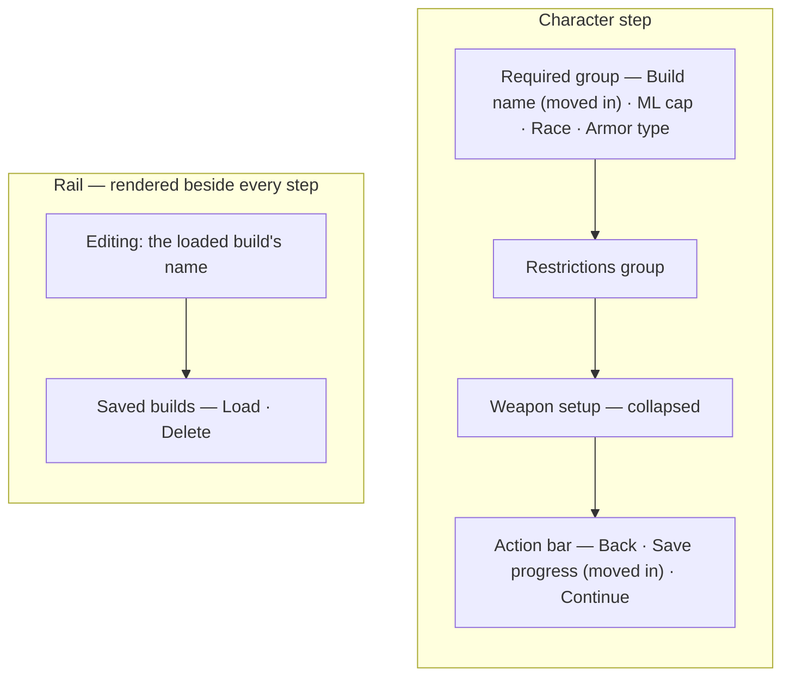
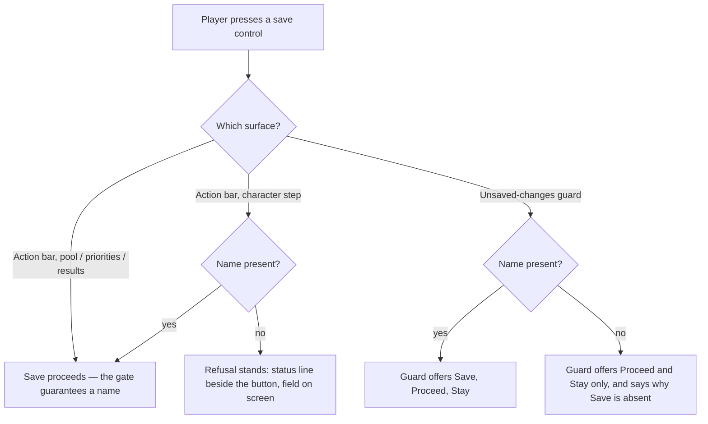

# Character Step Naming and Save Placement - Plan

## Goal Capsule

**Objective.** Make the build's name part of setting up a character, and put saving next to the action it competes with, so the flow stops asking for a name at the one moment it cannot ask for it well.

**Tracked as** [#431](https://github.com/eddiefiggie/ddo-loadout-optimizer/issues/431).

**Product authority.** This document. Requirements and Key Decisions here are settled unless a later plan supersedes them in place.

**Open blockers.** None. Every product decision is settled; what remains is implementation shape and is listed under Outstanding Questions.

**Product Contract preservation.** One R-ID was added by planning: R12, which holds that moving the name input out of the rail must not cost cross-step reachability of renaming. It adds no scope — existing step navigation already satisfies it, and R12 pins that rather than requesting a new control. No existing R-ID was altered or removed. One clarification: the Summary previously reasoned that the required-name gate made the guard's naming request unreachable. Planning found that `canAdvance` gates forward navigation only, so Back still reaches the guard unnamed; the Summary now states the mechanism that actually satisfies R10 (KTD3). The requirement itself did not change.

**Amends an existing plan.** KD3 changes where a requirement of `docs/plans/2026-08-21-001-feat-wizard-structure-and-save-progress-plan.md` is satisfied. That plan's R17 (one name input) and R14 (save reachable from every step) both still hold — the input and the control move, and R1-R9 below restate where they land. That plan's R2a ("The required set is race, ML cap, and armor type") is amended too — the required set now carries a fourth member, per R1 and KD2.

---

## Product Contract

### Summary

The build name becomes a fourth required field on the character step, and `Save progress` moves out of the rail into the step's action bar beside `Continue →`. The rail keeps the build's identity and the saved-build list. The unsaved-changes guard stops asking for a name: it offers Save only when saving can succeed, and its request-a-name path is removed rather than improved.

### Problem Frame

Two things on the character step compete for the same attention, and one of them fails at the moment it matters most.

The step renders `Continue →` in its action bar and `Save progress` in the rail, both styled as the primary action, both on screen at once (`web/wizard.js:1945-1946`, `web/wizard.js:3575`). There is no visual answer to "what am I meant to press here." The two controls also sit in different columns, so the player reads them as belonging to different jobs when they are two ways of moving the same build forward.

The sharper failure is in the unsaved-changes guard. Pressing its **Save and continue** with no name does not save: `saveCurrentCharacter` returns `no-name` (`web/wizard.js:3268`), the dialog stays up, and the handler calls `.focus()` on the name input (`web/wizard.js:3962-3964`). That input lives in the rail (`web/wizard.js:3574`), behind a fixed full-viewport overlay at `z-index: 90` (`web/styles.css:1161-1164`). The player gets a cursor placed somewhere they are not looking, in a field the dialog is sitting on top of, with no statement of what to do. The moment the app most needs the player's engagement is the moment it hides the thing it is asking for.

Both symptoms share a cause: naming is treated as something to collect later, at the point of saving, rather than as part of describing the build. Everything downstream inherits that — the second primary button exists because saving is a separate errand, and the dialog has to ask for a name because nothing earlier did.

### Key Decisions

- KD1. **Naming moves to the front of the flow; saving stays optional.** Nothing persists unless the player saves, exactly as before. What changes is that the name exists before any save is possible, which is what lets the awkward moment be deleted instead of redesigned. *(session-settled: user-directed — chosen over folding saving into the forward path, and over de-conflicting the two buttons without moving naming: those keep the naming request in the dialog.)*

- KD2. **The name is required to leave the character step.** It joins race, ML cap and armor type in the required set, and `canAdvance` blocks on it. Requiring it is what makes the guard's naming request unreachable rather than merely rarer. The accepted cost is first-run friction — a player names a build before seeing a result — and a second required-field gate landing one build after armor. *(session-settled: user-directed — chosen over an optional-but-prominent field, and over a dedicated naming prompt at first save: only a gate removes the case entirely.)*

- KD3. **The name sits inside the Required group; save moves beside Continue.** The two actions become one secondary and one primary in a single action bar, and the rail stops being an action surface. Because the rail also stops being directly editable, R12 records that renaming must stay reachable from any step and pins the navigation that keeps it so. *(session-settled: user-directed — chosen over leaving save in the rail demoted to secondary, and over a full-width name banner above the field groups: co-locating the actions is what resolves the competition, and a banner would compete with the step's own heading.)*

- KD4. **The field arrives empty, with a placeholder.** No value is pre-filled and nothing derives a name from the player's picks. The name is the player's own words, and an auto-filled one would produce near-identical names across builds for anyone who does not edit it. *(session-settled: user-directed — chosen over auto-filling from race, armor and ML cap and following those until edited.)*

- KD5. **Save moves to the action bar on every step, not only the character step.** A control that lives in the rail on three steps and the action bar on one is worse than either. *(session-settled: user-approved — the alternative, moving it only where the conflict was observed, breaks the one-place-to-save property that made the rail worth building.)*

- KD6. **The two gate changes ship one build apart.** Armor joined the required set in the previous build; the build name joins it in this one. Both are called out as behavior changes in the release note rather than spaced out to soften the second. *(session-settled: user-approved — the alternative was deferring this gate to a later build to avoid two consecutive gate changes.)*

The character step's region composition after these decisions:

### Requirements

**Naming on the character step**

- R1. The build's name is a required field on the character step, in the same group as race, ML cap and armor type.
- R2. The field arrives with no value and a placeholder that shows the shape of a name rather than supplying one.
- R3. Attempting to advance without a name holds the step, and the name appears in the same message that names every other unanswered required field.
- R4. The flow carries exactly one input for the build's name.

**Save placement and hierarchy**

- R5. The save control renders in the step's action bar, beside the step's forward action.
- R6. Exactly one control is styled as the primary action on any screen the player can see at once, including a conditional banner rendered above the action bar. A modal overlay counts as its own screen, so the guard's primary does not contend with the step's.
- R7. Saving is reachable from every step of the flow where a build exists — every step except the intro screen.
- R8. A save's outcome is reported next to the control that triggered it.

**The rail's remaining job**

- R9. The rail shows which build is being edited and the list of saved builds with load and delete, and hosts neither a save control nor a name input.
- R12. Renaming the build in progress stays reachable from any step, saved or not. Moving the name input out of the rail must not cost that reachability; the existing step navigation is what provides it, and no new control is added for it.

**The unsaved-changes guard**

- R10. The guard never asks the player to supply a name, and its refuse-for-no-name path is removed rather than reworded.
- R11. The guard's other behavior is unchanged: it fires on a step change or a load that would discard unsaved work, and offers save, proceed, or stay.

### Key Flows

- F1. First run — naming and advancing
  - **Trigger:** A player with no saved builds opens the character step.
  - **Steps:** They meet four required fields, one of which is the build's name, empty. They fill them in any order. Continue advances once all four are answered; pressing it earlier holds the step and names what is missing, the name included.
  - **Outcome:** The build has a name before any save, guard, or dialog can occur.
  - **Covered by:** R1, R2, R3

- F2. Saving from a step
  - **Trigger:** The player presses the save control in the action bar.
  - **Steps:** The build is written under its current name. The outcome appears beside the control.
  - **Outcome:** The saved-build list in the rail reflects the write.
  - **Covered by:** R5, R7, R8, R9

- F3. Leaving with unsaved changes
  - **Trigger:** The player edits a build and then changes step, or loads a different build.
  - **Steps:** The guard states what is unsaved and offers to save, to proceed anyway, or to stay. Saving succeeds without further input, because a name already exists.
  - **Outcome:** No path through the guard asks for a name.
  - **Covered by:** R10, R11

### Acceptance Examples

- AE1. The name is blank and the player presses Continue. **Covers R3.** The step does not advance, the name field is marked as needing an answer, and one message names it alongside any other blank required field.
- AE2. Name, race, ML cap and armor are all set. **Covers R1.** Continue advances regardless of which optional fields are blank.
- AE3. A player with a named build presses the action bar's save control. **Covers R5, R8.** The build is saved and the outcome appears beside that control, not in the rail.
- AE4. A player edits a loaded build and navigates away. **Covers R10, R11.** The guard fires, names what is unsaved, and offers save, proceed, or stay — with no request for a name and no focus moved outside the dialog.
- AE5. A player loads a saved build and returns to the character step. **Covers R2, R4.** The name field holds that build's name and is not marked as needing an answer.
- AE6. The results step is on screen with one or more re-solve banners showing. **Covers R6.** The action bar's save renders ghost, leaving the primary to the banner. With no banner showing, save is the bar's primary and nothing else in the action bar is. (Ranking two co-showing banners against each other is [#432](https://github.com/eddiefiggie/ddo-loadout-optimizer/issues/432), not this plan.)

### Scope Boundaries

- The save model does not change. Nothing persists unless the player saves, and no step writes on advance.
- The guard's load and delete branches are unchanged; only its no-name path is removed.
- No name is derived, suggested, or defaulted from any other field.
- The Restrictions and Weapon setup groups, and the other steps' contents, are untouched — only their action bars gain a save control.
- No new gate is added to any step other than the character step.
- Ranking the results step's three re-solve banners against each other is out of scope. They can already co-show with three `btn primary` buttons today; that is a pre-existing defect, filed as [#432](https://github.com/eddiefiggie/ddo-loadout-optimizer/issues/432). This plan only makes save yield to them.

### Dependencies / Assumptions

- Every saved record is keyed by its name in the store (`web/persist.js:283-286`), so no record can exist unnamed. The new gate therefore creates no migration case for builds saved before it.
- Adding a fourth entry to the character step's required set gates Continue on it without further change, because the gate is defined as the required set being satisfied (`web/wizard.js:22`).
- The scroll, focus, outline and single-message treatment already applied to unanswered required fields extends to the name at no additional product cost.
- Assumes the rail continues to earn its column on identity and the saved list alone. If it does not, that is a later decision, not one this plan makes.
- R6 is met on the results step only once [#432](https://github.com/eddiefiggie/ddo-loadout-optimizer/issues/432) also lands. This plan removes one contending primary (save); #432 removes the rest. Neither blocks the other, and either can ship first.

### Outstanding Questions

Two of these were answered by planning and are recorded as KTD7 (save is the results bar's primary) and KTD6 (intro carries none). The rest are deferred to implementation.

**Deferred to implementation**

- Whether the rail's width or internal order changes now that it holds no control (U5).
- The label, help text and placeholder wording for the name field (U2).

### Sources / Research

- `web/wizard.js:44-48` — the character step's required set, currently three entries.
- `web/wizard.js:22` — the character-step gate, defined as the required set being satisfied.
- `web/wizard.js:1945-1946` and `web/wizard.js:3575` — the two controls currently styled as the primary action on the same screen.
- `web/wizard.js:3268` and `web/wizard.js:3962-3964` — the no-name refusal and the focus move it triggers.
- `web/wizard.js:3574`, `web/wizard.js:3576` — the name input and the save status line, both inside the rail.
- `web/styles.css:1161-1164` — the guard overlay's fixed, full-viewport, `z-index: 90` box, which covers the rail.
- `web/wizard.js:2002-2003`, `web/wizard.js:2261-2262`, `web/wizard.js:2285-2286` — the pool, priorities and results action bars, none of which carry a save control today.
- `docs/plans/2026-08-21-001-feat-wizard-structure-and-save-progress-plan.md` — R14 (save reachable from every step) and R17 (exactly one name input), both preserved here with the control and input relocated.

---

## Planning Contract

### Key Technical Decisions

- KTD1. **`name` becomes the first entry in `CHARACTER_REQUIRED`.** The gate is already `missingRequired(state).length === 0` (`web/wizard.js:22`), so the entry alone gates Continue, and `missingRequiredMessage` names it from the same `label`. First position puts it first in both the message and the scroll-to-first-missing order, matching its position in the group. Instantiates KD2. *(session-settled: user-directed — inherits KD2.)*

- KTD2. **The name field is a `.wz-field` carrying `data-req="name"`, inside the existing Required `fieldset`.** `applyRequiredMarks` resolves its host with `root.querySelector('[data-req="${key}"]')` and toggles `.wz-invalid` on that element (`web/wizard.js:4338-4353`), so the outline, scroll and focus treatment come for free. No new validation machinery.

- KTD3. **The guard offers Save only when saving can succeed.** `data-back` calls `navigate()` without consulting `canAdvance` (`web/wizard.js:4022`), so Back from the character step reaches the guard with an empty name — the gate covers forward navigation only. Rather than reword the refusal, the guard omits its Save option when the name is empty and says why. This satisfies R10 without moving focus behind the dialog. Replaces the focus call at `web/wizard.js:3962-3965`.

- KTD4. **`saveCurrentCharacter`'s `no-name` refusal stays.** It reads as dead once the gate exists, but it is a store-integrity guard: `CharacterStore.saveCharacter` does `all[record.name] = record` (`web/persist.js:283-286`), so an empty name would mint a `""`-keyed record. Save is still pressable on the character step with the field blank, which is the one reachable path. `saveErrorText("no-name")` keeps its wording and now points at a field on screen. See `docs/solutions/conventions/a-removed-refusal-takes-its-unstated-guards-with-it.md` — this is the same function whose sibling refusal was removed one build ago and took two unstated guards with it.

- KTD5. **One shared renderer emits the save control; four action bars call it.** Hand-writing the button into each bar invites drift. The renderer owns the button, its `id`, and its adjacent status line, and each bar interpolates it. A guard asserts the call-site count so a sixth step cannot appear without one.

- KTD6. **`intro` gets no save control.** `WIZARD_STEPS` runs `intro` before `character` (`web/wizard.js:9`), so an intro save would be reachable with no name and nothing worth saving. R7's "every step" means every step where a build exists. Answers an Outstanding Question.

- KTD7. **Save is the results step's primary action, and yields to a re-solve banner.** The character, pool and priorities bars already carry a primary forward action, so save takes `btn ghost` there. The results bar carries two ghosts and no primary (`web/wizard.js:2285-2286`), so save becomes its primary — except while a re-solve banner is showing, when save renders ghost and the banner holds the screen's primary. Scope note: the three re-solve banners raise independently (`web/wizard.js:2271`, `:2275`, `:2281`) and can co-show, so the results step can already carry up to three primaries today, before save arrives. That is a pre-existing defect and is **not** this plan's to fix — filed as [#432](https://github.com/eddiefiggie/ddo-loadout-optimizer/issues/432), which owns the banner-versus-banner rule. This plan owns only save's deference. R6 is therefore fully met once both land; until #432 does, this plan removes one contending primary rather than all of them. The four `migrationBanner` notices (`web/wizard.js:3815-3838`) also carry `wz-cbar` but their buttons are `btn ghost`, so they do not contend and must not ghost save. Scoping R6 to the action bar instead was rejected: it would keep on screen the exact two-primaries arrangement this plan's Problem Frame calls the defect. Answers an Outstanding Question.

- KTD8. **Save sits between the spacer and the forward action, except on results, where it is last.** `tests/wizard.test.js:560-589` pins each bar's bottom-right control as the advance token and bottom-left as `data-back`; placing save immediately before the forward action preserves both on character, pool and priorities. The results bar has no forward action — its terminal control is a ghost `Edit character` — so leaving save second-to-last would put the screen's loudest button out of the slot players are trained to read as primary. On results, `Edit character` moves before the spacer beside `Adjust priorities`, save takes the terminal slot, and `NAV.stepResults.advance` in `tests/wizard.test.js` updates to the save control.

- KTD9. **Typing a name marks the build dirty.** `markDirty`'s delegated listener is scoped to `.wz-body` and deliberately excludes the rail, on the reasoning that "naming a build is not editing it" (`web/wizard.js:3999-4001`). That reasoning dies with the move: the name is now a required build input like race. The field participates in dirty-tracking as an ordinary input, and the stale comment goes.

- KTD10. **`railModel` sheds its save-shaped fields.** `name`, `canSave` and `overwrites` exist only to drive the rail's input and button. `canSave` and `overwrites` are unread by production code but **pinned by four test assertions** (`tests/wizard.test.js:3087`, `:3112`, `:3114`, `:3115`), so removing them is a test change too, not a silent deletion. With the input and button gone, the model keeps `loaded`, `loadedName`, `saved` and `empty`. The overwrite confirm keeps deriving its own answer in `trySave`.

- KTD11. **New source-slice guards use the construct-anchored helpers, which are a prerequisite.** `fnBody` and `endAfter` are not on `main` — they arrive with the in-flight construct-anchor migration of `tests/wizard.test.js`, which still carries fixed-offset windows at `b70fc3f`. This plan branches from that work landing, not from `b70fc3f`, and every `tests/wizard.test.js:N` citation here is relative to the migrated file. New assertions use those helpers and assert their end marker resolved. See `docs/solutions/logic-errors/closure-scoped-ui-state-must-reset-on-character-load.md`.

- KTD12. **The name gate gets isolated coverage.** Existing negative assertions (`tests/wizard.test.js:34-36`, `:3327`) already fail on another field, so a broken name check would pass them for the wrong reason. One positive test (all four present → advances) and one negative (name absent, other three present → blocked, on the `name` key specifically) isolate it. See `docs/solutions/conventions/stamp-shared-fixtures-for-new-required-fields.md`.

### High-Level Technical Design

Where a save can be attempted, and what each surface offers:

The unnamed branches are reachable only from the character step: forward navigation is gated, so `pool`, `priorities` and `results` cannot be reached without a name, and `intro` carries no save control.

### Assumptions

- The rail continues to earn its column on identity and the saved list alone. If it does not, that is a later decision.
- `state.characterName` is restored unconditionally at the top of `loadCharacter` (`web/wizard.js:3317`), before the branch split, so the relocated input needs no new reset.
- Only one step body renders at a time, so a single `id` minted by the shared save renderer stays unique per render.

### Sequencing

U1 establishes the key that U2's markup and U4's guard both read. U2 and U3 both edit the rail, so they run in order rather than in parallel. U5 restyles what U2 and U3 leave behind. U6 stamps last, after the player-facing surface has settled.

---

## Implementation Units

### U1. Add the build name to the required set

**Goal:** `canAdvance("character")` blocks on an empty build name, and the blocked message names it.
**Requirements:** R1, R3. Implements KTD1, KTD12.
**Dependencies:** none.
**Files:** `web/wizard.js`, `tests/wizard.test.js`.
**Approach:** Add `{ key: "name", label: "Build name" }` as the first entry of `CHARACTER_REQUIRED`. Extend `missingRequired` with a trimmed-empty check on `state.characterName`, pushed first so it leads both the message and the scroll order. `missingRequiredMessage` needs no change — it reads labels from `CHARACTER_REQUIRED`.
**Execution note:** Write the isolated gate pair before the production change and watch both go red; the existing negative assertions cannot prove this key.
**Patterns to follow:** the three existing entries and their checks at `web/wizard.js:44-71`.
**Test scenarios:**
- `Covers AE2.` All four required fields set: `canAdvance("character")` is true.
- Name absent, race, ML cap and armor all set: `canAdvance("character")` is false, and `missingRequired` returns exactly `["name"]`.
- A whitespace-only name is treated as absent.
- `Covers AE1.` `missingRequiredMessage` names the build name, and names it alongside a second missing field when both are blank.
- The Forged armor exemption still holds with a name present.
- Update the five positive `canAdvance` assertions that now lack a name (`tests/wizard.test.js:37`, `:39`, `:3331`, `:3332`, `:3343`) and the eight `missingRequired` / `missingRequiredMessage` pins whose fixtures carry no name (`:3315-3316`, `:3317`, `:3321`, `:3326`, `:3341`, `:3349`, `:3350`, `:3355`) by stamping a name into each fixture rather than weakening them. `:39` is the Forged exemption, which passes no name either. Line numbers are relative to the migrated test file (see KTD11).
**Verification:** `node tests/wizard.test.js` green, with the two new isolated tests proven red against the pre-change tree.

### U2. Move the name input into the Required group

**Goal:** The name is a marked required field on the character step, and the rail no longer hosts an input.
**Requirements:** R1, R2, R4, R9, R12. Implements KTD2, KTD9, KTD10, KTD11.
**Dependencies:** U1.
**Files:** `web/wizard.js`, `tests/wizard.test.js`.
**Approach:** Add a `.wz-field` carrying `data-req="name"` and a `wz-req-mark` to the Required `fieldset`'s `.wz-grid`, holding `id="wz-buildname"` bound to `state.characterName` and a placeholder. Bound, not value-less: `render()` runs on every navigation, so an unbound input would blank the name each time and block the player on their own gate. R2's "no value" means nothing is derived or defaulted (KD4), matching the `data-req="ml"` pattern, which binds its value. Update the Required legend's count at `web/wizard.js:1770-1771` — the non-Forged branch reads `all three are needed to continue` and would ship saying three above four marked fields. Remove the input and its label from `railHTML`, and move the `oninput` handler from `wireRail` into the character step's wiring. Drop `name` from `railModel`'s return along with the unread `canSave` and `overwrites`. Delete the rail-exclusion comment that `markDirty` carries, since the field is now inside `.wz-body` and should mark dirty. Add no replacement control for R12: the step dots (`web/wizard.js:1731`) and the results bar's `Edit character` (`:2286`) already reach the character step from every later step, so R12 is a guarantee pinned by a test rather than a third path to build. A rail link was considered and rejected — `renderRail()` re-wires with `wireRail()` alone and never re-runs `wire()`'s `[data-goto]` sweep (`web/wizard.js:3587-3592`, `:4045`), so it would ship dead on the first save.
**Patterns to follow:** the `data-req="ml"` field at `web/wizard.js:1773-1775`; `railModel` at `web/wizard.js:196-214`.
**Test scenarios:**
- Exactly one `id="wz-buildname"` exists anywhere in the flow (the existing invariant at `tests/wizard.test.js:3123-3130` survives the move).
- The character step's `wz-req-mark` count is 4, and `data-req="name"` is present — updates the literal `3` at `tests/wizard.test.js:3424-3431`.
- `railHTML`'s body contains no name input.
- `railModel` returns the identity fields and no longer returns `name`.
- The field is not marked `data-nodirty`, so typing a name arms the guard.
- `Covers R12.` The character step's dot stays a `data-goto` target and is enabled once the step is done (`web/wizard.js:1731`), and the results bar keeps its `data-goto="character"` control — so the name field is reachable from every later step without the rail input, and neither path can be removed without failing this.
- `Covers AE5.` A build loaded through `loadCharacter` renders the character step with its stored name in the field, and `missingRequired` marks nothing.
- The Required legend's stated count matches the number of `wz-req-mark` markers, so the two cannot drift again.
- Remove the `canSave` assertion at `tests/wizard.test.js:3087` and the now-subjectless overwrite test at `:3110-3116`; `overwriteConfirmText` and `trySave` still cover that behaviour.
**Verification:** the character step renders four marked required fields; the rail renders none.

### U3. Move the save control into the action bars

**Goal:** Save renders beside each step's forward action, and the rail holds no control.
**Requirements:** R5, R6, R7, R8, R9. Implements KTD5, KTD6, KTD7, KTD8, KTD11.
**Dependencies:** U2.
**Files:** `web/wizard.js`, `tests/wizard.test.js`.
**Approach:** Add a shared renderer emitting the save button plus its adjacent status span, taking the button class. Interpolate it immediately before the forward action on the character, pool and priorities bars, passing `btn ghost`; leave the intro bar alone. On results there is no forward action, so follow KTD8: move `Edit character` to immediately before the spacer beside `Adjust priorities`, and interpolate save after the spacer in the bar's terminal slot. Results passes its class from a `resolveBannerShowing()` predicate (`staleNote(state) || state.twfMigrated || state.constraintsDirty`) — ghost when any re-solve banner is up, primary otherwise. Leave the banners' own classes alone; ranking them against each other is [#432](https://github.com/eddiefiggie/ddo-loadout-optimizer/issues/432). Because banner visibility is mutated imperatively without a re-render, add a `refreshSaveEmphasis()` helper that re-applies the classes on the rendered buttons, and call it from every site that changes banner visibility outside `render()`: `refreshStaleBanner` (`web/wizard.js:2915-2922`), the two re-solve dismissals (`:4242`, `:4257`) and the constraint-dirty reveal (`:4307`). Note `loadCharacter` calls `refreshStaleBanner` after its `render()` (`:3520`, `:3529`), so first paint for a returning player depends on this. Remove the button and `wz-railstat` from `railHTML`. Move `wireRail`'s save handler to a shared wiring path that finds the one rendered button, keeping the re-render-then-write-status ordering that `web/wizard.js:3628-3632` warns about.
**Patterns to follow:** the bar shapes at `web/wizard.js:1945`, `:2002`, `:2261`, `:2285`; the save handler at `web/wizard.js:3624-3633`.
**Test scenarios:**
- `Covers AE3.` Each of the four bars contains the save control; the intro bar does not.
- The shared renderer has exactly four call sites, so a new step cannot silently ship without one.
- `Covers AE6.` With no banner showing, each bar holds exactly one `btn primary`: the forward action on character, pool and priorities, and save on results.
- `Covers AE6.` With any re-solve banner showing, save renders `btn ghost`; with none showing, it renders `btn primary`.
- Every site that mutates a re-solve banner's `wz-hidden` class also calls `refreshSaveEmphasis`, so a fifth banner path cannot ship without one.
- A `migrationBanner` notice showing does not ghost the save button.
- Each bar's last control is still its advance or goto token, and its first is still `data-back` where one exists — the `NAV` map at `tests/wizard.test.js:560-589` still passes.
- `railHTML`'s body contains no save control and no status span — replaces the assertion at `tests/wizard.test.js:3143-3154`.
- The save status is written after the re-render, not before.
**Verification:** save works from all four steps and reports beside the button it was pressed from.

### U4. The guard offers Save only when it can succeed

**Goal:** No path through the unsaved-changes guard asks the player for a name.
**Requirements:** R10, R11. Implements KTD3, KTD4.
**Dependencies:** U1.
**Files:** `web/wizard.js`, `tests/wizard.test.js`.
**Approach:** Make the guard's option set a function of whether a name exists. With one, it offers save, proceed and stay as today. Without one, it omits save and states that the build needs a name first. Delete the `no-name` branch and its `.focus()` call from the guard's save handler. Repoint the modal's open-time focus (`web/wizard.js:3931-3932`), which targets `#wz-unsaved-save` by id — with no name that button does not exist, so the modal would otherwise open focusing nothing and leave a keyboard player tabbing into the page behind the overlay. Focus `#wz-unsaved-save` when it is rendered and `#wz-unsaved-stay` when it is not. Do **not** focus "the first control rendered": the guard's DOM order is save, then the discard action, then stay (`web/wizard.js:3923-3926`), so omitting save would make discard the keyboard default and a reflexive Enter would throw the build away. Also correct `saveErrorText`'s comment, which claims the name field is on screen from every step. Leave `saveCurrentCharacter`'s refusal and its existing test untouched.
**Execution note:** Reach the unnamed guard by pressing Back from a dirty, unnamed character step — that is the one path the gate does not cover, and it is the case this unit exists for.
**Patterns to follow:** the guard's option rendering at `web/wizard.js:3920-3935`.
**Test scenarios:**
- `Covers AE4.` With a name and unsaved work, the guard offers all three options and saving succeeds without further input.
- With no name and unsaved work, the guard omits save and states why.
- No code path in the guard calls `.focus()` on the name input.
- With no name, the guard's open-time focus targets the stay control, not the discard control.
- `saveCurrentCharacter` still refuses an empty name, and its existing assertion at `tests/wizard.test.js:3229-3237` still passes.
- The load and delete branches are unchanged.
**Verification:** Back from an unnamed dirty character step raises a guard with two options and no naming request.

### U5. Restyle what the move leaves behind

**Goal:** The action bars and the rail read correctly in their new shapes at both widths.
**Requirements:** R5, R6, R9.
**Dependencies:** U2, U3.
**Files:** `web/styles.css`.
**Approach:** `.wz-actions` is already a flex row with a gap and needs no rule for a third child. Add `flex-wrap: wrap` to `.wz-actions` (`web/styles.css:904`) — three buttons plus a status span do not fit the results bar at 375px, and `.wz-modal-actions` already wraps for the same reason. Wrap alone is not enough: `.wz-spacer { flex: 1 }` (`web/styles.css:905`) still absorbs the first line's slack, which would strand the terminal save control at the bottom-left and invert the placement KTD8 protects — suppress the spacer at the narrow width so a wrapped bar reads in document order. Remove `.wz-rail .btn`, `.wz-rail input` and `.wz-rail input:focus` (`web/styles.css:1145-1148`), which match nothing once both elements leave. Revisit the 900px rail-first rule (`web/styles.css:1153-1156`): its stated reason is that a phone player should meet "save this" before a long form, and save is no longer in the rail — either drop the `order: -1` so the rail follows document order, or record a new reason to keep it first. Check the rail's width now that it holds only identity and the list, and the wider action bar at the 620px breakpoint.
**Test expectation:** none — pure styling, verified in the browser pass.
**Verification:** no dead rules matching removed elements; bars and rail hold together at desktop and 375px.

### U6. Stamp the build and write the release note

**Goal:** The deploy carries a correct version and the gate change is disclosed.
**Requirements:** none directly. Implements KD6.
**Dependencies:** U1, U2, U3, U4, U5.
**Files:** `web/index.html`, `web/app.js`, `README.md`.
**Approach:** Bump the `?v=` cache-busts, `BUILD`, and the `**Current build:**` line together. Add the build-name gate to the README section that already carries the armor gate, naming it as a behavior change and stating that existing saved builds are unaffected because every record is keyed by its name. Also refresh the "How to use it" walkthrough, which goes stale on two counts: step 2 enumerates Required as "your ML cap, race and armor type", and the closing paragraph says the build is named and saved "from the panel beside every step".
**Test expectation:** none beyond the existing stamp guard.
**Verification:** `python3 tests/run_tests.py` green, including `tests/test_build_stamp.py`.

---

## Verification Contract

| Gate | Command | Applies to | Signal |
|---|---|---|---|
| Python suite | `python3 tests/run_tests.py` | U6, final | All pass, build-stamp guard included |
| JS suite | `for t in tests/*.test.js; do node "$t"; done` | U1-U4, final | All pass; run one file per invocation |
| Red-proof | Copy new tests over the base commit's tree and run them | U1, U2, U3, U4 | Every new behavioral test fails there |
| Browser pass | Serve `web/` and drive the real flow | U2-U5 | See below |

The browser pass is not optional. Most of this plan is DOM placement, and the node suite structurally cannot see a control render in the wrong column. Clear `localStorage` first — the wizard persists state, so a plain reload is not a clean first run. Verify: the name field appears exactly once and is marked required; Continue is blocked with it empty and names it; save works from all four bars and reports beside the button pressed; the rail holds no button or input; Back from an unnamed dirty character step raises a guard with no naming request, and Enter on it does not discard the build; on results, raise a re-solve banner and confirm save drops to ghost, then dismiss it and confirm save returns to primary; the layout holds at 375px, including the wrapped results bar with save still reading last.

---

## Definition of Done

- All twelve requirements implemented, each traceable to a unit above.
- All six acceptance examples exercised by a named test.
- Python and JS suites green, run per the Verification Contract.
- New behavioral tests proven red against the pre-change tree; the mechanical pins updated rather than deleted (`tests/wizard.test.js:3143-3154`, `:3424-3431`, and the five positive gate assertions).
- Browser pass completed on a real flow, from cleared storage.
- Build stamp bumped in all three places.
- KD2's gate change called out in the release note as a behavior change, alongside the armor gate.
- No abandoned-attempt code left in the diff.
