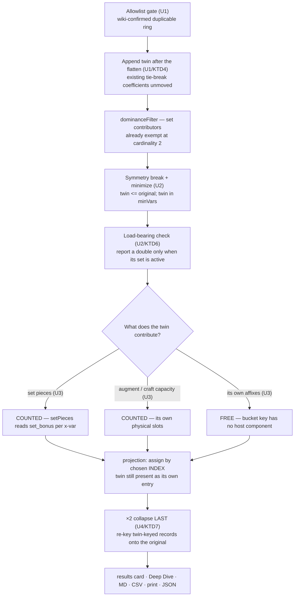

# Duplicate ring set completion — twin-variant expansion

## Goal Capsule

**Objective.** Let the solver equip two copies of the same ring so a set that
permits it can be completed, and report that honestly everywhere the player
reads a loadout.

**Tracked as** [#335](https://github.com/eddiefiggie/ddo-loadout-optimizer/issues/335).

**Product Contract preservation.** No upstream brainstorm; this plan bootstraps
its own Product Contract from the issue and the wiki evidence it cites.

---

## Product Contract

### Summary

The Ring slot has cardinality 2, but each variant gets one binary pick var, so
the same variant cannot be chosen twice. A player reported a legal in-game
completion — two Legendary Katra's Razor Wit rings plus one other piece for
Legendary Perfected Wrath — that the optimizer cannot produce. That item's wiki
page states it outright: *"2 rings, identical or not, can be used for the set
bonus."*

### Problem Frame

The model's pick var is binary per variant. `sum(x) <= 2` over the Ring slot
therefore means *two different rings*, never one ring twice. The gap is not a
solver bug — the constraint is doing exactly what it says — it is a modelling gap
about what a slot of cardinality 2 can hold.

The cost is a wrong answer, not a cosmetic one: a set the player can legally wear
is unreachable, so the solver returns a loadout that is optimal only within an
artificial restriction and never discloses the restriction.

**The mirror-image risk governs the scope.** Duplicate-wearability is a per-item
property (DDO's Unique Equipped), and the dataset does not carry it: `restrictions`
is the literal string `"unknown"` on 426 of 427 rings, no ring carries a
`unique_equipped` field, and the only such flag in the tree is on augments
(`web/solver.js:474`). The wiki line above says how set bonuses *count* when two
rings are worn — it presupposes wearability rather than establishing it, and it is
one item's page. Generalising it to every set-member ring would trade an
under-reporting bug for an over-reporting one and violate the standing *never
infer a value* rule. Hence KD2.

### Key Decisions

- KD1. **Twin-variant expansion, not an integer pick var.** Every solver var stays
  binary. *(session-settled: user-directed — chosen over `x in {0,1,2}`: the 29
  binary `> 0.5` reads in `web/solver.js` survive untouched, and two physical rings
  model their two independent augment and craft slot-sets for free, where an
  integer pick would have to multiply every capacity and contribution term by the
  pick count.)*
- KD2. **Twinning is gated to a wiki-confirmed allowlist, not to set membership.**
  *(session-settled: user-directed — chosen over twinning all 132 set-member rings
  and over blocking on a full harvest first: the allowlist is correct by
  construction, closes the reported case, and widens for free once the data exists.
  The harvest is filed as [#442](https://github.com/eddiefiggie/ddo-loadout-optimizer/issues/442).)*
- KD3. **A doubled pick renders as one row marked ×2.** *(session-settled:
  user-directed — chosen over two separate rows: two rows invite the reading that
  the affixes apply twice, which is the exact stacking error this tool exists to
  get right.)*
- KD4. **Golden diffs are accepted and re-ratified deliberately.** *(session-settled:
  user-directed — chosen over constraining the feature to keep goldens stable: a set
  that was previously unreachable becoming reachable is the feature working.)*

### Requirements

**Solver mechanics**

- R1. Two copies of one ring variant can be equipped together when that variant is
  on the duplicable allowlist.
- R2. Both copies count as distinct pieces toward set-tier thresholds.
- R3. The second copy carries its own augment and craft capacity, independent of
  the first.
- R4. The second copy contributes **no** second instance of the ring's own
  affixes — a same-name, same-type pair collapses to the highest, as it does today.
- R10. A twin is never returned on a path where it buys nothing — including the
  alternatives generator, which re-solves without the tie-break objective.

**Presentation**

- R5. A doubled pick renders as a single entry marked ×2, in the results card, the
  Loadout Deep Dive, and every share export.
- R6. The receipt states what the second copy actually contributes — set membership
  plus whatever per-item capacity that item carries — and that it is not a second
  set of affixes.

**Persistence, pinning, and pool**

- R7. A doubled pick survives save, load, and backup import without becoming two
  unrelated entries or collapsing to one.
- R8. Pinning is unaffected: a player pinning the ring still gets it, and pinning
  does not force or forbid the twin.
- R11. In owned-inventory mode, a twin is offered only when the player's export
  shows they own two or more of that item.

**Scope**

- R9. Rings not on the allowlist are not twinned, and non-Ring slots are untouched.

### Acceptance Examples

- AE1. A player ranks a stat that Legendary Perfected Wrath serves, owns no second
  qualifying piece, and the solver returns two Katra rings plus one other piece —
  the completion that was previously unreachable. **Covers R1, R2.**
- AE2. The results card shows that ring once, marked ×2, and the totals reflect its
  affixes counted once. **Covers R4, R5.**
- AE3. The receipt for that loadout names set membership and the second copy's own
  capacity as its contribution. **Covers R6.**
- AE4. The two copies receive different augments, and both appear in the loadout,
  attributed to their copy. **Covers R3.**
- AE5. Saving that loadout, reloading it, and exporting it all round-trip the ×2
  without splitting or collapsing it. **Covers R7.**
- AE6. A ring not on the allowlist is never doubled, and no non-Ring slot gains a
  duplicate. **Covers R9.**
- AE7. A player pins an allowlisted ring; the solver still returns it, and the pin
  neither forces nor forbids the twin. **Covers R8.**
- AE8. An alternatives re-solve never returns a doubled ring whose set is not
  active. **Covers R10.**
- AE9. In owned-inventory mode with one copy owned, no twin is offered. **Covers R11.**

### Scope Boundaries

- Rings only. Ring is the sole worn slot with cardinality 2 where identical named
  items can legally coexist.
- No integer pick vars anywhere in the model.
- Twinning is allowlist-gated. Widening it to all set-member rings needs the
  Unique Equipped harvest in [#442](https://github.com/eddiefiggie/ddo-loadout-optimizer/issues/442).
- **A player cannot pin the same ring to both Ring slots.** `applyPinId`
  (`web/wizard.js:915`) ignores a duplicate id for a multi-cardinality slot and that
  stays true, so a doubled pick is solver-discretionary — the player cannot request
  one. Deferred, and disclosed here rather than discovered.
- Set-augment-granted membership does not make a ring twin-eligible; the allowlist
  is about the item's physical duplicability, not how it earns a set identity.
- Three-of-a-kind does not exist — cardinality is 2.

### Deferred to Follow-Up Work

- [#442](https://github.com/eddiefiggie/ddo-loadout-optimizer/issues/442) — harvest
  Unique Equipped and widen the gate.
- Letting a player pin a doubled pick, per the boundary above.
- Duplicates on non-set rings purely for augment capacity.

### Dependencies / Assumptions

- **Confirmed, not assumed:** `dominanceFilter`'s cardinality > 1 exemption reads
  `set_bonus` / `set_membership_slot.pool` (`web/model.js:757-759`) and fires before
  the dominance loop, so a shallow-copy twin survives and cannot prune or be pruned
  by its original.
- **Confirmed:** affix bucket keys are `stat||equivType(type)` with no host
  component, and `encodeStage` emits `Σz <= 1` per bucket, so a twin's duplicate
  affix can never be co-selected — R4 is free.
- **Measured:** 427 rings; 132 carry `set_bonus`; **0** carry
  `set_membership_slot`; 139 carry a separate `sets` field. The 7-ring difference
  names sets with no parsed tier and registers no pieces in the solver — a
  pre-existing data gap, out of scope, and **not** a reason to widen any predicate.
- **Measured:** no set-member ring in the current dataset carries any craft slot,
  and only 95 of 132 expose an augment color. R3's craft half therefore needs a
  synthetic fixture; its augment half needs a candidate drawn from the 95.
- The augment model places each augment id at most once globally, so the two copies
  can never wear the *same* augment — AE4 is scoped to different augments.

---

## Planning Contract

### Key Technical Decisions

- KTD1. **The twin is generated at candidate construction, gated by the allowlist.**
  `web/model.js:986` builds each worn slot's candidates; the twin is appended there,
  so everything downstream sees an ordinary variant. Instantiates KD1 and KD2.
- KTD2. **The twin id is preserved on physical-host paths and mapped back only on
  display paths.** These are two different questions and one rule cannot serve both:
  - **Preserve verbatim** — anything identifying a *physical item*: set-augment host
    reservation (`setAugmentsPlaced[].host`), attribution `hostIds` in `sourceOf`
    (which exists precisely so the two Rings can be told apart), `slotOfItem`, the
    utility carrier's `equippedIdx`, and augment/insert capacity allocation.
  - **Map back to the original** — anything producing a *display label* or resolving
    a *pin*. A suffixed id must never reach a receipt or an export.
- KTD3. **Symmetry breaking is a constraint:** `twin - original <= 0`. Without it
  the solver has two identical solutions for every doubled pick and could return the
  twin alone, which no display path expects.
- KTD4. **Twin x-vars are minted after every worn group is flattened.** The
  deterministic tie-break is `Σ (i+1)·x_i` over the flattened candidate index
  (`encodeStage`, `web/solver.js:1310`), so inserting twins *into* the Ring group
  would shift the coefficient of every candidate in every later slot and move
  results in builds involving no ring and no set. Appending after the flatten keeps
  every existing coefficient fixed, which is what makes U6's re-ratification rule
  sound.
- KTD5. **R2 rides `setPieces`, not `realPieces`.** `setPieces` is built from
  `xv.variant.set_bonus` per x-var (`web/solver.js:979-984`) and consumed by the
  threshold constraint; a shallow-copy twin carries `set_bonus`, so R2 needs no
  solver change — confirm the registration rather than assuming it. Separately the
  twin's x-var lands in `realPieces` (`:1118`) and therefore in `sourceOf().hostIds`,
  so the set receipt will name the twin id and U4's collapse must re-key it.
- KTD6. **The twin is minimized and load-bearing-checked, like every other
  free-floating var.** The alternatives generators call `solveConstrained` with
  `tieBreak: false`, which returns from phase 1 with no minimizing solve, so a var
  with no objective coefficient can be set to 1 for free. Jokers, membership picks
  and set-augment copies each get two protections — an entry in `minVars` and a
  load-bearing check in `readSolution` — and the twin gets the same pair.
- KTD7. **The ×2 collapse is a final pass over already-assigned data.** Augment and
  insert assignment fills by *chosen index* (`assignAugments`, `assignDinoInserts`)
  and craft/host maps key on `variant_id`, so collapsing before assignment halves
  the ring's slot supply and orphans every twin-keyed record. The collapse runs
  last and re-keys those records onto the original.

### High-Level Technical Design

Where the twin is and is not a real item:

### Sequencing

U1 creates the gated twin in the right index position; U2 makes it well-behaved on
both solve paths; U3 confirms its three contributions; U4 makes it legible without
losing records; U5 protects persistence and pinning; U6 re-ratifies and stamps.

---

## Implementation Units

### U1. Generate the twin, gated and index-safe

**Goal:** Allowlisted rings have a twin, appended so no existing candidate's tie-break coefficient moves.
**Requirements:** R1, R9, R11. Implements KTD1, KTD2, KTD4.
**Dependencies:** none.
**Files:** `web/model.js`, `tests/model.test.js`.
**Approach:** Add a small allowlist of wiki-confirmed duplicable rings — Legendary
Katra's Razor Wit at minimum, the reported case — with the wiki URL recorded beside
each entry. Append a twin for each allowlisted candidate **after** every worn group
has been flattened, per KTD4, not inside the Ring group's candidate list. The twin
is a shallow copy carrying `set_bonus`, with a derived `variant_id` and a marker
naming its original. Add the twin-to-original mapping as one exported function, and
apply KTD2's two lists rather than mapping everywhere.
**Execution note:** Prove the index invariant first — a solve with all twins forced off must produce a byte-identical program to the pre-change tree. Without that, U6 cannot tell a real regression from tie-break drift.
**Patterns to follow:** slot construction at `web/model.js:985-995`; `variantKey` at `:703`.
**Test scenarios:**
- `Covers AE6.` A ring absent from the allowlist gets no twin, whatever its set membership; an allowlisted ring gets exactly one.
- No non-Ring slot gains a candidate.
- With all twins forced off, the emitted program is byte-identical to the pre-change tree — the KTD4 index invariant.
- The twin survives `dominanceFilter` at cardinality 2, reading as a set contributor.
- The twin-to-original mapping round-trips every twin id back to its original.
- `Covers AE9.` With `ownedMode` set and the export showing one copy owned, no twin is generated; with two or more, it is.
**Verification:** the Ring slot's candidate count rises by exactly the allowlist size, no other slot changes, and the twins-off program matches the baseline.

### U2. Constrain, minimize, and guard the twin on both solve paths

**Goal:** The twin is takeable only alongside its original, is never free-floating, and is never reported when it buys nothing.
**Requirements:** R1, R10. Implements KTD3, KTD6.
**Dependencies:** U1.
**Files:** `web/solver.js`, `web/alternatives.js`, `tests/solver.test.js`, `tests/alternatives.test.js`.
**Approach:** Emit `twin - original <= 0` per pair; the existing `sum(x) <= cardinality`
then bounds the pair with no change. Add the twin pick vars to `minVars` in
`encodeStage` so the optimum path minimizes them, and add a load-bearing check in
`readSolution` mirroring `jokerPlaced` / `membershipPlaced` — report a doubled pick
only when the twin's set is actually active.
**Execution note:** Write the alternatives assertion before the guard exists and watch it fail. The `tieBreak:false` path is where this bug lives, and the optimum path will look fine without the guard.
**Patterns to follow:** the joker and membership load-bearing checks in `readSolution`; `minVars` in `encodeStage` (`web/solver.js:1329`).
**Test scenarios:**
- A solve that takes the twin also takes the original; the twin never appears alone.
- The Ring slot still holds at most two picks in total.
- One symmetry constraint is emitted per allowlisted pair.
- `Covers AE8.` An alternatives re-solve (`tieBreak: false`) never returns a doubled ring whose set is not active.
- A solve where the doubled ring is not optimal returns a single ring, unchanged from today.
**Verification:** no returned loadout — from either solve path — contains a twin without its original or a twin whose set is inactive.

### U3. Confirm the twin's three contributions

**Goal:** The twin counts as a set piece and carries its own capacity, and contributes no second copy of its own affixes.
**Requirements:** R2, R3, R4. Implements KTD5.
**Dependencies:** U2.
**Files:** `web/solver.js`, `tests/solver.test.js`, `tests/fixtures/`.
**Approach:** Three separate questions with different answers. **Set pieces:**
confirm `setPieces` registration from `set_bonus` per x-var — that is the R2
mechanism. **Capacity:** confirm augment and craft capacity follow the twin as an
independent x-var. **Affixes:** already free per the bucket-key finding; assert it
rather than adding suppression.
**Execution note:** Prove each separately. A change that fixes one and silently breaks another is the failure mode, and a twin contributing its affixes twice is a wrong total — the defect class this tool exists to avoid.
**Test scenarios:**
- `Covers AE1.` A set requiring three pieces completes with two copies of one ring plus one other piece.
- `Covers AE4.` The two copies hold different augments and both are reported — using a ring drawn from the 95 that expose an augment color.
- Craft capacity is independent, proven with a synthetic fixture ring carrying a roll group, since no set-member ring in the dataset carries a craft slot.
- `Covers AE2.` A doubled ring's own affixes appear once in the totals.
- A doubled ring's affix sharing a name and type with a third item still collapses to the highest.
**Verification:** for a doubled loadout, totals equal the single-ring loadout plus the set tier plus the second copy's own capacity contributions — and nothing else.

### U4. Collapse to one ×2 entry, last, without losing records

**Goal:** Every surface shows the doubled ring once, marked ×2, with both copies' capacity attributed and nothing orphaned.
**Requirements:** R5, R6. Implements KTD7, KTD2.
**Dependencies:** U3.
**Files:** `web/projection.js`, `web/results.js`, `tests/projection.test.js`, `tests/results.test.js`, `tests/exporters.test.js`.
**Approach:** Assignment runs over the **uncollapsed** chosen list so both copies'
index-keyed slot supply is allocated. The collapse is a final pass that merges the
pair and **re-keys** every host-keyed record from the twin id onto the original —
`augAssign`, `setAugByHost`, `jokerByHost`, `membershipByHost`, the craft
`byItemMap` families, `setContributors`, and `sourceOf().hostIds`. Two render loops
also need it, both of which are position- or index-bound and would otherwise emit a
second row: the paperdoll's `for (let r = 0; r < cardinality; r++)`
(`web/results.js:1468`) must iterate de-duplicated picks, and `loadoutDeepDive`'s
`result.chosen.map((c, idx) => …)` (`:332`) must merge the pair into one block —
that tab is the only surface showing augments at all, so a split there is the
worst place for the "affixes apply twice" misreading. The receipt line is
**derived**, listing what the second copy actually contributes, so it stays true if
an allowlisted ring ever gains a craft slot.
**Test scenarios:**
- `Covers AE2.` A doubled loadout projects one ring entry with a count of 2, and the paperdoll emits one row, not two.
- The Deep Dive merges the pair into a single block carrying both copies' augments.
- `Covers AE3.` The receipt names set membership and the copy's actual capacity, derived rather than fixed.
- A doubled ring hosting a set-augment copy and a per-copy ordinary augment renders both under the collapsed entry — nothing keyed to the twin id is dropped.
- A doubled ring reports zero unplaced augments.
- No receipt or export contains a suffixed twin id.
- All five exports render the ×2 from the same projection; a single-ring loadout is unchanged.
**Verification:** browser pass on a doubled loadout — card, Deep Dive and all five exports agree, with zero unplaced augments.

### U5. Keep persistence and pinning honest

**Goal:** A doubled loadout survives save, load, export and import; pinning behaves as documented.
**Requirements:** R7, R8.
**Dependencies:** U4.
**Files:** `web/backup.js`, `tests/persist.test.js`, `tests/backup.test.js`, `tests/wizard.test.js`.
**Approach:** Confirm-first, not design-first. `serializeCharacter` already
denormalizes full item objects into the snapshot so a restored character renders
without the live catalog and is never re-solved (`web/persist.js:231-233`) — verify
a doubled loadout round-trips through that unchanged, and add schema work only if
it does not. The genuinely new risk is `backup.js`, whose field allowlist was
hardened in #420 to refuse rather than silently reduce: confirm a twin-bearing
record survives `sanitizeCharacter` rather than being quietly stripped.
**Test scenarios:**
- `Covers AE5.` Save, reload and export a doubled loadout: still ×2, not split, not collapsed, with no live-catalog lookup.
- A loadout saved before this change loads unchanged.
- `Covers AE7.` Pinning an allowlisted ring returns it; the twin is neither forced nor forbidden.
- The duplicate-pin ignore at `web/wizard.js:915` still holds with twins present — the documented limitation.
- A backup carrying a doubled loadout round-trips through import without the twin field being scrubbed.
**Verification:** browser pass — save a doubled loadout, clear storage, import the backup, ×2 intact.

### U6. Re-ratify the goldens, measure, and stamp

**Goal:** Golden diffs are deliberately accepted with reasons, solve cost is measured, and the deploy carries a correct version.
**Requirements:** none directly. Implements KD4.
**Dependencies:** U1, U2, U3, U4, U5.
**Files:** `tests/solver_golden.test.js`, `web/index.html`, `web/app.js`, `README.md`.
**Approach:** U1's index invariant means every remaining golden diff is genuinely
behavioral, so the two-bucket rule holds: a case that changed because a previously
unreachable set is now reachable is the feature working — record the reason beside
the updated expectation; anything else is a defect. Measure primary-solve and
alternatives-generation time before and after using the existing `tests/perf_utility.js`
harness, and state the accepted ratio. Then bump the three build stamps together.
**Execution note:** Do not blanket-accept. If a diff appears in a build with no ring and no set, the KTD4 invariant has been broken — that is a defect in U1, not a re-ratification.
**Test expectation:** none beyond the re-ratified goldens and the existing stamp guard.
**Verification:** `python3 tests/run_tests.py` green including `tests/test_build_stamp.py`; every changed golden carries a recorded reason; the perf ratio is recorded.

---

## Verification Contract

| Gate | Command | Applies to | Signal |
|---|---|---|---|
| Python suite | `python3 tests/run_tests.py` | U6, final | All pass, build-stamp guard included |
| JS suite | `for t in tests/*.test.js; do node "$t" \|\| echo FAILED $t; done` | U1-U5, final | **Gate on exit code, never on grepping for `^FAIL` — `tests/browse.test.js` indents its failure lines, so an anchored grep reports clean while the file fails** |
| Red-proof | Copy new tests over the base commit's tree and run them | U1-U5 | Every new behavioral test fails there |
| Index invariant | Solve with all twins forced off | U1 | Program byte-identical to the pre-change tree |
| Golden | `node tests/solver_golden.test.js` | U6 | Every diff examined and re-ratified with a reason |
| Perf | `node tests/perf_utility.js` (not in the `*.test.js` glob — run it explicitly) | U6 | Solve and alternatives cost within the stated accepted ratio |
| Browser pass | Serve `web/` and drive a real solve | U4, U5 | See below |

The browser pass is not optional. Clear `localStorage` first. Verify: a solve that
completes a set with two copies of one ring returns it; the card shows that ring
once marked ×2 and the paperdoll emits one row; the Deep Dive shows one merged
block carrying both copies' augments; totals count its affixes once; zero augments
report unplaced; the receipt explains the second copy; and the loadout survives
save, reload, export and import.

---

## Definition of Done

- All eleven requirements implemented, each traceable to a unit above.
- All nine acceptance examples exercised by a named test.
- Python and JS suites green, gated on exit code per the Verification Contract.
- New behavioral tests proven red against the pre-change tree.
- The KTD4 index invariant holds: twins-off is byte-identical to baseline.
- Every changed golden case individually re-ratified with its reason recorded.
- Solve and alternatives cost measured, with the accepted ratio stated.
- Browser pass completed on a real doubled loadout, from cleared storage.
- Build stamp bumped in all three places.
- No integer pick vars introduced anywhere in the model.
- No suffixed twin id appears in any receipt or export.
