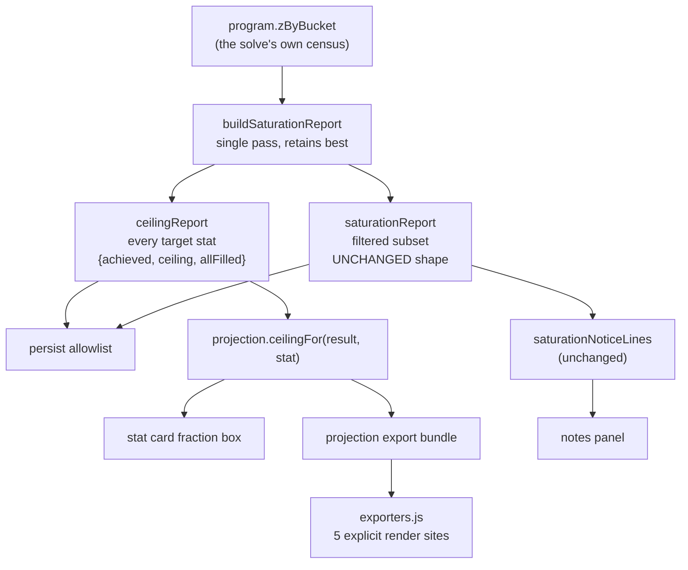
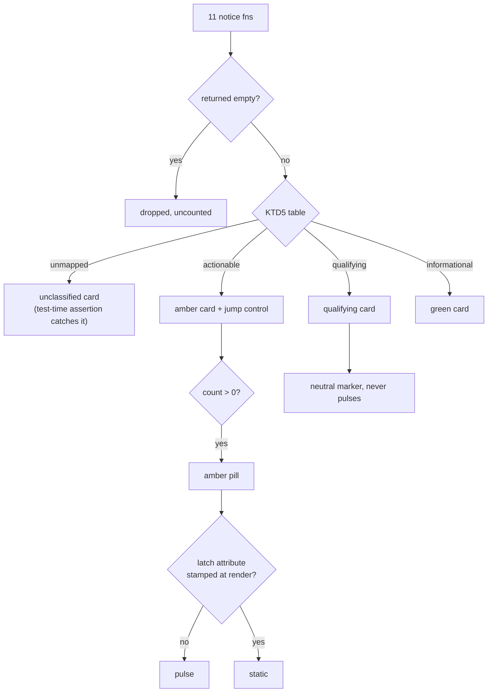

# Results-Phase UI Clarity - Plan

## Goal Capsule

- **Objective:** Make the results phase read as an organised, honest report instead of a stack of loose prose. Four changes: contain the eleven solve notices in one foldable banner-coloured panel; move the stat-ceiling fact off the item and onto the ranked-priority card as an achieved/ceiling fraction; make each item's stat contributions scannable; make the per-slot control visible.
- **Product authority:** The user, via two browser mockup probes on 2026-08-22. The eight original Key Decisions were chosen against rendered variants in the first probe. R5's qualifying colour, R26, R28, R29 and R32 were authored in prose during document review and then taken back to a second probe, where each was chosen against renders. **Every shape decision in this plan has now been seen rendered.** KTD7 remains the one call settled from argument rather than a render, and it is labelled as such.
- **Open blockers:** None. All three review blockers resolved 2026-08-22: OQ1 splits the multi-fact notices (U10), OQ2 adds a fourth `capBound` state (KTD7), OQ3 emits `ceilingReport` from `readSolution` so alternatives carry it (KTD9).

**Product Contract preservation:** Changed — R5, R8, R11, R14, R15, R17, R18, R20, R21, R24, R25, R30 revised, R26–R37 added, AE1 and AE5 revised, AE11–AE13 added. All arose from the 2026-08-22 document review, which found the original text under-specified or contradicted the tree in ways that would have shipped regressions. **No settled decision was reopened** — every revision serves a decision the product authority already made. Details in each requirement.

---

## Product Contract

### Summary

The results phase currently renders eleven sibling notice blocks flat under the OPTIMAL banner (`web/results.js:1154-1164`), with no wrapper and no shared fold. Some are `
`, some are bare `
`, so the ones that fold give no sign they can be opened. Separately, the "at ceiling" marker is attached to individual gear boxes, where it is misleading: one item is not the whole contribution to a stat, so a green "at ceiling" beside a single item reads as a claim about that item. And `.pd-ctl` — the per-slot constraint control — is `opacity: 0` until `.pd-row:hover`, so it is invisible on desktop until discovered by accident and permanently absent on touch (filed as #447).

This work contains the notices, relocates the ceiling fact to the level it actually describes, expresses it as a fraction rather than a boolean, makes per-item stat contributions scannable, and gives the slot control a real affordance.

### Actors

- **A1 — The player reading a finished solve.** Wants to know what they got, what they did not get, and what they could change. Reads the results phase on both desktop and phone.

### Requirements

**The notices panel**

- **R1** — The eleven solve notices render inside a single container, separate from the OPTIMAL banner with a gap between them, using the banner's green/blue gradient and border so it reads as part of the optimization.
- **R2** — The panel is a fold, collapsed by default, with a chevron and the label "Notes on this solve".
- **R3** — The panel summary states the total note count, so the player can see there is something to open without opening it.
- **R4** — Each notice renders as its own bordered sub-card inside the panel, with a short uppercase title and its sentence body. No notice renders as bare prose in the panel.
- **R5** — Notices are classified into **three** classes:
  - **actionable** — the player has a control that resolves it. Amber left edge and amber title.
  - **qualifying** — it changes how the displayed numbers should be read, but the player has no resolution path. Slate left edge and slate tag (`--qualify`), deliberately OFF the amber ramp: the tree already carries four near-identical ambers, so a fifth would not read as distinct. *(session-settled: user-directed, chosen against renders 2026-08-22.)*
  - **informational** — a statement of fact about the solve that qualifies nothing. Green left edge and green title.

  Sort order: actionable, then qualifying, then informational. *(Revised — the original two-way split had no home for notices that caveat the totals but cannot be acted on. See KTD6.)*
- **R6** — Each actionable notice carries a control that navigates to the surface which resolves it. The resolution route for every actionable card — including the per-fact cards U10 splits out — is enumerated in KTD5 and is part of this contract, not an implementation choice. A notice already carrying its own in-card resolution control satisfies this without an added jump control.
- **R7** — When one or more actionable notices are present, the panel summary shows an amber "N need attention" pill alongside the total count. `N` counts actionable notices only, and counts only those that actually rendered a card.
- **R8** — The pill pulses until the player **first** opens the panel. From that moment it renders static amber for the remainder of the session — including across every subsequent `renderResults` call (solve, load, per-slot constraint change) and if the player collapses the panel again. *(Revised — the original wording said "for the rest of the session" while the prescribed mechanism could only see current open state. See KTD3.)*
- **R9** — The pill is legible as urgent **without** the pulse. Motion is a redundant enhancement layered over a static amber fill, never the sole carrier of the signal.
- **R10** — When no actionable notice is present, no pill renders and nothing pulses.
- **R26** — When one or more **qualifying** notices are present, the panel summary carries a slate, non-pulsing marker that NAMES its subjects, not just their count — "2 qualify: affix withheld, declared credit" — truncating to a count past two. Visible without opening the panel, distinct from the actionable pill, never animated. *(session-settled: user-directed, chosen against renders 2026-08-22 over a count-only marker. A bare count says something exists; it does not say the headline totals rest on unverified input, which is the fact the disclosure carries.)*
- **R27** — When the non-empty notice count is zero, **no panel renders at all** — no empty fold, no zero count, no chevron. *(Added — the clean-solve path was unspecified.)*
- **R28** — Every notice class uses a non-colour carrier in addition to its edge colour, so class survives a greyscale render or red-green colour-vision deficiency. The carrier is a short class tag ("Needs attention" / "Qualifies" / "Note") rendered as its own element beside the card title, **not** concatenated into it. *(session-settled: user-directed, chosen against renders 2026-08-22 over a title prefix, which produced ~40-character uppercase strings that wrapped at phone width and buried the distinguishing word at the far right.)*
- **R35** — A notice that already returns its own `
` is unwrapped inside the panel: its summary text becomes the card's sentence body and its inner content renders open. The panel is the only fold. *(Added — `saturationNotice` returns a `
`, so wrapping it as-is gives the player a fold inside a fold under a card title that already restates the fact.)*
- **R36** — The panel's containment must not reduce what a screen reader announces. Ten of the eleven notices are `role="status"` live regions today; content inside a **closed** `
` is not rendered, so those announcements vanish. The summary line (or the existing sr-only region at `web/results.js:1191`) carries a polite live announcement naming the counts by class on each render, and the per-notice `role="status"` is dropped when the notice moves inside the fold. *(Added — without this the containment ships as a net accessibility regression on exactly the disclosures the product's identity rests on.)*

**The achieved / ceiling fraction**

- **R11** — Each ranked-priority card carries a sub-container at its bottom stating what the solve reached against the best source available in each bonus type, summed, as a fraction (`30 / 50`). *(Revised — "what was available" seeded a reachable reading in the requirement an implementer reads first.)*
- **R12** — The sub-container includes a proportional meter reflecting the same fraction.
- **R13** — When achieved equals the ceiling **and the ceiling is non-zero**, the fraction and meter render green and the sub-container takes a green border and tint.
- **R14** — When achieved is below the ceiling, the fraction and meter render in the neutral accent, with no red or warning colour. *(Revised — the original carried a causal rationale asserting the shortfall was caused by priority order. That is a claim about a solve nobody runs. See KTD2.)*
- **R15** — The denominator is explained in two forms. Each sub-container carries a SHORT form — one clause naming what the denominator is — differing across the maxed, shortfall, zero-ceiling and cap-bound cases. The FULL statement, which also says those sources may compete for one slot so no loadout is claimed to reach the ceiling, renders ONCE per readout at section level, and must be present in the same view rather than merely reachable. *(Revised — a full sentence repeated on every unmaxed card down a five- or eight-priority build reads as boilerplate and stops being read, which defeats the premise that the sentence is the mitigation.)*
- **R16** — Neither the wording nor the visual may imply the ceiling was a reachable build. The denominator is the sum of the best source available in each bonus type, which can exceed what any single loadout could hold. No sentence may assert what a different solve would have produced. See KTD2.
- **R29** — The meter's **whole track** carries the bound treatment — a hatch — with the fill drawn over it, so the track reads as an upper bound rather than attainable headroom. *(session-settled: user-directed, chosen against renders 2026-08-22 over hatching only the remainder and over a marked terminus. Hatching the remainder alone puts the strongest signal where the risk is lowest and leaves a 96%-filled bar with 4% of track to render it in — exactly the case that reads as "almost attainable".)*
- **R17** — The stat-level ceiling fact renders once **in the loadout and stat-card surfaces**, and nowhere else in them. Concretely: **(a)** the per-item `at-ceiling` span inside `whyThisLine` (`web/results.js:613-631`) is removed; **(b)** `ceilingChip` (`web/results.js:821`, rendered on the stat card at `web/results.js:1451`) is retained **only** as the fallback render for a restored build carrying the old `saturationReport` shape and no `ceilingReport`; a result carrying `ceilingReport` renders the fraction and never the chip. The `saturationNotice` inside the notes panel is unchanged and keeps its own sentence. *(Revised — "nowhere else" collided with the scope boundary preserving the notices, and deleting `ceilingChip` outright would leave restored builds with no ceiling signal at all from data their save still contains.)*
- **R18** — The fraction reaches **all five** share exports. In every export the fraction appears together with its short form, and the full statement appears once per export document; a bare fraction never travels alone. In the structured `ddo-loadout/v1` JSON the denominator field is named for its scope (e.g. `ceilingUpperBound`) so a third-party consumer cannot read it as an attainable target.
- **R19** — A restored build saved before this ships has no `ceilingReport`. Its cards render no fraction sub-container, fall back to `ceilingChip` per R17(b), invent no denominator, and trigger no re-solve.
- **R30** — When a stat's ceiling is zero, the card renders neither the green maxed treatment nor a meter. It states only what the data supports — that this solve found nothing reachable for the stat — and does NOT defer to `zeroSourceNotice`. That notice tests `poolStatNames(model)` BEFORE gating, while `ceiling === 0` is computed after gating, dominance and slot locks: a player who locks every slot that could carry a stat gets `ceiling === 0` with no `zeroSourceNotice` on screen, so a card deferring to it would point at an explanation that is not there and assert something the pool contradicts. *(Added — `0 / 0` satisfies `achieved === ceiling`, so the original R13 would render green "at ceiling" on a stat the solve found nothing for.)*
- **R33** — For a stat carrying a cap, **both** numerator and denominator are clamped to the cap, so the fraction never disagrees with the card's headline number. A cap-bound stat renders the `capBound` state — its own sentence naming the cap as the binding limit, and a treatment distinct from R13 green. Green is reserved for `achieved === pool ceiling`. See KTD7. *(Added — the headline is `effectiveOf` = `Math.min(cap, raw)`, and the card already renders a `capNote` reading "capped at N · raw M". An unclamped fraction would make a capped stat's card state three different totals for one stat, and would present raw headroom the player cannot hold. See KTD7.)*
- **R34** — The Utility tier is exempt from the fraction. It is a count of distinct effects, not a summable stat, and its card renders through a separate path. *(Added — `_UTILITY_SENTINEL` is a member of `targetList`; emitting "a row for every target stat" would give it `0 / 0` and a NaN meter width. See KTD8.)*

**Loadout stat contributions**

- **R20** — Each gear box in the Loadout tab renders its contributing stats as discrete chips. A chip's primary line is a large tabular-numeral value and its stat name. A chip **must also carry**, when present on that contribution: the bonus type, a `(set)` marker, a `(from <stat>)` cross-add source, and the player-override disclosure `(your call — catalog says X)`. A boolean contribution renders a distinct presence variant (`✓ <stat>`) with no numeric value.

  **`whyThisLine` has two early-return forms that are NOT chip rows and are preserved verbatim:** the #245 craft-carried line (`⚒ here only for its crafts: …`, with its explanatory title) and the filler line (`included to complete the loadout`). Both return before the contribution spans are built. Neither becomes chips; both keep their current markup and wording. *(Revised — the original spec named only value and stat name, which would have deleted five existing disclosures including the #88 override label that exists precisely so a gear box does not state a bonus type as though the wiki said so.)*
- **R21** — A chip for the player's rank-1 priority is distinguished by a named accent token AND a non-colour carrier — heavier border weight or a rank pip reusing the existing `.stat-rank` idiom — so the distinction survives greyscale and red-green colour-vision deficiency. *(Revised — colour alone contradicts R28's own principle, on a denser surface than the notice cards.)*
- **R22** — The chip row wraps without horizontal overflow at phone width.
- **R37** — The panel summary wraps without horizontal overflow at 375px. It carries the label, chevron, total count, the actionable pill and the qualifying marker; the pill and marker each wrap as a unit rather than breaking internally, and the summary's tap target stays at least `var(--tap)` in every wrap state. *(Added — R22 covered the gear chips only, while the summary became the densest new element in this work and is also the panel's only tap target.)*
- **R31** — The existing three-contribution cap (`contribs.slice(0, 3)`) is retained. *(Added — left unstated, and it governs chip-row height on the 375px pass R22 covers.)*

**The slot control**

- **R23** — The per-slot constraint control is visible at rest, with no dependence on `:hover`. It must be discoverable on touch.
- **R24** — The control's gear glyph and resting border render at 34px. Its **touch target** reaches `var(--tap)` (44px) via a negative-inset overlay pseudo-element, NOT via padding. *(Padding and overlay are not equivalent: `.pd-ctl` sits in `.pd-rtop`, a flex row whose height follows its tallest child, so padding the control to 44px raises every gear row — ~18 rows in the single-column layout below 560px — adding hundreds of pixels of scroll to the phone Loadout view this work is meant to make scannable. An overlay costs nothing and stays inside the row's existing padding. The control must not change `.pd-rtop`'s rendered height.)* *(Revised — 34px is the settled visual size; sizing the hit area to it would make the one new touch affordance in this work the only control in the app below the app's own tap floor.)*
- **R25** — The control's focus indicator is actually visible — the control is never focusable while transparent. *(Revised — the original asked for an `aria-label` and a `:focus-visible` rule, both of which already ship: `web/results.js:402` and the global rule at `web/styles.css:245`. The real defect is that focus currently lands on an `opacity: 0` element, a WCAG 2.4.11 failure. The existing label and inherited ring are preserved, not added.)*

**Design tokens**

- **R32** — Two tokens are defined in `:root` and used by name:
  - **`--warn: #d9a441`** — the actionable class edge, tag and the attention pill. This is the value `web/styles.css:1310` already uses as its inline fallback.
  - **`--qualify: #8fa2c4`** — the qualifying class edge, tag and summary marker. Slate, deliberately off the amber ramp.

  The pill's ink is a dark token on the amber fill, specified explicitly, and meets contrast.

  **Scope limit:** this defines the two tokens for *this work's* elements. It does **not** migrate the two pre-existing `var(--warn, …)` call sites — `.pd-why.pd-carried` (`web/styles.css:397`, the #245 craft caution) and `.wz-util-status` (`:1310`, a Utility message). Neither is a results-phase notice, they currently render two different ambers, and migrating them would change an unrelated shipped component's colour inside a results-phase PR. Defining `--warn` makes `:1310` resolve to the same value it already shows; `:397` keeps its own fallback and is left alone. *(session-settled: user-directed on the palette, chosen against swatches 2026-08-22; scope narrowed on review.)*

### Key Decisions

- **Panel placement — separate matching panel, not welded to the banner.** *(session-settled: user-directed — chosen over welding the panel to the banner as one continuous surface, which kept the association tighter but grew the banner tall and pushed the fold control away from the verdict.)*
- **Severity colour is preserved inside the panel.** *(session-settled: user-approved — chosen over uniform banner-green on every notice.)* The brief asked for the container to be "the same color as the optimal banner". Applied to the notices themselves, this tints "41 candidates were not considered" the same success-green as "every augment is optimal". The container is banner-coloured; the notices inside keep their class colour.
- **Only actionable notices are counted by the pill.** *(session-settled: user-approved — chosen over counting all notices.)* Informational notices have no resolution path, so counting them makes the pill unresolvable by construction. R26's qualifying marker is a separate, non-pulsing signal and does not violate this.
- **The pulse ends when the panel is opened, not when the notes are resolved.** *(session-settled: user-directed — chosen over pulsing until resolved, and over a timed burst per solve.)* The literal "until resolved" reading means indefinite motion with no stop control — the WCAG 2.2.2 concern. Opening the panel is the action the pulse exists to provoke.
- **Fraction presentation — boxed footer with meter.** *(session-settled: user-directed — chosen over a lighter pill chip with no meter.)*
- **Loadout emphasis — chips.** *(session-settled: user-directed — chosen over a right-aligned decimal-aligned ledger, which scanned better down a full paperdoll but cost significant row height.)*
- **Slot control — gear glyph, enlarged.** *(session-settled: user-directed — chosen over an always-visible bordered ellipsis and a labelled "⋯ Constrain" pill, the latter self-describing but costly in phone width.)*
- **Old saves omit the fraction box rather than explaining its absence.** *(session-settled: user-directed — chosen over an "unavailable, re-solve to restore" line and over a re-solve prompt.)* R17(b) retains `ceilingChip` as their fallback, which explains nothing and invents nothing — it simply keeps showing the fact their save already contains.

### Acceptance Examples

- **AE1** — A solve produces three actionable, two qualifying and one informational notice. The panel reads "Notes on this solve · 6 notes · **3 need attention** · 2 qualify this result", the amber pill pulsing and the qualifying marker static. Opened, the three amber cards sort first, then the two qualifying, then the informational; each amber card carries a jump control. The pill stops pulsing and stays amber and static.
- **AE2** — A solve produces only informational notices. The panel reads "6 notes" with no pill and no qualifying marker, and nothing on screen moves.
- **AE11** — A solve produces one qualifying notice and no actionable ones. The summary carries the qualifying marker, visible without opening the panel, and nothing pulses.
- **AE12** — A solve produces no notices at all. No panel element renders.
- **AE3** — A player with `prefers-reduced-motion: reduce` loads a solve with actionable notices. The pill renders static amber from the outset and is still identifiable as urgent. No motion occurs at any point.
- **AE13** — A player opens the notes panel, then collapses it, then changes a per-slot constraint (triggering a full `renderResults`). The pill does not resume pulsing at any point after the first open.
- **AE4** — Priority 1 Physical Sheltering reaches 132 with every bonus type filled. Its card's footer reads `132 / 132` in green, with a full green meter and a sentence stating no other item in the pool can raise it. This is the *expected* rank-1 state on essentially every solve, since priority 1 is always at its global maximum — a green rank-1 card is normal, not a defect (see KTD1).
- **AE5** — Priority 3 Melee Power reaches 30 against a summed per-bonus-type best of 50. Its card's footer reads `30 / 50` in neutral accent, the meter filled to 60% with its remainder in the bound treatment, and a sentence stating only that the denominator is the best source available in each bonus type summed, and that those sources may compete for the same slot so no loadout is claimed to reach it. The sentence makes no claim about what a different priority order would have produced.
- **AE6** — No gear box displays an "at ceiling" marker, and no stat card displays both a `ceilingChip` and a fraction box.
- **AE7** — A player on a touch device opens the Loadout tab. Every gear row shows its gear control without any hover interaction, its tap target measures at least 44px, and tapping it opens the slot constraint surface.
- **AE8** — A gear box for an item contributing to three stats shows three chips; the rank-1 chip is visually distinct. A contribution carrying a player override shows `(your call — catalog says X)`; a boolean contribution shows `✓ <stat>` with no number. At 375px the chips wrap and the page does not scroll horizontally.
- **AE9** — A player exports a build in each of the five formats. Every export carries the achieved/ceiling fraction for each ranked priority, and in every export the qualifying sentence appears with it.
- **AE10** — A build saved before this change is loaded. Its stat cards render no fraction sub-container, fall back to the `ceilingChip` marker where the old data supports it, throw no error, and trigger no solve.

### Outstanding Questions

These are **blocking** — U5 and U6 cannot be written without them, and two are product decisions rather than planning ones. All three surfaced in the 2026-08-22 document review's second round.

- ~~**OQ1**~~ — **Resolved 2026-08-22: split them.** The three multi-fact notices are split at the render seam into per-fact cards (KTD5's second table, U10). This deliberately widens scope: the Scope Boundaries no longer claim the notice set is untouched.
- ~~**OQ2**~~ — **Resolved 2026-08-22: a fourth `capBound` state, not green.** See KTD7. Original question: KTD7 clamps a capped stat's fraction to its cap. If it then renders green under "no other item in your pool can raise it", that sentence is false when the cap rather than the pool is the limit, it contradicts the `capNote` on the same card, and it collapses two materially different states (at-cap-with-slack vs pool-exhausted) into one. The review's recommendation is a fourth state — `capBound` — with its own sentence and treatment, green reserved for `achieved === pool ceiling`. **The clamp also makes `ceilingReport` and `saturationReport` disagree**, since the latter is held byte-identical and therefore unclamped: a stat could read green `100 / 100` on the card and be absent from the AT CEILING notice in the same panel.
- ~~**OQ3**~~ — **Resolved 2026-08-22: `readSolution`, so alternatives carry it.** See KTD9. Original question: `saturationReport` is built in `solveLexicographic` (`web/solver.js:2355`), not `readSolution` (which ends at `:2029`). Emitting from `readSolution` also gives `solveConstrained` the data and therefore the Alternatives tab — which the Scope Boundaries exclude — but is the only place the prescribed synthetic-primal test seam exists. Emitting at `:2355` holds the boundary and requires a `solveLexicographic` fixture test instead, matching the existing saturation tests.

### Scope Boundaries

- **Not** a change to what any notice *says* or *when* it fires. Every sentence is owned by `web/projection.js` and its wording is carried across verbatim.
- **In scope, by the OQ1 ruling:** splitting three notices that bundle facts of different classes into per-fact cards (U10). This changes how many notices exist and touches the projection seam. It does **not** rewrite a single sentence — the same text is emitted, addressed to its own card.
- **Not** a change to solver behaviour, the lexicographic guarantee, or which items are chosen.
- **Not** a loosening of the saturation notice's firing condition. See KTD1.
- **Not** a new pool traversal. See KTD1.
- **Not** a redesign of the OPTIMAL banner, the paperdoll layout, or the wizard steps.
- **Not** an extension of the fraction to the Utility card (R34 exempts it).
- **In scope, by the OQ3 ruling:** alternative builds carry their own `ceilingReport` and render the fraction from the build being displayed. `renderBuild` is generic over optimum and alternative (`web/results.js:1336` warns it "must never close over the optimum"), so the alternative shows its own numbers or none — never the optimum's.

#### Deferred to Follow-Up Work

- Normalising the eleven notice functions' heterogeneous signatures into a uniform descriptor, which would make classification data-driven rather than a hand-maintained lookup table. Filed as **#448**.

---

## Planning Contract

### Key Technical Decisions

**KTD1 — One census, two outputs. The saturation notice's gate does not move.**

`buildSaturationReport` (`web/solver.js`) emits a row only when `sawBucket && allFilled && unusedSources > 0`. That gate is deliberate and documented as KTD3 in the function: priority 1 is at its global maximum on every solve, so an ungated notice would fire constantly, and the informative case is the one that generates the complaint.

The fraction needs a row for **every** target stat. Resolve this by building the full row set on the existing single pass and deriving the notice's set from it:

- Each row carries `{ stat, achieved, ceiling, bonusTypes, unusedSources, allFilled }`, where `achieved` is today's `total` (`Σ taken`) and `ceiling` is `Σ best`.
- `ceilingReport` is the full set — the fraction's source.
- `saturationReport` is the subset satisfying today's predicate, in today's shape — **bit-identical output** for the notice and every existing consumer.

This honors the function's own doc-comment prohibition on a second pool traversal, which exists because a parallel notion of "the pool" is free to drift from the one the solve used.

**The display is deliberately ungated, unlike the notice.** The notice's gate includes `unusedSources > 0` precisely because priority 1 is at its global maximum on every solve. The fraction box drops that half for display, so the rank-1 card will read green on essentially every solve. That is correct and expected — the box reports a fact, it does not raise an alarm — but it means an always-green rank-1 card is the normal state, not a bug. AE4 records it so the browser pass does not read it as one.

**KTD2 — The ceiling is an upper bound. Wording alone cannot carry that.**

`Σ best` sums the best source in each bonus-type bucket independently. Those sources may be the same item, may compete for one slot, or may contradict a chosen set. A stat can read `30 / 50` where no legal loadout reaches 50.

Two consequences the original plan under-served:

1. **No sentence may assert a counterfactual.** "Higher priorities took slots that could otherwise have carried more" describes a solve that is never run, and when the ceiling is unreachable it is simply false. `docs/solutions/conventions/never-infer-a-claim-about-your-own-results.md` records five prior instances of exactly this shape — all caught by review, none by a test, in a tool whose headline claim is provable optimality. Every fix there was a rewording toward what the data supports, never a better estimate. R16 and U2's scenario enforce it mechanically.
2. **The visual carries the claim too.** A partially-filled bar terminating in green is the universal grammar of progress toward an attainable target; it is read before any sentence, and on a phone the sentence may not be read at all. R29 gives the remainder a bound treatment so the track reads as a bound, not headroom.

**KTD3 — A one-way latch on an element that survives re-render.**

R8 needs a latch: pulse until first open, static thereafter. `
[open]` is a live toggle, not a latch, and `renderResults` destroys and rebuilds the whole container on every call — its own comment at `web/results.js:1328` states that child panels "are destroyed on every renderResults call (solve, load, per-slot constraint change)". A pulse keyed on `[open]` therefore re-arms on every collapse **and** every re-render.

`docs/solutions/conventions/a-state-derived-predicate-cannot-rank-a-dom-its-handlers-mutate.md` does not forbid the fix. It forbids a **state-derived predicate ranking an element whose handlers mutate it**. A one-way latch is the opposite shape: written once by the handler, never cleared, and read only by CSS.

The mechanism: on the panel's first `toggle`-to-open, set a session-scoped flag; `renderResults` stamps that flag onto the freshly built panel as an attribute at build time, so the latch survives the rebuild. The pulse selector reads the absence of that attribute. Render-time answers come from state; post-render answers come from the DOM — and here the flag *is* the render-time input, which is exactly the moment the learning assigns to state.

**KTD4 — Motion is additive over a static cue, and the repo already kills it.**

`web/styles.css:726` carries `@media (prefers-reduced-motion: reduce) { * { animation: none !important; transition: none !important; } }`. Any pulse is therefore auto-disabled for those players. R9 exists because of that: the pill must be a static amber fill that the pulse decorates, never a signal the animation carries alone.

**KTD5 — Notice classification is a settled table, not an implementation choice.**

The eleven notices have heterogeneous signatures, return finished HTML fragments (some `
`, some bare `
`), and carry no title concept. R4 requires a titled sub-card, so the table supplies the title too — the notice functions keep owning their sentences (per the scope boundary), and the wrapper owns the card chrome around them.

Built by reading each function's emitted branches, not from its name. Verified 2026-08-22 against `web/results.js`.

| Notice | Card title | Class | Resolution route |
|---|---|---|---|
| `staleSnapshotNotice` | STALE SNAPSHOT | actionable | same screen — scroll+focus the re-solve control |
| `emptySlotNotice` | EMPTY SLOT | actionable | same screen — scroll+focus "Adjust & re-solve" (the notice's own text already says so) |
| `craftingExcludedNotice` | EXCLUDED BY CRAFTING OPT-OUT | actionable | character step — crafting opt-out |
| `blockNotice` | BLOCKED GEAR | actionable | gear pool — block list |
| `augCeilingNotice` | AUGMENT POOL NARROWED | actionable | the step hosting `#wz-augceiling` |
| `outbidNotice` | PRIORITY SCORED 0 | actionable | **in-card** — its existing `.outbid-require` / `.outbid-price` buttons; no jump control is added |
| `absorptionQuarantineNotice` | AFFIX WITHHELD | qualifying | — |
| `saturationNotice` | AT CEILING | informational | — (already returns its own `
`; see R35) |
| `artifactNotice` | **MIXED** | see below | — |
| `zeroSourceNotice` | **MIXED** | see below | — |
| `boundNotice` | **MIXED** | see below | — |

**Corrections from the first draft, all found by reading the code:** `augCeilingNotice` fires only when the player set the ceiling themselves — the same shape as `craftingExcludedNotice`, which was already actionable. `outbidNotice` renders two live resolution controls (`web/results.js:1099`, `:1104`, wired at `:1222-1231`), so classing it "no resolution path" would have folded a player's fix out of sight and excluded it from the attention count. Its title also named the wrong subject: a *candidate* is a variant in this codebase's vocabulary (see `CONCEPTS.md`), but the notice is about a ranked priority scoring 0.

**R6 amendment.** An actionable notice satisfies R6 either by a jump control or by already carrying its own in-card resolution control. `outbidNotice` does the latter and gets no added control.

**Three notices bundle facts of different classes and are split into per-fact cards by U10** *(session-settled: user-directed — chosen over one card with a most-urgent class and a vaguer title, and over deferring the three entirely)*. A single title such as "DECLARED CREDIT APPLIED" would assert a declared credit was applied on every solve where the notice fired for any of its other five reasons — a false user-facing claim manufactured by the table itself, which is instance 3 in `never-infer-a-claim-about-your-own-results.md`.

| Source | Branch | Card title | Class | Resolution route |
|---|---|---|---|---|
| `artifactNotice` | none flagged in data | ARTIFACT UNAVAILABLE | qualifying | — |
| `artifactNotice` | included because pinned | ARTIFACT PINNED IN | actionable | gear pool — pins |
| `zeroSourceNotice` | `absent` (not in dataset) | STAT NOT IN DATA | qualifying | — |
| `zeroSourceNotice` | `filtered` (gated out) | STAT FILTERED OUT | actionable | character step |
| `boundNotice` | ML floor considered | GEAR ML FLOOR | qualifying | — |
| `boundNotice` | floor not reached | FLOOR NOT REACHED | actionable | priorities |
| `boundNotice` | held at your cap | HELD AT YOUR CAP | qualifying | — |
| `boundNotice` | declared credit | DECLARED CREDIT APPLIED | qualifying | — |
| `boundNotice` | bonus-type override | BONUS TYPE OVERRIDDEN | qualifying | — |
| `boundNotice` | declaration post-dates the solve | RE-SOLVE TO APPLY | actionable | same screen — re-solve control |
| `boundNotice` | TWF off-hand exclusion | OFF-HAND EXCLUDED | qualifying | — |

The `boundNotice` branch list above is drawn from its render sites; U10 enumerates it from `web/projection.js` at implementation time and the table is corrected there if a branch is missed. A branch that fires but has no row is caught by U5's completeness assertion.

The rendered title is the class word from R28 followed by this card title.

**A missing table entry is a test-time failure, not a runtime throw.** `renderResults` is called inside a try/catch at `web/wizard.js:3286` whose catch replaces the entire results box with `Solver error: <message>`. A throw there would destroy a correct solve's whole results screen and misattribute it to the solver — and other call sites (`web/wizard.js:3588` restore, `:4434` re-render) sit outside that try, so the same throw would break differently depending on how the player arrived. Instead: a U5 test asserts every notice in the render array has a table entry, and at runtime an unmapped notice renders in a visible "unclassified" state. The table is asserted in full, so a reclassification is a deliberate test edit rather than a silent one.

**Jump control label copy.** Each actionable card's control is a button (not a link — it changes wizard state rather than navigating a URL) carrying a verb plus destination: "Re-solve now", "Edit priorities →", "Change crafting opt-out →", "Review block list →", "Change augment ceiling →", and for the pinned-artifact card "Review pins →". `outbidNotice` adds no control; its existing Require / price buttons stand. The two same-screen routes scroll their target into view and focus it rather than dispatching a step change, and the panel stays open on return.

**The jump-target contract.** A `jumpTarget` is a wizard step id plus an optional anchor, dispatched through the existing `onAfterRender` / `onRequire` callback seam rather than by `results.js` reaching into wizard state. This puts `web/wizard.js` in U5's file list.

**KTD6 — Why a third class exists.**

The actionable/informational split was chosen on "does this have a resolution path". That is a different question from "does this change how the numbers should be read", and four notices answer yes to the second and no to the first: a declared-credit bound folded into the totals, an affix dropped because its wiki record is unconfirmed, a narrowed augment pool, an outbid candidate. Under a two-way split those collapse silently behind a fold with nothing moving — a reduction in disclosure prominence shipped in the same change as a new headline number, in a product whose stated identity is that a visible gap beats a confident wrong number. R26 gives them an at-rest signal without touching the settled rule that only actionable notices feed the pill.

**KTD7 — A capped stat is clamped, and gets its own state rather than the green one.**

`effectiveOf` (`web/solver.js`) returns `Math.min(cap, raw)`, so the card's headline number is capped while `achieved` (`Σ taken`) is raw. Left unreconciled, a capped stat's card would carry the headline, the existing `capNote` ("capped at N · raw M"), and a fraction whose numerator exceeds both — three totals for one stat.

Clamp both sides to the cap, so the fraction agrees with the headline. *(session-settled: user-directed.)*

**But a cap-bound stat does not inherit the R13 green maxed treatment.** *(session-settled: user-directed — chosen over letting it render green, and over suppressing the box on capped stats.)* `ceilingFor` returns a fourth state, `capBound`, with its own sentence — the limit here is the player's cap, not the gear pool — and its own treatment. Green stays reserved for `achieved === pool ceiling`.

Three reasons, all of which the green reading violates:

1. The maxed sentence says *no other item in your pool can raise it*. When the cap is the binding constraint that is false — the pool can, the cap won't let it land.
2. It contradicts the `capNote` rendered inches away on the same card.
3. It collapses two materially different states. At-cap-with-headroom means the player has slack and can swap gear freely; at-pool-maximum means none. A single green erases the distinction.

**The clamp also desynchronises the two reports.** `ceilingReport` is clamped; `saturationReport` is held byte-identical and therefore is not. A stat could read `100 / 100` on the card and be absent from the AT CEILING notice in the same panel. The `capBound` state resolves this — a cap-bound card is not claiming saturation, so its absence from the notice is correct rather than contradictory. U2 asserts the pairing.

**KTD8 — The Utility sentinel is skipped, not reported.**

`program.targetList` is `model.targets`, which includes `_UTILITY_SENTINEL` when the tier is ranked. Every other per-stat loop in `web/solver.js` guards it explicitly (`:1624`, `:1839`, `:2083` — "not a stat; no per-stat parts"); `buildSaturationReport` does not, and is safe today only because the sentinel never sets `sawBucket` so no row is pushed. KTD1's "a row for every target stat" removes that protection. Add the same explicit skip, matching the existing guards. Separately, `web/results.js:1441` returns `utilityCard(build, i)` before the stat-card template, so the Utility card could not carry the sub-container anyway — R34 makes that exemption explicit rather than incidental.

**KTD9 — `ceilingReport` is emitted from `readSolution`, so every solve path carries it.**

`saturationReport` is built in `solveLexicographic` (`web/solver.js:2355`); `readSolution` ends at `:2029`. The two emitters are not equivalent:

- **`solveLexicographic`** keeps `solveConstrained` — and therefore the Alternatives tab — free of the new data.
- **`readSolution`** is spread into `solveConstrained`'s returns (`:2678`, `:2701`), so alternatives get it too.

`readSolution` is chosen. *(session-settled: user-directed.)* The deciding argument is not the test seam, though that follows: `renderBuild` is generic over the optimum and any selected alternative, and its own comment at `web/results.js:1336` warns it "must never close over the optimum". Emitting only from `solveLexicographic` would leave an inspected alternative with `ceilingFor` returning `null` **and** `ceilingChip` returning empty — the ceiling information silently vanishing the moment a player looks at an alternative, with no explanation. Emitting from `readSolution` gives the alternative its own correct numbers from its own solve.

The wrong answer would have been to close over the optimum and render its numerator beside an alternative's headline — a confidently-stated wrong number, and precisely the failure `never-infer-a-claim-about-your-own-results.md` governs. U3 asserts it never happens.

This also restores the synthetic-primal test seam the report-guard discipline asks for: `readSolution` is already exported for tests, and the primal is `{ Columns: { <var>: { Primal: 1 } } }`.

### Patterns to Follow

| Concern | Follow |
|---|---|
| New persisted result key | The per-entry reasoning comments in `web/persist.js:30-60` — each states why a restored build goes silent without it |
| New solver-derived report | `buildCreditReport` / `buildSaturationReport` in `web/solver.js` — plain JSON built at solve time, never at render time, because `program` is dropped from the snapshot |
| Report guard testing | `docs/solutions/design-patterns/every-solver-family-report-needs-a-load-bearing-guard.md` — synthetic primal into `readSolution`, paired positive/negative arms, mutation-check each guard |
| Any user-facing sentence carrying a number or attribution | `docs/solutions/conventions/never-infer-a-claim-about-your-own-results.md` — weaken the sentence, never approximate the number; name a computed field for its scope |
| Per-format export rendering | The `saturationNotice` precedent in `web/exporters.js` — rendered explicitly at `:231`, `:312`, `:394`, `:477`. The projection bundle is content only; each format renders its own fields |
| Shared export content | `web/projection.js` is the single content source; the bundle assembles at `web/projection.js:1550` |
| Classic-script globals | `docs/solutions/conventions/shared-classic-script-globals-use-var-not-const.md` — `var`, not `const`, for cross-file globals |
| Editing a comment a change invalidates | `docs/solutions/conventions/edit-the-stale-comment-instead-of-stacking-a-new-one-above-it.md` — edit it; never stack a second block above |

### Risks & Dependencies

- **R-a — Silent notice-count drift.** A notice returning empty must not be counted or rendered. R3's total is asserted in U5; R7's actionable `N` is asserted in U6. Both are claims about a population, and this repo treats an unasserted count as a defect.
- **R-b — Export byte-drift.** Five exports change. `tests/exporters.test.js` goldens are re-ratified deliberately, never blanket-accepted. Note a never-rendered field produces **no** diff — so the per-format assertions in U2, not the golden diff, are what prove R18.
- **R-c — Solver golden diff.** U1 changes what `readSolution` returns, which reaches both `solveLexicographic` and `solveConstrained`. `tests/solver_golden` catches tie-break drift nothing else does; a diff there is a signal, not noise.
- **R-d — `saturationReport` shape is persisted.** Old saves carry the old shape and no `ceilingReport`. U1's byte-identity scenario proves the emitted shape is unchanged; U3's AE10 scenario proves the restore path renders the fallback. Nothing migrates saved files.
- **R-e — Line-number drift across units.** The plan's citations are accurate at authoring time but unanchored. Later units editing the same files (U3, U4, U5, U6, U7 and U8 all touch `web/results.js`) will shift earlier offsets. Locate by function name, not line number, once U1 has landed.

---

## High-Level Technical Design

Data flow for the fraction, from the existing census to the five exports:

Notice classification, the pill, and the latch:

---

## Implementation Units

### U1. Emit the full ceiling census

- **Goal:** `readSolution` returns a per-target-stat achieved/ceiling row set for every solve path, without changing the saturation notice's behaviour or adding a pool traversal.
- **Requirements:** R11, R19, R30, R33, R34; KTD1, KTD7, KTD8
- **Dependencies:** none
- **Files:**
  - Modify: `web/solver.js` (`buildSaturationReport`; emit `ceilingReport` from `readSolution` per KTD9, leaving `saturationReport` at its existing `:2355` call site)
  - Modify: `web/persist.js` (result allowlist, ~`:45`)
  - Test: `tests/solver.test.js`
- **Approach:** Retain the per-bucket `best` currently discarded after the `allFilled` comparison, accumulating it alongside `total`. Emit one row per target stat carrying `{ stat, achieved, ceiling, bonusTypes, unusedSources, allFilled }`, **skipping `_UTILITY_SENTINEL`** with the same explicit guard used at `web/solver.js:1624` / `:1839` / `:2083`. Clamp both `achieved` and `ceiling` to `program.cappedStats[stat]` when a cap exists, per KTD7. Derive `saturationReport` as the subset matching today's predicate, projected back to today's field shape — **field order included**, since the byte-equality scenario compares serialized output. Add `ceilingReport` to the persist allowlist with a reasoning comment matching the existing entries' shape, noting that it deliberately overlaps `saturationReport` (retained for old-save compatibility) so a future reader does not try to dedupe them.
- **Execution note:** Prove the `saturationReport` half is unchanged before touching anything downstream — capture its output on the pre-change tree for a fixture solve and assert byte-equality after. The gate this preserves is documented as KTD3 in the function and is easy to loosen by accident.
- **Patterns to follow:** `buildCreditReport` in the same file for report shape; `web/persist.js:30-60` for the allowlist comment idiom.
- **Test scenarios:**
  - Covers AE4. A fixture where every bucket feeding a stat is filled yields a row with `achieved === ceiling` and `allFilled === true`.
  - Covers AE5. A fixture where one bucket took a lesser source yields `achieved < ceiling`, with `ceiling` equal to the summed per-bucket maxima.
  - A target stat that is *not* saturated appears in `ceilingReport` and does **not** appear in `saturationReport`.
  - `saturationReport` output for a fixture solve is byte-identical to the pre-change tree's.
  - A stat whose buckets hold exactly one live source each yields `achieved === ceiling` with `unusedSources === 0`, appearing in `ceilingReport` but not `saturationReport`.
  - A ranked stat with no live source in any bucket yields `ceiling === 0` and `achieved === 0` — the R30 input.
  - A stat carrying a cap yields `achieved` and `ceiling` both clamped to that cap, and `achieved` never exceeds the card's `effectiveOf` value for the same stat (R33).
  - A model whose targets include `_UTILITY_SENTINEL` yields no `ceilingReport` row for it (R34).
  - Synthetic-primal guard arm: feed `readSolution` a primal where a stat's contribution vars read 0 and assert `achieved` is 0 rather than absent, so an empty stat is distinguishable from a missing one.
  - Mutation check: disable the `allFilled` condition and confirm the saturation-subset test — and only it — goes red.
- **Verification:** Full JS suite green file-by-file, including `solver_golden`. Any golden diff is inspected and deliberately re-ratified.

### U2. Expose the fraction as shared content and render it in all five exports

- **Goal:** One projection helper owns the fraction's numbers and wording; every export renders both.
- **Requirements:** R15, R16, R18, R19, R30; KTD2
- **Dependencies:** U1
- **Files:**
  - Modify: `web/projection.js` (new `ceilingFor`, export bundle at ~`:1550`, module exports at ~`:1892`)
  - Modify: `web/exporters.js` — **all four per-format render sites** (markdown `:231`, BBCode `:312`, CSV `:394`, HTML/print `:477`) plus the structured `ddo-loadout/v1` JSON
  - Test: `tests/projection.test.js`, `tests/exporters.test.js`
- **Approach:** Add `ceilingFor(result, stat)` returning `{ achieved, ceiling, maxed, zeroCeiling }` or `null` when the stat has no row — `null` is the restored-old-save path and the sole mechanism behind R19. Own all four SHORT forms and the single FULL statement here (maxed, shortfall, zero-ceiling, cap-bound; R15) so card and exports cannot drift. The bundle is content only; each export format must render the fields explicitly, following the `saturationNotice` precedent. Name the JSON denominator field for its scope per R18.
- **Execution note:** Adding a field to the projection bundle alone puts it in **zero** exports — the bundle is not a renderer. A missing field also produces no golden diff, so the per-format assertions below are what prove R18, not the goldens.
- **Patterns to follow:** `saturationLineFor` immediately above — keyed by stat, never by array index. The four `saturationNotice` render sites in `web/exporters.js` for the per-format idiom.
- **Test scenarios:**
  - Covers AE4. A maxed stat returns `maxed: true` and the maxed sentence.
  - Covers AE5. A shortfall stat returns `maxed: false` and the shortfall sentence.
  - The shortfall sentence contains no counterfactual construction — asserted mechanically against the words `would`, `could`, `otherwise`, `alone`, `instead`, `without`. This is the check `never-infer-a-claim-about-your-own-results.md` prescribes.
  - The shortfall sentence contains no phrasing asserting the ceiling was reachable.
  - Covers AE10. A result with no `ceilingReport` returns `null` for every stat and throws nothing.
  - A stat with `ceiling === 0` returns `zeroCeiling: true` and does not return `maxed: true`.
  - A capped stat pinned at its cap returns `capBound: true` and `maxed: false`, and its sentence names the cap rather than the pool as the limit.
  - The maxed sentence is emitted only when `capBound` is false — the mechanical guard for KTD7.
  - A cap-bound stat absent from `saturationReport` produces no contradiction: its card claims no saturation.
  - Covers AE9. **One assertion per export format** — markdown, BBCode, CSV, HTML/print, and JSON each contain the fraction. Each must fail independently if its format is missed.
  - Covers AE9. In every export format the qualifying sentence co-occurs with the fraction.
  - The JSON export's denominator field name states its scope.
  - Export goldens re-ratified deliberately with the diff inspected.
- **Verification:** `tests/projection.test.js` and `tests/exporters.test.js` green; each of the five formats separately confirmed to carry fraction and sentence.

### U3. Render the fraction sub-container on the ranked-priority card

- **Goal:** The stat card carries the boxed fraction, its bounded meter, and the correct treatment for the maxed, shortfall, zero-ceiling and no-data cases.
- **Requirements:** R11, R12, R13, R14, R15, R16, R17(b), R19, R29, R30, R33, R34
- **Dependencies:** U2
- **Files:**
  - Modify: `web/results.js` (stat-card render at ~`:1451`; `ceilingChip` at `:821` becomes the no-`ceilingReport` fallback)
  - Modify: `web/styles.css`
  - Test: `tests/results.test.js`
- **Approach:** Render the box from `Proj.ceilingFor`. **Name the sub-container's class explicitly** — `stat-reach` — and use that name in every assertion, so the absence tests are structural rather than vacuous. Green border, tint, fraction and meter when `maxed`; neutral accent otherwise; remainder always in the bound treatment. On `null`, render no box and fall back to `ceilingChip`. On `zeroCeiling`, render neither meter nor green.
- **Execution note:** `ceilingChip` is retained, not deleted — it stays in the module exports at `web/results.js:1627`. It must render only when `ceilingFor` returns `null`, so the two are mutually exclusive by construction and AE6 holds.
- **Test scenarios:**
  - Covers AE4. Maxed stat renders the fraction, a full green meter, the maxed class, and the maxed sentence.
  - Covers AE5. Shortfall stat renders `30 / 50`, a 60% meter, no maxed class, the shortfall sentence, and the bound treatment on the remainder.
  - Covers AE10. A result with no ceiling datum renders no `.stat-reach` element, renders `ceilingChip` where the old data supports it, and throws no error.
  - Covers AE10. The restore path invokes no solve entry point (call-count assertion), so R19's no-re-solve clause is load-bearing rather than vacuous.
  - A stat with `ceiling === 0` renders no meter and no green treatment, and its sentence claims only that this solve found nothing reachable — it does not assert the pool lacks the stat, and does not defer to `zeroSourceNotice` (R30).
  - A stat whose sources exist but are all excluded by slot locks yields `ceiling === 0` and renders that card WITHOUT a `zeroSourceNotice` on screen, and the card still reads truthfully.
  - A capped stat's fraction numerator equals the card's headline number — the card never states two different totals (R33).
  - A cap-bound card renders neither the R13 green treatment nor the maxed sentence, and does not contradict the `capNote` beside it.
  - The Utility card renders no fraction sub-container (R34).
  - Covers AE6. No rendered stat card contains both a `ceilingChip` and a `.stat-reach` box.
  - A selected alternative build renders the fraction from its OWN `ceilingReport`; the optimum's numerator never appears on an alternative's card (KTD9).
  - `renderBuild` passes the build being rendered to `ceilingFor`, never a closed-over optimum.
  - A shortfall card contains no red or warning colour class.
- **Verification:** `tests/results.test.js` green; a live browser pass on a real solve confirming a maxed card, an unmaxed card, and a zero-ceiling card.

### U4. Remove the per-item ceiling marker

- **Goal:** An item no longer carries a claim about a whole stat.
- **Requirements:** R17(a)
- **Dependencies:** U3
- **Files:**
  - Modify: `web/results.js` (`whyThisLine`, ~`:613-631`)
  - Modify: `web/styles.css` (`.pd-prio .at-ceiling`, ~`:402`)
  - Test: `tests/results.test.js`
- **Approach:** Drop the `sat` / `saturationLineFor` lookup and the `at-ceiling` span from the contribution spans, leaving the label. Remove the now-unreferenced CSS rule. **Every other qualifier in the label is preserved** — see U7, which owns the label's new form.
- **Execution note:** Only `saturatedStats` (`web/results.js:37`, `:613`) is orphaned. `saturationLineFor` (`:38`) KEEPS a live consumer: `ceilingChip` calls it at `:822`, and R17(b) retains `ceilingChip` as the old-save fallback — removing that binding would break the AE10 path. Both are re-exported at `:1627` and `tests/projection.test.js:990` asserts the re-export surface, so deleting either turns that parity test red. The U4 grep looks for `at-ceiling` and will not surface either binding.
- **Patterns to follow:** `web/styles.css:399-402` carries a comment stating at-ceiling green "carries exactly one meaning". This change invalidates it — edit that comment, do not stack a new one above it.
- **Test scenarios:**
  - Covers AE6. A rendered gear box for a saturated stat contains no `at-ceiling` span.
  - The contribution label for that stat still renders, with its value and every other qualifier.
  - No stylesheet rule references `.pd-prio .at-ceiling` after the change.
- **Verification:** `tests/results.test.js` green; grep confirms no `at-ceiling` reference outside the stat-card fallback path.

### U5. Contain and classify the notices

- **Goal:** The eleven notices render inside one folded, banner-coloured panel as three-way classified sub-cards.
- **Requirements:** R1, R2, R3, R4, R5, R6, R27, R28, R32, R37; KTD5, KTD6
- **Dependencies:** U10
- **Files:**
  - Modify: `web/results.js` (notice block at `:1154-1164`)
  - Modify: `web/wizard.js` (jump-target dispatch through the existing callback seam — see KTD5)
  - Modify: `web/styles.css`
  - Test: `tests/results.test.js`
- **Approach:** Wrap the eleven calls in a `
` panel, each notice's returned fragment decorated with the card chrome and the title from the KTD5 table — the notice functions keep owning their sentences. Drop empty returns before counting or rendering. Sort actionable, qualifying, informational. Prefix each card's title with its class word per R28. An unmapped notice renders in a visible "unclassified" state; the loudness is a **test-time** assertion, never a runtime throw (KTD5). Define `--warn` in `:root` and migrate the two fallback call sites per R32.
- **Execution note:** Line 1165 begins `
` — it holds the live "Return to optimum" control and must stay **outside** the panel. The eleven notice interpolations are `:1154-1164`. The eleven functions also take different argument lists; preserve each call's arguments exactly.
- **Test scenarios:**
  - Covers AE1. Three actionable, two qualifying and one informational notice render six sub-cards in that order, each actionable card carrying a jump control.
  - The full KTD5 name→class map is asserted entry by entry, so a reclassification requires a deliberate test edit.
  - The panel summary count equals the number of non-empty notices, not the number of notice functions.
  - A notice returning empty renders no card and is not counted.
  - Every notice in the render array has a table entry — the test-time completeness assertion that replaces a runtime throw.
  - Mutation check: remove one row from the KTD5 table and confirm the completeness assertion — and only it — goes red.
  - A notice name absent from the table renders in the visible "unclassified" state and does **not** throw, so a correct solve's results screen survives.
  - Each card's title comes from the KTD5 table, not from the notice function's own markup.
  - Covers AE12. Zero non-empty notices render no panel element at all.
  - The panel is collapsed on first render.
  - Structural guard: the `active-build-bar` element is not inside the panel.
  - Covers AE1/AE11. Each card's title text names its class independently of any colour class.
  - `--warn` and `--qualify` both resolve to `:root` definitions.
  - The two pre-existing `var(--warn, …)` call sites at `web/styles.css:397` and `:1310` are unchanged by this work.
  - The qualifying class uses `--qualify`, not any amber token — asserted so the slate cannot drift back onto the amber ramp.
- **Verification:** `tests/results.test.js` green; a live browser pass on solves producing all three classes and on a clean zero-notice solve.

### U6. The attention pill and the qualifying marker

- **Goal:** An amber count pill that pulses until first open and never again, plus a static qualifying marker — both legible without motion.
- **Requirements:** R7, R8, R9, R10, R26, R32, R37; KTD3, KTD4
- **Dependencies:** U5
- **Files:**
  - Modify: `web/results.js` (panel summary, latch stamping)
  - Modify: `web/wizard.js` (session-scoped latch flag, set on first `toggle`-to-open)
  - Modify: `web/styles.css`
  - Test: `tests/results.test.js`
- **Approach:** Render the pill only when the actionable count is non-zero, and the qualifying marker only when the qualifying count is non-zero. Per KTD3, the latch is a session-scoped flag set once on first open and never cleared; `renderResults` stamps it onto the freshly built panel as an attribute, and the pulse selector reads that attribute's absence. Static amber fill is the base; the animation decorates it. The qualifying marker never animates.
- **Execution note:** Keying the pulse on `[open]` alone is wrong twice over — the panel re-collapses, and `renderResults` rebuilds it from scratch on every solve, load and per-slot constraint change (see its own comment at `web/results.js:1328`). The latch must be stamped at build time from state that outlives the rebuild. This is *not* the anti-pattern in `a-state-derived-predicate-cannot-rank-a-dom-its-handlers-mutate.md`: the flag is write-once and read only by CSS, never a predicate re-ranking a live element.
- **Test scenarios:**
  - Covers AE1. Three actionable notices render a pill reading "3 need attention".
  - Four classified-actionable notices where one returns empty render a pill reading "3 need attention".
  - Covers AE2. Zero actionable notices render no pill element.
  - Covers AE11. Qualifying notices with zero actionable ones render the marker and no pill.
  - The qualifying marker carries no animation rule under any state.
  - Covers AE13. After the latch is set, a re-render produces a panel carrying the latch attribute — the pulse does not re-arm.
  - Covers AE13. Collapsing the panel after opening does not restore the pulse.
  - Covers AE3. The pill's base rule carries amber background and border independent of any animation.
  - The pill's ink colour meets contrast against its amber fill.
  - Mutation check: key the pulse on `[open]` instead of the latch and confirm the AE13 scenarios — and only those — go red.
- **Verification:** `tests/results.test.js` green; a live browser pass confirming the pulse stops on first open and stays stopped through a collapse and a re-solve, and that the pill is legible with animations disabled.

### U7. Loadout stat chips

- **Goal:** An item's stat contributions are scannable at a glance, with every existing disclosure preserved.
- **Requirements:** R20, R21, R22, R31
- **Dependencies:** U4
- **Files:**
  - Modify: `web/results.js` (`whyThisLine` output form and its consumers at `:376`, `:448`)
  - Modify: `web/styles.css`
  - Test: `tests/results.test.js`
- **Approach:** Replace the inline `.pd-prio` run with a wrapping chip row. Each chip's primary line is the value and stat name at display size; the qualifiers `whyThisLine` already renders — bonus type, `(set)`, `(from <stat>)`, `(your call — catalog says X)` — move to a secondary sub-label on the chip rather than being dropped. A boolean contribution renders the `✓ <stat>` presence variant with no primary number. Retain the three-contribution cap. Distinguish the rank-1 chip by border.
- **Execution note:** The run being replaced carries five qualifiers, not one label. The override disclosure in particular shipped under #88 precisely because a gear box that states a bonus type without it "states a bonus type as though the wiki said so". Enumerate the existing content model from `whyThisLine` before rewriting it.
- **Test scenarios:**
  - Covers AE8. An item contributing to three stats renders three chips.
  - The rank-1 priority's chip carries the distinguishing class; the others do not.
  - Covers AE8. A contribution with a player override renders `(your call — catalog says X)`.
  - Covers AE8. A boolean contribution renders `✓ <stat>` and no numeric value.
  - A cross-added contribution renders `(from <stat>)`; a set-sourced one renders `(set)`; every NUMERIC chip renders its bonus type, and a boolean chip renders none.
  - An item with more than three contributions renders exactly three chips.
  - A craft-carried item renders the #245 `⚒ here only for its crafts` line verbatim, NOT chips.
  - An item with no ranked contribution renders `included to complete the loadout` verbatim, NOT an empty chip row.
  - The rank-1 chip carries its non-colour carrier (border weight or rank pip), asserted independently of any colour class (R21).
  - Chip values render with tabular numerals.
- **Verification:** `tests/results.test.js` green; a browser pass at 375px confirming the row wraps with no horizontal page scroll, on an item carrying an override and one carrying a boolean contribution.

### U8. Make the slot control visible

- **Goal:** The per-slot constraint control is reachable on touch and its focus indicator actually shows. Closes #447.
- **Requirements:** R23, R24, R25
- **Dependencies:** none
- **Files:**
  - Modify: `web/styles.css` (`.pd-ctl`, `:1106-1110`)
  - Modify: `web/results.js` (`:402` — glyph only)
  - Test: `tests/results.test.js`
- **Approach:** Drop `opacity: 0` and the `:hover`-gated reveal, keeping `.pd-row.constrained`'s own styling. Render the glyph and resting border at 34px, extending the touch target to `var(--tap)` with a negative-inset overlay pseudo-element — NOT padding, which would raise every `.pd-rtop` row (R24). Swap the ellipsis for a gear glyph.
- **Execution note:** The `aria-label` at `:402` and the global `button:focus-visible` rule at `web/styles.css:245` **already exist** — they are preserved, not added, and asserting them would produce tests that pass against the pre-change tree in violation of the red-proof gate. The behaviour that actually changes is that focus no longer lands on a transparent element.
- **Test scenarios:**
  - Covers AE7. The `.pd-ctl` rule set contains no `opacity: 0` and no `:hover`-gated visibility.
  - Covers AE7. The control's rule set extends the hit area to `var(--tap)` via an overlay, and `.pd-rtop`'s rendered height is unchanged from the pre-change tree (R24).
  - The constrained-row styling still applies after the hover rule is removed.
  - Regression guard, exempt from the red-proof gate: the `aria-label` survives the glyph swap.
- **Verification:** `tests/results.test.js` green; a browser pass at mobile viewport confirming the control is visible and tappable with no hover, and a keyboard tab pass confirming a visible focus ring on a rendered control.

### U10. Split the three multi-fact notices

- **Goal:** `artifactNotice`, `zeroSourceNotice` and `boundNotice` each emit one fact per card instead of one paragraph per function, so KTD5 can classify them and R3's count means what it says.
- **Requirements:** R3, R4, R5, R7; KTD5
- **Dependencies:** none — lands before U5
- **Files:**
  - Modify: `web/projection.js` (expose each notice's branches as separately addressable sentences)
  - Modify: `web/results.js` (`artifactNotice` `:671`, `boundNotice` `:~725`, `zeroSourceNotice` `:995`)
  - Test: `tests/projection.test.js`, `tests/results.test.js`
- **Approach:** Split at the render seam, not the wording seam. Each branch keeps its existing sentence **verbatim** and gains its own addressable identity carrying the title and class from KTD5's second table. `boundNotice` is the large one: enumerate its branches from `web/projection.js` rather than trusting this plan's list, and correct the table if a branch was missed.
- **Execution note:** This is the unit most able to silently change player-facing text. The sentences are the product; only their addressing changes. Assert byte-equality of each branch's sentence against the pre-change tree before touching the render sites.
- **Patterns to follow:** `docs/solutions/conventions/never-infer-a-claim-about-your-own-results.md` — a disclosure channel is itself a claim, which is exactly why the bundled titles were rejected.
- **Test scenarios:**
  - Each branch's sentence is byte-identical to what the pre-change tree emitted for the same input.
  - A solve firing only `boundNotice`'s ML-floor branch produces one card titled GEAR ML FLOOR and no card claiming a declared credit was applied.
  - A solve firing `boundNotice`'s floor-miss branch produces an actionable card, and that card is counted by R7's `N`.
  - `artifactNotice`'s pinned branch and its none-flagged branch never render as one card.
  - `zeroSourceNotice`'s `absent` and `filtered` branches render as separate cards with different classes.
  - A `boundNotice` branch that fires with no KTD5 table row is caught by U5's completeness assertion.
  - The total note count equals the number of fired branches, not the number of notice functions.
- **Verification:** `tests/projection.test.js` and `tests/results.test.js` green; a diff review confirming no sentence text changed.

### U9. Build stamp

- **Goal:** The deploy reports itself.
- **Requirements:** none — repo convention
- **Dependencies:** U1–U8, U10
- **Files:** Modify `web/index.html` (`?v=`), `web/app.js` (`BUILD`), `README.md` (`**Current build:**`)
- **Approach:** Bump all three together to the next `mmddyyyy.x`.
- **Test expectation:** covered by `tests/test_build_stamp.py`, which fails when the three disagree.
- **Verification:** `python3 tests/run_tests.py` green.

---

## Verification Contract

| Gate | Command | Applies to |
|---|---|---|
| Python suite | `python3 tests/run_tests.py` | U9, and any unit touching the pipeline |
| JS suite, file by file | `for t in tests/*.test.js; do node "$t" \|\| echo "FAILED $t"; done` | every unit |
| Solver golden | included in the JS sweep; diffs inspected, never blanket-accepted | U1, U2 |
| Export goldens | `tests/exporters.test.js`; re-ratified deliberately. **Not** proof of R18 — a missing field yields no diff | U2 |
| Per-format export assertions | one independent assertion per export format | U2 |
| New-test proof | each new test run against the pre-change tree and observed red | U1, U2, U3, U4, U5, U6, U7, U8 — except the one U8 regression guard named in that unit |
| Guard mutation checks | named per unit above | U1, U5, U6 |
| Live browser pass | real solve on a local server | U3, U5, U6, U7, U8 |

**The JS suite has no DOM.** There is no `package.json` and no jsdom; `tests/results.test.js` opens with "pure functions; no DOM" and `tests/wizard.test.js:1029` states outright that DOM behaviour is asserted against the source text. Every scenario in U5, U6 and U8 that reads as a live-DOM assertion — the panel's collapsed-on-first-render state, the latch attribute surviving a re-render, the effective touch target, the pill's ink contrast — is a **source-text or CSS-text assertion** in the `wizard.test.js` idiom, and each must name the specific string it pins so the red-proof gate stays meaningful. The behavioural proof for those four is the named live browser pass, not the suite. Adding jsdom would be a first dependency in a deliberately stdlib-only repo and is out of scope here.

**U5 breaks an existing guard.** `tests/results.test.js:1918` proves `outbidNotice` is actually emitted by slicing `web/results.js` from `container.innerHTML = \`` to `active-build-bar` and regexing for the call. U5's notice-array restructuring moves that interpolation outside the slice and turns the guard red. Update it to slice the new assembly region, preserving its intent: a notice that is never called renders nowhere.

**Run the JS tests file by file.** `node a.js b.js` executes only the first and has silently skipped the golden solver check before. Verify by exit code — `tests/browse.test.js` indents its FAIL lines, so an anchored `grep -c '^FAIL'` reports clean on a failing run.

---

## Definition of Done

- All thirty-seven requirements met; all thirteen acceptance examples demonstrated.
- Full Python and JS suites green, verified by exit code.
- Every new test proven red against the pre-change tree, except the one U8 regression guard explicitly exempted; all three named guard mutation checks performed.
- Solver and export goldens either unchanged or deliberately re-ratified with the diff reviewed.
- All five export formats independently confirmed to carry the fraction **and** its qualifying sentence.
- No user-facing sentence added by this work asserts what a different solve would have produced.
- A live browser pass covering: a maxed, an unmaxed and a zero-ceiling stat card; a solve with all three notice classes; a zero-notice solve; the pulse stopping on first open and staying stopped through a collapse and a re-solve; the pill legible with animation disabled; the slot control visible and tappable at 375px with no hover; keyboard focus visible on it.
- Comments invalidated by U4 edited in place, not supplemented.
- `#447` closed by the PR with a closing keyword; `#448` referenced as the deferral's tracking issue.
- Build stamp bumped in all three places.

---

## Sources & Research

- Mockup probe, 2026-08-22 — all eight shape decisions chosen against rendered variants.
- Document review, 2026-08-22 — coherence, feasibility, design-lens, scope-guardian and product-lens. Six P1 findings, all verified against the tree, drove the R5/R8/R11/R14/R17/R20/R24/R25 revisions and R26–R36. A second round found ten more, including three notices that bundle facts of different classes (U10), the role="status" live-region regression (R36), and that the JS suite has no DOM.
- `docs/solutions/conventions/never-infer-a-claim-about-your-own-results.md` — KTD2, U2's counterfactual assertion.
- `docs/solutions/design-patterns/every-solver-family-report-needs-a-load-bearing-guard.md` — U1's guard discipline.
- `docs/solutions/conventions/a-state-derived-predicate-cannot-rank-a-dom-its-handlers-mutate.md` — KTD3, and why the latch is not that anti-pattern.
- `docs/solutions/conventions/edit-the-stale-comment-instead-of-stacking-a-new-one-above-it.md` — U4.
- Issues #447 (slot control, closed by U8) and #448 (notice-descriptor normalisation, the deferral).

No external research was run. Every decision here is grounded in this repo's own code and documented learnings.
