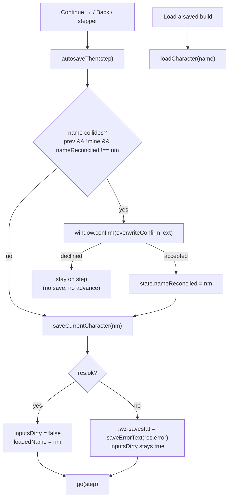

# Autosave on Continue - Plan

## Goal Capsule

**Objective.** Make `Continue →` save the build, and delete the unsaved-changes
guard rather than improve it.

**Tracked as** #452.

**Product authority.** This document, from a maintainer brainstorm on
2026-08-22. Requirements and Key Decisions here are settled unless a later plan
supersedes them in place.

**Open blockers.** None.

**Product Contract preservation:** unchanged. No R-ID was altered, added or
removed by planning.

What planning did find is an **implementation gap against R5 as already
written**. R5 scopes the collision to "an existing record that is not this
build"; `trySave` does not — it gates every save behind a native
`window.confirm` whenever *any* record carries the name, the build being edited
included. Under autosave that fires a browser modal on every `Continue →` for
any build saved even once, which is strictly worse than the dialog this plan
removes. R5 is correct as stated; the code has to be narrowed to it. KTD1 owns
that, and it is the single most important thing in this plan.

All four Outstanding Questions are resolved below. None became backlog.

**Amends an existing plan.** This reverses **KD1** of
`docs/plans/2026-08-21-002-feat-character-step-naming-and-save-placement-plan.md`,
which chose *"saving stays optional — nothing persists unless the player saves"*
and explicitly rejected *"folding saving into the forward path"*. That decision
is superseded here: saving now rides the forward path. The reversal is possible
only because that plan's **KD2** (the name is required to leave the character
step) shipped — a guaranteed name is what makes an unprompted save well-defined.
KD2, and that plan's R1-R9, are unchanged and are load-bearing for this one.

**Execution profile.** Browser-only. No pipeline, dataset, or seed change.

**Stop conditions.** Stop and surface rather than guessing if autosave cannot be
made to preserve a prior record's solved snapshot (the #429 review #1 hazard), or
if a storage failure cannot be reported without reintroducing a modal on the
forward path.

**Tail ownership.** This plan does not own the commit, PR, or deploy. `main`
deploys on push. Player-facing behavior changes, so the three build markers move
together per `AGENTS.md`.

---

## Product Contract

### Summary

`Continue →` saves the build under its stated name, with no prompt. The
unsaved-changes guard is removed from both the forward path and the load path.
The one case that can still destroy data — a name that collides with a
*different* saved build — asks once per build and is silent thereafter. `Save
progress` remains for saving without advancing.

### Problem Frame

The unsaved-changes guard fires on `Continue →` and asks a question the player
has already answered.

Its message is *"This build has never been saved."* It is not about naming — the
naming path was deleted by #431, which made the build name a fourth required
field that `canAdvance` blocks on. A player physically cannot reach the guard
with an unnamed build going forward. The guard therefore interrupts a flow where
every input it needs is already present, to ask permission for an action that
cannot fail.

Reproduced 2026-08-22 in a headless browser pass: character step filled (name,
ML cap, race, armor), `Continue →` pressed, `#wz-unsaved` intercepts pointer
events and blocks the step change until dismissed.

The guard's cost is not only the click. It trains the player to dismiss a dialog
on the forward path, which is the same reflex that makes a genuinely destructive
prompt ineffective later. And it makes the app's central promise — *"Everything
stays in your browser"* — conditional on the player having pressed the right
button, when the storage is already local, already free, and already keyed by a
name the player was required to supply.

### Key Decisions

- KD1. **Continue saves.** Pressing `Continue →` on any step writes the build
  under its stated name, without a prompt. *(session-settled: user-directed —
  chosen over de-conflicting the guard's wording and over showing it only on the
  first Continue: both keep an interruption on the forward path, which is what
  the report is about.)*

- KD2. **The guard is deleted, not narrowed.** Both the forward path and the
  load path lose it. Loading another build is non-destructive once the current
  one is already saved, so the `isLoad` branch has no remaining hazard to
  guard. *(session-settled: derived from KD1 — a guard whose precondition can no
  longer occur is dead code, and dead UI code is worse than dead logic because
  it can still be reached by a state nobody predicted.)*

- KD3. **A name collision warns once per build, then never again.**
  `CharacterStore.saveCharacter` replaces by name. Where the typed name matches a
  *different* existing record, the first Continue asks; the player's answer is
  remembered for that build and subsequent Continues are silent. *(session-settled:
  user-directed — chosen over silent overwrite, auto-suffixing, and a
  required-field-style block at the name input. Silent overwrite destroys a build
  with no undo; auto-suffixing accumulates near-duplicates the player never
  agreed to; blocking at the field re-adds a gate to the step #431 just
  finished gating.)*

- KD4. **Autosave must not silently destroy a solved snapshot.** #429 review #1
  established that saving an in-progress build over a solved record's name
  destroyed that record's loadout, query and build stamp, and the existing code
  preserves the prior snapshot when the live run does not belong to the name
  being written. Autosave runs that path far more often than a manual save did,
  so the preservation becomes load-bearing rather than incidental.

- KD5. **The storage disclosure must stop implying an opt-in.** The rail
  currently reads *"Saved in this browser only — no account, and cleared if you
  clear browser data."* That sentence is true under autosave, but it sits beside
  a `Save progress` button and reads as describing what that button does. Under
  KD1 every build persists whether or not the player pressed anything, and the
  copy has to say so.

### Requirements

**Saving**

- R1. Pressing `Continue →` on any wizard step saves the build under its stated
  name. No dialog appears on the forward path.
- R2. `Save progress` remains available on every step, for saving without
  advancing.
- R3. A save triggered by Continue is indistinguishable in the stored record from
  one triggered by `Save progress`. There is no "autosaved" flavor of record.
- R4. Autosave preserves a prior record's solved snapshot, query and build stamp
  where the live run does not belong to the name being written (KD4).

**Collision**

- R5. Where the stated name matches an existing record that is not this build,
  the first `Continue →` asks the player to overwrite or rename, and states which
  of the two records carries a solved loadout.
- R6. The player's answer is remembered for the duration of that build. A second
  Continue on a reconciled name does not re-ask.
- R7. R6 survives a step change and a re-solve. It does not need to survive a
  page reload — a reload re-establishes the same facts and asking once more is
  correct rather than annoying.

**Removal**

- R8. The unsaved-changes guard is removed from the forward path.
- R9. The unsaved-changes guard is removed from the load path.
- R10. No path remains that can render `#wz-unsaved`. The element and its
  handlers are deleted rather than left unreachable.

**Failure**

- R11. A save that fails — storage quota, a disabled store, a serialization
  error — is reported to the player and does not block the step change. The
  build advances; the player is told it is unsaved and why.
- R12. R11's report is not a modal. Reintroducing a blocking dialog on the
  forward path would restore the defect this plan removes, in a rarer case.

**Disclosure**

- R13. The rail's storage sentence states that builds save automatically, so no
  player believes their work is unsaved when it is, or saved when it is not.

### Acceptance Examples

1. **The reported case.** Fill the character step, press `Continue →`. The step
   advances immediately. The rail shows the build under `Saved builds`.
2. **Collision, first time.** A saved build named `Barbarian` exists and carries a
   loadout. Start a new build, name it `Barbarian`, press `Continue →`. The app
   asks, naming which record holds a solved loadout.
3. **Collision, second time.** Answer "overwrite" in (2), advance, step back,
   press `Continue →` again. Nothing is asked.
4. **Load is safe.** With unsaved edits on build A, load build B from the rail. No
   guard appears, and A is intact when reloaded.
5. **Storage failure.** With storage unavailable, press `Continue →`. The step
   advances and a non-blocking notice says the build could not be saved.

---

## Outstanding Questions — resolved

All four are answered by measurement. None is deferred; none is backlog.

1. **Where does R11's non-modal report render?** — In the step's own action bar,
   reusing the `.wz-savestat` idiom the guard already carries
   (`<span class="wz-savestat" aria-live="polite">`). It is already the repo's
   answer to "say a save outcome without stealing focus", already polite-live for
   screen readers, and it sits beside `Continue →` where the press happened. No
   new surface.

2. **Does R6's "remembered" live in `state` or in the record?** — `state`. R7
   explicitly does not require surviving a reload, and a record field would
   persist a UI acknowledgement into a shared/exported build where it means
   nothing. `state.nameReconciled` (the reconciled name string, or null).

3. **Does autosave fire on `Back` as well as `Continue`?** — Yes, and it comes
   free. Both directions funnel through `guardOr({ kind: "step", value: step })`
   at `web/wizard.js:4018`; the seam is direction-agnostic, so excluding Back
   would cost an extra branch and leave one forward-path reflex behaving
   differently from the other. Also covers the stepper rail.

4. **Does `Save progress` need a new label?** — No. It still names exactly what
   it does: save without advancing. Renaming it to something like "Save now"
   would imply the autosave is deferred or unreliable, which it is not. KD5's
   copy change is on the rail's storage sentence, not the button.

---

## Planning Contract

### Key Technical Decisions

**KTD1 — `trySave`'s native `window.confirm` is the thing that makes or breaks this plan.**

`trySave` (`web/wizard.js:3686`) is documented as "the one save transaction",
deliberately so — both saving surfaces route through it precisely so an overwrite
confirm "cannot be enforced on one and skipped on the other". Its gate is:

```js
const prev = nm ? CharacterStore.loadCharacter(nm) : null;
if (prev) { if (!window.confirm(overwriteConfirmText(...))) return null; }
```

`prev` is truthy whenever *any* record carries the name — **including the build
currently being edited**. Re-saving your own build is the overwhelmingly common
case under autosave, so wiring `Continue →` into `trySave` unchanged would fire a
native browser modal on every step change of every build saved even once. That is
categorically worse than the dialog this plan exists to remove, and it would look
like the plan failed rather than like the gate was mis-scoped.

The gate narrows to a genuine collision:

```js
const mine = nm === state.loadedName;
const collides = !!prev && !mine && state.nameReconciled !== nm;
```

Three properties, each load-bearing:

- `!mine` — re-saving the loaded build is not an overwrite of someone else's work.
- `state.nameReconciled !== nm` — R6's warn-once. Set on an accepted confirm.
- `prev` still consulted first, so the no-record case never constructs a message.

`overwriteConfirmText` itself is unchanged. Its three wordings already
distinguish "no loadout", "replacing a loadout" and "keeping a loadout", which is
exactly what R5's "states which of the two records carries a solved loadout"
asks for. Rewording it would be scope this plan did not ask for and would drift
from the `Save progress` path that shares it.

**KTD2 — The seam is `guardOr`, and it has exactly two call sites.**

`guardOr` (`web/wizard.js:4031`) is the whole guard surface:

| Site | Call | Becomes |
|---|---|---|
| `web/wizard.js:4018` | `guardOr({ kind: "step", value: step })` | autosave, then `go(step)` unconditionally |
| `web/wizard.js:4026` | `guardOr({ kind: "load", value: name })` | `loadCharacter(name)` unconditionally |

Two sites is what makes R10 ("no path remains that can render `#wz-unsaved`")
provable rather than aspirational: delete `guardOr`, `resumePending`,
`unsavedGuardMessage`, `closeUnsavedGuard`, the modal builder at `:4054-4090` and
its three button handlers, and there is no remaining producer. `state.unsavedPrompt`
goes with them.

**KTD3 — `inputsDirty` survives, with a changed job.**

The flag currently gates the guard (`unsavedGuardMessage` returns `null` when it
is false). After KTD2 nothing reads it for that. It stays, because
`saveCurrentCharacter` clears it **only on success** (`web/wizard.js:3395`, whose
comment already says "a quota failure leaves the work unsaved and still at
risk"). That is precisely R11's semantics, already implemented: a failed autosave
leaves the flag raised, so the next `Continue →` retries rather than assuming the
work is safe.

Do not repurpose it into an "autosave needed" optimisation that skips the write
when clean. A clean flag means the last write succeeded, not that the record
matches the current step — and the step itself is part of what is saved
(`stepOnLoad` / `savedStep`).

**KTD4 — `saveErrorText` already has every string R11 needs.**

`web/wizard.js:3700` maps `no-name` → "Name this build first.", `quota` →
"Storage full — remove some saves.", and everything else → "Could not save."
`writeAll` (`web/persist.js:281`) is the only producer and emits exactly
`no-storage` / `quota` / `write`. R11 needs a *surface*, not new wording.

One consequence to keep: `no-name` becomes unreachable from the forward path,
because `canAdvance` blocks a nameless build before autosave is reached. It stays
in the map for the `Save progress` button, whose own doc-comment (`#431 U4`)
already records that the button is where that error is reachable and the guard is
not.

**KTD5 — Storage now grows on every step change, not every deliberate save.**

Each record carries a full denormalised snapshot (`serializeCharacter` writes
whole item objects so a restored build renders without the live catalog). Autosave
does not multiply records — the store is keyed by name and replaces in place — so
the growth is in write *frequency*, not record count. `quota` was already a
modelled failure with a player-facing string; this raises how often it can be hit,
which is why R11 is a requirement rather than a nicety.

### Patterns to Follow

| Concern | Follow |
|---|---|
| Deleting a UI affordance and its state | `#431`'s removal of the guard's naming path — the request was deleted, not improved, and the plan said so in its Summary |
| A save outcome shown without stealing focus | The existing `.wz-savestat` span, `aria-live="polite"` |
| Editing a comment this change invalidates | `docs/solutions/conventions/edit-the-stale-comment-instead-of-stacking-a-new-one-above-it.md` — the `#428 U5 (KTD3)` comments on `inputsDirty` describe a guard that no longer exists |
| Asserting DOM behaviour with no DOM | `tests/wizard.test.js:1029` — source-text assertions; name the exact string pinned |
| Proving a new test fails first | `docs/solutions/conventions/prove-a-test-fails-against-the-pre-change-tree.md` — export the base commit, copy the gitignored dataset in first |

### Risks & Dependencies

- **R-a — A native `confirm` on every Continue.** The failure mode KTD1 exists to
  prevent. It is not caught by the suite (no DOM), so U2's assertions are
  source-text and the browser pass in the Definition of Done is the behavioural
  proof. Treat any confirm on a second Continue as a release blocker.
- **R-b — Deleting `unsavedGuardMessage` breaks its unit tests.** It is exported
  and directly tested. Those tests are removed with it, which means the suite gets
  *smaller* — record the count change in the PR so a shrinking suite is not read
  as an accident.
- **R-c — Autosave writes on a step change that a solve has not validated.** A
  half-configured build now persists. This is intended (R3: no "autosaved"
  flavour) and already supported — `#428 U4 (R15)` removed the solved-run gate on
  saving for exactly this reason.
- **R-d — `state.loadedName` must be set by autosave.** `trySave` sets it on
  success; if autosave bypasses `trySave` it must do the same, or the second
  Continue sees `mine === false` and warns on the build it just wrote. This is the
  most likely way to reintroduce R-a.
- **R-e — Backup import.** `sanitizeCharacter`'s allowlist (hardened by `#420` to
  refuse rather than silently reduce) must not see a new record field. KTD2's
  `state.nameReconciled` lives in `state`, never in the record, so nothing new
  reaches the allowlist — this is a reason for OQ2's answer, not a coincidence.

---

## High-Level Technical Design



The one asymmetry worth reading twice: a **declined collision** is the only path
that does not advance, and it is not the guard returning under another name — it
is the player choosing to go rename the build. A **failed save** always advances,
per R11/R12.

---

## Implementation Units

### U1. Autosave on the forward path

- **Goal:** `Continue →`, `Back` and the stepper save the build before moving.
- **Requirements:** R1, R3, R4
- **Dependencies:** none
- **Files:**
  - Modify: `web/wizard.js` (the `kind: "step"` call site at `:4018`)
  - Test: `tests/wizard.test.js`
- **Approach:** Replace the `guardOr` step call with an `autosaveThen(step)` that
  saves and then calls `go(step)`. Reuse `saveCurrentCharacter` unchanged, so R3
  and R4 hold by construction — the record shape, the `runBelongsTo` stamp logic
  and the `#429 review #1` snapshot preservation are all inherited rather than
  reimplemented.
- **Execution note:** Do **not** route through `trySave` yet. It still carries the
  unnarrowed confirm; wiring it here before U2 is exactly R-a. Land U1 with the
  collision case explicitly out of scope, then narrow in U2.
- **Test scenarios:**
  - Covers AE1. A step change writes a record under the stated name.
  - The written record is byte-identical to one produced by `Save progress` from
    the same state (R3).
  - A step change on a build whose live run does not belong to the name preserves
    the prior record's `snapshot`, `query` and `stampedBuildId` (R4, KD4).
  - `Back` writes a record too (OQ3).
- **Verification:** `tests/wizard.test.js` and `tests/persist.test.js` green; each
  new test proven red against the pre-change tree.

### U2. Narrow the collision gate and remember the answer

- **Goal:** A genuine collision asks once; re-saving your own build never asks.
- **Requirements:** R5, R6, R7
- **Dependencies:** U1
- **Files:**
  - Modify: `web/wizard.js` (`trySave` at `:3686`; `state` init at `:1717`)
  - Test: `tests/wizard.test.js`
- **Approach:** Introduce the KTD1 predicate. Add `state.nameReconciled`,
  initialised `null` beside `inputsDirty` at `:1717`, set to `nm` on an accepted
  confirm, and cleared on load (beside the existing `state.inputsDirty = false` in
  `loadCharacter`) so a freshly loaded build starts unreconciled.
- **Execution note:** The predicate is the plan's highest-risk line. Extract it as
  a named pure helper (`nameCollides(state, nm, prev)`) exported for test, in the
  `unsavedGuardMessage` / `overwriteConfirmText` idiom — those are pure and
  unit-tested precisely because wording and gating must be testable without a
  dialog. A predicate buried inside `trySave` is only reachable by source-text
  assertion.
- **Test scenarios:**
  - Covers AE2. A name matching a different record collides.
  - Covers AE3. The same name after reconciliation does not collide.
  - Re-saving the loaded build never collides, at any step, however many times
    (R-a's direct guard).
  - A name matching no record never collides.
  - Loading a build clears `nameReconciled` (R7's reload-equivalent boundary).
  - `overwriteConfirmText` output is unchanged for all three of its branches — a
    regression guard, exempt from the red-proof gate.
- **Verification:** `tests/wizard.test.js` green; the collision predicate's five
  arms each proven red.

### U3. Delete the guard

- **Goal:** No path can render `#wz-unsaved`.
- **Requirements:** R8, R9, R10
- **Dependencies:** U1, U2
- **Files:**
  - Modify: `web/wizard.js` (`guardOr` `:4031`, `resumePending` `:4038`,
    `unsavedGuardMessage` `:211`, the modal builder `:4054-4090`, the three
    handlers `:4098-4114`, the load call site `:4026`, the export list `:1626`)
  - Modify: `web/styles.css` (`.wz-modal` rules, if `#wz-unsaved` is the only user)
  - Test: `tests/wizard.test.js`
- **Approach:** Delete rather than disable. Remove `unsavedGuardMessage` from the
  module export list and delete its tests with it.
- **Execution note:** Check whether `.wz-modal` has other users before removing
  the CSS — the overwrite path uses native `confirm`, not this class, but the
  selector may be shared. Leaving orphaned CSS is the smaller error; removing a
  live rule is not.
- **Test scenarios:**
  - `web/wizard.js` source contains no `wz-unsaved` string (R10, source-text).
  - Loading a build with dirty inputs calls `loadCharacter` directly (R9).
  - `unsavedGuardMessage` is no longer exported.
- **Verification:** Full JS suite green file by file. The suite shrinks; record by
  how many tests in the PR body (R-b).

### U4. Report a failed autosave without blocking

- **Goal:** A save that fails is visible and does not stop the step change.
- **Requirements:** R11, R12
- **Dependencies:** U1
- **Files:**
  - Modify: `web/wizard.js` (`autosaveThen`; the step action bar renderer)
  - Test: `tests/wizard.test.js`
- **Approach:** On `res.ok === false`, write `saveErrorText(res.error)` into the
  step's `.wz-savestat` span and advance anyway. No new strings (KTD4).
- **Execution note:** `saveCurrentCharacter` already leaves `inputsDirty` raised on
  failure (KTD3). Do not clear it in the error branch — the next Continue must
  retry.
- **Test scenarios:**
  - A `quota` result yields "Storage full — remove some saves." and the step still
    advances (R11, R12).
  - A `write` result yields "Could not save." and the step still advances.
  - A failed autosave leaves `inputsDirty` true.
  - No code path in the failure branch constructs a modal (source-text, R12).
- **Verification:** Injected failing storage in the persist test harness.

### U5. Correct the storage disclosure

- **Goal:** The rail stops implying saving is something the player opts into.
- **Requirements:** R13
- **Dependencies:** U1
- **Files:**
  - Modify: `web/wizard.js` (`railModel` / rail copy)
  - Test: `tests/wizard.test.js`
- **Approach:** Reword the rail's storage sentence to state that builds save
  automatically and stay in this browser only.
- **Execution note:** The sentence carries two facts — *automatic* and *local
  only*. The second is the app's privacy promise and appears in `README.md` and on
  the Share tab; do not weaken it while adding the first.
- **Test scenarios:** The rail's storage sentence names automatic saving; it still
  names browser-local storage.
- **Verification:** Source-text assertion; browser pass confirms it reads correctly
  beside the saved-build list.

### U6. Build stamp

- **Goal:** The three markers agree.
- **Requirements:** none (repo convention)
- **Dependencies:** U1-U5
- **Files:** `web/index.html` (`?v=`), `web/app.js` (`BUILD`), `README.md`
- **Approach:** Bump all three together. `tests/test_build_stamp.py` fails the
  build when they disagree.

---

## Verification Contract

| Gate | Command | Applies to |
|---|---|---|
| Python suite | `python3 tests/run_tests.py` | U6 |
| JS suite, file by file | `for t in tests/*.test.js; do node "$t" \|\| echo "FAILED $t"; done` | every unit |
| New-test proof | each new test run against the pre-change tree and observed red | U1, U2, U3, U4, U5 — except the `overwriteConfirmText` regression guard named in U2 |
| Live browser pass | real solve on a local server | U1, U2, U4, U5 |

**The JS suite has no DOM.** `tests/wizard.test.js:1029` states outright that DOM
behaviour is asserted against source text. Every scenario above that reads as a
live-DOM assertion — no modal renders, the savestat span receives the string — is
a source-text assertion naming the specific string it pins. **The behavioural
proof that no `confirm` fires on a repeat Continue is the browser pass, not the
suite.**

**Run the JS tests file by file.** `node a.js b.js` executes only the first and
has silently skipped the golden solver check before. Verify by exit code.

---

## Definition of Done

- All thirteen requirements met; all five acceptance examples demonstrated.
- Full Python and JS suites green, verified by exit code.
- Every new test proven red against the pre-change tree, except the one U2
  regression guard explicitly exempted.
- `grep -c wz-unsaved web/wizard.js` returns 0 (R10).
- A live browser pass covering: a first Continue on a new build writing a record
  with no dialog; a **second and third** Continue on that same build with **no
  `window.confirm` at any point** (R-a); a genuine collision asking once and not
  again after reconciliation; a declined collision staying on the step; loading
  another build with dirty inputs showing no guard and leaving the first build
  intact; a simulated quota failure advancing the step with the error visible.
- Comments describing the deleted guard edited or removed, not left stale —
  specifically the `#428 U5 (KTD3)` notes on `inputsDirty` at `web/wizard.js:3393`
  and in `loadCharacter`.
- The net test-count change recorded in the PR body (R-b).
- `Closes #452` in the PR body.
- Build stamp bumped in all three places.

---

## Sources & Research

- `web/wizard.js:3686` — `trySave`, "the one save transaction"; the unnarrowed
  `window.confirm` that KTD1 exists to fix.
- `web/wizard.js:4018`, `:4026`, `:4031` — the two `guardOr` call sites and the
  gate itself.
- `web/wizard.js:3357-3396` — `saveCurrentCharacter`, including the `#429 review #1`
  snapshot preservation (R4) and the success-only `inputsDirty` clear (KTD3).
- `web/wizard.js:3700` — `saveErrorText`; the three strings R11 needs.
- `web/persist.js:281-297` — `writeAll` / `saveCharacter`; the only producer of
  `no-storage` / `quota` / `write`, and the replace-by-name behaviour KD3 responds to.
- `docs/plans/2026-08-21-002-...` — KD1 (reversed here), KD2 (load-bearing here).
- Headless reproduction, 2026-08-22, build `08222026.3`: the guard fires on
  `Continue →` with every required field filled.
