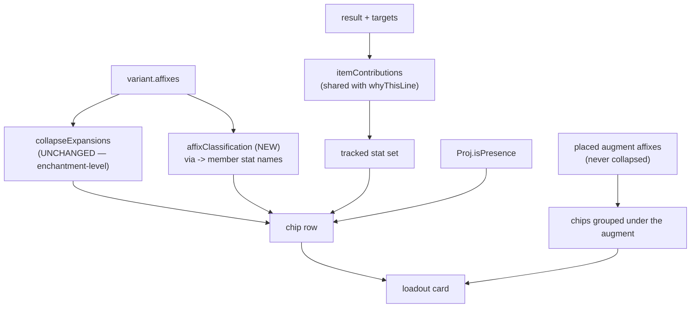

# Loadout Stat Chips and Notice Actions - Plan

## Goal Capsule

**Objective.** Make every stat on a loadout card readable at a glance in one
visual language, say which of them the solve was actually steering toward, and
make the notices panel's resolution controls do something visible when pressed.

**Tracked as** #453.

**Product authority.** This document, from a maintainer brainstorm on
2026-08-22 following a live pass over build `08222026.3`.

**Open blockers.** None.

**Follows #449.** Every item here is downstream of the results-phase UI clarity
work. #449's own Definition of Done requires a live browser pass that was never
performed; this brainstorm is part of that pass, and two of the three findings
are defects in what #449 shipped rather than new scope. #449 stays open on its
remaining checklist.

**Product Contract preservation.** Unchanged by planning — no R-ID here was
altered, added or removed. R9's cap is now a **measured** number rather than an
open question (KTD4); the requirement's wording already anticipated that.

This plan still changes **R31** of #449, which retained the three-contribution
chip cap to govern row height at phone width. R31's *intent* is preserved and
restated as R9 — the cap on what is displayed at rest survives; what changes is
that the overflow is reachable rather than discarded. No other #449 requirement
is altered.

Planning did find that **R7 is not satisfiable as the code stands**:
`collapseExpansions` deliberately discards the member stat names that
classification needs. The requirement is right; the data has to be carried. KTD1
owns it, and the repo has solved this exact shape once already.

All four Outstanding Questions are resolved below. None became backlog.

**Execution profile.** Browser-only. No pipeline, dataset, or seed change.

**Stop conditions.** Stop and surface rather than guessing if "incidental" and
"tracked" cannot be distinguished for a given contribution without a second
source of truth, or if the utility class cannot be derived from the existing
presence/utility model.

**Tail ownership.** This plan does not own the commit, PR, or deploy. Player-facing
behavior changes, so the three build markers move together per `AGENTS.md`.

---

## Product Contract

### Summary

Every stat an equipped item grants becomes a chip, replacing the plain-text affix
run. Three visual classes distinguish a stat the solve is ranking, a stat that
merely comes with the item, and a utility effect. Augment-granted stats stay
grouped beneath the augment that grants them. Separately, the notices panel's
`Adjust & re-solve →` control opens the panel it scrolls to, which it does not
do today.

### Problem Frame

**The card speaks two languages.** #449 U7 turned an item's *ranked* contributions
into a chip row — value, stat, and qualifiers on a sub-label — and it reads well.
Everything else on the same card stayed a comma-run of plain text
(`Armor Class +58 Armor · Enhancement Bonus (Armor) +15 · Accuracy +24
Competence`), and augment-granted stats sit inline beside the augment name in a
third style again. So the card renders the same kind of fact three ways, and the
one styling that means something — *this is what the solve was steering toward* —
is not visually separated from the two that do not.

The player's read of a loadout card is "what am I getting, and which of it did I
ask for." The card currently answers the first question three times in three
voices and the second only if you already know that the chips are the ranked ones.

**A third class is missing entirely.** Utility effects — Ghostly, True Seeing,
Freedom of Movement — are tracked as presence rather than magnitude and fill
slots after the ranked stats are locked. They are neither a ranked contribution
nor an incidental affix; they are the reason an item was chosen once the ranked
stats stopped separating candidates. Nothing on the card says so.

**The notice control is inert.** `jumpFromNotice` scrolls `#wz-adjust-slot` into
view and calls `.focus()` on it. `#wz-adjust-slot` is the wrapper div; the panel
is `<details id="wz-adjust">`, documented in its own emitter as *"Collapsed by
default."* The jump never sets `open`, and the wrapper is not focusable, so the
focus call is a no-op. Pressing the control scrolls the page a little and does
nothing else — which is what was reported.

Three notices route to that anchor, so one defect presents three times, including
on a control labelled `Re-solve now`.

**What is not broken.** The brainstorm also asked for a progress indicator on
notice-button actions. There is one, and it already fires: all four `Re-solve ⚡`
controls call `solve()`, which raises the full-screen overlay and — per #218 —
awaits `yieldToPaint()` before the synchronous MILP blocks the main thread,
specifically so the overlay renders on a re-solve where HiGHS is already cached.
The perceived absence was the inert jump above: the player pressed a control,
nothing happened, and read that as missing feedback. Recorded here so it is not
re-investigated; no requirement follows from it.

### Key Decisions

- KD1. **Chips replace the text run; they do not join it.** Every stat an item
  grants renders as a chip. *(session-settled: user-directed — chosen over
  chipping only ranked and utility stats and leaving incidental ones as text:
  that preserves exactly the two-languages problem the report is about.)*

- KD2. **Three classes, three treatments.** *Tracked* (a contribution to a ranked
  priority), *incidental* (a real affix advancing nothing the player ranked), and
  *utility*. The tracked class carries the vivid treatment; incidental is muted;
  utility is visually distinct from both rather than a shade between them.
  *(session-settled: user-directed.)*

- KD3. **Augment-granted stats stay grouped under their augment.** They render as
  chips in the same three classes, nested beneath the augment that grants them,
  rather than merged into one flat row per slot. *(session-settled: user-directed
  — chosen over a flat merged row and over a flat row with per-chip source
  markers: the loadout is a shopping list, so "which gem do I actually go slot"
  must survive; and a hover-only marker is unavailable on touch.)*

- KD4. **The rank-1 accent survives.** #449 R21 distinguishes the top-priority
  chip by a named accent token and by border treatment. Tracked chips are now a
  larger population, which makes the rank-1 distinction more useful, not less.

- KD5. **The jump opens what it scrolls to.** A control that moves the viewport
  and changes nothing else is indistinguishable from a control that failed.

- KD6. **The notice control does not itself solve.** It opens the panel and puts
  focus in it; the player presses `Re-solve ⚡`. *(session-settled: user-directed —
  chosen over having `Re-solve now` solve directly. The smaller change; the panel
  is where the adjustments are, and solving before the player has made any is a
  wasted 3.5 seconds.)* The `Re-solve now` label is corrected to match.

### Requirements

**Chips**

- R1. Every stat an equipped item grants renders as a chip. No plain-text affix
  run remains on the loadout card.
- R2. A chip whose stat is one of the player's ranked priorities is visually
  distinct from one that is not, without relying on hover or color alone.
- R3. A chip for a utility effect is visually distinct from both R2 classes.
- R4. The rank-1 contribution keeps its existing accent treatment (#449 R21).
- R5. Every qualifier #449 R20 preserved survives: the value, the stat, the bonus
  type, `(set)`, `(from <stat>)`, and the #88 player-override disclosure. In
  particular an overridden bonus type is still labelled as the player's call.
- R6. Augment-granted stats render as chips grouped beneath the augment granting
  them, in the same three classes.
- R7. The three classes are derived from the existing model — the ranked target
  list and the existing presence/utility definition — not from a new
  classification stored alongside.
- R8. A chip's class is stable between a fresh solve and a restored snapshot.

**Density**

- R9. The card's resting height at phone width does not regress from today.
  #449 R31's cap on displayed chips is preserved in effect; where an item carries
  more stats than fit, the remainder is reachable rather than discarded.
- R10. Tracked and utility chips are never the ones hidden by R9.

**Ceiling emphasis**

- R11. In the `AT CEILING` notice, each named stat is emphasized — bold, and in
  the existing at-ceiling green — while its total stays in the body treatment.
- R12. R11 reuses the token already carrying "at ceiling" green. No new color is
  minted.
- R13. Emphasis is carried by weight as well as color, so the distinction
  survives a color-vision difference or a monochrome print export.
- R14. The `AT CEILING` sentences in every export are unchanged. `projection`
  stays the single wording source; this is presentation only.

**Notice actions**

- R15. A notice control targeting the `Adjust & re-solve` panel opens that panel.
- R16. It then moves focus to the first control inside the opened panel.
- R17. A control whose anchor cannot be found still fails silently rather than
  throwing, as today.
- R18. The `stale snapshot` notice's control is labelled for what it does under
  KD6 — open the panel — not `Re-solve now`.

### Acceptance Examples

1. **Three classes on one card.** Solve with Melee Power ranked and inspect the
   armor card: `Accuracy +24 Competence` (tracked, ranked), `Enhancement Bonus
   (Armor) +15` (incidental), `Soundproof` (utility) are each visibly a different
   kind of thing.
2. **Augment provenance.** The helmet's `Seeker +4 Artifact` reads as belonging to
   `Solar Gem of Critical Confirmation (Legendary)`, not as a loose card-level
   chip.
3. **Ceiling emphasis.** A solve with two saturated priorities shows both stat
   names bold and green in the `AT CEILING` card; the totals do not change weight.
4. **The jump works.** Press `Adjust & re-solve →` on the empty-slot notice: the
   panel scrolls into view *and opens*, with focus in its first control.
5. **Phone height.** At 375px, a heavy item's card is no taller at rest than it
   is today, and its tracked and utility chips are all still visible.

---

## Outstanding Questions — resolved

All four are answered by measurement against the built dataset and the source.
None is deferred; none is backlog.

1. **What is the R9 overflow affordance, and what is the cap?** — An in-place
   `+N more` chip that expands the row, with the cap at **6**. The number is
   measured, not chosen: see KTD4. The Deep Dive is *not* the overflow — it is a
   different tab, and R9's whole point is that the fact stays on the card.

2. **Does "incidental" need a further split for tracked-but-outbid?** — No. A
   fourth class would be a claim the chip cannot support. `itemContributions`
   returns what the solve actually credited; an affix whose bucket lost to a
   larger contributor was not credited, so it is not why this item is here. The
   outbid fact is a *solve-level* one and `outbidNotice` already names it in the
   notices panel, which is the right altitude for it. Recorded as a KTD so this
   is not re-litigated (KTD3).

3. **Does R1 apply to the Deep Dive tab?** — No. Loadout tab only. The Deep Dive
   is the exhaustive per-item surface and its full affix list is deliberately
   complete rather than scannable; it already has its own `dd-chips` family for
   crafts. Chipping both would make the two tabs the same tab.

4. **Which token is "the at-ceiling green"?** — `--optimal` (`#43c59e`),
   unambiguously. `.stat-ceiling` is `color: var(--optimal); font-weight: 600`
   (`web/styles.css:497`), `.stat-reach.is-maxed` uses it (`:525-526`), and
   `.pd-chip-check` already uses it to mean "achieved" inside the chip family
   (`:431`). No new token; R12 is satisfied by reuse.

---

## Planning Contract

### Key Technical Decisions

**KTD1 — `collapseExpansions` throws away exactly what classification needs, and the repo has already solved this once.**

R7 requires the three classes be derived from the existing model. That is
currently impossible for item affixes, and the reason is deliberate.

`equippedBody` renders `collapseExpansions(v.affixes || [])`, which folds every
expansion back to the **enchantment** it came from (`web/projection.js:126`). A
universal spell focus that the solver expanded into seven school stats collapses
to one entry named for the enchantment. The collapsed entry is:

```js
{ name: via, stat: via, via, collapsed: ms.length, /* value+unit OR parts */ }
```

The member stat names are gone. So "is this affix one of the player's ranked
priorities" cannot be answered from a collapsed entry — the entry's `stat` is an
enchantment name, and the ranked targets are solver stat names. Matching them
directly would silently classify every collapsed bundle as incidental, including
ones carrying the player's rank-1 stat.

**Do not change `collapseExpansions` to retain members.** Its doc-comment is
explicit that reducing non-uniform members to one magnitude "would publish a
value the data never stated, which is the one thing this repo refuses to do", and
its output feeds `affixLabel`, the exports and the goldens.

Follow the precedent instead. `bundleGroups` (`web/projection.js:209`,
`#340 KTD5`) exists for precisely this reason and says so:

> Emits its OWN entry shape carrying the full member list — per-member stat name,
> value, and bonus type — because `collapseExpansions`' collapsed entries
> deliberately drop those and cannot back a display row.

So U1 emits a parallel **classification** shape keyed the same way
(`PROVENANCE_KEY === "via"`, `web/dataset.js:174`), carrying each collapsed
entry's member stat names. A collapsed entry is **tracked** when *any* member is
a ranked target. `collapseExpansions` is untouched, `affixLabel` output is
untouched, and no golden moves.

**KTD2 — `equippedBody` has no access to the ranked targets. `equippedRow` already does.**

Classification needs the result and the ranked list. `equippedBody(v, idx, maps,
augById, ownedMode, ownedAugments)` receives neither. Its caller does:
`equippedRow(..., prioCtx)` already carries `{ result, attr, targets }` and hands
it to `whyThisLine` two lines later (`web/results.js:452`).

So the plumbing is one added parameter, not a new data path. Thread `prioCtx`
into `equippedBody` and derive the tracked set from
`itemContributions(result, item, attr, targets)` — the same function
`whyThisLine` already uses, so the card's two surfaces cannot disagree about what
"tracked" means. Deriving it twice from two sources is the failure this decision
exists to prevent.

**KTD3 — Three classes, and the boundary is "did the solve credit it", not "is the stat ranked".**

- **tracked** — the affix's stat (or, for a collapsed entry, any member's stat)
  appears in `itemContributions` for this item.
- **utility** — `Proj.isPresence(a)` is true (`web/projection.js:76`, over
  `PRESENCE_TYPES`) and the affix is not already tracked.
- **incidental** — everything else.

Order matters: test tracked first, then utility, then fall through. A presence
affix that the player ranked explicitly is tracked, not utility — they asked for
it, so it is a reason the item is here rather than a bonus that came along.

This is deliberately *not* "the stat appears in `targets`". OQ2 records why: a
ranked stat whose bucket was outbid was not credited and is not why this item was
picked. The chip must not claim otherwise.

**KTD4 — The overflow cap is 6, measured post-collapse against the endgame band.**

Measured 2026-08-22 against `web/data/items.json` (9,110 records), grouping by
`via` exactly as `collapseExpansions` does. Two populations, because the roster
and what a level-capped solve actually equips are not the same claim:

| Population | median | mean | max |
|---|---|---|---|
| Whole roster, raw | 4 | 4.59 | 43 |
| ML 29-36 (2,668 records), raw | 5 | 5.14 | 43 |
| **ML 29-36, post-collapse** | **4** | **4.19** | **11** |

Post-collapse is the population that matters — it is what the card renders — and
the collapse is what makes a cap viable at all, taking the worst case from 43
chips to 11.

| cap | ML 29-36 records with no overflow |
|---|---|
| 4 | 50.4% |
| 5 | 76.1% |
| **6** | **92.1%** |
| 7 | 97.8% |

**6** is the knee: it leaves 92% of endgame items showing everything at rest, and
the worst case anywhere in the band hides 5 chips behind one `+5 more`.

Two honesty notes that must survive into the test:

- This is the **eligible band**, not the equipped 13. A solve equips the
  high-affix tail preferentially, so the real equipped distribution skews higher
  than this table. The cap is therefore a *display* decision validated against the
  candidate pool, and the browser pass on a real solve is what confirms R9.
- R10 constrains what may be hidden, not how many. Tracked and utility chips are
  never counted against the cap; the cap applies to incidental chips only. An item
  with 8 tracked contributions shows 8.

**KTD5 — The jump defect is two lines, and the anchor is wrong as well as the state.**

`jumpFromNotice` (`web/wizard.js:3196`):

```js
const el = document.querySelector(target.anchor);   // "#wz-adjust-slot" — the WRAPPER
el.scrollIntoView({ block: "center" });
if (typeof el.focus === "function") el.focus({ preventScroll: true });
```

The panel is `<details id="wz-adjust">`, emitted into `#wz-adjust-slot` by
`adjustPanelHTML` (`web/wizard.js:2342`) and "Collapsed by default". Two faults
compound: nothing sets `open`, and `#wz-adjust-slot` is a plain div so `.focus()`
is a no-op even though the code guards for it.

Fix both: after landing, set `open = true` on the `<details>` and move focus to
the first focusable control inside it (`#wz-radd`), not to the container. Keep the
existing "a miss scrolls nothing rather than throwing" tolerance — that comment is
correct and its reasoning (a renamed anchor must not take the results screen down)
still holds.

Note the side effect, which is desirable and already handled: `fold.ontoggle =
refreshResultsEmphasis` (`web/wizard.js:2389`) means opening the panel makes
`Save progress` yield primacy to `Re-solve ⚡`, exactly as it does when the player
opens the fold by hand (`#431 U3 KTD7/R6`). Opening it programmatically must go
through the same property so that stays true.

### Patterns to Follow

| Concern | Follow |
|---|---|
| Needing member detail `collapseExpansions` drops | `bundleGroups` (`web/projection.js:209`) — emit a parallel shape, never widen the collapse |
| Shared content between card, Deep Dive and exports | `web/projection.js` is the single content source |
| A chip family and its class names | The existing `.chip.*` and `.pd-chip*` rules in `web/styles.css:274-440` |
| A colour that also needs a non-colour carrier | #449 R21's rank-1 chip — accent token **and** border treatment |
| Editing a comment this change invalidates | `docs/solutions/conventions/edit-the-stale-comment-instead-of-stacking-a-new-one-above-it.md` |
| Asserting DOM behaviour with no DOM | `tests/results.test.js` opens "pure functions; no DOM" — source-text assertions naming the pinned string |
| Proving a new test fails first | `docs/solutions/conventions/prove-a-test-fails-against-the-pre-change-tree.md` — copy the gitignored dataset in first or the crash reads as a pass |

### Risks & Dependencies

- **R-a — Misclassifying a collapsed bundle as incidental.** The KTD1 failure
  mode, and it is silent: the card looks fine, it just under-credits the player's
  own priority. U1's test must assert a *collapsed multi-member* entry with one
  ranked member classifies tracked — a single-member fixture cannot discriminate.
- **R-b — Line-number drift.** #451 landed hours ago and moved `web/results.js`
  offsets; every citation here was re-measured against `755a153`. Later units all
  touch the same file. Locate by function name once U1 has landed.
- **R-c — Golden and export drift.** `affixLabel` and `collapseExpansions` outputs
  must not change, so exports should show **zero** diff. A diff in
  `tests/exporters.test.js` means the collapse was widened after all — treat it as
  a red flag, not something to re-ratify.
- **R-d — Card height regression.** R9 is the guard, but the cap is validated
  against the candidate band, not the equipped set (KTD4). The 375px browser pass
  on a real endgame solve is the actual proof.
- **R-e — `pd-prio` still exists.** #449's chip row is separate from the new affix
  chips and stays. Two chip families now render on one card; they must be visually
  reconciled or the card gains a fourth language while removing the third.
  U2 owns this explicitly.

---

## High-Level Technical Design



The load-bearing shape: `collapseExpansions` keeps producing display entries and
a **parallel** map answers "which stats did this entry come from". Nothing merges
the two responsibilities into one function.

---

## Implementation Units

### U1. Emit the classification shape

- **Goal:** A collapsed affix entry can be asked which stats it covers.
- **Requirements:** R7, R8
- **Dependencies:** none
- **Files:**
  - Modify: `web/projection.js` (new export beside `bundleGroups`)
  - Test: `tests/projection.test.js`
- **Approach:** Emit a map from `via` to the member stat names, built on the same
  grouping pass shape `collapseExpansions` and `bundleGroups` already use.
  A non-expansion affix passes through by identity and covers its own stat.
- **Execution note:** Follow `bundleGroups`' precedent exactly — a separate
  shape, not a widened collapse. Its doc-comment states the reason; re-read it
  before writing this.
- **Test scenarios:**
  - A uniform-magnitude collapsed entry (spell focus) reports all seven member stats.
  - A non-uniform collapsed entry (`Parrying`) reports its member stats, not its
    pre-rendered `parts` strings.
  - A native affix with no `via` reports its own stat.
  - `collapseExpansions` output is byte-identical before and after this unit — a
    regression guard, exempt from the red-proof gate.
- **Verification:** `tests/projection.test.js` green; export goldens show zero diff (R-c).

### U2. Classify and render item affix chips

- **Goal:** Every item affix is a chip in one of three classes.
- **Requirements:** R1, R2, R3, R4, R5, R7, R10
- **Dependencies:** U1
- **Files:**
  - Modify: `web/results.js` (`equippedBody`, `equippedRow` signature)
  - Modify: `web/styles.css`
  - Test: `tests/results.test.js`
- **Approach:** Thread `prioCtx` into `equippedBody` (KTD2). Replace the
  `<ul class="pd-stats"><li>` run with a chip row; each chip keeps
  `affixLabel(a)` as its text so wording does not drift. Apply the KTD3 predicate
  in order: tracked, then utility, then incidental.
- **Execution note:** R-e — `whyThisLine`'s `pd-prio` row still renders below this
  one. Decide and record how the two read together; two chip families on one card
  that look unrelated would replace the reported problem rather than fix it.
- **Test scenarios:**
  - Covers AE1. An item with a ranked affix, an unranked affix and a presence
    affix renders three chips in three classes.
  - A collapsed multi-member entry with one ranked member classifies **tracked** (R-a).
  - A presence affix the player ranked classifies tracked, not utility (KTD3 order).
  - No `pd-stats` `<li>` run remains in the rendered card (R1, source-text).
  - Each class carries a non-colour carrier as well as its colour (R2, R3).
  - An item with zero affixes renders no empty chip row.
- **Verification:** `tests/results.test.js` green; each new test proven red.

### U3. Augment chips, grouped under their augment

- **Goal:** Augment-granted stats are chips without losing which augment grants them.
- **Requirements:** R6
- **Dependencies:** U2
- **Files:**
  - Modify: `web/results.js` (`equippedBody`'s `aug-affx` branch)
  - Modify: `web/styles.css`
  - Test: `tests/results.test.js`
- **Approach:** Replace the `<span class="aug-affx">` comma-join with a chip row
  nested inside the augment's `<li>`. Same three classes, same predicate.
- **Execution note:** Augment affixes are **never collapsed** anywhere (stated in
  `bundleGroups`' doc-comment), so U1's map is not needed here — classify
  each affix directly. Do not "helpfully" collapse them for consistency; that
  would change what the player compares against the in-game tooltip.
- **Test scenarios:**
  - Covers AE2. An augment's granted stat renders as a chip inside that augment's
    list item, not at card level.
  - An augment granting a ranked stat renders it tracked.
  - An open augment slot still renders its pip and no chip row.
- **Verification:** `tests/results.test.js` green; browser pass confirms the
  nesting reads as ownership.

### U4. The overflow affordance

- **Goal:** A heavy item does not grow the card at rest.
- **Requirements:** R9, R10
- **Dependencies:** U2, U3
- **Files:**
  - Modify: `web/results.js`, `web/styles.css`
  - Test: `tests/results.test.js`
- **Approach:** Incidental chips beyond **6** collapse behind a `+N more` chip
  that expands in place. Tracked and utility chips are never counted against the
  cap and never hidden (R10).
- **Execution note:** The cap governs incidental chips only — see KTD4's second
  honesty note. An implementation that caps the total will hide tracked chips on
  exactly the items where they matter most.
- **Test scenarios:**
  - An item with 9 incidental affixes renders 6 chips and a `+3 more` control.
  - An item with 8 tracked contributions renders 8 chips and no overflow control (R10).
  - An item with exactly 6 incidental affixes renders no overflow control.
  - The hidden chips are present in the DOM, not dropped (reachable, per R9).
- **Verification:** `tests/results.test.js` green; **browser pass at 375px on a
  real endgame solve** — the actual R9 proof (R-d).

### U5. Emphasize the at-ceiling stat names

- **Goal:** The `AT CEILING` card names its stats in bold and green.
- **Requirements:** R11, R12, R13, R14
- **Dependencies:** none
- **Files:**
  - Modify: `web/results.js` (`saturationNotice`, `:842`)
  - Modify: `web/styles.css`
  - Test: `tests/results.test.js`
- **Approach:** Wrap each stat name in a span carrying `--optimal` and a bold
  weight (KTD4 of the OQ list — token settled). The total stays in body treatment.
- **Execution note:** R14 — `Proj.saturationNoticeLines` remains the single wording
  source and every export is untouched. This unit changes markup around existing
  text, never the text.
- **Test scenarios:**
  - Covers AE3. A two-stat ceiling report emphasizes both names and neither total.
  - The emphasis span carries a weight as well as a colour class (R13).
  - Export output for the same result is byte-identical (R14).
  - A single-stat report still reads "1 priority at ceiling" (existing pluralization).
- **Verification:** `tests/results.test.js` and `tests/exporters.test.js` green,
  the latter with **zero** diff.

### U6. Make the notice jump open the panel

- **Goal:** `Adjust & re-solve →` does something visible. Fixes the defect three
  notices share.
- **Requirements:** R15, R16, R17, R18
- **Dependencies:** none
- **Files:**
  - Modify: `web/wizard.js` (`jumpFromNotice`, `:3196`)
  - Modify: `web/results.js` (`NOTICE_TABLE` stale-snapshot label, `:990`)
  - Test: `tests/wizard.test.js`, `tests/results.test.js`
- **Approach:** After landing, open the `<details id="wz-adjust">` and focus
  `#wz-radd` inside it. Retarget or keep `#wz-adjust-slot` as the scroll anchor,
  but the `open` and the focus must address the panel and its first control.
  Relabel `Re-solve now` per KD6/R18.
- **Execution note:** Set `open` via the property so `ontoggle` fires and
  `refreshResultsEmphasis` runs (KTD5). Assigning the attribute without triggering
  the toggle would leave `Save progress` wrongly primary.
- **Test scenarios:**
  - The jump handler sets `open` on the details (source-text, naming the string).
  - The focus target is the panel's first control, not the wrapper.
  - A missing anchor still no-ops rather than throwing (R17, existing behaviour —
    regression guard, exempt from the red-proof gate).
  - The stale-snapshot notice's label no longer reads `Re-solve now` (R18).
- **Verification:** JS suite green; **browser pass covering all three notices**
  that route to this anchor — the behavioural proof, since the suite has no DOM.

### U7. Build stamp

- **Goal:** The three markers agree.
- **Requirements:** none (repo convention)
- **Dependencies:** U1-U6
- **Files:** `web/index.html` (`?v=`), `web/app.js` (`BUILD`), `README.md`

---

## Verification Contract

| Gate | Command | Applies to |
|---|---|---|
| Python suite | `python3 tests/run_tests.py` | U7 |
| JS suite, file by file | `for t in tests/*.test.js; do node "$t" \|\| echo "FAILED $t"; done` | every unit |
| Export goldens | `tests/exporters.test.js` — must show **zero** diff | U1, U5 |
| Solver golden | included in the JS sweep | none expected; a diff means something reached the solve |
| New-test proof | each new test run against the pre-change tree and observed red | U1-U6, except the two regression guards named in U1 and U6 |
| Live browser pass | real endgame solve on a local server | U2, U3, U4, U5, U6 |

**Export goldens are an inverse gate here.** Everywhere else in this repo a
golden diff is re-ratified deliberately; in this plan a diff in
`tests/exporters.test.js` means `collapseExpansions` or `affixLabel` was widened
after all, which KTD1 forbids. Investigate, do not accept.

**The JS suite has no DOM.** `tests/results.test.js` opens "pure functions; no
DOM". Every scenario above that reads as a live-DOM assertion — the `<details>`
opening, focus landing, the overflow expanding, chip colours — is a source-text or
CSS-text assertion naming the string it pins. The behavioural proof is the browser
pass.

**Run the JS tests file by file.** `node a.js b.js` executes only the first and
has silently skipped the golden solver check before. Verify by exit code —
`tests/browse.test.js` indents its FAIL lines, so an anchored `grep -c '^FAIL'`
reports clean on a failing run.

---

## Definition of Done

- All eighteen requirements met; all five acceptance examples demonstrated.
- Full Python and JS suites green, verified by exit code.
- Every new test proven red against the pre-change tree, except the two regression
  guards explicitly exempted (U1's collapse byte-identity, U6's missing-anchor no-op).
- **Export goldens show zero diff** (R-c). A diff is investigated as a KTD1
  violation, never re-ratified.
- A live browser pass covering: a card showing all three chip classes at once; an
  augment-granted stat reading as belonging to its augment; a heavy endgame item at
  375px with no card-height regression and no horizontal page scroll; the overflow
  control expanding in place; a two-stat `AT CEILING` card with both names bold and
  green; **all three notices** that route to `#wz-adjust-slot` opening the panel
  with focus landing inside it.
- The `pd-prio` and affix-chip families visually reconciled on one card (R-e),
  with the decision recorded in the PR body.
- Comments invalidated by U2 and U3 edited in place, not supplemented.
- `Closes #453` in the PR body. `#449` referenced — it stays open on its own
  remaining checklist.
- Build stamp bumped in all three places.

---

## Sources & Research

- `web/results.js:468-520` — `equippedBody`; the `pd-stats` run (R1) and the
  `aug-affx` comma-join (R6).
- `web/results.js:396`, `:452` — `equippedRow` and the `prioCtx` it already
  carries (KTD2).
- `web/results.js:604-664` — `whyThisLine` / `itemContributions`; the shared
  definition of "tracked" and #449's three-contribution cap.
- `web/results.js:842` — `saturationNotice`; the unstyled stat list (R11).
- `web/results.js:988-1005` — `NOTICE_TABLE`; the three rows pointing at
  `#wz-adjust-slot`.
- `web/projection.js:126` — `collapseExpansions` and its doc-comment prohibition.
- `web/projection.js:209` — `bundleGroups`, the precedent KTD1 follows; its doc-comment
  block opens at `:155` and states why a parallel shape exists.
- `web/projection.js:75-79` — `isPresenceType` / `isPresence`, the utility predicate.
- `web/dataset.js:174` — `PROVENANCE_KEY = "via"`, the key the measurement used.
- `web/wizard.js:2342`, `:2389`, `:3196` — the collapsed `<details>`, its
  `ontoggle` wiring, and the jump that never opens it.
- `web/styles.css:431`, `:497`, `:525-526` — `--optimal` as the settled
  at-ceiling green (OQ4).
- Dataset measurement, 2026-08-22, `web/data/items.json` (9,110 records), grouped
  by `via`: ML 29-36 post-collapse median 4, mean 4.19, max 11; cap 6 leaves 92.1%
  with no overflow (KTD4).
