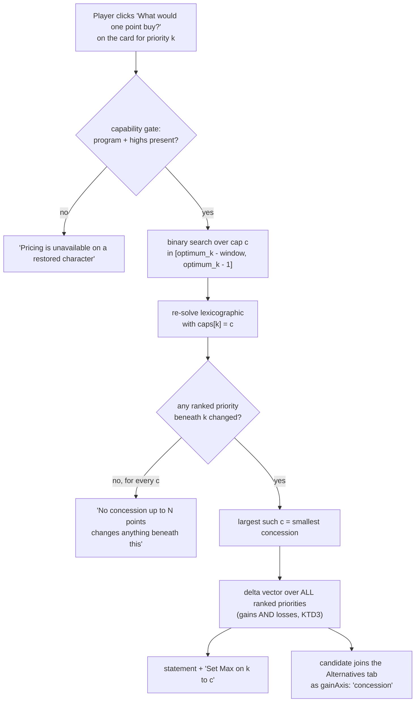

# Concession Probe - Plan

## Goal Capsule

**Objective.** For any ranked priority with priorities beneath it, answer on
request: *what is the smallest concession here that changes anything below, and
what does it change?* Then hand the player the exact input that takes the trade,
and the resulting build to inspect.

**Tracked as** #481. Closes #480 in U1.

**Product authority.** This document, from a maintainer session on 2026-08-23.

**Open blockers.** None.

**Execution profile.** Browser-only. No pipeline, dataset, or seed change.

**Stop conditions.** Stop and surface rather than guessing if the cap search
cannot be shown monotone against the exhaustive walk (U2's `linear` seam), or if
a probed build cannot be rendered through the existing alternative-card path
without changing what an existing card claims.

**Tail ownership.** This plan does not own the commit, PR, or deploy. Player-facing
behavior changes, so the three build markers move together per `AGENTS.md`.

---

## Problem Frame

Strict lexicographic priority is the product: priority 2 is maximized without
surrendering a single point of priority 1. That guarantee is deliberately not
negotiable — weighted-sum and Pareto trade-off modes are non-goals in `AGENTS.md`.

But the guarantee has a price, and the player cannot see it. A player who would
happily trade one point of Strength for fifteen of Doublestrike has no way to
learn the offer exists. Three surfaces get near it and none answers it:

| surface | what it does | why it does not answer the question |
| --- | --- | --- |
| `attributeOutbid` / "price on request" (`web/results.js`) | prices what a higher priority costs a target | fires only for a target that scored **zero**; a priority at 30 that could reach 45 gets nothing |
| `rebalance` alternatives (`web/solver.js` `generateAlternatives`) | relaxes one priority, maximizes another | reports a **non-minimal** cost (#480), capped at 6 pairs, and probes exactly one fixed give |
| per-priority **Max** cap (`web/wizard.js`) | the lever that actually takes the trade | the player must already know the breakpoint to set it |

The third row is the key one. `docs/solutions/design-patterns/lexicographic-redundancy-is-not-a-bug.md`
already ruled that the honest answer to "the solver over-invests in my top stat"
is a per-stat cap, not a solver change: capping Strength at 19 does not force
Strength to 19, it stops *valuing* it past 19, and the freed slack falls through
to the priorities below. The lever exists. What is missing is the number to put
in it.

**So the probe searches over the cap the player would actually set.** Its answer
is not a hypothetical — it is the build they get if they take the action.

---

## Product Contract

### Requirements

| ID | Requirement |
| --- | --- |
| R1 | A ranked priority with at least one ranked priority beneath it offers a concession probe. The last priority, and the Utility sentinel, do not. |
| R2 | The probe reports the **smallest** concession that changes anything beneath it — never an arbitrary point inside a tolerance window. |
| R3 | The probe reports the **whole** delta vector over ranked priorities, gains and losses alike. A lower priority that falls is stated, never omitted. |
| R4 | The probe states the exact action that takes the trade: the Max value to set on the conceded stat. |
| R5 | A probe that finds nothing says so plainly, and distinguishes "no concession inside the search window changes anything" from "the probe could not run". |
| R6 | The probe never runs on the solve path. One probe per click, with a spinner, and every terminal state replaces it. |
| R7 | A probe that finds a trade yields a selectable build, rendered through the existing alternative-card path and inspectable against the optimum. |
| R8 | A concession candidate is never dropped for being *too close* to the optimum. A single-slot swap is the common shape of a one-point concession and is the most interesting result the probe can return. |
| R9 | The lexicographic optimum is unchanged. Nothing here alters what the solve returns, only what is disclosed about it. |
| R10 | Existing rebalance cards state a minimal concession too (#480). |

### Scope Boundaries

**In scope.** The cheapest step: the largest cap that changes anything, its delta
vector, its action hint, and its build.

**Non-goals — do not file these as issues.**

- **A concession curve.** The full step function over every cap value is a
  Pareto-frontier slice presented as a menu, which is the declined mode in
  `AGENTS.md` wearing a different hat. One step is disclosure; a frontier to pick
  from is a trade-off mode.
- **Applying the cap automatically.** The probe states the number; the player
  types it. The tool never takes a trade on the player's behalf — that is the
  guarantee R9 protects.

### Deferred to Follow-Up Work

- Probing a concession on a **floor** rather than a cap (a player who lowered a
  Min might free the same slack). File if wanted; not filed now.

---

## Key Technical Decisions

### KTD1 — The concession is a cap, and the probe searches over cap values

Rejected: relaxing the stage lock by a tolerance (what `rebalance` does today).
A tolerance-relaxed lock describes a state the player has no input for — they
cannot ask the tool for "Strength within 2 of its max". A cap is an input that
already exists, so the probed build is reproducible by the player, and the
reported concession is `optimum − cap` in effective terms, which is the number
the card already shows.

This also collapses the minimality problem for the probe: searching over the cap
*is* searching over the concession, so the answer is minimal by construction. No
re-tightening stage is needed on this path.

### KTD2 — Monotone in the cap, so binary-searchable — and proven, not assumed

Lowering the cap enlarges the set of stage-optimal solutions (any solution with
raw ≥ cap attains the stage max), so every later stage's constraint set relaxes
and what is reachable beneath can only grow as the cap falls. The search for the
largest cap that changes anything is therefore a binary search.

`attributeOutbid` already established the pattern *and* the obligation: it
binary-searches its prefix boundary and carries an `opts.linear` seam that forces
the exhaustive walk **so a test can prove the two agree rather than assuming
monotonicity**. The probe carries the same seam for the same reason.

### KTD3 — The first lower priority that changes rises; ones after it may fall

Straight from `docs/solutions/design-patterns/lexicographic-descent-bounds-the-vector-not-each-stat.md`,
read in the relaxing direction. Priority *k+1* is maximized over a superset, so it
cannot fall. But *k+2* is then locked against a **different** (higher) *k+1*
value, so it genuinely can. The measured table in that document is the same
property running the other way.

This is why R3 exists. A card that showed only the gain would advertise a trade
while hiding its cost, and that document's closing warning — a player told
"turning this off can only cost you" who then sees a bigger number reads the tool
as broken — applies symmetrically here.

### KTD4 — #480's fix is an appended lexicographic stage, not a pinned post-stage

The rebalance family maximizes the traded-to priority and stops. Nothing
re-tightens the relaxed stat, so its reported value is an incidental vertex.
The fix pins the achieved gain and maximizes the traded-from stat.

That stage **changes which items are chosen**, so it is a lexicographic stage
appended to the alternative's own descent — *not* a member of the pinned
post-stage chain described under "Lexicographic solve" in `CONCEPTS.md`, whose
defining property is that it pins the loadout first and frees only the variables
its preference is about. Do not fold it into that chain, and do not add it as a
tie-break term: `docs/solutions/design-patterns/add-a-solver-preference-as-a-pinned-post-stage.md`
records what a term appended to a shared tie-break objective cost last time
(5 of 11 golden loadouts reshuffled, one equipping two more items to shed one
augment).

### KTD5 — The concession family is exempt from the K-distinctness filter

`rankAlternatives` drops any candidate within `K = 2` differing slots of the
optimum or of a kept alternative, on the reasoning that a near-identical build is
not a distinct option. That reasoning inverts for this family: a one-point
concession that swaps a single item is the *most* valuable thing the probe can
find, and the existing filter would silently discard exactly those. The family
gets `K = 1` (still deduped by build key, so the optimum itself never returns).

---

## High-Level Technical Design

The probe, end to end:

The search window is bounded so the probe stays interactive. `alternativeGive`
is the existing precedent for a tolerance that scales with the stat
(`max(2, 10%)`); the probe reuses its shape but widens it, because unlike the
rebalance path a wide window no longer inflates the reported price — KTD1 makes
the answer minimal regardless of how far the search looks.

---

## Implementation Units

### U1. Minimal concession on the rebalance family

**Goal.** Rebalance cards state the minimum concession that buys their gain.

**Requirements.** R10, R2. Closes #480.

**Dependencies.** None.

**Files.** `web/solver.js` (`generateAlternatives`, the `(b)` rebalance block;
`solveConstrained`), `tests/alternatives.test.js`.

**Approach.** After the phase-1 solve that maximizes `targets[j]`, run a second
solve with `targets[j]` pinned at what it achieved and `targets[i]` as the
objective, holding the same locks and `extra`. Prefer expressing this as an
option on `solveConstrained` (a "then re-maximize this stat" stage) over
open-coding it in the rebalance block, since U3 needs the same shape and a third
caller would make it a pattern by accident.

Per KTD4, frame it in the code comment as an appended lexicographic stage.
The rebalance block keeps `tieBreak: false` — the added stage is not a tie-break
and does not restore one, so the load-bearing report guards
(`docs/solutions/design-patterns/every-solver-family-report-needs-a-load-bearing-guard.md`)
still carry the same weight on this path.

**Patterns to follow.** `solveConstrained`'s existing phase-2 pin
(`locks2 = [...locks, { stat: objectiveStat, value: gainVal }]`) is the pin
mechanic; the new stage differs only in what it then optimizes.

**Test scenarios.**

- *Covers R10.* Three same-slot variants — `A: Str 20 / Dbl 0`, `B: Str 18 /
  Dbl 50`, `C: Str 19 / Dbl 50` — with priorities `Strength > Doublestrike`. The
  optimum picks A. The rebalance candidate must return **Strength 19** (variant C),
  not merely "some Strength ≥ 18". This is the repro on #480 and fails against the
  pre-change tree.
- The re-maximize stage never lowers the gain: assert the candidate's
  `Doublestrike` still equals the phase-1 maximum.
- A pair with no slack (only one build attains the gain) is unchanged by the new
  stage — same chosen set before and after.
- The utility count lock still rides: a rebalance candidate under a ranked
  Utility tier does not shed a `mustKeep` effect through the added stage.

**Verification.** The #480 repro asserts 19; `./scripts/run_js_tests.sh` is green;
the golden solver check is unchanged (the optimum path does not run this code).

---

### U2. `probeConcession` — the cap search

**Goal.** One function that answers "what is the smallest cap on this stat that
changes anything beneath it, and what changes?", or `null`.

**Requirements.** R1, R2, R3, R5, R9.

**Dependencies.** None (independent of U1; U3 consumes both).

**Files.** `web/solver.js`, `tests/solver.test.js`.

**Approach.** Signature mirrors `attributeOutbid`:
`probeConcession(model, program, highs, stat, targetList, perTarget, opts)`.

- Refuse the Utility sentinel and any stat with no ranked priority beneath it
  (R1) — return `null`, do not guess.
- Search cap values in `[optimum − window, optimum − 1]` for the **largest** cap
  at which any ranked priority beneath `stat` differs from `perTarget`. Monotone
  per KTD2, so binary search; `opts.linear` forces the exhaustive walk.
- Each probe is a re-solve with the stat's cap applied. Reuse the existing cap
  channel (`program.cappedStats` / the model's cap map) rather than inventing a
  second clamping path — one concept under one name.
- Return the **whole** delta vector over ranked priorities (R3), the cap, the
  concession (`optimum − cap`, in effective terms so it matches what the card
  shows), and the solution.
- Return `null` when no cap in the window changes anything. The caller
  distinguishes that from an unavailable probe (R5) — `null` here means
  *searched and found nothing*, and the two wordings must not blur, exactly as
  `attributeOutbid`'s "could not isolate" is kept distinct from "not outbid".

**Execution note.** Write the monotonicity test before the binary search — if
`linear` and binary can disagree, the search is what is wrong, and a
search-first implementation will make the test look like the problem.

**Test scenarios.**

- *Covers R2, KTD2.* On a model with a known step at 3 points, `linear` and
  binary agree on the boundary and both return the largest cap that changes
  anything. Assert on a model where the step is **not** at the window edge, so a
  search that always returns the widest cap cannot pass.
- *Covers R3, KTD3.* Priorities `A > B > C` where conceding on A raises B and
  **lowers** C. The returned delta vector carries both. A result carrying only
  the gain fails.
- *Covers R1.* The last ranked priority returns `null`. The Utility sentinel
  returns `null` and is never passed to the cap channel.
- *Covers R5.* A model where nothing beneath can move at any cap returns `null`,
  and the probe is not confused with an infeasible solve.
- *Covers R9.* The optimum passed in is not mutated — assert `program.cappedStats`
  and `perTarget` are unchanged after the probe runs, since the search applies
  caps repeatedly and a leaked cap would silently re-rank every later solve.
- A stat the player already capped: the search stays below the existing cap and
  reports a concession relative to the achieved value, not the raw.

**Verification.** Both search modes agree across the fixtures; no fixture leaks a
cap; `tests/solver.test.js` green.

---

### U3. The concession family in `generateAlternatives`

**Goal.** A probed concession becomes a candidate the existing alternatives
pipeline can analyze, rank, and render.

**Requirements.** R7, R8, R3.

**Dependencies.** U1, U2.

**Files.** `web/solver.js` (`generateAlternatives`), `web/alternatives.js`
(`analyzeAlternative`, `rankAlternatives`), `tests/alternatives.test.js`.

**Approach.** *Revised during implementation:* there is no `(d)` generator inside
`generateAlternatives`. Two reasons, both discovered by writing it. `probeConcession`
is async (it re-runs the lexicographic descent) while `generateAlternatives` is
synchronous, so a family there would have made the whole bulk generator async and
every caller with it. And each probe is a full descent, so probing every eligible
priority on the tab's "Run analysis" button would have made the tab pay for
questions the player never asked. Concession candidates therefore enter the ranked
list **only through the per-priority probe** (U4/U5) — which is also the surface the
player asked the question from. The `alternatives.js` work below is unchanged and is
what makes those candidates renderable.

In `alternatives.js`:

- `gainText` gets a `concession` branch naming the gain and the price together.
- `typeOrder` gets a `concession` entry. Place it beside `rebalance` — they are
  the same kind of trade told from opposite ends, and separating them would put
  two descriptions of one move in different parts of the list.
- Per KTD5, the family uses `K = 1` in `rankAlternatives` rather than the shared
  `K = 2`. Thread this as a per-candidate minimum-distinctness rather than a
  global `opts.k` change, which would loosen the filter for every other family.

Cost and gain rows need no new code — `analyzeAlternative` already diffs
`sol.effective` against `optimum.effective` over `query.targets`, so R3's losses
land in `altCostSection` for free. Confirm this rather than assume it.

**Test scenarios.**

- *Covers R8, KTD5.* A concession candidate differing from the optimum in
  exactly **one** slot survives `rankAlternatives`. Assert it is dropped when the
  family is given `K = 2`, so the exemption is proven load-bearing rather than
  incidental.
- *Covers R3.* A concession whose delta vector contains a loss renders that loss
  in the cost rows and is never described as costing only the conceded stat.
- The candidate's `costText` names the conceded stat with its minimal
  concession — the same number `probeConcession` returned, not a re-derived one.
- The generator skips the last ranked priority and the Utility sentinel, and
  stays inside its solve budget on an eight-priority query.
- Dedupe: a concession candidate identical to a rebalance candidate by build key
  is kept once.

**Verification.** Cards render for a concession candidate through
`renderAltCards` unchanged; existing alternatives tests stay green.

---

### U4. The per-priority entry point

**Goal.** The question is askable from the priority it is about.

**Requirements.** R1, R4, R5, R6.

**Dependencies.** U2.

**Files.** `web/results.js` (the ranked stat-card render and its handler block),
`web/styles.css`, `tests/results.test.js`.

**Approach.** Mirror the `.outbid-price` handler end to end — it is the same
interaction with a different probe behind it:

- Render the control on each ranked stat card that has a ranked priority beneath
  it (R1), never on the last card and never on the Utility card.
- Capability gate before rendering, in the shape of `canPriceOutbid()`: a
  restored character carries `highs: null` and no `program`, and the control must
  be withheld rather than offered and then failing.
- On click: disable, show a pending label, `setTimeout(0)` so it paints before
  the synchronous probe, then replace the control with the result (R6).
- Result wording carries the delta vector *and* the action (R4): the gain, any
  loss, and the Max value to set on this stat.
- Three terminal states, kept distinct (R5): a priced concession; "no concession
  up to N points changes anything beneath this"; and a caught failure that says
  the probe did not run. Log the caught error — a swallowed failure is
  indistinguishable from a genuine "nothing found", which is the one thing this
  must not blur.

**Test scenarios.**

- The control renders on ranks 1..n−1 and not on rank n, and not on the Utility
  card.
- With no solver (restored character), the control is absent — not present and
  disabled.
- A priced result names the conceded stat, the gain, every loss in the delta
  vector, and the Max value; a result with a loss does not read as free.
- The "nothing found" and "probe failed" wordings are distinct strings and
  neither is produced by the other's path.
- Clicking twice does not run two probes.

**Verification.** A live browser pass on a real query per
`docs/solutions/developer-experience/browser-verify-against-real-data-not-just-unit-tests.md` —
unit tests over synthetic models cannot show whether the wording fits a real
eight-priority readout.

---

### U5. Hand the probed build to the Alternatives tab

**Goal.** A player who is shown a trade can look at the build that takes it.

**Requirements.** R7.

**Dependencies.** U3, U4.

**Files.** `web/results.js`.

**Approach.** The priced result carries an affordance that selects the
concession candidate in the Alternatives tab. The probe already produced the
solution, so nothing re-solves.

The state seam is the risk: `altState.list` may be `null` (never run), `[]`
(run, nothing found), or populated. Decide and record which of those the probed
candidate merges into, and make the affordance's behavior identical in all three
— a control that works only after the tab has been opened is worse than no
control.

**Test scenarios.**

- The affordance appears only when the probe returned a build.
- Selecting from each of the three `altState` shapes lands on the same rendered
  build.
- The selected build's stat cards show **its own** numbers, not the optimum's —
  the standing hazard called out in `buildCeilingReport`'s comment, where a card
  rendered for a selected alternative must never show the optimum's numerator
  beside the alternative's headline.
- A re-render (per-slot constraint change) between probe and click does not
  select a stale build.

**Verification.** Live browser pass: probe, select, confirm the build sheet and
the priority cards agree with the probed numbers.

---

### U6. Vocabulary, docs, and build markers

**Goal.** The feature is named once, documented where players and agents look,
and deployed without a stale cache.

**Requirements.** All (disclosure surface).

**Dependencies.** U1–U5.

**Files.** `CONCEPTS.md`, `README.md`, `web/index.html`, `web/app.js`.

**Approach.**

- `CONCEPTS.md` gets a **Concession probe** entry: the definition, that the
  concession is expressed as a cap because that is the input the player has, and
  the KTD3 property that the first lower priority to change rises while later
  ones may fall. Cross-link the two lexicographic entries.
- `README.md`: the Alternatives table row mentions the concession axis.
- Bump the three build markers together per `AGENTS.md` — the `?v=` refs in
  `web/index.html`, `BUILD` in `web/app.js`, and `**Current build:**` in
  `README.md`. `tests/test_build_stamp.py` fails the build when they disagree.

**Test expectation: none** — documentation and version markers, with
`tests/test_build_stamp.py` already guarding the three-marker agreement.

---

## Verification Contract

| gate | command / action |
| --- | --- |
| Python suite | `python3 tests/run_tests.py` |
| JS suite | `./scripts/run_js_tests.sh` (never a bare loop — see `AGENTS.md`) |
| New tests fail pre-change | Export the base commit to a scratch dir, copy the gitignored `web/data/items.json` in, copy the new tests over, run. Anything still green covers nothing. |
| Golden solver check | Unchanged. R9 means the optimum path is untouched; a golden diff here is a regression, not a re-ratification. |
| Live browser pass | U4 and U5 on a real query with 6+ priorities. |

---

## Definition of Done

- #480's repro asserts a minimal concession and fails against the pre-change tree.
- The cap search agrees with its exhaustive walk on every fixture.
- A one-slot concession candidate survives ranking, and is proven dropped without
  the KTD5 exemption.
- Every terminal state of the per-priority control is reachable and distinct.
  **Partial — tracked as #482.** The priced branch is verified live; the two
  non-priced wordings are covered only at the probe layer.
- A probed build is selectable from all three `altState` shapes and renders its
  own numbers. **Partial — tracked as #482.** The `list === null` shape is verified
  live; the other two are covered by construction only.
- Three build markers moved together; both suites green; golden unchanged.
- #480 closed by the PR with a closing keyword; #481 likewise.

---

## Risks

| risk | mitigation |
| --- | --- |
| The cap search leaks a cap into the shared program and silently re-ranks later solves | U2 asserts `cappedStats` and `perTarget` unchanged after the probe. This is the same hazard the `extra` channel exists for in `generateAlternatives` ("never mutated onto the shared program"). |
| Probe latency on a long priority list makes the control feel broken | **Measured, 2026-08-23**, `heroic-str-melee` golden fixture on the real dataset in Node: one lexicographic solve 392 ms, a full `probeConcession` 944–1004 ms — about 2.5 solves, because the binary search visits ~3 caps in a window of 3. Comparable to the Alternatives tab's own generation. Bounded window plus one probe per click. (The in-app Browser pane measures far worse, but that is hidden-tab `setTimeout` throttling: the same query's *first* solve took ~4 minutes there.) |
| The card advertises a gain and buries a loss | R3 plus the U3 test that asserts a lossy concession renders its loss. KTD3 is the reason this risk is real rather than theoretical. |
| Feature drifts toward the declined Pareto mode | Scope Boundaries names the curve and the auto-apply as non-goals. One step, stated; the player types the cap. |

---

## Live verification, 2026-08-23

Real dataset, build `08232026.9`, priorities Strength > Constitution > Dexterity.

- The control renders on ranks 1 and 2 and **not** on rank 3 (R1).
- Pricing Strength returns: *"Giving up 1 Strength buys +1 Constitution. Set Max 36
  on Strength to take it."* (R2, R4).
- "See this build" puts a `concession` card in the Alternatives tab with headline
  `+1 Constitution` and cost `Strength -1`, selects it in the listbox, and swaps the
  readout to `Strength 36 / Constitution 37 / Dexterity 36` (R7, R8).
- The alternative's own cards carry **no** control, and the Run-analysis affordance
  survives beneath the probed card — a probe does not masquerade as the full analysis.
- Return to optimum restores `37 / 36 / 36`, re-offers both controls, and deselects
  the card.

On the `heroic-str-melee` golden fixture the answer is larger and shows the sentinel
participating: **giving up 1 Strength buys +13 Physical Sheltering and +2 Utility
effects.**

---

## Sources & Research

- `docs/solutions/design-patterns/lexicographic-redundancy-is-not-a-bug.md` — the
  per-stat cap is the ruled-correct lever for "enough of this stat"; the `U6:`
  regression test (`cap saturates KL; the freed slot now serves KI`) is the
  mechanism this feature searches over.
- `docs/solutions/design-patterns/lexicographic-descent-bounds-the-vector-not-each-stat.md` —
  KTD3, read in the relaxing direction, plus the standing warning about
  user-facing copy that claims a one-directional effect.
- `docs/solutions/design-patterns/add-a-solver-preference-as-a-pinned-post-stage.md` —
  why KTD4's stage is not a tie-break term, with the measured cost of the
  alternative.
- `docs/solutions/design-patterns/every-solver-family-report-needs-a-load-bearing-guard.md` —
  the `tieBreak: false` float hazard that still applies on both new solve paths.
- `web/solver.js` `attributeOutbid` — the binary-search-with-`linear`-seam
  pattern and the refuse-rather-than-guess discipline.
- `web/results.js` `.outbid-price` handler — the on-demand probe interaction,
  capability gate, and terminal-state discipline U4 mirrors.
- Issues #480, #481.
