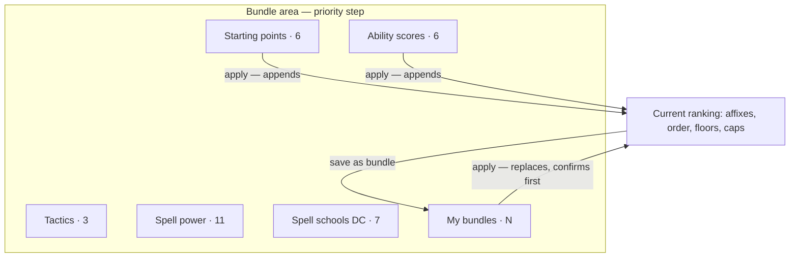
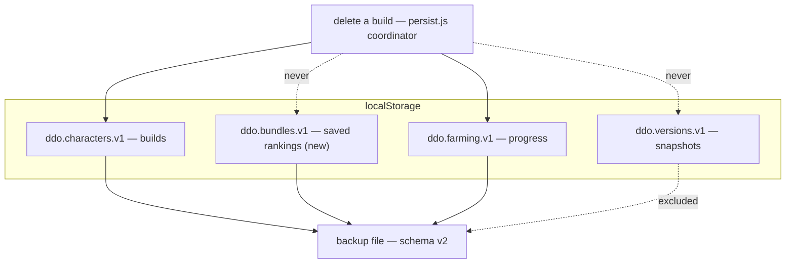

# Bundle Containers and Local Data Management - Plan

## Goal Capsule

- **Objective:** Give the priority step's bundle area real containers, let a player save their own ranking as a reusable bundle, and turn "Your data" from a backup-only surface into one that lists and deletes what is actually stored.
- **Authority:** This document. Where it and the code disagree, this document wins for product behavior; the code wins for how existing modules are structured. Container treatment, bundle payload, apply semantics, delete cascade, and backup scope are settled — do not re-litigate them.
- **Execution profile:** Eight units, dependency-ordered. U1 and U2 are independent and can start in parallel; U3 needs both, and everything after it waits on U2.
- **Stop conditions:** Stop and surface if the saved-bundle payload would need to carry a character-level setting to work, if cascade deletion cannot be made single-authority, or if widening the backup would break the existing three-version compatibility window.
- **Tail ownership:** This plan ends at a green suite and a bumped build stamp. Branch, PR, and merge are the caller's.
- **Open blockers:** None.

---

## Product Contract

**Product Contract preservation:** unchanged. Planning added the Planning Contract, Implementation Units, Verification Contract, and Definition of Done below; no requirement, acceptance example, key decision, or scope boundary was edited.

### Summary

The bundle area gains bordered containers with a header and a count per group, and a new **My bundles** container where a player saves the current ranking — affixes, their order, and their per-stat floors and caps — then applies, edits, or deletes it. "Your data" grows from export-and-import into a per-item list covering builds, bundles, versions, and farming progress, each removable.

### Problem Frame

Three separate surfaces are further along than they look, and each stops just short of the thing a player needs.

The bundle groups already exist. `web/wizard.js` renders four tagged rows — `Ability scores`, `Tactics`, `Spell power`, `Spell schools (DC)` — beneath an untagged row of six starting packages. They are separated by a two-pixel left rule and nothing else, so eleven Spell power chips and seven school chips read as one undifferentiated field. The grouping is real; the containment is not.

Saved rankings do not exist at all. A player who tunes twelve priorities with floors and caps for a reaper tank, then builds a second character, retypes all of it. The preset bundles are primers by design and cannot carry that work.

"Your data" is backup and restore only. `serializeAll` in `web/backup.js` writes four keys — `schema_version`, `exported_at`, `app_build_id`, `characters` — and the panel offers export-all and import. There is no way to see or remove a single item. Three stores exist (`ddo.characters.v1`, `ddo.versions.v1`, `ddo.farming.v1`), and the version store already tells players *"Delete a version you no longer need"* — advice naming a capability the app does not have. `deleteVersion` is implemented in `web/versions.js` and has no caller anywhere.

The cost compounds. `deleteCharacter` removes the character key alone, so a deleted build leaves its farming progress behind, unreachable and still consuming the quota that fills up. Version snapshots are a separate problem rather than the same one: they are a single global list with no owner, so nothing orphans them and nothing prunes them either.

### Key Decisions

- **Containers get a header bar and a count** (session-settled: user-directed — chosen over bordered cards and borderless wells: the count is load-bearing once user bundles exist, because it lets **My bundles** render `0` as information rather than as an empty broken box). Containers size themselves to their contents and the viewport, flowing into as many columns as fit.

- **Nothing collapses on click.** Sizing is automatic — driven by how many bundles a container holds and how wide the viewport is. A click-to-collapse container would reinstate the progressive disclosure `web/wizard.js` records as removed after it hid three rows players had been using, and the flat layout is the chosen behavior there.

- **A saved bundle carries goals, not character facts** (session-settled: user-directed — chosen over carrying the whole Advanced panel: declared credits describe one character's enhancements and past lives, so a bundle carrying them would silently assert them on the next character). The per-priority Advanced panel holds three stat-scoped things — a floor, a cap, and declared credits. Floors and caps travel with the bundle. Credits stay on the character.

- **Applying a user bundle replaces the ranking; presets keep appending** (session-settled: user-directed — chosen over one shared verb: a saved ranking is a complete recipe whose `#1` is the decision that matters, and appending it onto a non-empty list demotes that `#1` to rank six). A replace confirms first when the current list is non-empty.

- **Deleting a build takes its farming progress with it, and says so** (session-settled: user-directed — chosen over silent cascade and over listing orphans separately: orphaned data that counts against the quota and cannot be reached is the condition the version store is already in).

- **The backup covers authored work, not auto-captured byproducts** (session-settled: user-directed — chosen over backing up everything: version snapshots are the largest thing in storage and the store with the known growth problem). Builds, bundles, and farming progress are preserved; version snapshots are not.

- **Bundles are not owned by a character.** That is what makes them reusable across builds, and it means they survive a build's deletion rather than cascading with it.

### Requirements

**Bundle containers**

- R1. Each bundle group renders as a container with a header carrying the group's name and a count of the bundles it holds.
- R2. Containers size to their contents and the viewport, flowing into as many columns as fit, down to a single column on narrow screens.
- R3. No container hides its contents behind a click, a toggle, or any other disclosure control.
- R4. The six starting packages render in their own container alongside the others rather than as an untagged row.

**Saving a ranking as a bundle**

- R5. A player can save the current ranking as a named bundle from within the bundle area.
- R6. A saved bundle stores its affixes, their order, and the floor and cap declared for each of those affixes.
- R7. A saved bundle does not store declared credits, crafting rung, ML cap, race, blocklist, or any other character-level setting.
- R8. Saved bundles appear in a **My bundles** container using the same treatment as the preset containers.
- R9. When a player has saved no bundles, **My bundles** renders as an informative empty state that offers the save action, not as an empty container.
- R10. A player can rename and delete a saved bundle.
- R11. Preset bundles cannot be edited or deleted.

**Applying a bundle**

- R12. Applying a saved bundle replaces the current ranking with the bundle's affixes, order, floors, and caps.
- R13. A replace confirms first when the current ranking is non-empty.
- R14. Applying a preset bundle appends to the current ranking, unchanged from today's behavior.

**Your data**

- R15. "Your data" lists the stored items a player holds, grouped by kind: builds, bundles, versions, and farming progress.
- R16. A player can delete an individual item from that list.
- R17. Deleting a build also deletes its farming progress.
- R18. The confirmation for deleting a build names how many farming entries go with it.
- R19. Deleting a build does not delete any bundle or any version snapshot.
- R20. The backup file preserves builds, bundles, and farming progress.
- R21. The backup file does not carry version snapshots, and "Your data" says which stored items a backup restores and which it does not.
- R22. Importing a backup MERGES into the existing stores and never replaces them: characters by name, bundles by id, farming progress by character key. A record the player made since the export survives the restore.
- R23. An import that saves the characters but fails to save the bundles or the farming progress reports which part did not land, rather than reporting a successful restore.
- R24. Deleting a version snapshot confirms first, and the confirmation states that a backup cannot restore it.

### Acceptance Examples

- AE0. Restoring onto a browser that is NOT empty
  - **Covers R22, R23.**
  - **Given:** a player holding one saved bundle and farming ticks under one build, who imports a backup exported from another browser carrying different bundles and different farming keys.
  - **When:** the import completes.
  - **Then:** both bundles are present and both farming keys are present. An incoming bundle whose id is already taken by a different bundle is re-issued a fresh id rather than overwriting. If the bundle or farming write fails, the panel names that part as not saved instead of reporting success.

- AE1. Empty My bundles
  - **Covers R9.**
  - **Given:** a player who has never saved a bundle.
  - **When:** they open the priority step.
  - **Then:** **My bundles** shows a count of zero and an action to save the current ranking, with copy explaining what a saved bundle is for.

- AE2. Applying a saved bundle over existing work
  - **Covers R12, R13.**
  - **Given:** a ranking of five stats, and a saved bundle of twelve.
  - **When:** the player applies the bundle.
  - **Then:** they are asked to confirm the replacement, and on confirming the ranking becomes the bundle's twelve in the bundle's order, with the bundle's floors and caps.

- AE3. A bundle carries a floor but not a credit
  - **Covers R6, R7.**
  - **Given:** a ranking where Constitution has a floor of 40 and a declared credit of +6 Insight.
  - **When:** the player saves it as a bundle and applies it on a second character.
  - **Then:** the second character's ranking carries the floor of 40 and no declared credit for Constitution.

- AE4. Deleting a build with history
  - **Covers R17, R18, R19.**
  - **Given:** a saved build with eleven farming entries, three saved bundles, and four version snapshots.
  - **When:** the player deletes the build from "Your data".
  - **Then:** the confirmation names the eleven farming entries, deleting removes them with the build, and the bundles and version snapshots remain.

- AE5. Restoring onto a cleared browser
  - **Covers R20, R21.**
  - **Given:** a player who exported a backup while holding builds, bundles, farming progress, and version snapshots, then cleared their browser data.
  - **When:** they import the backup.
  - **Then:** their builds, bundles, and farming progress return, their version snapshots do not, and "Your data" had told them that before they relied on it.

### Scope Boundaries

- Sharing or exporting a single bundle to another player. The whole-backup file remains the only transport.
- A storage-quota policy for the version store — caps, auto-pruning, or a retention window. This work wires up per-item delete, which is the first defect #502 names; the policy stays with #502.
- Reordering containers, nesting them, or letting a player define their own groups.
- Any change to how presets resolve their affixes.

### Dependencies / Assumptions

- The backup schema is versioned and carries a migration step-runner that is currently identity, so widening the payload is an anticipated change rather than a new mechanism.
- Farming progress is keyed by character name rather than a stable id (#518). Renaming a build orphans its progress, and creating a new build with a former build's name inherits the old entries. This is a pre-existing defect, out of scope here, and it sits inside this work's blast radius because cascade deletion reads the same key. Cascade deletion is correct under today's keying and stays correct after a fix.
- The version store's own growth problem is unresolved. This work makes deletion reachable, which is what the storage-full advice already assumes.

### Outstanding Questions

**Deferred to planning**

- Whether a saved bundle's name must be unique, and how a collision is handled. The build store already has a name-collision mechanism that may apply.
- ~~How "Your data" presents a store with many entries — whether the list paginates, groups, or summarizes when a player holds dozens of versions.~~ **Answered — see KTD8.**

### Sources / Research

- `web/wizard.js` — `BUNDLE_GROUPS` and the five rendered rows; `PRESET_BUNDLES`; `resolveBundle` and `addBundle`, which append via `insertAboveTrailingSentinel`; `advancedRowModel`, which defines the per-priority Advanced panel as floor, cap, and declared credits; the recorded decision against reinstating progressive disclosure of bundle rows.
- `web/persist.js` — `deleteCharacter`, which removes the character key and nothing else.
- `web/versions.js` — `deleteVersion`, implemented and uncalled.
- `web/farming.js` — progress read as `all[String(character || "")]`, keyed by name.
- `web/backup.js` — `serializeAll` and its four payload keys; the `schema_version` and `migrate` machinery.
- Issue #502 — the version store's missing lifecycle, whose first defect this work resolves.
- Issues #486 and #252 — adjacent work on how bundled enchantments and set-bonus surfaces are presented.

---

## Planning Contract

### Key Technical Decisions

- **KTD1. Saved bundles get their own store, `ddo.bundles.v1`, built on the `web/versions.js` module shape.** A namespaced global with a thin storage wrapper and a dual export for Node tests, matching `VersionStore` and `CharacterStore`. Not a field on the wizard's `state` object and not a key inside the saved-builds blob: bundles outlive any one character, and putting them on `state` would make them subject to the per-character reset discipline that must never clear them.

- **KTD2. Cascade deletion lives in `web/persist.js`, reached through lazy module resolution.** One authority so a second delete path cannot skip it. `persist.js` loads before `versions.js` and `farming.js`, so a load-time dependency would invert the order — but `persist.js` already resolves `overrides.js` lazily inside a function (`window.Overrides` first, `require` fallback), and that pattern resolves at call time. Reuse it rather than moving the coordinator to the UI layer, where a second call site could bypass it.

- **KTD3. Transient bundle-editing state is per-character and must be reset on character load; saved bundles are global and must not be.** `web/wizard.js` documents the rule inline — the state object outlives a character, so a field not reset on load stays live from the previous one. A closure-scoped staging Set already fell through it once (`docs/solutions/logic-errors/closure-scoped-ui-state-must-reset-on-character-load.md`), because the convention and its tests both keyed on `state.*` and a closure variable is neither. Any pending name or selection this work adds carries the same hazard.

- **KTD4. The backup schema advances one version and registers a migration step.** `web/backup.js` holds `CURRENT_SCHEMA` with a `migrate()` step-runner that is identity at the baseline and a three-version compatibility window. Widening the payload is what that machinery was built for. A v1 file restores with bundles and farming absent rather than being refused.

- **KTD5. Containers are markup and CSS over the existing `BUNDLE_GROUPS`, with no JavaScript layout.** Column flow comes from a CSS grid that fits as many columns as the width allows, which is what satisfies sizing to volume and viewport. `BUNDLE_GROUPS` keeps its shape; only how a group renders changes.

- **KTD7. A restore MERGES; it never replaces.** Every store's restore entry point takes an incoming set and folds it onto what is already there. Replacing was the shipped behavior and it deleted authored work that exists nowhere else, on the one path a player reaches *because* something already went wrong. Bundles merge by id, and because `nextId` is per-store monotonic, two browsers independently produce `b1` — so an incoming id already held by a **different** bundle is re-issued rather than overwriting, while a matching name is the same bundle coming home and the incoming copy wins, keeping a re-import idempotent. Farming merges per character key; *within* one character the incoming record wins, because a tick is a boolean with no timestamp and an untick made before the export cannot be told apart from a tick made after it — merging inside a character would resurrect unticked items permanently. Every incoming record still passes the owning store's write boundary, so a restore cannot reach storage unsanitized.

- **KTD8. "Your data" renders every entry, with no pagination, summarization, or collapse.** This answers the volume question planning deferred. The list is the *only* way a player prunes a store that #502 says only grows, so a presentation that hides entries behind a page or a summary hides exactly what needs pruning. The panel is already behind a disclosure, so the length costs nothing until it is opened deliberately. If the length becomes a real problem, the fix is a per-group `max-height` with an internal scroll — which keeps every entry reachable — not pagination.

- **KTD6. "Bundle" is already taken in this repo — name the new work to avoid it.** `tests/bundles.test.js`, `bundleGroups`, and `bundlesBlock` all refer to **bundled enchantments** on the Sets tab (a multi-stat engraved affix group), which has nothing to do with the priority step's affix bundles. The new store's test file must not be `tests/bundles.test.js`, and new identifiers should be specific enough that a reader cannot confuse the two.

- **KTD7. Applying a saved bundle replaces; `addBundle` is untouched.** Inherits the Product Contract decision on apply semantics. The existing append path serves presets unchanged, and replace is a separate path rather than a mode flag on the same function, so a preset can never take the replace branch.

### High-Level Technical Design

Four stores, one coordinator, and a single widening of the backup payload.

The delete coordinator and the backup payload are the two places where the four stores are named together. Everything else touches one store.

### Assumptions

- Saved builds are keyed by name, and the existing name-collision helper for builds is the right precedent for bundle names.
- Farming progress is keyed by character name (#518). Cascade deletion reads that key and is correct under it; a later fix to that keying does not change this work's cascade logic, only what key it passes.
- No existing consumer reads the backup payload's shape outside `web/backup.js` and its tests.

### Risks and dependencies

- **Version snapshots have no owner, so nothing can prune them per build.** `web/versions.js` holds no character reference, `listVersions` takes no scope, and `stampedBuildId` is the dataset build id used for staleness. A version's only tie to a character is the display name of a `named` snapshot, as prose; `auto` snapshots — the ones that accumulate — carry nothing. Deleting them by matching that prose would infer a relationship the data does not record. The consequence is that the per-item list in U7 becomes the only way a player ever prunes the store #502 says only grows, which makes U7 load-bearing rather than convenient.

- **Deleting a build destroys its farming progress irreversibly, and that is new.** Today those ticks survive the delete as orphans. Mitigation is disclosure rather than retention: the confirmation names the count before deleting, and the backup carries farming progress so a player with a current backup can restore it.

- **A partial cascade is worse than no cascade.** If the build is deleted and the dependent deletes fail, the player is left with exactly the orphans this work exists to remove, and no build to reach them from. **The ordering rule that closes this: the build record is removed LAST.** A failed dependent delete aborts before it, leaving nothing removed — the player keeps a coherent build they can retry the delete from, rather than an unreachable orphan. The coordinator reports the failure rather than success.

- **Storage writes fail, and a failed write must not render as a success.** Every store here already treats a failed write as a reportable outcome; the new store and the delete paths must do the same rather than updating the view optimistically.

- **`named` version snapshots are authored work the backup drops (#530).** The settled decision treats all snapshots as auto-captured byproducts, but `versions.js` holds two kinds and the player deliberately named one of them. Filed rather than resolved here — the decision to include them or to correct the panel's copy is a product call with a payload-size consequence.

- **The schema bump is one-way in practice.** A player who exports at the new version and then loads an older deployment gets a refusal from the version window, which is the guard working. Nothing needs building for that, but it is the one user-visible consequence of widening the payload.

### Sequencing

U1 and U2 are independent — either can start first, and they can run in parallel. U3 needs both. U4 and U5 need U3. U6's only tie to U2 is a guard test — that deleting a build removes no saved bundle — so U6 can start before U2 lands and only its test needs U2 present; it touches no bundle-store file. U7 needs U2 and U6. U8 needs U2 and U7 — it rewrites the same panel U7 introduces, and its copy names the stored kinds U7 groups.

---

## Implementation Units

### U1. Bundle group containers

- **Goal:** Each bundle group renders as a container with a header and a count, flowing into as many columns as the viewport allows.
- **Requirements:** R1, R2, R3, R4.
- **Dependencies:** none.
- **Files:** `web/wizard.js` (the priority step's bundle markup), `web/styles.css`, `tests/wizard.test.js`.
- **Approach:** Wrap each group from `BUNDLE_GROUPS` in a container carrying a header with the group's name and its bundle count. Give the packages row a header of its own so it stops reading as loose chips. Column flow comes from a CSS grid that fits as many columns as the width allows; containers size to content. Add no disclosure control of any kind.
- **Patterns to follow:** the existing bundle chip and row styling in `web/styles.css`; the panel treatments already used for the wizard's data blocks.
- **Test scenarios:**
  - Every group in `BUNDLE_GROUPS` renders a container, and the count shown equals the number of bundles that group holds.
  - The packages group renders a header rather than an untagged row.
  - No container markup carries a disclosure control, and no CSS rule hides a container's body — the standing decision against reinstating progressive disclosure.
  - At a narrow viewport the containers stack to a single column with no horizontal overflow on the document.
- **Verification:** the priority step shows five labelled containers, counts match their contents, and nothing collapses. The sixth arrives with My bundles in U3.

### U2. The saved-bundle store

- **Goal:** A store that holds saved rankings, independent of any character.
- **Requirements:** R6, R7.
- **Dependencies:** none.
- **Files:** `web/saved-bundles.js` (new — see KTD6 on naming), `web/index.html` (script tag), `tests/saved-bundles.test.js` (new).
- **Approach:** Mirror the `web/versions.js` module shape: namespaced global, thin storage wrapper, dual export. A saved bundle holds a name, an ordered affix list, and floor and cap maps keyed by affix name. Reject any key outside that shape at the write boundary, the way `persist.js` sanitizes on write — a hand-edited backup can carry anything. Expose list, save, rename, delete, and a **merge** entry point for restore (KTD7). The merge re-makes every incoming record through the same allowlist constructor the single-save path uses, so a restore cannot reach storage without passing the write boundary — a raw `writeAll` reachable from the import handler would be a second, unsanitized door into the store.
- **Execution note:** Write the store and its tests before any UI touches it; every later unit depends on this shape being settled.
- **Patterns to follow:** `web/versions.js` for the module and storage shape; `web/persist.js` for write-boundary sanitization.
- **Test scenarios:**
  - A saved bundle round-trips through storage with its affix order preserved.
  - Floors and caps survive the round trip, keyed to the affixes they belong to.
  - A payload carrying a character-level key (a crafting rung, an ML cap, a declared credit) is rejected or stripped at the write boundary rather than stored.
  - A failed write reports failure rather than reporting a save that did not land.
  - Reading a store whose value is absent, malformed, or not an object returns empty rather than throwing.
  - A merge carrying a character-level key stores a sanitized record rather than the raw one — the restore path cannot bypass the allowlist.
  - A merge onto a non-empty store keeps the existing records and adds the incoming ones.
  - An incoming id already held by a different bundle is re-issued; an incoming id held by the same-named bundle overwrites, so a re-import is idempotent.
- **Verification:** the store's tests pass and no UI depends on it yet.

### U3. Save the current ranking, and render My bundles

- **Goal:** A player can save the current ranking as a named bundle and see it in a container.
- **Requirements:** R5, R8, R9.
- **Dependencies:** U1, U2.
- **Files:** `web/wizard.js`, `web/styles.css`, `tests/wizard.test.js`.
- **Approach:** Add a save action inside the bundle area that captures the current ranking's affixes, their order, and their floors and caps, then writes through the store from U2. Render saved bundles in a **My bundles** container using U1's treatment. When the store is empty, render an informative empty state offering the save rather than an empty container. Name collision follows the builds precedent. Saving refuses an empty ranking and an unnamed bundle, each with the reason: an unnamed or empty bundle is a chip a player can never identify or usefully apply, and a store that accepts one is a store that can only be cleaned up by hand.
- **Execution note:** Any pending name or in-progress selection this adds is per-character UI state — reset it on character load per KTD3, and pin that reset in a test the way the existing reset discipline is pinned.
- **Patterns to follow:** the build-name collision helper; the existing wizard panel that updates its own summary inline rather than re-rendering.
- **Test scenarios:**
  - Saving captures the ranking's affixes in order, with each affix's floor and cap.
  - Saving captures no declared credit and no character-level setting, even when the ranking has them. Covers the floor-but-not-credit acceptance case from the Product Contract.
  - With no saved bundles, My bundles renders its empty state and offers the save action. Covers the empty-My-bundles acceptance case from the Product Contract.
  - With saved bundles, each appears in My bundles and the container's count matches.
  - A name matching an existing bundle is handled by the collision path rather than silently overwriting.
  - Saving with an empty ranking, or with no name, refuses and says why — nothing reaches the store.
  - Loading a character resets any pending bundle-editing state and leaves saved bundles untouched.
- **Verification:** a ranking can be saved, appears in My bundles, and survives a reload.

### U4. Apply a bundle

- **Goal:** Applying a saved bundle restores its ranking; presets keep appending.
- **Requirements:** R12, R13, R14.
- **Dependencies:** U3.
- **Files:** `web/wizard.js`, `tests/wizard.test.js`.
- **Approach:** A separate apply path for saved bundles that replaces the ranking with the bundle's affixes, order, floors and caps, confirming first when the current ranking is non-empty. Leave the preset append path untouched so a preset can never take the replace branch.
- **Test scenarios:**
  - Applying a saved bundle onto an empty ranking yields the bundle's affixes in the bundle's order, with its floors and caps.
  - Applying onto a non-empty ranking asks for confirmation first.
  - Declining the confirmation leaves the current ranking exactly as it was.
  - Confirming replaces the ranking rather than merging it — no affix from the previous ranking survives unless the bundle also carries it.
  - Applying a preset still appends and still dedupes, unchanged from today.
  - Covers the applying-over-existing-work acceptance case from the Product Contract.
  - An affix the bundle carries that the current dataset no longer offers is restored as-is — see the open question below; do not silently drop it.
- **Open question — filed as #529, not settled here:** a bundle saved against one dataset can name an affix a later rebuild no longer offers. Applying restores the name unchanged today. Silently dropping it would change the player's ranking without telling them — the same failure the weighted-mode non-goal exists to prevent — so the shipped behavior is deliberately the conservative one until the disclosure is designed.
- **Verification:** a saved bundle's `#1` is the ranking's `#1` after applying it.

### U5. Rename and delete a saved bundle

- **Goal:** A player can rename and delete their own bundles; presets are immutable.
- **Requirements:** R10, R11.
- **Dependencies:** U3.
- **Files:** `web/wizard.js`, `tests/wizard.test.js`.
- **Approach:** Rename and delete affordances on saved bundles only. Presets render without them, and the handlers refuse a preset key rather than relying on the affordance being absent — a disabled or missing control is a UI state, not a guarantee.
- **Execution note:** The pending rename value is per-character UI state and carries KTD3's hazard exactly as U3's pending name does — reset it on character load, and pin that reset in a test. KTD3's own precedent failed on a *closure-scoped* variable, which is neither a `state.*` field nor covered by the reset convention's tests, so the pin has to name the value rather than assume the convention catches it.
- **Test scenarios:**
  - Renaming a bundle preserves its affixes, order, floors and caps.
  - Renaming to a colliding name takes the same collision path as saving.
  - Deleting a bundle removes it from the store and from My bundles, and leaves other bundles intact.
  - A rename or delete handler invoked against a preset key refuses and changes nothing.
  - The My bundles count updates after a delete without a full re-render closing the panel.
  - A pending rename value does not survive a character load — the KTD3 reset is pinned for this unit's own state, not inherited from U3's.
- **Verification:** bundles can be renamed and deleted; presets cannot.

### U6. Cascade deletion when a build is removed

- **Goal:** Deleting a build removes its farming progress, and says how many entries go with it, leaving version snapshots untouched.
- **Requirements:** R17, R18, R19.
- **Dependencies:** none for the code; U2 must exist for the "removes no saved bundle" guard test.
- **Files:** `web/persist.js`, `web/wizard.js` (the existing build-delete call site), `tests/persist.test.js`, `tests/wizard.test.js`.
- **Approach:** A coordinator in `web/persist.js` that deletes a build and its farming progress, resolving `FarmingList` lazily at call time per KTD2. Expose a count of what would be removed so the confirmation can name it before deleting. The primitive delete stays as it is; the coordinator is what call sites use. Version snapshots are not touched — they have no owner (see Risks), so a build's deletion neither removes nor orphans them. **The build record is removed last**: a failed dependent delete aborts before it and leaves nothing removed, so the player keeps a coherent build to retry from rather than an unreachable orphan.
- **Execution note:** Prove the counts are read before the delete, not after — a confirmation naming zero because the delete already ran is the failure this unit exists to prevent.
- **Patterns to follow:** the lazy `window.X`-then-`require` resolution already used in `web/persist.js`.
- **Test scenarios:**
  - Deleting a build removes its farming progress along with the build.
  - Deleting a build leaves every version snapshot in place.
  - The reported count matches what is actually removed, and is available before the deletion runs.
  - Deleting a build removes no saved bundle.
  - Deleting a build with no versions and no farming progress reports zero for each and still deletes the build.
  - A build whose farming progress is stored under a name it no longer uses is unaffected — the coordinator deletes by the key it is given and does not guess.
  - When the farming clear fails, the coordinator reports failure AND the build still exists — nothing is removed, rather than the build going and its progress staying.
  - Covers the deleting-a-build-with-history acceptance case from the Product Contract.
- **Verification:** no orphaned farming entry remains after a build is deleted, and every version snapshot survives.

### U7. Your data: list and delete stored items

- **Goal:** "Your data" shows what is stored, grouped by kind, and can delete an individual item.
- **Requirements:** R15, R16, R18.
- **Dependencies:** U2, U6.
- **Files:** `web/wizard.js`, `web/styles.css`, `tests/wizard.test.js`.
- **Approach:** Extend the existing "Your data" block with a list grouped by kind — builds, bundles, versions, farming progress — each row deletable. Builds route through U6's coordinator so the confirmation names the counts. Versions delete through the store function that already exists and has no caller; that delete confirms first and the confirmation states that a backup cannot restore the snapshot (R24), because it is the one deletion here with no recovery path. A farming row whose key names no saved build is **shown and visibly marked** as having no saved build rather than hidden or nested under a build — #518 keys progress by the live build-name field, which does not have to name a saved build, so these entries accrue and nothing else ever collects them. Marking is what the data supports: a saved build has no id, the name IS its identity, and inferring ownership would assert a link the store does not record. Per KTD8 the list renders every entry with no pagination. Keep the backup and restore controls where they are; the list is added beside them, not in place of them.
- **Test scenarios:**
  - Every stored kind appears in the list, and a kind holding nothing renders as empty rather than being omitted silently.
  - Deleting a bundle from the list removes it from the store.
  - Deleting a version from the list removes that version and leaves its siblings.
  - Deleting a build from the list routes through the cascade coordinator and shows the counts in its confirmation.
  - The panel is reachable without having solved this session, matching how the data block is reachable today.
  - A farming entry keyed to a name no saved build uses appears in the list, is marked as having no saved build, and is individually deletable.
  - Declining the version-delete confirmation leaves the snapshot in the store.
  - A kind holding many entries renders all of them, with no pagination and no horizontal overflow on the document.
  - Every delete control carries an accessible name that says what it deletes, not a bare symbol.
- **Verification:** every stored item is visible and individually removable, and the storage-full advice now names something the player can do.

### U8. Widen the backup

- **Goal:** A backup preserves builds, bundles and farming progress, and says what it does not carry.
- **Requirements:** R20, R21.
- **Dependencies:** U2, U7.
- **Files:** `web/backup.js`, `web/wizard.js`, `tests/backup.test.js`, `tests/wizard.test.js`.
- **Approach:** Advance the schema version and register a migration step for the new payload keys, so a file at the previous version restores with bundles and farming absent rather than being refused. Serialize bundles and farming alongside builds; leave version snapshots out. **The import MERGES per KTD7** — bundles by id through the store's own merge entry point, farming per character key — matching the by-name merge the character half already performs, and it must not claim a merge-by-name it does not do. Each dependent write returns `{ ok }`; check both and name the part that did not land rather than reporting a clean restore over a failed write. Update the panel's copy so it states which stored items a backup restores and which it does not.
- **Execution note:** Verify the three-version compatibility window still accepts a file written before this change — a widening that refuses old backups breaks the promise this panel makes.
- **Patterns to follow:** the existing `migrate()` step-runner and version-window logic in `web/backup.js`.
- **Test scenarios:**
  - A backup written after this change carries builds, bundles and farming progress.
  - A backup written after this change carries no version snapshots.
  - A file at the previous schema version still imports, with bundles and farming absent rather than the import being refused.
  - A file from a newer schema version is still declined, unchanged from today.
  - The panel's copy names what a backup restores and what it does not.
  - Importing onto a browser that already holds bundles and farming progress keeps the local records and adds the incoming ones.
  - An incoming bundle id already held by a different bundle is re-issued rather than overwriting; re-importing the same file twice does not duplicate.
  - When the bundle or farming write fails during an import, the panel reports the failure and names which stored kinds did not land.
  - Covers the restoring-onto-a-cleared-browser acceptance case from the Product Contract, and the restoring-onto-a-non-empty-browser case (AE0).
- **Verification:** export, clear storage, import — builds, bundles and farming return; versions do not; the panel said so beforehand. Then import again onto the non-empty result and confirm nothing local was destroyed.

---

## Verification Contract

| Gate | Command | Applies to |
|---|---|---|
| Python suite | `python3 tests/run_tests.py` | every unit |
| JS suite, one file per invocation | `./scripts/run_js_tests.sh` | every unit |
| Build stamp advanced | `python3 scripts/check_stamp_advanced.py main` | the branch as a whole |
| Dataset build | `python3 build_dataset.py` | only if a unit touches the pipeline (none should) |

Run the JS suite through the script, never a bare loop — `node a.js b.js` executes only the first file, and a missing generated dataset makes a crash read as a pass.

Every new test must be proved to fail against the pre-change tree before it is trusted. Export the base commit to a scratch directory, copy the generated dataset in, copy the new tests over it, and run them. A deliberate "nothing changed" guard is the exception and should say so in its own body.

## Definition of Done

Global:

- Every requirement in the Product Contract is met or explicitly deferred in writing.
- Both suites pass, and every new test was observed red against the pre-change tree first.
- The build stamp advances across `web/app.js`, every cache-bust in `web/index.html`, and the README line — this work is player-facing, and `scripts/check_stamp_advanced.py` is the arbiter rather than judgement.
- No dead-end or experimental code from an abandoned approach remains in the diff.
- The five acceptance examples in the Product Contract each have a test that enforces them.

Per unit: the unit's own verification line holds, and its test scenarios are covered by real tests rather than by an annotation.
