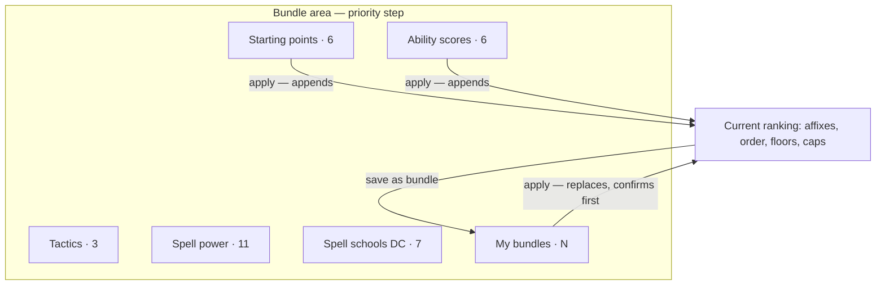

# Bundle Containers and Local Data Management - Plan

## Goal Capsule

- **Objective:** Give the priority step's bundle area real containers, let a player save their own ranking as a reusable bundle, and turn "Your data" from a backup-only surface into one that lists and deletes what is actually stored.
- **Product authority:** This document. Container treatment, bundle payload, apply semantics, delete cascade, and backup scope are settled here.
- **Open blockers:** None block planning. Two questions in Outstanding Questions are answerable during planning.

---

## Product Contract

### Summary

The bundle area gains bordered containers with a header and a count per group, and a new **My bundles** container where a player saves the current ranking — affixes, their order, and their per-stat floors and caps — then applies, edits, or deletes it. "Your data" grows from export-and-import into a per-item list covering builds, bundles, versions, and farming progress, each removable.

### Problem Frame

Three separate surfaces are further along than they look, and each stops just short of the thing a player needs.

The bundle groups already exist. `web/wizard.js` renders four tagged rows — `Ability scores`, `Tactics`, `Spell power`, `Spell schools (DC)` — beneath an untagged row of six starting packages. They are separated by a two-pixel left rule and nothing else, so eleven Spell power chips and seven school chips read as one undifferentiated field. The grouping is real; the containment is not.

Saved rankings do not exist at all. A player who tunes twelve priorities with floors and caps for a reaper tank, then builds a second character, retypes all of it. The preset bundles are primers by design and cannot carry that work.

"Your data" is backup and restore only. `serializeAll` in `web/backup.js` writes four keys — `schema_version`, `exported_at`, `app_build_id`, `characters` — and the panel offers export-all and import. There is no way to see or remove a single item. Three stores exist (`ddo.characters.v1`, `ddo.versions.v1`, `ddo.farming.v1`), and the version store already tells players *"Delete a version you no longer need"* — advice naming a capability the app does not have. `deleteVersion` is implemented in `web/versions.js` and has no caller anywhere.

The cost compounds. `deleteCharacter` removes the character key alone, so a deleted build leaves its versions and its farming progress behind, unreachable and still consuming the quota that fills up.

### Key Decisions

- **Containers get a header bar and a count** (session-settled: user-directed — chosen over bordered cards and borderless wells: the count is load-bearing once user bundles exist, because it lets **My bundles** render `0` as information rather than as an empty broken box). Containers size themselves to their contents and the viewport, flowing into as many columns as fit.

- **Nothing collapses on click.** Sizing is automatic — driven by how many bundles a container holds and how wide the viewport is. A click-to-collapse container would reinstate the progressive disclosure `web/wizard.js` records as removed after it hid three rows players had been using, and the flat layout is the chosen behavior there.

- **A saved bundle carries goals, not character facts** (session-settled: user-directed — chosen over carrying the whole Advanced panel: declared credits describe one character's enhancements and past lives, so a bundle carrying them would silently assert them on the next character). The per-priority Advanced panel holds three stat-scoped things — a floor, a cap, and declared credits. Floors and caps travel with the bundle. Credits stay on the character.

- **Applying a user bundle replaces the ranking; presets keep appending** (session-settled: user-directed — chosen over one shared verb: a saved ranking is a complete recipe whose `#1` is the decision that matters, and appending it onto a non-empty list demotes that `#1` to rank six). A replace confirms first when the current list is non-empty.

- **Deleting a build takes its versions and farming progress with it, and says so** (session-settled: user-directed — chosen over silent cascade and over listing orphans separately: orphaned data that counts against the quota and cannot be reached is the condition the version store is already in).

- **The backup covers authored work, not auto-captured byproducts** (session-settled: user-directed — chosen over backing up everything: version snapshots are the largest thing in storage and the store with the known growth problem). Builds, bundles, and farming progress are preserved; version snapshots are not.

- **Bundles are not owned by a character.** That is what makes them reusable across builds, and it means they survive a build's deletion rather than cascading with it.

### Requirements

**Bundle containers**

- R1. Each bundle group renders as a container with a header carrying the group's name and a count of the bundles it holds.
- R2. Containers size to their contents and the viewport, flowing into as many columns as fit, down to a single column on narrow screens.
- R3. No container hides its contents behind a click, a toggle, or any other disclosure control.
- R4. The six starting packages render in their own container alongside the others rather than as an untagged row.

**Saving a ranking as a bundle**

- R5. A player can save the current ranking as a named bundle from within the bundle area.
- R6. A saved bundle stores its affixes, their order, and the floor and cap declared for each of those affixes.
- R7. A saved bundle does not store declared credits, crafting rung, ML cap, race, blocklist, or any other character-level setting.
- R8. Saved bundles appear in a **My bundles** container using the same treatment as the preset containers.
- R9. When a player has saved no bundles, **My bundles** renders as an informative empty state that offers the save action, not as an empty container.
- R10. A player can rename and delete a saved bundle.
- R11. Preset bundles cannot be edited or deleted.

**Applying a bundle**

- R12. Applying a saved bundle replaces the current ranking with the bundle's affixes, order, floors, and caps.
- R13. A replace confirms first when the current ranking is non-empty.
- R14. Applying a preset bundle appends to the current ranking, unchanged from today's behavior.

**Your data**

- R15. "Your data" lists the stored items a player holds, grouped by kind: builds, bundles, versions, and farming progress.
- R16. A player can delete an individual item from that list.
- R17. Deleting a build also deletes its version snapshots and its farming progress.
- R18. The confirmation for deleting a build names how many versions and how many farming entries go with it.
- R19. Deleting a build does not delete any bundle.
- R20. The backup file preserves builds, bundles, and farming progress.
- R21. The backup file does not carry version snapshots, and "Your data" says which stored items a backup restores and which it does not.

### Acceptance Examples

- AE1. Empty My bundles
  - **Covers R9.**
  - **Given:** a player who has never saved a bundle.
  - **When:** they open the priority step.
  - **Then:** **My bundles** shows a count of zero and an action to save the current ranking, with copy explaining what a saved bundle is for.

- AE2. Applying a saved bundle over existing work
  - **Covers R12, R13.**
  - **Given:** a ranking of five stats, and a saved bundle of twelve.
  - **When:** the player applies the bundle.
  - **Then:** they are asked to confirm the replacement, and on confirming the ranking becomes the bundle's twelve in the bundle's order, with the bundle's floors and caps.

- AE3. A bundle carries a floor but not a credit
  - **Covers R6, R7.**
  - **Given:** a ranking where Constitution has a floor of 40 and a declared credit of +6 Insight.
  - **When:** the player saves it as a bundle and applies it on a second character.
  - **Then:** the second character's ranking carries the floor of 40 and no declared credit for Constitution.

- AE4. Deleting a build with history
  - **Covers R17, R18, R19.**
  - **Given:** a saved build with four version snapshots and eleven farming entries, and three saved bundles.
  - **When:** the player deletes the build from "Your data".
  - **Then:** the confirmation names the four versions and eleven farming entries, deleting removes all of them, and the three bundles remain.

- AE5. Restoring onto a cleared browser
  - **Covers R20, R21.**
  - **Given:** a player who exported a backup while holding builds, bundles, farming progress, and version snapshots, then cleared their browser data.
  - **When:** they import the backup.
  - **Then:** their builds, bundles, and farming progress return, their version snapshots do not, and "Your data" had told them that before they relied on it.

### Scope Boundaries

- Sharing or exporting a single bundle to another player. The whole-backup file remains the only transport.
- A storage-quota policy for the version store — caps, auto-pruning, or a retention window. This work wires up per-item delete, which is the first defect #502 names; the policy stays with #502.
- Reordering containers, nesting them, or letting a player define their own groups.
- Any change to how presets resolve their affixes.

### Dependencies / Assumptions

- The backup schema is versioned and carries a migration step-runner that is currently identity, so widening the payload is an anticipated change rather than a new mechanism.
- Farming progress is keyed by character name rather than a stable id (#518). Renaming a build orphans its progress, and creating a new build with a former build's name inherits the old entries. This is a pre-existing defect, out of scope here, and it sits inside this work's blast radius because cascade deletion reads the same key. Cascade deletion is correct under today's keying and stays correct after a fix.
- The version store's own growth problem is unresolved. This work makes deletion reachable, which is what the storage-full advice already assumes.

### Outstanding Questions

**Deferred to planning**

- Whether a saved bundle's name must be unique, and how a collision is handled. The build store already has a name-collision mechanism that may apply.
- How "Your data" presents a store with many entries — whether the list paginates, groups, or summarizes when a player holds dozens of versions.

### Sources / Research

- `web/wizard.js` — `BUNDLE_GROUPS` and the five rendered rows; `PRESET_BUNDLES`; `resolveBundle` and `addBundle`, which append via `insertAboveTrailingSentinel`; `advancedRowModel`, which defines the per-priority Advanced panel as floor, cap, and declared credits; the recorded decision against reinstating progressive disclosure of bundle rows.
- `web/persist.js` — `deleteCharacter`, which removes the character key and nothing else.
- `web/versions.js` — `deleteVersion`, implemented and uncalled.
- `web/farming.js` — progress read as `all[String(character || "")]`, keyed by name.
- `web/backup.js` — `serializeAll` and its four payload keys; the `schema_version` and `migrate` machinery.
- Issue #502 — the version store's missing lifecycle, whose first defect this work resolves.
- Issues #486 and #252 — adjacent work on how bundled enchantments and set-bonus surfaces are presented.
