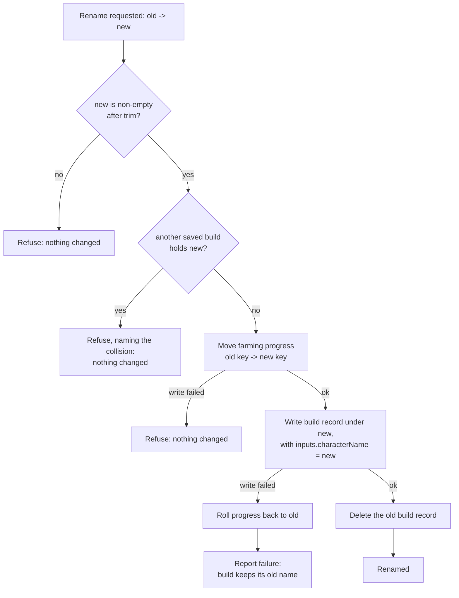
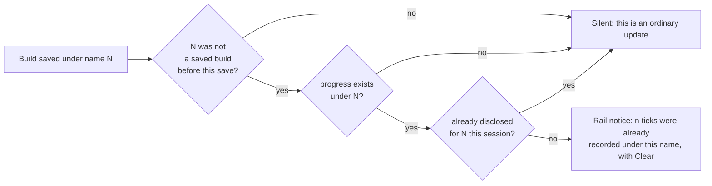

# Build Rename and the Farming-Progress Keying - Plan

## Goal Capsule

- **Objective:** Close #518 by giving a saved build a real rename that carries its farming progress with it, and by disclosing the one path where a build inherits ticks it did not earn.
- **Authority:** This document. Where it and the code disagree, this document wins for product behavior; the code wins for how existing modules are structured. The identity model is settled — the name IS the identity, and no stable build id is introduced. Do not re-litigate it.
- **Execution profile:** Four units, dependency-ordered. U1 and U2 are the store layer, U3 and U4 the wizard surface. U4 is independent of U3 and can start once U2 lands.
- **Stop conditions:** Stop and surface if a rename cannot be made to leave the store consistent on failure, or if the takeover disclosure cannot be delivered without a blocking dialog on the autosave path.
- **Tail ownership:** This plan ends at a green suite and a bumped build stamp. Branch, PR, and merge are the caller's.
- **Open blockers:** None.

---

## Product Contract

**Product Contract preservation:** authored here (`ce-plan-bootstrap`); no upstream requirements document exists. Issue #518 is the origin.

### Summary

Farming progress is filed under the build's name. #518 reports that this orphans progress on a rename and lets a reused name inherit a stranger's ticks. Reading the store first changes what is actually broken, and this plan targets what survives that reading.

**There is no stable build identity anywhere in the app, and there is no rename operation at all.** `web/persist.js` keys the character store by name (`all[record.name] = record`); `web/farming.js`, the backup's merge, and the save rail all key by the same name. So "renaming a build" today means typing a different name and letting autosave write a *second* build — the original and its ticks both survive, untouched. And delete-then-reuse-a-name is already clean: the cascade delete that shipped in the bundle-containers work clears a build's progress when the build goes.

What survives is the third path, which #518 names only in passing. Ticks are keyed to the **live** character-name field, which never has to name a saved build. Entries therefore accrue under names that were never builds, and a build later saved under one of those names silently takes them over — the player sees items already ticked off for gear nobody farmed on that build, with nothing on screen to say the state is inherited.

This plan ships the missing rename, carries progress with it, and discloses the takeover once when it happens.

### Problem Frame

Three defects, one cause — the name is the only handle anything has, and nothing moves it:

1. **No rename exists.** The only way to change a build's name is to create a second build, leaving a duplicate the player did not ask for and progress attached to the copy they stopped using.
2. **Progress cannot follow a build even in principle,** because no operation moves a build.
3. **A name carrying ticks is silently adopted** by whatever build is next saved under it.

The first is the player-visible gap; the second is what makes the first unfixable without store work; the third is the false-state hazard #518 calls the sharper half.

### Requirements

| ID | Requirement |
|---|---|
| R1 | A player can rename a saved build from the save rail. The build keeps its loadout, solved query, build stamp and save date. |
| R2 | A rename carries the build's farming progress to the new name. |
| R3 | A rename to a name another saved build already holds is refused, says which name collided, and changes nothing. |
| R4 | A rename to a blank or whitespace-only name is refused and changes nothing. |
| R5 | Renaming the build currently being edited leaves the player editing that same build under its new name: the rail's "Editing X", the name the next autosave writes, and the attribution of the on-screen solve all follow it. |
| R6 | A rename that fails part-way leaves the player able to retry, and reports that it did not happen. It never reports success on a partial move. |
| R7 | When a build is first saved under a name that already carries farming ticks no saved build earned, the app says so and offers to clear them. |
| R8 | R7's disclosure fires once per name, and never blocks navigation. |
| R9 | Ticks are still recorded under a name that is not yet a saved build, exactly as today. |
| R10 | Version snapshots do not follow a rename, and no surface claims they do. |

### Acceptance Examples

- **AE1.** A build named "Aurelia" has six farming ticks. The player renames it to "Aurelia Mk2". The build appears in the rail as "Aurelia Mk2", opens with its saved loadout intact, and its Farming List still shows the same six items ticked. No build named "Aurelia" remains, and no progress remains filed under "Aurelia".
- **AE2.** The player renames "Aurelia" to "Bram", and a saved build named "Bram" already exists. The rename is refused, naming the collision. Both builds are unchanged, and "Aurelia"'s progress is still under "Aurelia".
- **AE3.** The player is editing "Aurelia" with unsaved changes and renames it to "Aurelia Mk2". The rail reads "Editing Aurelia Mk2", the unsaved changes are still on screen, and continuing to the next step autosaves them to "Aurelia Mk2" rather than re-creating "Aurelia".
- **AE4.** Six ticks are recorded under the name "Kestrel", which was never saved as a build. The player later saves a build named "Kestrel". The rail discloses that six ticks were already recorded under that name and offers to clear them. Navigation is not blocked, and the disclosure does not reappear on the next save.
- **AE5.** A player with no farming progress renames a build. No disclosure appears, and no farming write occurs.

### Scope Boundaries

- **No stable build id.** Settled — see KTD1. Every store stays name-keyed.
- **Rename lives on the save rail only,** not in the "Your data" panel. The rail is the build surface; "Your data" is the storage-pruning surface, and a second rename control would be a second path into a transaction that must have one authority.
- **Version snapshots and saved bundles are untouched.** Neither records an owning build; see KTD8.
- **No backup schema change.** The payload keys builds by name and merges by name; a rename changes which names exist, not the shape of the file.

#### Deferred to Follow-Up Work

- Nothing. Everything this work opens is either resolved here or already carried by an existing issue (#530, #529, #502).

### Open Questions

None blocking. The takeover-disclosure delivery mechanism is settled in KTD6 and differs from the confirm-dialog sketch used when the decision was taken — the reason is recorded there.

### Dependencies / Assumptions

- The cascade delete from the bundle-containers work (`deleteBuildAndDependents`) is the shape a rename coordinator mirrors. It is shipped and stable.
- Autosave-on-Continue saves a named build on every navigation. This is why the R7 disclosure cannot be a modal, and it also narrows which paths can produce ticks under a name that is not a saved build. Three do, and they are what U4's fixtures should be built from rather than an assumed population: a backup restore, whose parse returns farming keyed independently of the characters in the same file and merges it in, so entries can arrive for builds the file did not carry; a save that fails on quota after a tick succeeded; and progress recorded before the cascade delete shipped. Delete-then-recreate is **not** among them — the cascade already clears.
- `localStorage` writes can fail on quota at any point, including mid-rename.

---

## Planning Contract

### Key Technical Decisions

- **KTD1. The name stays the identity; no build id is introduced.** *(session-settled: user-directed — chosen over introducing a stable build id: every store is already name-keyed, the name is the player-visible identity, and an id would be a migration across the character store, the farming store, the rail, and the backup's three-version compatibility window for a benefit a rename delivers directly.)*
- **KTD2. A rename ships as a first-class operation.** *(session-settled: user-directed — chosen over fixing only the progress keying: without a rename there is no act for the fix to attach to, which is why #518's first hazard cannot be closed any other way.)*
- **KTD3. The record's `inputs.characterName` moves with the store key.** `pickInputs` writes the name *into* the record's inputs as well as using it as the key. Moving only the key leaves a record whose inputs still say the old name — loading it restores the old name into `state.characterName`, and the next autosave re-creates the build the rename was supposed to remove. This is the single trap in the unit and the reason the store-level rename is not a two-line key move.
- **KTD4. The progress-key move lives in `farming.js`; the coordinator lives in `persist.js`.** Same split `clearProgress` already established: the module that owns the storage key owns every write to its shape, and the module that owns builds owns the transaction. A coordinator that reached in and rewrote the progress blob would be a second writer of a format only `farming.js` documents.
- **KTD5. Progress moves first; a failed build move rolls it back.** A partial rename is the orphan state this work exists to remove. Moving progress first means a failure at that step changes nothing at all. A failure at the build step is rolled back — and the rollback is not futile despite writing to the storage that just refused: the write that failed is the one that grew the store by holding both build keys at once, while the rollback restores a same-sized entry to a key that already existed. A rollback that itself fails is reported as a failure rather than a success — leaving progress under a name with no build, which is exactly the state "Your data" already marks and can delete.
- **KTD6. The R7 takeover disclosure is a non-blocking rail notice with a Clear action, not a confirm dialog.** The decision to disclose was taken against a Keep/Clear modal sketch; the mechanism is changed here and the substance is not. A build is saved on every navigation, so a blocking dialog on the save path is precisely what the autosave work removed when it narrowed `nameCollides` — a native confirm firing during a step change reads as the feature failing. The rail is where the save-failure messages already go, for the same stated reason: reported where the press happened, never as a modal, never blocking. This binds the **save** path only. U3's rename is user-initiated and may collect its new name with a prompt, as the bundle rename already does — the objection is to a dialog the player did not ask for, not to dialogs.
- **KTD7. The disclosure fires once per name, tracked the way `nameReconciled` already tracks the overwrite warning.** A per-save disclosure under autosave is a per-navigation disclosure.
- **KTD8. A rename does not chase version snapshots.** `versions.js` records no owning character; a `named` snapshot's only tie to a build is its display name, as prose, and `auto` snapshots carry nothing. Rewriting that prose on rename would assert a relationship the data does not record. R10 makes this a stated limit rather than a silent one.

### High-Level Technical Design

The rename transaction and its failure branches:

The takeover disclosure, which is a different question asked at a different moment:

### Assumptions

- A rename never grows the character store on net, but the intermediate state holds both keys, so quota failure at the build-write step is reachable and KTD5's rollback is not theoretical.
- The rail re-renders from the store rather than from accumulated flags, so a successful rename needs no separate rail-state bookkeeping beyond the live-editing fields R5 names.

### Risks and dependencies

- **The `inputs.characterName` trap (KTD3) is invisible in testing that only checks the rail.** A rename that moves the key alone looks completely correct until the renamed build is loaded and the player navigates once. The unit's test scenarios pin the round-trip, not the key.
- **A rollback that fails leaves marked orphan progress.** Accepted, and bounded: the state is the one "Your data" already lists and can delete, and the alternative — reporting success — would hide it.
- **The disclosure sits on the autosave path.** If it is ever made blocking it re-introduces the defect the autosave work removed. KTD6 and R8 both exist to hold that line.

### Sequencing

U1 → U2 → (U3, U4 in either order). U4 depends on U2 only for the store read it uses to count ticks; it does not depend on the rename path.

---

## Implementation Units

### U1. Move a character's farming progress to a new key

- **Goal:** `farming.js` gains the one operation that relocates a progress entry, so the coordinator never writes the blob itself.
- **Requirements:** R2, R6.
- **Dependencies:** none.
- **Files:** `web/farming.js`, `tests/farming.test.js`.
- **Approach:** A `renameProgress(oldName, newName, storage)` beside `clearProgress`, returning the same `{ ok }` shape its siblings do so a caller can tell a moved entry from a failed write. An absent source entry is a success with nothing to do — a build with no ticks is renamed like any other, and reporting failure there would abort a rename for the commonest case. A destination that already holds an entry is the takeover question, not this function's: it is not silently merged here, because the coordinator refuses the collision before ever calling this.
- **Patterns to follow:** `clearProgress` in the same file — the `{ ok, missing }` return, the `resolveStorage` guard, and the comment discipline that names why the function lives here rather than in the caller.
- **Test scenarios:**
  - Moving an entry with three ticks puts all three under the new key and leaves nothing under the old.
  - Renaming a name with no progress entry returns ok and writes nothing new.
  - Every other character's progress is untouched by the move.
  - A storage whose `setItem` throws returns `{ ok: false }` and leaves the stored blob exactly as it was.
  - A move onto a key that already has an entry replaces rather than merges — pinned so the coordinator's collision refusal is the only thing standing between the two, and a later caller cannot assume a merge that does not happen.
- **Verification:** the JS suite is green, and the new cases fail against the pre-change tree.

### U2. The rename coordinator

- **Goal:** `persist.js` gains the single authority that renames a build and everything filed under its name.
- **Requirements:** R1, R2, R3, R4, R6.
- **Dependencies:** U1.
- **Files:** `web/persist.js`, `tests/persist.test.js`.
- **Approach:** A `renameBuild(oldName, newName, storage)` beside `deleteBuildAndDependents`, resolving `farming.js` at call time through the existing `_farming()` bridge rather than at load time. Order and rollback per KTD5. The moved record carries a corrected `inputs.characterName` and its own `name` field (KTD3) while `savedAt`, `snapshot`, `query` and `stampedBuildId` are preserved verbatim — a rename is not a save, and re-stamping would silence the staleness warning the same way the save path's comment already warns about. Refusals are distinguishable in the return value so the surface can say which one happened.
- **Execution note:** Write the load-round-trip scenario first. A key-only rename passes every other test in this list, and that scenario is the one that fails.
- **Patterns to follow:** `deleteBuildAndDependents` and `deletionImpact` in the same file — one authority, dependents handled before the build, the doc comment stating why a partial transaction is worse than none.
- **Test scenarios:**
  - A rename moves the record: the new name loads the build, the old name loads nothing.
  - The renamed record's `inputs.characterName` reads the new name, and re-serializing the loaded record does not resurrect the old name. *(Covers AE1.)*
  - `savedAt`, `snapshot`, `query` and `stampedBuildId` survive the rename byte-for-byte.
  - Farming progress moves with the build. *(Covers AE1.)*
  - A rename onto an existing saved build's name is refused; both records and both progress entries are unchanged. *(Covers AE2.)*
  - A rename to `""` or to whitespace is refused and changes nothing.
  - A rename to the build's own current name is a no-op success, not a self-collision refusal.
  - A storage that fails the build write leaves progress back under the old name and reports failure — the build is still loadable under its old name.
  - A storage that fails the progress move never writes the build record at all.
  - Renaming a build with no farming progress succeeds and touches the progress store only to read it.
- **Verification:** the JS suite is green; the failure-path cases were observed red against the pre-change tree.

### U3. The rail's rename control

- **Goal:** The player can rename a build where they already load and delete one, and renaming the build they are editing keeps them editing it.
- **Requirements:** R1, R3, R4, R5, R6, R10.
- **Dependencies:** U2.
- **Files:** `web/wizard.js`, `web/index.html` (styles for the new control), `tests/wizard.test.js`.
- **Approach:** A rename button beside each saved build's `Load →` and `✕` in `railHTML`, wired through the same delegated handler that already reads `data-railload` and `data-raildel`. The new name is collected the way a bundle rename collects one, and the collision check is the store's refusal rather than a second predicate in the UI — one authority, per U2.
  When the renamed build is the loaded one, the live fields R5 names move together: the rail's `loadedName`, `state.characterName`, and the warn-once `nameReconciled` if it was holding the old name. Solve attribution is not a fourth field — `runBelongsTo` derives it from `loadedName` at save time rather than from a name stored on the run, so moving `loadedName` carries it. Do not add a parallel fix for it. This is the load-boundary discipline the repo already documents, applied at a boundary that did not exist before — the question to ask of each per-character field is whether a stale value could leak through it, not whether it lives on `state`.
  A refusal and a failure both report in the rail rather than as an alert, matching where save failures already report.
- **Patterns to follow:** the `data-raildel` handler and its confirm-then-act shape; the bundle chip's rename control for the prompt-and-collision flow; `renderRail` for re-rendering from the store rather than patching the DOM.
- **Test scenarios:**
  - The rail's markup carries a rename control for every saved build, and its accessible name identifies which build it renames.
  - Pure-model coverage: the sentence shown for a collision names the colliding build, and the sentence for a failure says nothing was changed. *(Covers AE2.)*
  - Source-slice coverage on the rename path, bounded by the enclosing construct rather than a fixed offset: renaming the loaded build assigns `state.loadedName` and `state.characterName`, and clears a `nameReconciled` still holding the old name. *(Covers AE3.)*
  - Renaming a build that is not the loaded one leaves `state.loadedName` alone.
  - A rename leaves the share dropdown's build list showing the new name and not the old.
  - Cancelling the rename prompt performs no store write.
- **Verification:** the JS suite is green; the rail renders the control and the source-slice guards resolve their end markers. Check the rail at a narrow viewport before calling this done — this is a third control on every saved-build row, and #204 already reports header controls failing to stack below ~385px.

### U4. Disclose a takeover of ticks the build did not earn

- **Goal:** A build saved under a name that already carries farming ticks says so, once, and offers to drop them.
- **Requirements:** R7, R8, R9.
- **Dependencies:** U2 (for nothing more than the store read; independent of U3).
- **Files:** `web/wizard.js`, `tests/wizard.test.js`.
- **Approach:** A pure predicate answering "does saving under this name take over ticks no saved build earned?" — true only when the name was not a saved build before this save and progress exists under it — plus a pure sentence function beside `overwriteConfirmText` and `deleteBuildConfirmText`, for the same stated reason those are pure: the sentence is the product, so it is testable without a browser.
  The notice renders in the rail with a Clear action that routes through `clearProgress`. Warn-once is tracked per name alongside the existing `nameReconciled` (KTD7), so the notice does not return on the next navigation. Declining is doing nothing: the ticks stay, which is the conservative half and matches R9.
- **Patterns to follow:** `nameCollides` for a pure gate that keeps a native dialog off the autosave path; `nameReconciled` for warn-once; the save-failure status span for a non-blocking rail report.
- **Test scenarios:**
  - The predicate is true when the name has ticks and was not a saved build, and false when the name was already a saved build — an ordinary update discloses nothing. *(Covers AE4.)*
  - The predicate is false when the name has no progress entry, and false for an empty name. *(Covers AE5.)*
  - The sentence names the tick count and pluralizes it, matching the sibling text functions' handling.
  - Once disclosed for a name, the predicate does not fire again for that name in the same session. The warn-once rule (R8) is what this pins.
  - Source-slice coverage: the save path consults the gate and renders to the rail, and contains no `window.confirm` on this path. This is the guard for KTD6 — a later change that reaches for a modal here goes red.
  - Clearing from the notice removes the entry and leaves every other character's progress intact.
- **Verification:** the JS suite is green; the no-modal guard was observed red against a deliberately modal implementation before being trusted.

---

## Verification Contract

| Gate | Command | Applies to |
|---|---|---|
| Python suite | `python3 tests/run_tests.py` | the branch as a whole |
| JS suite, one file per invocation | `./scripts/run_js_tests.sh` | every unit |
| Build stamp advanced | `python3 scripts/check_stamp_advanced.py main` | the branch as a whole |

Run the JS suite through the script, never a bare loop — `node a.js b.js` executes only the first file, and a missing generated dataset makes a crash read as a pass.

Every new test must be proved to fail against the pre-change tree before it is trusted. Export the base commit to a scratch directory, copy the generated dataset in, copy the new tests over it, and run them.

The no-modal guard in U4 and the failure-path cases in U2 are guards, not feature tests: prove each one fails against an implementation that violates it, not merely against the tree that lacks the feature.

## Definition of Done

Global:

- Every requirement is met or explicitly deferred in writing.
- Both suites pass, and every new test was observed red against the pre-change tree first.
- The build stamp advances across `web/app.js`, every cache-bust in `web/index.html`, and the README line — this work is player-facing, and `scripts/check_stamp_advanced.py` is the arbiter rather than judgement. Resolve any stamp conflict FORWARD.
- The five acceptance examples each have a test that enforces them.
- The PR body writes `Closes #518`.
- The `#518` comments in `web/farming.js` (`clearProgress`) and `web/wizard.js` (`storedItemsModel`) are updated to describe what is now true rather than left describing the defect.

Per unit: the unit's own verification line holds, and its test scenarios are covered by real tests rather than by an annotation.
