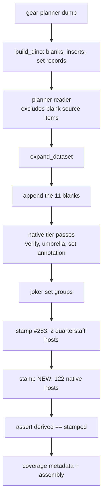
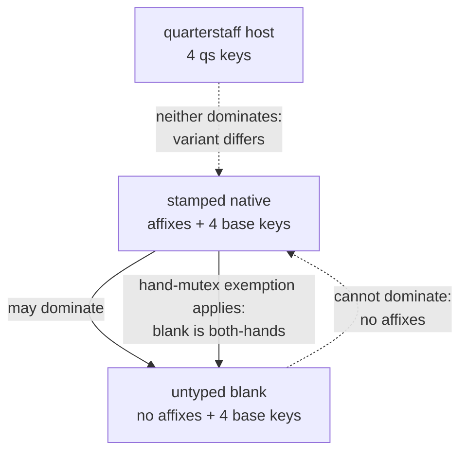

# Native Dinosaur Bone Insert Capacity - Plan

## Goal Capsule

- **Objective.** Give every native Dinosaur Bone host the Dino insert capacity its own gear-planner crafting list already grants it, keep the eleven synthetic blanks, and let the dominance guard arbitrate between the two shapes.
- **Authority.** This plan, then `CLAUDE.md`, then repo convention. Where they disagree, `CLAUDE.md` wins.
- **Execution profile.** A data/pipeline change that reaches every weapon solve on the live site. Measure before accepting the performance cost; re-ratify goldens deliberately.
- **Stop conditions.** Stop and surface, rather than deciding alone, when: the measured perf ratio exceeds the standing budget (R11); the population guard fires on a host the catalog cannot honour; or a golden diff cannot be attributed to a named cause.
- **Tail ownership.** Standalone run owns commit, PR, and CI. Deferred items in Open Questions are filed as issues before the PR merges.

---

## Product Contract

### Summary

122 native Dinosaur Bone records gain the typed insert slots their crafting lists name. The eleven synthetic blanks stay as the type-agnostic option. Dominance decides, per solve, which shape survives — and this plan proves that outcome rather than assuming it.

### Problem Frame

Today the entire catalog has 13 records with Dino insert capacity: the eleven synthetic blanks, plus the two Bone Quarterstaffs that [PR #544](https://github.com/eddiefiggie/ddo-loadout-optimizer/pull/544) stamped for #283.

Measured against the current build (`08262026.4`), 126 distinct gear-planner records name a Dino `<Type> (<Category>)` pool. Two are the quarterstaff hosts already handled. Two more — `Dinosaur Bone Helmet` and `Dinosaur Bone Cloak` — are blank source items that ship as synthetic blanks and already carry capacity. That leaves **122 native records shipping with zero insert capacity, every one of them carrying its own affixes.**

| Population | Count |
|---|---|
| Distinct native records naming a base Dino pool | 126 |
| Quarterstaff hosts, stamped by #283 | 2 |
| Blank source items, already shipping as blanks with capacity | 2 |
| **Unstamped natives — this plan's population** | **122** |
| …of those, carrying at least one affix of their own | 122 |

Distribution of the 122: 90 `Weapon`, 6 `Armor`, 6 `Off Hand`, 3 each of Belt / Boots / Bracers / Gloves / Necklace / Ring, 2 `Trinket`. The 90 weapons name all four pools; the other 32 name exactly one.

These counts differ from the ones recorded on #545 (134 / 132 / 130 / 124), which were taken before the deduplication and blank-shadow exclusions above. R3 makes the number a build-time assertion so the discrepancy cannot recur.

The reason the gap stayed open is that stamping the natives puts the same craftable capacity into the catalog in two shapes. The blank is type-agnostic and reachable from any query but carries no affixes and names no farmable item; the natives are real items carrying real affixes, and each weapon gains four slots.

### Requirements

**Population and stamping**

- R1. Every native record naming a base `<Type> (<Category>)` Dino pool carries the physical slot keys its own crafting list names.
- R2. The population is derived from the crafting list, never enumerated as a name list — a record qualifies by naming a pool itself, the same selection rule `native_quarterstaff_hosts` uses.
- R3. The build asserts that the derived population and the stamped count agree, and fails loudly on any gap, naming the hosts that went unstamped.
- R3a. The failure distinguishes a host that never reached a variant from a host that shipped and was not stamped. The two have different causes and only the second is this plan's defect.
- R4. A stamped native keeps every field it earned through the native pipeline; nothing is synthesized over it.
- R5. A record that already carries capacity — a blank, or a quarterstaff host — is never stamped twice.

**Blank retention and dominance**

- R6. The eleven synthetic blanks continue to ship, unchanged in slots, sets, and set-bonus pools.
- R7. A stamped native carrying affixes and the same slot multiset dominates the untyped Weapon blank, and the blank never dominates it. A test asserting the reverse of either half must fail.
- R8. A weapon-type lock that no Dino native satisfies still reaches Dino insert capacity through the untyped blank.
- R9. The hand-mutex exemption still protects a one-handed main-hand pick from a both-hands dominator once 90 typed weapons carry Dino slots.

**Solve size and performance**

- R10. The perf gate is measured as an A/B against the pre-change baseline before the change is accepted.
- R11. A measured ratio over the standing budget stops the work and surfaces the number; the budget is never raised silently.

**Disclosure and deploy**

- R12. Coverage metadata records the stamped population so a later reader can ask how many natives carry capacity and on whose authority.
- R13. The deploy bumps the cache-bust, the footer `BUILD`, and the README build line together.

### Scope Boundaries

**In scope.** All 122 unstamped natives, every slot, in one change.

**Deferred to follow-up work** — file each as an issue before this plan's PR merges:

- Whether an Off Hand blank should exist for shields and orbs (see OQ2).
- The Rune Arm's double representation (see OQ3).

**Outside this plan:**

- The `(artifact)` variant pools, on their original grounds — no roster host references them.
- Dino Set-Bonus activation, which is deferred on its own separate record.
- Any change to which inserts exist. This plan changes where they can be placed, not what the pool contains.

---

## Planning Contract

### Key Technical Decisions

- KTD1. **Both shapes ship; dominance arbitrates.** Natives get their real capacity and the blanks stay as the "I have not picked a weapon type yet" answer. (session-settled: user-directed — chosen over retiring the blanks, and over closing #545 as an intended model.)
- KTD2. **All 122 hosts, every slot, one change.** The 32 non-weapons reuse the same machinery as the 90 weapons; splitting them duplicates the work and the perf re-baseline. (session-settled: user-directed — chosen over a weapons-only first pass.)
- KTD3. **Measure before committing to a perf posture.** The plan carries the A/B as a gate and lets the number choose between accepting the growth and returning to the user. (session-settled: user-directed — chosen over pre-committing to accept, and over constraining the population up front.)
- KTD4. **Stamp after `expand_dataset`, joining on `source_item`.** This is the #283 site in `build_dataset.py`, generalized. Variants rebuild from a fixed field list, so a field stamped on the base record is dropped — the same reason the joker set groups are attached there.
- KTD5. **Physical slot keys only.** Which pool variant a host draws stays a solve-time property of its weapon type, resolved by `dinoWeaponVariant`. One encoding serves hosts of both variants, which is #283's single-authority rule.
- KTD6. **No new capacity-constraint families.** The Hall's-condition triple added for #283 already expresses two kinds of host supply against three kinds of demand. Stamping adds supply terms to existing constraints; it introduces no new demand kind. See `docs/solutions/design-patterns/an-aggregate-capacity-pool-needs-halls-condition-not-a-key-per-variant.md`.
- KTD7. **The six Off Hand natives are stamped like any other host.** Shields, orbs, and rune arms all ship in the solver's Off Hand slot today (592 variants across those six types). The blank-era deferral was about materializing a *blank* for them, not about the slot existing — that distinction is recorded as OQ2, not corrected here.
- KTD8. **Nothing is synthesized over a native.** All 122 carry affixes, so replacing one would delete real value — the #364 trap. Capacity is stamped onto the record the native pipeline already produced.

### High-Level Technical Design

The stamp reuses the derived-host pattern at the same seam #283 uses. Nothing moves; the seam widens from two hosts to 124.

The blanks join at E rather than after F so one pipeline covers natives and blanks alike — the #338 ordering. The stamps sit at H and I because variants rebuild from a fixed field list during expansion, so a field written before D would be dropped.

The dominance picture is where the risk lives. Capacity is invisible to the bucket check, so `dominates` compares Dino slot multisets through `dinoSlotKeys`. Today only the blanks and two quarterstaffs carry a non-empty multiset, so nearly every weapon comparison ignores that clause. After the stamp, 90 typed weapons carry the same four `||Weapon||base` keys as the untyped blank, and three comparisons become live at once:

The untyped blank classifies as a both-hands weapon, because `styleOfType` is undefined for a record with no type. That makes the hand-mutex exemption load-bearing in a way it was not before: with 90 one-handed Dino natives now carrying capacity, the exemption is what keeps a one-handed pick alive when a shield is in the off hand.

### Assumptions

- The 122 counts hold against the shipping dump. R3 turns this from an assumption into a build-time assertion, so a drift fails the build rather than silently shrinking the population.
- Every one of the 122 already ships as exactly one variant, verified against the current dataset. A host that stops shipping upstream trips the R3 assertion.
- The insert pool itself is unchanged at 111 units. This plan adds host supply, not demand.

### Sequencing

U1 derives the population. U2 stamps it. U3 and U4 prove the solver and dominance behavior against the stamped dataset. U5 measures. U6 re-ratifies the goldens and the disclosure surfaces. U7 ships the stamp and docs.

---

## Implementation Units

### U1. Derive the native host population

- **Goal.** A derived `name -> [slot key, ...]` map for every native record naming a base Dino pool, excluding the quarterstaff hosts and the blank source items.
- **Requirements.** R1, R2, R5.
- **Dependencies.** None.
- **Files.** `src/dino.py`, `tests/test_dino.py`.
- **Approach.** Add `native_dino_hosts(planner_items, catalog, blank_source_items)` beside `native_quarterstaff_hosts`, reusing `_parse_dino_pool_key`. A record qualifies by naming at least one base pool and no `(quarterstaff)` pool. Keys are physical `type||category`, per KTD5. Exclude the blank source items passed in, so `Dinosaur Bone Helmet` and `Dinosaur Bone Cloak` are not offered for stamping — they already ship as blanks.
- **Patterns to follow.** `native_quarterstaff_hosts` in `src/dino.py` — its derived selection, its refuses-zero guard, and its named-pool-not-in-catalog guard are the shape to mirror.
- **Execution note.** Write the guards' failing cases first. Each one exists because the soft-read failure mode turns a dropped upstream key into a silently smaller population.
- **Test scenarios.**
  - A record naming `Claw (Weapon)` and three siblings yields four physical keys, in a stable order.
  - A record naming exactly one pool yields exactly one key.
  - A record naming a `(quarterstaff)` pool is excluded — it belongs to #283.
  - A blank source item passed in the exclusion set is absent from the result.
  - A record naming a pool the crafting catalog does not define raises `SystemExit` naming the record and the pool.
  - An empty population raises `SystemExit` — 122 records qualified when this plan was written, so zero is upstream drift, not an empty case.
  - Non-vacuity: the fixture used for each guard test yields a non-empty population when the guard's trigger is removed.
- **Verification.** `python3 tests/run_tests.py` passes, and each guard has been shown to fire by corrupting its input and restoring it.

### U2. Stamp capacity at the build seam

- **Goal.** The 122 natives ship carrying their slot keys, and the build fails if the derived and stamped counts disagree.
- **Requirements.** R1, R3, R3a, R4, R5, R12.
- **Dependencies.** U1.
- **Files.** `build_dataset.py`, `tests/test_dino.py`.
- **Approach.** Generalize the #283 stamping loop rather than adding a second one: fold the quarterstaff map and the native map into one pass over `variants`, keyed on `source_item`, skipping any variant that already carries `dino_slots_norm`. Raise `SystemExit` when the stamped count differs from the derived population, naming the missing hosts. Record the stamped count and the per-slot breakdown under `dino_coverage`.
- **Split the failure by cause (R3a).** A derived host can go unstamped two ways: it never reached a variant at all (an unrelated pipeline gate dropped it), or it shipped and the join missed it. The #283 guard covers two hosts, where the distinction did not matter; across 122 it does, because an unrelated blocklist or quarantine change would otherwise present as this plan's defect. Report the two sets separately.
- **Patterns to follow.** The existing `_qs_hosts` block in `build_dataset.py`, including its failure message's reasoning about why an unstamped host is the whole defect.
- **Test scenarios.**
  - The built dataset carries 122 newly stamped natives, and the count matches `dino_coverage`.
  - A stamped weapon carries its own affixes, its `type`, and `verification: "verified"` — nothing was synthesized over it (the #364 trap).
  - The two quarterstaff hosts still carry exactly their four keys, stamped once.
  - `Dinosaur Bone Helmet` and `Dinosaur Bone Cloak` still ship as blanks and are not double-stamped.
  - The eleven blanks are unchanged: same count, same slots, same augment slots, same set-bonus pools.
  - Removing one host from the derived map fails the build with a message naming it.
  - A derived host that never reaches a variant, and a derived host that ships unstamped, produce different failure messages.
- **Verification.** `python3 tests/run_tests.py` passes; the count-mismatch guard has been shown to fire.

### U3. Prove the dominance outcome

- **Goal.** The comparison between a stamped native and the untyped blank behaves as designed, in both directions, and under the hand mutex.
- **Requirements.** R6, R7, R8, R9.
- **Dependencies.** U2.
- **Files.** `web/model.js`, `tests/model.test.js`.
- **Approach.** Test first against the current `dominates` and `dominanceFilter`; change code only if a scenario proves the guard wrong. The load-bearing question is whether a native carrying affixes plus the same four base keys should prune the affix-less blank — and whether pruning it costs any reachable loadout. If a scenario shows a real loss, the fix belongs in the slot-key or exemption logic, not in a special case for blanks.
- **The two shapes do compare, despite different `slot` values.** The blank sits at slot `Main Hand` and the natives at slot `Weapon`, but the main-hand pool is assembled by `category === "weapon"`, so both land in the same dominance pool. Do not conclude from the `slot` mismatch that they never meet.
- **Patterns to follow.** `dinoSlotKeys` and the hand-mutex exemption in `dominanceFilter`, plus the Lamordia slot-key precedent alongside them.
- **Execution note.** Each new test must be shown to fail against the pre-change tree. Export the base commit to a scratch directory, copy the generated dataset in first, then copy the new tests over and run them.
- **Test scenarios.**
  - A stamped native with affixes and four base keys dominates the untyped blank; the blank does not dominate it.
  - A quarterstaff host and a stamped base-variant native do not dominate each other — their Weapon keys carry different variants.
  - Under a weapon-type lock naming a type with no Dino native, the blank survives the filter and Dino capacity is still reachable.
  - With a shield in the off hand, the hand-mutex exemption keeps a one-handed stamped native alive against a both-hands dominator.
  - Two stamped natives with identical slot multisets resolve on buckets alone, and the tie-break keeps the lower index.
  - A stamped native in a multi-pick slot carrying a set bonus is exempt from pruning, as set contributors already are.
- **Verification.** `./scripts/run_js_tests.sh` passes, and each new scenario has been shown to fail on the pre-change tree.

### U4. Prove the capacity encoding under many hosts

- **Goal.** Aggregate capacity and the Hall's-condition families stay sound when supply comes from 124 hosts instead of 13.
- **Requirements.** R1, and KTD6.
- **Dependencies.** U2.
- **Files.** `web/solver.js`, `tests/solver.test.js`.
- **Approach.** No new constraint families (KTD6). Prove the existing three still hold with wide supply: total demand within total supply, and each restricted demand within the supply it may use.
- **Patterns to follow.** The three `dinoCapacity` calls in `web/solver.js` and the reasoning recorded in `docs/solutions/design-patterns/an-aggregate-capacity-pool-needs-halls-condition-not-a-key-per-variant.md`.
- **Test scenarios.**
  - A quarterstaff-only insert cannot be placed when only base-variant natives are equipped.
  - One equipped native with one open Fang slot accepts exactly one Fang insert, never a quarterstaff-only insert alongside an unmarked one.
  - Two equipped natives each exposing a Scale slot support two Scale placements and no more.
  - An insert whose key no equipped host exposes is forced to zero.
  - A multi-affix insert on a stamped native applies all its affixes or none.
  - A stamped native's own affixes and its placed inserts both reach the objective, with no double-credit between them.
- **Verification.** `./scripts/run_js_tests.sh` passes, including the golden solver check.

### U5. Measure the solve cost and decide

- **Goal.** A recorded A/B of the perf gate against the pre-change baseline, and an explicit decision on the result.
- **Requirements.** R10, R11.
- **Dependencies.** U2, U3, U4.
- **Files.** `tests/perf_utility.js`.
- **Approach.** Capture the gate on the pre-change dataset, then on the post-change dataset, using the same `shipped` roster both times. The expected cost is not record count — it is the Main Hand and Off Hand Pareto sets each gaining up to 90 newly un-prunable variants out of 3,317 weapon-category records.
- **The ratio alone cannot see this change.** The gate reports the sentinel's *added* cost as a ratio, and both of its arms grow together when the solve gets bigger. So compare the absolute `(a) total baseline` as well as the two ratios; a flat ratio over a materially larger absolute is still a slowdown players feel.
- **Baseline as of build `08262026.4`,** for the post-change run to be read against:

  | Measure | Today | Budget |
  |---|---|---|
  | Cost-weighted (b)/(a) | 1.64x | 1.75x |
  | Worst per-fixture ratio | 3.59x (`cross-add-combustion-usp-ml32`) | 5.00x |
  | (a) total baseline | 19,121 ms over 23 fixtures | not asserted |

- **Execution note.** Do not change the budget. Headroom on the cost-weighted budget is 0.11x, so this is the measure most likely to trip. If the run clears both budgets, record the numbers and why they moved; if it does not, stop and surface them.
- **Test scenarios.**
  - Both arms report, and every fixture at or above the 200 ms floor is compared.
  - The A/B uses the same roster on both arms.
  - The recorded result names both ratios, the fixture the worst ratio came from, and the absolute baseline total against the 19,121 ms figure above.
- **Verification.** `node tests/perf_utility.js` reports `PERF GATE: PASS` and an absolute baseline whose growth has been accounted for — or the run stops with the numbers surfaced for a decision.

### U6. Re-ratify goldens and the disclosure surfaces

- **Goal.** Every golden and parity diff is attributed to a named cause before it is accepted, and the browse surface shows the new capacity.
- **Requirements.** R12.
- **Dependencies.** U5.
- **Files.** `web/browse.js`, `tests/browse.test.js`, `tests/dataset.test.js`, the golden fixtures under `tests/`.
- **Approach.** Rebuild the dataset before capturing anything. Walk each golden diff and attribute it: a weapon solve that now picks a stamped native over a blank is the intended improvement; a diff in an unrelated slot is not, and is investigated before acceptance. Confirm the browse detail line already renders Isle of Dread slots for a stamped native — it reads `dino_slots_norm` and should need no change.
- **Patterns to follow.** `docs/solutions/workflow-issues/rebuild-the-dataset-before-any-golden-capture.md`.
- **Execution note.** Never blanket-accept. An unattributed diff is a stop condition.
- **Test scenarios.**
  - A stamped native's detail view lists its Isle of Dread slots.
  - The dataset test's record and capacity counts move to the new values and assert them.
  - Coverage metadata reports the stamped population and its per-slot breakdown.
  - Each accepted golden diff has a written attribution.
- **Verification.** `python3 tests/run_tests.py` and `./scripts/run_js_tests.sh` both pass against the rebuilt dataset.

### U7. Ship the stamp and the docs

- **Goal.** The deploy carries a correct build stamp and the vocabulary matches what shipped.
- **Requirements.** R13.
- **Dependencies.** U6.
- **Files.** `web/index.html`, `web/app.js`, `README.md`, `CONCEPTS.md`.
- **Approach.** Bump the three values together. This is a solver-affecting data change, so the trigger fires even though no player-facing UI code moved. Resolve a stamp conflict forward, never to either side. Update the `Blank host` entry in `CONCEPTS.md` only if U2 changed what a blank is — if the blanks are untouched, leave it alone.
- **Test scenarios.** Test expectation: none for the docs edit — `tests/test_build_stamp.py` and `scripts/check_stamp_advanced.py` already own the stamp assertions.
- **Verification.** `python3 tests/run_tests.py` passes, and `python3 scripts/check_stamp_advanced.py` confirms the stamp advanced from the base.

---

## Verification Contract

| Gate | Command | Applies to |
|---|---|---|
| Python suite | `python3 tests/run_tests.py` | U1, U2, U6, U7 |
| JS suite | `./scripts/run_js_tests.sh` | U3, U4, U6 |
| Perf A/B | `node tests/perf_utility.js` | U5 |
| Stamp direction | `python3 scripts/check_stamp_advanced.py` | U7 |
| Browser check against real data | manual, against the rebuilt dataset | U6 |

Two disciplines apply throughout and are not optional:

- Every guard added in U1 and U2 is shown to fail by corrupting its input and restoring it. A guard that has never gone red is untested.
- Every test claiming new behavior in U3 and U4 is shown to fail against the pre-change tree, with the generated dataset copied in first so a crash cannot read as a pass.

---

## Definition of Done

- All 122 natives ship with the slot keys their crafting lists name, and the build asserts the count.
- The eleven blanks ship unchanged.
- The dominance outcome between a stamped native and the untyped blank is proven in both directions, and Dino capacity stays reachable under a weapon-type lock no native satisfies.
- The perf A/B is recorded, and the result is either inside the standing budget or surfaced for a decision.
- Every golden diff is attributed in writing before acceptance.
- The cache-bust, the footer `BUILD`, and the README build line agree and advance from the base.
- OQ2 and OQ3 are filed as GitHub issues, and the PR body closes #545 with a keyword.
- No dead-end or experimental code remains in the diff.

---

## Open Questions

- OQ1 (deferred). Is the untyped Weapon blank ever the unique carrier of Dino capacity once the natives are stamped? U3 answers this for the weapon-lock case. If the answer turns out to be never, the blank is a fiction rather than an option — record that finding and file it, rather than deleting the blank inside this plan.
- OQ2 (deferred). Should an Off Hand blank exist for shields and orbs? The blank-era rationale says they have no Off Hand slot in the solver, but 425 shield and orb variants ship in that slot today. The distinction looks like blank materialization rather than a model limit, and this repo has ruled wrongly on "obvious" corrections before — file it, do not fix it here.
- OQ3 (deferred). The Rune Arm is represented twice: a synthetic blank at slot `Rune Arm` sourced from `Dinosaur Bone Rune Arm`, and a native `Dinosaur Bone Runearm` at slot `Off Hand`. The two names never join, so nothing compares them.
- OQ4 (deferred). Issue #545 records counts of 134 / 132 / 130 / 124 against measurements that now read 126 / 124 / 122 / 122. Update the issue when this plan's PR opens.

---

## Risks & Dependencies

- **Solve growth is the real cost, and it is not proportional to the stamp.** Adding four slots to 90 weapons makes those 90 un-prunable by anything without the same slot multiset, so the Main Hand and Off Hand Pareto sets grow against a 3,317-record weapon population. U5 is the gate, and the cost-weighted budget has only 0.11x of headroom.
- **The perf gate can pass while the site gets slower.** Its verdict is a ratio between two arms that both grow with solve size. U5 asserts the absolute baseline total alongside the ratios for exactly this reason.
- **The hand-mutex exemption becomes load-bearing.** The untyped blank classifies as a both-hands weapon because its type is undefined. Until now that mattered for one record; after the stamp it interacts with 90 typed weapons. R9 covers it.
- **Golden diffs are expected and must not be blanket-accepted.** A weapon solve preferring a stamped native over a blank is the intended improvement. Anything else is a regression until attributed.
- **Double-stamping is the silent failure.** Two of the 126 records are blank source items that already carry capacity. R5 and the already-carries-capacity skip guard against it; the count assertion catches it if they fail.
- **Upstream dependency.** The population derives from the gear-planner dump. A refresh that renames or drops a Dino host changes the count, which is why R3 asserts it rather than recording it in prose.

---

## Sources & Research

Measured against the shipping dataset on build `08262026.4`.

- `src/dino.py` — `native_quarterstaff_hosts` is the derived-selection pattern U1 mirrors, including both of its loud-failure guards.
- `build_dataset.py` — the `_qs_hosts` stamping block is the seam U2 generalizes; the surrounding comments explain why the stamp happens after `expand_dataset`.
- `web/model.js` — `dominates`, `dinoSlotKeys`, `dinoWeaponVariant`, `isBothHandsWeapon`, and the hand-mutex exemption in `dominanceFilter`.
- `web/solver.js` — the Dino capacity encoding and the three Hall's-condition families.
- `docs/solutions/design-patterns/an-aggregate-capacity-pool-needs-halls-condition-not-a-key-per-variant.md` — why one constraint per key is unsound here.
- `docs/solutions/design-patterns/append-a-synthesized-record-before-the-passes-not-after.md` — why the blanks join before the tier passes.
- `docs/solutions/design-patterns/derive-a-synthesized-record-from-the-record-it-shadows.md` and `docs/solutions/logic-errors/synthesized-records-need-the-full-set-field-chain.md` — the #364 and #541 lessons behind KTD8.
- `docs/solutions/conventions/prove-a-guard-fails-before-trusting-it.md` and `docs/solutions/conventions/prove-a-test-fails-against-the-pre-change-tree.md` — the two disciplines in the Verification Contract.
- `docs/wiki-evidence/dino-set-bonus-hosts.md` — the standing ruling on which hosts carry a Set-Bonus slot.
- [#545](https://github.com/eddiefiggie/ddo-loadout-optimizer/issues/545), [PR #544](https://github.com/eddiefiggie/ddo-loadout-optimizer/pull/544), [PR #543](https://github.com/eddiefiggie/ddo-loadout-optimizer/pull/543).
