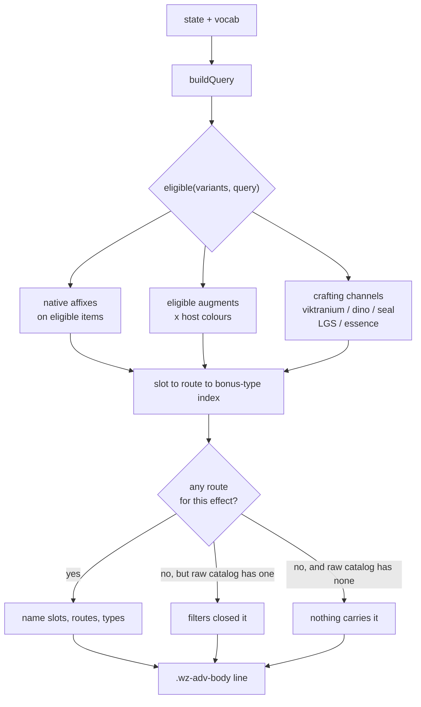

# Per-Effect Slot Reachability Disclosure - Plan

**Issue:** #743. **Base:** `main` at `09112026.2`, clean and green.

---

## Goal Capsule

For an effect the player has ranked, say **which slots can supply it, by which
route, at which bonus types** — under the filters that player currently has set.

This answers a question the app cannot answer today: *the effect exists, I ranked
it first, and I wanted it in a slot that can never supply it.* It changes no
solve, sets nothing on the player's behalf, and makes no claim about the game.

---

## Problem Frame

A player asked how to put `Assassinate` and `Insightful Assassinate` on an
off-hand weapon. Two things went wrong, and only one of them is a defect.

The mental model — a blank weapon you pour chosen effects into — matches nothing
the project models, and the reporter correctly found no surface for it. That is
#742's territory, not this plan's.

The defect is that **ranking the effect does not fail.** The solver satisfies
`Assassinate` from Gloves or a Ring and reports `optimal`. That answer is
correct and tells the player nothing about the weapon they asked about. The
reporter even ranked it first "just to make sure it doesn't give a lower score",
which does nothing for a slot-reachability question.

`CONCEPTS.md` names three ways a ranked target reaches zero — nothing carries it,
the filters removed every source, and [[Outbid target]]. This report is a
**fourth question** the vocabulary does not cover: the target did *not* reach
zero, and the player still did not get what they asked for. A silent correct
answer to the wrong question is the worst failure mode for a tool whose output is
a finished loadout.

### Evidence: the issue's own analysis has a gap this plan must not inherit

Issue #743 enumerates native and crafting routes and concludes weapons are
served only by four named items. Measured against the built catalog, **an
augment route to a weapon exists and the issue does not name it**:

| | |
|---|---|
| `The Art of Persuasion, Vol. 1` | Yellow augment, ML 18, `Assassinate \| Enhancement 10` |
| `The Art of Persuasion, Vol. 3` | Yellow augment, ML 32, `Assassinate \| Enhancement 16` |
| Weapons declaring a Yellow slot | `Bleeding Edge`, `Drowned Priest's Torch`, `Thirteen`, `Legendary Thirteen` |
| Off-hand items declaring a Yellow slot | 40 |

So at the reporter's own ML 34 cap, `Legendary Thirteen` + `Vol. 3` is a real
weapon route, and the off-hand ask has 40 candidate hosts. A disclosure that
counted only native affixes would have told this reporter "no weapon route" —
**wrong, in the exact case that prompted the issue.** This is why the augment
route is in scope (KTD2), and it is the plan's sharpest test case.

The issue's two genuinely-unreachable findings hold and are worth preserving as
fixtures: no weapon carries `Assassinate | Insight` through any channel, and no
Weapon or Off Hand host declares a `Miserable` slot, so the Viktranium route is
closed to weapons by construction.

---

## Product Contract

### Requirements

**Disclosure content**

- **R1** — For a ranked effect, state the slots that can supply it, the route
  (native affix, augment, or a named crafting channel), and the bonus types
  available by that route.
- **R2** — The statement reflects the player's **active filters** — ML cap,
  owned packs, blocked items, crafting rungs, and every other gate the solve
  applies. It describes the pool the solver will actually see.
- **R3** — When filters are what closed a route, say so distinctly from "the
  catalog has no such route." These are the two existing `CONCEPTS.md` zero
  routes and the player can act on only one of them.
- **R4** — Augment routes are counted and **named as augment routes**, never
  folded into the worn-slot list as if a colour were a gear slot.
- **R5** — Crafting-channel routes are counted, named by channel.

**Discipline**

- **R6** — Read-only. It sets no bound, changes no rank, alters no solve, and
  adds no setting. `adv.cap` and the Advanced badge count stay untouched.
- **R7** — It states facts about the built catalog under the current query. It
  never claims two affix names are interchangeable (#746, wiki-gated), never
  says a slot is a good choice, and never proposes an action.
- **R8** — Absent rather than wrong: when the inputs cannot support a statement,
  the line is withheld.

### Scope Boundaries

**In scope:** the ranked-row Advanced panel, native affixes, augment routes via
declared host colours, and the five crafting channels.

**Out of scope:**

- Pinning an effect to a slot, or any new solver constraint — #742.
- Any claim that `Ghost Touch` / `Ghostly` / `Ethereal` are one effect — #746,
  and it needs a wiki window this session does not have.
- The Advanced-panel grid rework — #744 step 2. This plan adds one element
  inside `.wz-adv-body` and touches no row layout, so the two do not collide.

**Deferred to Follow-Up Work:**

- The same disclosure in Browse, and in the picker before an effect is ranked.
  The player currently must rank an effect to learn it is unreachable; that is a
  real limitation of the chosen placement and worth its own issue.

---

## Planning Contract

### Key Technical Decisions

**KTD1 — Filter-aware, computed over the same pool the solver sees.**
Reachability is derived from `eligible(variants, query)` (`web/model.js:933`)
with a query built by `buildQuery(state, vocab, items)`
(`web/wizard.js:1078`), not from a raw scan of `dataset.items`.
*(session-settled: user-directed — chosen over a raw-catalog statement: a raw
claim can tell a player an effect is Gloves-shaped when their own filters removed
every Gloves source. True, and misleading.)*

The load-bearing consequence: because both read the same predicate, the
disclosure **cannot disagree with the solve**. Any future gate added to
`variantConflict` is inherited rather than needing a parallel update — which is
the failure `an-override-exemption-only-covers-the-gates-downstream-of-it.md`
records, where a gate that lived in only one of two paths dropped a pin in
silence.

**KTD2 — Augment routes count, and are named as augments.**
An augment route exists when some host in the eligible pool declares a colour in
`augment_slots_norm.colors` for which an eligible augment carries the effect.
*(session-settled: user-directed — chosen over worn-slots-only: the evidence
above shows worn-slots-only would answer the founding case wrongly.)*

**KTD3 — Lives in the ranked row's Advanced panel, inside `.wz-adv-body`.**
Follows the read-only `.wz-adv-ceiling` hint (`web/wizard.js:4131`), which is the
established precedent for a non-editable fact in that panel.
*(session-settled: user-directed — chosen over the picker and Browse: smallest
surface, and it rides inside the panel body so #744's row-layout rework does not
have to account for it.)*

**KTD4 — Computed per render, not stamped at the load seam.**
#746's carrier counts live on `dataset._familyCarrierCounts`
(`web/dataset.js:586`) because a carrier count is a catalog fact. Reachability is
a function of the *query*, so the same treatment would be wrong: a stamped value
would be a claim about a population that changes whenever the player toggles a
pack. Derive it on demand from the live query.

**KTD5 — Enumerate every source pool, not just `items[]`.**
`dataset.items` is one of several source families; augments, dino inserts,
Viktranium, seal, Legendary Green Steel and Essence Crafting are separate pools
that `buildModel` receives as distinct arguments. A view that iterates only the
canonical array silently omits them — precisely the defect
`docs/solutions/design-patterns/browse-visibility-for-separate-source-pools.md`
records, where 55 Dino inserts were invisible to Browse while the solver used
them. Reachability must sweep all of them or it will under-report exactly the
crafting routes this issue is about.

**KTD6 — Descriptive, never advisory.**
The line reports where the effect can come from. It does not rank slots, does not
call a route better, and does not suggest a change. This mirrors the discipline
#752 held for the cap notice, and the reason is the same: a sentence that judges
on the player's behalf is the weighted-sum non-goal wearing different clothes.

### High-Level Technical Design

The second pass against the unfiltered catalog exists only to tell branch J from
branch K (R3). It is what makes "your filters did this" sayable, and it is the
only place a raw-catalog read is legitimate.

---

## Implementation Units

### U1. Reachability index over every source pool

**Goal:** A pure function that, given an effect name and a query, returns the
routes that can supply it — slot, route kind, and bonus types.

**Requirements:** R1, R4, R5. Implements KTD1, KTD2, KTD5.

**Dependencies:** none.

**Files:**
- `web/model.js` — the function and its export (it belongs beside `eligible`
  and `statCeilingHintFor`, which it is a sibling of)
- `tests/slot-reachability.test.js` — new

**Approach:** Take the already-filtered variant list and the auxiliary pools.
Walk native affixes, then augments joined to hosts by declared colour, then each
crafting channel. Return structured route records, not prose — U3 owns wording,
and keeping them apart is what lets the tests assert reachability without
asserting sentences.

**Patterns to follow:** `eligible` / `variantConflict` for the filter predicate;
`crossAddSourcesFor` (`web/cross-add.js:37`) for the shape of a stat-keyed
source lookup.

**Execution note:** Write the `Assassinate` cases first, from the evidence table
above — they are the founding case and the augment join is the part most likely
to be got wrong.

**Test scenarios:**
- `Assassinate` returns a Weapon route via a Yellow augment when both
  `Legendary Thirteen` and `Vol. 3` are in the eligible pool.
- `Assassinate` returns the four named-weapon native routes with bonus type
  `Enhancement`.
- `Assassinate` returns Off Hand as augment-reachable (40 declared Yellow hosts).
- `Assassinate | Insight` returns **no** weapon or off-hand route by any channel.
- No Weapon or Off Hand host yields a `Miserable` Viktranium route.
- An effect carried only by a dino insert still returns a route — guards KTD5
  against the `items[]`-only regression.
- An effect no pool carries returns an empty route set, not a throw.
- Route records carry bonus type per route, so one slot reachable at two types
  reports both.

**Verification:** Run against the real built catalog and reproduce every row of
the evidence table.

### U2. Filter-closed vs. never-existed

**Goal:** Distinguish "your filters removed every source here" from "the catalog
has no source here."

**Requirements:** R2, R3. Implements the second pass in the design above.

**Dependencies:** U1.

**Files:**
- `web/model.js`
- `tests/slot-reachability.test.js`

**Approach:** Run U1's index twice — once under the live query, once against the
unfiltered pool — and classify per slot. The unfiltered pass is used **only** for
this classification and never for the headline statement, so a filtered-out route
can never be presented as available.

**Test scenarios:**
- An ML 30 cap closes the `Vol. 3` route while `Vol. 1` survives: the Weapon
  route is still reported, at the lower value.
- An ML cap below both Yellow augments reports the weapon augment route as
  **filter-closed**, not absent.
- Blocking all four named weapons reports the native weapon route as
  filter-closed.
- An effect with no route in either pass classifies as never-existed, not
  filter-closed.
- A route open in both passes classifies as neither.

**Verification:** Each classification is reachable from a real query, proving no
branch is inert — the trap #752's verification caught, where a guard could have
made the notice permanently silent.

### U3. Wording

**Goal:** Turn route records into one line that states facts and judges nothing.

**Requirements:** R1, R3, R4, R5, R7, R8.

**Dependencies:** U1, U2.

**Files:**
- `web/projection.js` — beside `capOpportunityLines` (`:1448`), the sibling
  read-only disclosure, and exported on the same surface (`:3301`)
- `tests/slot-reachability.test.js`

**Approach:** Name slots, name the route kind, name the bonus types. Withhold the
line when the route set is empty and the classification is unknown (R8).

**Execution note:** Pin the wording with a test the way #752 pinned the picker
hint — the drift to guard against is a descriptive line acquiring a
recommendation, and it is the kind of edit that looks like an improvement.

**Test scenarios:**
- An augment route renders as an augment route and never as a worn slot (R4).
- A crafting route names its channel (R5).
- The line never contains recommendation words — asserted against a list, so a
  future edit toward "best" or "you should" fails (R7, KTD6).
- The line makes no interchangeability claim about affix names (R7, #746).
- An empty route set with unknown classification renders nothing (R8).
- Filter-closed and never-existed render distinguishably (R3).

### U4. Render it in the Advanced panel

**Goal:** Put the line in the ranked row's Advanced panel.

**Requirements:** R1, R6. Implements KTD3.

**Dependencies:** U3.

**Files:**
- `web/wizard.js` — inside `advancedHTML`'s `.wz-adv-body`, adjacent to
  `ceilingHintHTML`
- `web/styles.css` — one rule, following `.wz-adv-ceiling`
- `tests/wizard.test.js`

**Approach:** Mirror `ceilingHintHTML` exactly: read the model, return markup or
the empty string, escape the effect name. Add nothing to the row's flex line —
the element sits inside the panel body, which is what keeps this clear of #744
step 2.

**Patterns to follow:** `ceilingHintHTML` (`web/wizard.js:4131`), which is the
same shape of read-only panel fact and already handles the absent case.

**Test scenarios:**
- The panel renders the line for an effect with routes.
- The panel omits the element entirely when U3 withholds the line.
- `adv.cap` and the Advanced badge count are unchanged by its presence (R6) —
  this is the guard that the disclosure did not become a setting.
- An effect name containing quotes or angle brackets is escaped.
- The element is inside `.wz-adv-body`, not a sibling of the row controls — the
  guard that keeps #744 step 2 from having to account for it.

**Verification:** No browser pass is available this session. Assert the rendered
markup in node and state plainly in the PR that the visual pass is outstanding.

### U5. Ship stamp

**Goal:** Deploy correctly.

**Requirements:** none — project convention.

**Dependencies:** U4.

**Files:** `web/app.js` (`BUILD`), `web/index.html` (`?v=`), `README.md`

**Approach:** This is player-facing web code, so all three move together and the
`?v=` **is** the stamp string. Resolve any conflict **forward**.

**Test expectation:** none — covered by `tests/test_build_stamp.py` and
`scripts/check_stamp_advanced.py`.

---

## Verification Contract

- `./scripts/run_js_tests.sh` exits 0. Never a bare loop: `node a.js b.js` runs
  only the first file and has silently skipped the golden solver check before.
- `python3 tests/run_tests.py` passes.
- Every new test is proven to **fail against the pre-change tree**, with the
  generated dataset copied in first so a crash cannot read as a pass.
- The evidence table reproduces from the real catalog.
- Each U2 classification is shown firing on a real query.

**Known gap, stated rather than papered over:** no browser visual pass — Chrome
is not reachable this session. U4 is asserted at the markup level only. The PR
must say so.

---

## Definition of Done

- A player who ranks `Assassinate` sees which slots supply it, that the weapon
  route is a Yellow augment, and that no weapon supplies `Assassinate | Insight`.
- The statement matches the filters in force and cannot contradict the solve.
- Nothing about the solve changed.
- Both suites green; build stamp moved forward in all three places.
- #743 closed with the evidence; the deferred Browse/picker placement filed.

---

## Risks

- **The augment join is the correctness risk.** A host declaring a colour is not
  the same as a host with a free slot for it — aggregate capacity is modelled
  elsewhere. This plan claims only that the route exists, never that it is free
  in a given loadout, and the wording must not imply otherwise.
- **A disclosure that never fires looks identical to one that works.** U2's
  reachable-branch check is the guard, and it earned its place on #752.
- **Sequencing against #744 step 2** is handled by placement, not by ordering:
  the new element is inside `.wz-adv-body`, so the future grid rework moves the
  panel as a unit without knowing this exists.

---

## Sources

- Issue #743 and its 2026-09-11 sweep comment
- `docs/plans/2026-09-10-001-user-feedback-batch-triage-plan.md`
- `docs/solutions/design-patterns/browse-visibility-for-separate-source-pools.md`
- `docs/solutions/design-patterns/an-override-exemption-only-covers-the-gates-downstream-of-it.md`
- `docs/solutions/conventions/prove-a-test-fails-against-the-pre-change-tree.md`
- `CONCEPTS.md` — [[Outbid target]] and the three routes to zero
- PR #752 — the disclosure-discipline precedent for #746 and #747
