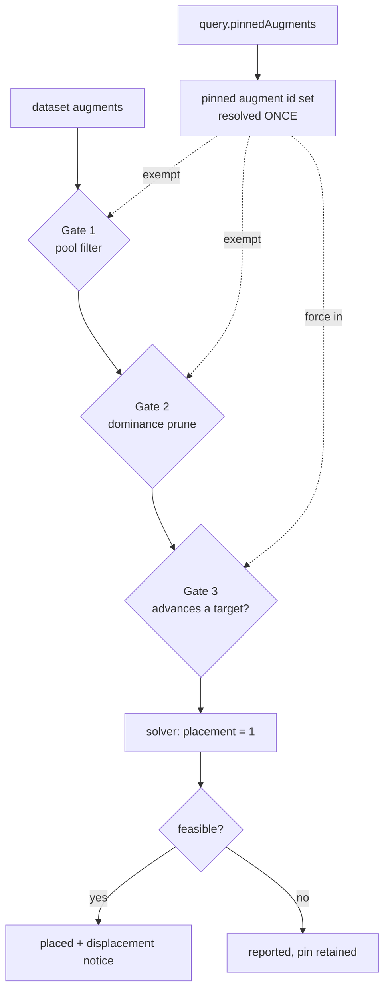

# Augment Pinning - Plan

**Issue:** #742 (origin document — its design notes are verified and carried forward).
**Base:** implement on top of PR #754, not `main` — see Dependencies.

---

## Goal Capsule

Let a player insist a specific **augment** is in the build — `Deconstructor`, in the
report that prompted this — and honour that even when the augment advances no
ranked target.

Today there is no lever at all. Items pin, sets pin, augments do not, and the one
remaining route (a hard floor on a presence effect) is satisfied by any of 111
other carriers. The reporter's failure is total, not partial.

---

## Problem Frame

`web/wizard.js` gates pinning on `v.category !== "augment"`, stated outright in
prose: *"augments cannot be pinned."* Blocking works on augments, so
`Deconstructor` is **blockable but not pinnable** — the asymmetry the reporter
walked into.

The fallback does not reach it either. A `min 1` floor on `Destruction` forces a
carrier, but 111 items carry `Destruction` and the solver has no reason to prefer
the augment; solved at ML 30 it picks `Breastplate of Destruction`. "The only
augment carrying X" is not a constraint the model can express.

### What makes this harder than an item pin

Augments are modelled as **aggregate per-colour capacity** (`web/solver.js`): each
augment gets at most one placement consuming one compatible slot *colour*, with
per-colour placements bounded by open slots across all equipped items. Host
attribution — which item ends up wearing it — is reconstructed in `web/results.js`
**after** the solve, off the critical path.

Two consequences the plan is built around:

1. *This augment, somewhere it fits* is expressible — force its placement
   indicator to 1.
2. *This augment, in that item* is **not** expressible without promoting
   physical-slot reconstruction into a solver constraint.

### Correction to the origin document, and it is load-bearing

Issue #742 proposes that pinning the weapon *and* the augment lets the player
express "Deconstructor in my weapon" in two moves. **It does not.** Because
placement is bounded per *colour* across every equipped item, a pinned augment
satisfies its pin in any compatible open slot — pinning the host as well
constrains the host, never the pairing. The two pins are independent.

This plan therefore ships the augment-only pin **and says so on screen** (R6).
Shipping it while implying slot-binding would be a new defect, and the player most
likely to hit it is the one this issue is named for.

---

## Product Contract

### Requirements

**The pin**

- **R1** — A player can pin an augment. A pinned augment is placed in the solved
  build whenever the build is feasible.
- **R2** — The pin holds even when the augment advances **no ranked target**.
  This is the reporter's exact case and the feature fails without it.
- **R3** — The pin overrides the filters a pin is already allowed to override
  (ML cap, augment ceiling, crafting rung, owned-gear pool), consistent with the
  existing pin-overrides-filters precedent.

**Honesty**

- **R4** — An unsatisfiable pin is **reported, never silently erased**, and
  survives the round trip so it returns when the condition that suppressed it
  lifts.
- **R5** — When a pinned augment displaces a scoring one, say what it cost.
  Advisory only: it never un-pins and never proposes a change.
- **R6** — The UI states that an augment pin places the augment *somewhere it
  fits*, not in a chosen item.

**Consistency**

- **R7** — An augment pin joins the existing `block` → `pin` precedence (block
  displaces pin, with a confirm; the reverse is refused). One rule, not two.
- **R8** — The pin persists in saved characters and appears in **every** share
  export. Never solve-visible but share-invisible.

### Scope Boundaries

**In scope:** the augment pin, its three gate exemptions, suppression reporting,
the displacement notice, persistence, and exports.

**Out of scope:**

- **Binding an augment to a named host slot.** Needs physical-slot reconstruction
  promoted from a display step into a solver constraint — a much larger change to
  the augment model, and a different feature.
- **Whether `Adamantine` and `Destruction` should carry numbers** rather than
  presence flags. A wiki question, and not why the reporter failed: even fully
  valued, neither singles out this augment.

**Deferred to Follow-Up Work:**

- Nothing yet. File anything this turns up **before** the PR merges, per
  `AGENTS.md` — prose in a plan is not a queue.

---

## Planning Contract

### Dependencies

**Implement on top of PR #754, after it merges.** It touches `web/model.js`,
`web/wizard.js` and `tests/wizard.test.js` — the same files — and it introduces
`filterEligiblePool`, which is the clean seam U2 hooks the pool exemption into. On
current `main` that chain is still inline in `buildModel`.
*(session-settled: user-directed — chosen over stacking on the unmerged branch or
building from `main` in parallel: both guarantee a conflict in exactly the code
each change restructures.)*

### Key Technical Decisions

**KTD1 — Augment-only pin, with the limitation on screen.**
The pin means *this augment is placed somewhere it fits*. The UI says that in
those terms.
*(session-settled: user-directed — chosen over host-slot binding, and over
shipping augment-only silently: the origin document's "two moves" claim is wrong,
and inheriting it would ship a promise the model cannot keep.)*

**KTD2 — One exemption set, threaded to three gates, proven end-to-end.**
A pinned augment must survive **three** independent gates, and none of them
currently knows about pins:

| # | Gate | Where | Today |
|---|---|---|---|
| 1 | Pool filter | `filterEligiblePool(eligible(...))`, `web/model.js` | ML cap, augment ceiling, rung, blocklist, packs all apply |
| 2 | Dominance prune | augment pool build, `web/model.js` | called **without** `pinnedIds` — worn slots pass it, augments do not |
| 3 | Target-advancement | `augBest`, `web/solver.js` | an augment advancing nothing gets no placement variable at all |
| 4 | **Result reporting** | `augmentsPlaced`, `web/solver.js` | reports a placement only when a contribution it gates **fired and is visible** |

**Gate 4 was found during implementation, not planning, and it is the one this
plan got wrong.** The first three were verified up front; the fourth only showed
itself when all three were satisfied and the end-to-end test still failed. The
augment was genuinely placed — `pu5 = 1` was in the program and the solve was
optimal — and reported nowhere, because the reporting step deliberately withholds
a placement that grants nothing, so as not to prescribe useless farming. That rule
is right for the case it was written for and wrong for a pin: the player named
this augment, it is really in the build, and it is really consuming a colour slot.
Left unfixed, the loadout would show a consumed slot with nothing in it.

That is the same lesson one gate further out than expected, and it is worth
stating plainly: **the count of gates was itself a guess.** What caught it was the
end-to-end test, exactly as KTD2 predicted — three gate-local guards were green
while the chain was broken.

Gate 3 is fatal for `Deconstructor` specifically: its three affixes are
`Adamantine` (Bool), `Destruction` (Bool), and a Rust-damage line that is not
rankable, so a player who pins it without *also* ranking one of the first two
would hit an unsatisfiable pin with nothing on screen.

This is `an-override-exemption-only-covers-the-gates-downstream-of-it.md` — #721,
where a pin was silently dropped because one of two paths learned a gate the other
did not. **The anti-drift mechanism is not three unit tests.** Three gate-local
tests can each pass while the chain is broken. One **end-to-end** test drives a
pinned zero-value augment from query to solved build and asserts it is placed; it
is the only test that fails if any gate forgets.

**KTD3 — Honour a zero-value pin, and report what it displaced.**
Forcing a scoreless augment consumes a colour slot a scoring one would have used.
The pin is honoured regardless — it must be, or R2 fails — and the cost is
reported.
*(session-settled: user-directed — chosen over placing it silently, and over
refusing to place it: refusing fails the founding case; silence drops the player's
totals with nothing explaining why.)*

The line is **advisory and never acts**, the discipline #752's cap notice keeps and
`AGENTS.md` draws around the weighted-sum non-goal: it states what the pin
displaced; it does not un-pin, rank, or propose.

**KTD4 — Suppression reports, following `classifySetPins`.**
`classifySetPins` already returns `{ pinned, report }` for exactly this — a pin the
pool cannot satisfy surfaces as a named report rather than a bare `INFEASIBLE`, and
is never erased, because a pin unreachable under an ML 30 cap is reachable at 34
and must survive the round trip
(`suppress-dont-erase-user-constraints-on-transient-invalidity.md`). Mirror that
shape rather than inventing a second one.

**KTD5 — Join the existing precedence rule.**
`blockDisplacesPinText` already displaces a pin with a confirm and refuses the
reverse. An augment pin routes through the same path. A second precedence rule
would let the two disagree on an augment that is both pinned and blocked.

### High-Level Technical Design

The dotted edges are the same set reaching three gates. The end-to-end test walks
the whole path; a gate-local test only ever proves one dotted edge.

---

## Implementation Units

### U1. Pin identity, state, and precedence

**Goal:** A player can add and remove an augment pin, and it obeys the existing
block precedence.

**Requirements:** R1, R7. Implements KTD5.

**Dependencies:** none (after #754 merges).

**Files:** `web/wizard.js`, `tests/wizard.test.js`

**Approach:** Augments already carry `variant_id` and normalise through `pinIdOf`,
so identity is free. Lift the `v.category !== "augment"` bar for a distinct
augment-pin control rather than folding augments into the worn-slot pin — a
worn-slot pin means *this item in this slot*, and an augment pin cannot mean that
(KTD1). Route displacement through `blockDisplacesPinText`.

**Patterns to follow:** `applyPin` / `removePinFrom` / `reconcilePinLegality`;
`pinnedSets` for the shape of a pin that is not slot-keyed.

**Test scenarios:**
- Pinning an augment records it; removing it clears it.
- Pinning the same augment twice does not duplicate.
- Blocking a pinned augment displaces the pin, with the existing confirm text.
- Pinning an already-blocked augment is refused, matching the item behaviour.
- A pin naming an id absent from the catalog is reported stale, not silently kept.
- Worn-slot pins are unaffected — no augment enters `slotConstraints`.

**Verification:** Pin/unpin round-trips in the wizard state with no effect on
existing item or set pins.

### U2. Carry the pin through all three gates

**Goal:** A pinned augment reaches the solver whatever the filters, the dominance
prune, or its own scorelessness would otherwise do.

**Requirements:** R1, R2, R3. Implements KTD2.

**Dependencies:** U1.

**Files:** `web/model.js`, `web/solver.js`, `tests/slot-reachability.test.js` is
*not* the home — add `tests/augment-pin.test.js`

**Approach:** Resolve the pinned-augment id set **once** and thread it to all
three gates. Gate 2 is the smallest change — the augment `dominanceFilter` call
simply is not passing `pinnedIds` that worn slots already pass. Gate 3 needs
`augBest` to admit a pinned augment with an empty bucket map, and the solver to
force its placement indicator.

**Execution note:** Write the end-to-end test **first** — pinned zero-value
augment, query to solved build. It is the only test that fails if any single gate
forgets, and it is the reporter's case.

**Test scenarios:**
- **End-to-end:** a pinned augment advancing no ranked target is present in the
  solved build. *(The KTD2 anti-drift guard.)*
- Gate 1: a pinned augment above the ML cap is still placed.
- Gate 1: a pinned augment is still placed when the augment ceiling would exclude
  it, and under a rung that excludes augments.
- Gate 1: a pinned augment the owned-gear pool does not carry is still placed
  (the #721 case, in its original shape).
- Gate 2: a pinned augment dominated by another of its colour is not pruned.
- Gate 3: an unpinned augment advancing nothing is still excluded — the exemption
  is scoped to pins and did not widen the pool for everyone.
- A blocked augment is **not** placed even if pinned (U1's precedence holds
  through the solver).
- Two pinned augments of the same colour both place when supply allows.

**Verification:** The reporter's query — pin `Deconstructor`, rank nothing it
carries — produces a build containing it, driven through `buildModel` +
`solveLexicographic` against the real catalog.

### U3. Report an unsatisfiable pin instead of erasing it

**Goal:** When the pin cannot be honoured, say so and keep it.

**Requirements:** R4. Implements KTD4.

**Dependencies:** U2.

**Files:** `web/model.js`, `web/projection.js`, `tests/augment-pin.test.js`

**Approach:** Mirror `classifySetPins`'s `{ pinned, report }` return. The pin
stays in the player's state so it returns when the blocking condition lifts.

**Test scenarios:**
- No compatible open slot of the augment's colour: reported, and the pin is still
  in state afterwards.
- A colour quarantined in the dataset (no exact slot to place into): reported
  rather than crashing.
- Raising the ML cap re-satisfies a pin suppressed at a lower one, with no
  re-pinning by the player.
- The report names the augment, so the player can act on it.
- A satisfiable pin produces an empty report.

**Verification:** Suppression and recovery both shown on a real query, so neither
branch is inert.

### U4. Say what the pin displaced, and what it does not promise

**Goal:** The two disclosures this feature owes the player.

**Requirements:** R5, R6. Implements KTD3, KTD1.

**Dependencies:** U2.

**Files:** `web/projection.js`, `web/wizard.js`, `web/styles.css`,
`tests/augment-pin.test.js`

**Approach:** Two separate statements. The **displacement** notice belongs with
the result (precedent: the `ARTIFACT PINNED IN` notice, which already reports a
pin overriding a filter). The **"somewhere it fits"** wording belongs beside the
pin control, where the expectation is set.

**Test scenarios:**
- A zero-value pin that displaces a scoring augment produces the notice, naming
  what was displaced.
- A pin that displaces nothing produces no notice (absent rather than empty).
- The notice never contains recommendation or action language — asserted against
  a banned-word list, as #752 does.
- The pin control's wording never claims a host slot — asserted against the words
  "in this item" / "in your weapon" / "slot", so a well-meaning copy edit that
  re-introduces the promise fails.
- The notice is withheld when the displaced set cannot be determined, rather than
  guessing.

**Verification:** The reporter's own query produces both the placement and an
accurate displacement line.

### U5. Persistence and exports

**Goal:** The pin survives save/load and appears in every share export.

**Requirements:** R8.

**Dependencies:** U2.

**Files:** `web/persist.js`, `web/projection.js`, `web/exporters.js`,
`tests/augment-pin.test.js`, `tests/exporters.test.js`

**Approach:** Join the saved-field allowlist beside `slotConstraints` and
`pinnedSets`. Flow through `projection.js`, which is the single content source for
every export — that is what makes "all five outputs" automatic rather than five
edits.

**Patterns to follow:** `pinnedSets` for both the persistence and the export path;
`docs/solutions/` records the standing invariant that a new mechanic must never be
solve-visible but share-invisible.

**Test scenarios:**
- Save a build with an augment pin, reload it, and the pin is present.
- A character saved **before** this feature loads with no pin and no error —
  absent means none.
- The pin appears in Markdown, BBCode, CSV, print, and the portable JSON.
- A portable-JSON round trip preserves it.
- An export of a build with no augment pin is byte-identical to before the change.

**Verification:** Round trip through `CharacterStore` and every exporter.

### U6. Ship stamp

**Goal:** Deploy correctly.

**Requirements:** none — project convention.

**Dependencies:** U5.

**Files:** `web/app.js`, `web/index.html`, `README.md`

**Approach:** Player-facing web change, so all three move together and the `?v=`
**is** the stamp string. Resolve any conflict **forward**.

**Test expectation:** none — covered by `tests/test_build_stamp.py` and
`scripts/check_stamp_advanced.py`.

---

## Verification Contract

- `./scripts/run_js_tests.sh` exits 0 — never a bare loop.
- `python3 tests/run_tests.py` passes.
- Every new test proven to **fail against the pre-change tree**, with the
  generated dataset copied in first so a crash cannot read as a pass.
- The reporter's case reproduced end-to-end: pin `Deconstructor`, rank nothing it
  carries, get a build containing it.
- `solver_golden` re-ratified deliberately. An unpinned solve must be unchanged;
  if a golden moves, that is a regression, not a re-ratification.
- Solve time measured with a pin against the unpinned baseline. #539 recorded
  pinned set augments costing ~41s against ~6.5s, so a placement forced per pin is
  a known cost shape here.

---

## Definition of Done

- A player can pin `Deconstructor`, rank nothing it carries, and get it.
- The UI says the pin places the augment somewhere it fits, not in a chosen item.
- An unsatisfiable pin is reported and survives to be re-satisfied later.
- A displacing pin says what it cost, and never acts on it.
- The pin saves, loads, and appears in every export.
- Both suites green; stamp moved forward in all three places.
- #742 closed with `Closes #742`; any deferral filed before merge.

---

## Risks

- **A forced placement is a new constraint on the hot path.** Watch solve time;
  #539 is the precedent for a pin making the program materially harder.
- **Gate 3 is the one most likely to be missed**, because it lives in the solver
  rather than the pool and looks like a performance filter. The end-to-end test
  exists for it specifically.
- **The "somewhere it fits" wording is the honesty of this feature**, and it is
  the sentence most likely to be softened later by someone who reads it as
  hedging. It is pinned by a test naming the words it must not acquire.

---

## Sources

- Issue #742 and its 2026-09-11 sweep comment (origin)
- `docs/solutions/design-patterns/an-override-exemption-only-covers-the-gates-downstream-of-it.md`
- `docs/solutions/design-patterns/suppress-dont-erase-user-constraints-on-transient-invalidity.md`
- `docs/solutions/design-patterns/where-a-per-item-gate-may-live-in-the-solver.md`
- `CONCEPTS.md` — augment placement, aggregate per-colour capacity
- PR #752 — the advisory-never-acting disclosure precedent
